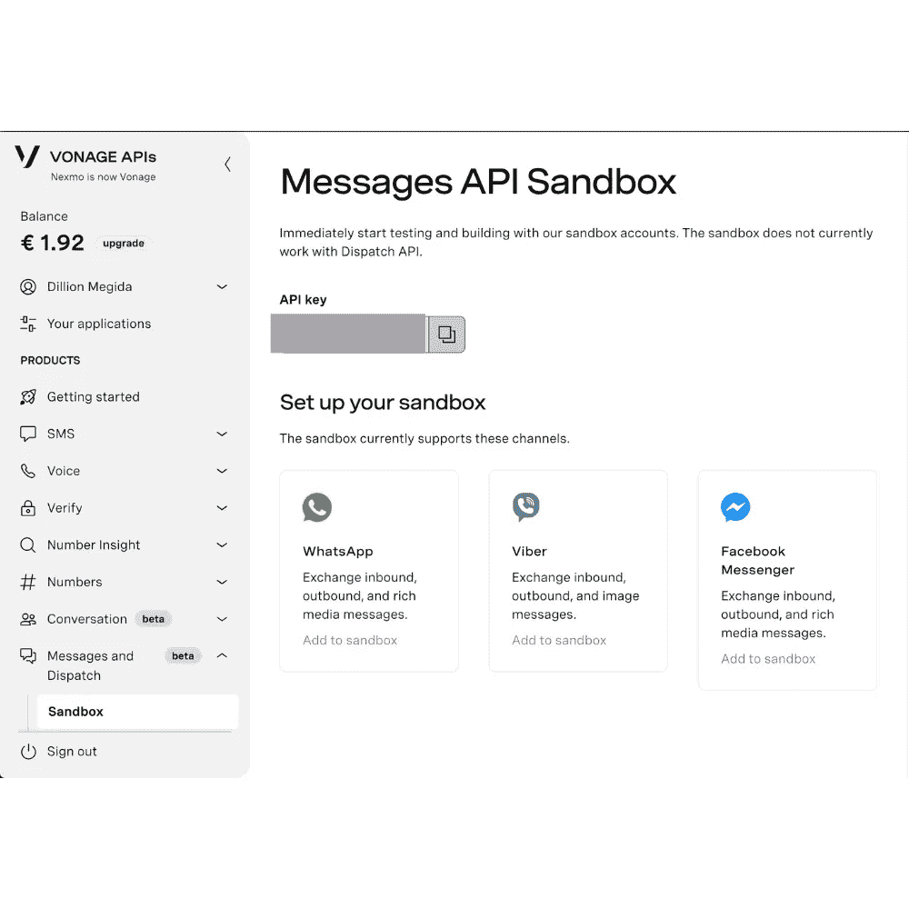
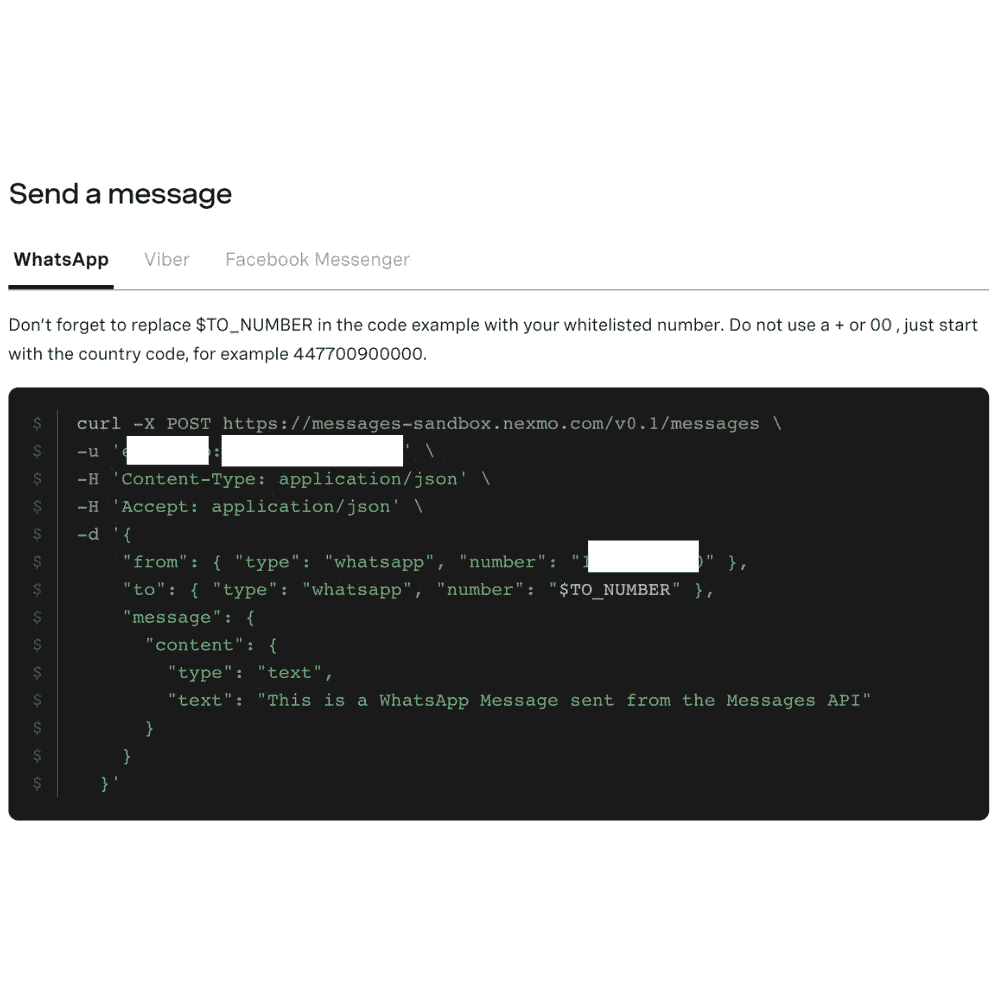
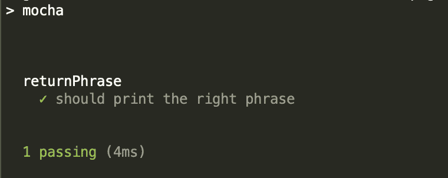
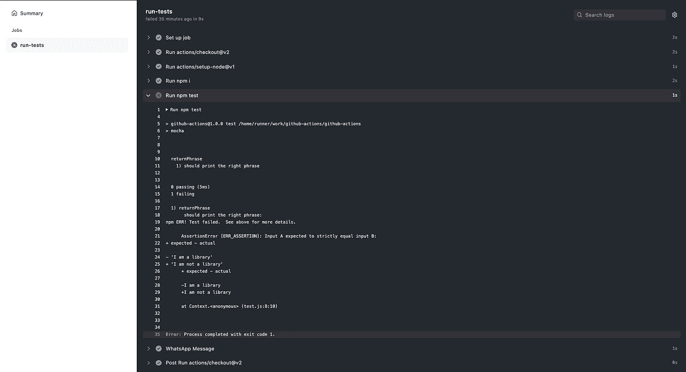
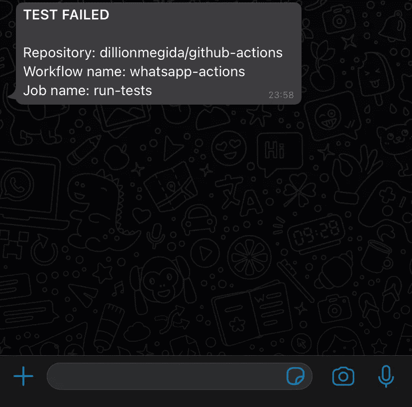

# 用 Vonage 消息 API 构建 Github 动作

> 原文：<https://medium.com/nerd-for-tech/building-github-actions-with-the-vonage-messages-api-c92f9cd5d04a?source=collection_archive---------14----------------------->

对于团队和个人来说，沟通对于项目的成长非常重要。不仅仅是成员之间的交流，还包括与项目的直接交流。手动检查应用程序的状态可能很费力，而这正是使用通信 API 的自动化所能提供的好处。当应用程序中发生事件时，您可以通过文本、语音通话、社交媒体或任何其他方式(取决于 API 的功能)轻松获得通知。

GitHub Actions 是 GitHub 中一个漂亮的集成，它允许你根据发生的特定事件触发动作。这对于许多目的都是有用的，这取决于开发人员的创造力。用例之一是通过通信 API 发送消息。

在本文中，我们将学习如何使用 WhatsApp 通道将 GitHub 动作与 Vonage Messages API 结合起来。当特定事件发生时，我们会向 WhatsApp 号码发送消息。您还可以使用 API 的其他支持通道进行练习。

**所需知识:**为了从本文中获得最大收益，需要对 Node.js 应用程序是如何创建的以及 GitHub 操作是如何工作的有一定的了解。这里有一篇[介绍 GitHub Actions](https://docs.github.com/en/free-pro-team@latest/actions/learn-github-actions/introduction-to-github-actions) 的文章，你可能想先看看。

# 什么是 Github 动作

GitHub 动作允许你在事件发生时执行特定的命令；例如，当有人发出拉请求时，推送到一个分支，以及[更多的事件](https://docs.github.com/en/free-pro-team@latest/actions/reference/events-that-trigger-workflows)。

GitHub 操作可以以多种方式使用，其中包括:

*   对拉请求运行测试
*   更新分支后自动部署
*   与开发者交流应用状态、问题或请求
*   更多的

# Vonage 消息 API — WhatsApp 频道

Messages API 允许您通过 WhatsApp 频道向 WhatsApp 号码发送消息。要访问 API，您需要在 Vonage 开发人员仪表板上创建一个帐户。之后，您将获得免费积分来开始测试 API。要使用 WhatsApp 频道，你需要设置一个沙箱。

然后，将 WhatsApp 频道添加到沙盒中。您将获得一个导航到 WhatsApp 应用程序的链接，在输入字段中有一条默认消息准备发送到 Vonage。默认消息各不相同。对于本教程，生成的消息是**“加入山药片”**。对于 WhatsApp 网络应用，这里有一个截图:

发送该消息时，您会收到一条消息，通知您您的号码已被列入沙箱的白名单。这意味着您现在可以向该号码发送消息。

如果你想添加更多号码，只需使用你想添加的 WhatsApp 号码向同一收件人发送相同的文本即可。

在同一个页面上，您会发现类似这样的内容:

这展示了如何调用 API 向白名单中的号码发送消息。此发布请求显示:

*   网址:[https://messages-sandbox.nexmo.com/v0.1/messages](https://messages-sandbox.nexmo.com/v0.1/messages)
*   `-u`标志中的用户名和密码(有意隐藏在截图中)。冒号前的第一组是 API 密钥，第二组是 Vonage 生成的密码。
*   一些标题
*   数据，包含`from`(Vonage 给你发消息的 WhatsApp 号)`to`(收件人，白名单号)，和`message`属性。

这是我们将在 GitHub 操作中用来发送消息的。

接下来，让我们设置一个示例应用程序来查看使用中的 GitHub 操作和 Vonage 消息 API。

# 将 Github 动作与 WhatsApp API 相结合

对于这个例子，我们将创建一个 npm 库，它在执行时返回“我是一个库”。这是一个非常简单的应用程序，所以我们可以专注于 GitHub 操作如何与 WhatsApp API 配合工作。

## 设置环境

使用终端，导航到您希望项目所在的目录，然后执行以下操作:

*   `mkdir simple-lib`:创建一个名为“简单库”的目录
*   `cd simple-lib`:导航至该目录
*   `npm init -y`:设置`package.json`
*   `touch index.js`:创建一个 index.js 文件，我们将在其中放置库的执行代码

将以下代码添加到`index.js`:

假设我们想为我们的库建立一个测试套件。在您的终端上运行以下命令:

是 JavaScript 应用程序的测试框架。我们将在`test.js`中使用以下代码进行测试:

在`package.json`中，将`test`属性编辑为以下值:

现在，当您在终端上运行`npm run test`时，您将得到:

使用`git init`初始化 Git repo，提交更改，并推送到您为此示例创建的新 GitHub 存储库。

## 实现 WhatsApp 消息传递

运行 GitHub 动作时，需要一个 [**动作运行器**](https://github.com/actions/runner) 。action runner 为我们想要使用的消息 API 提供了实现。动作跑者需要两个文件:

*   它为运行者提供了模式，比如要接收的输入、输出的变量等等。
*   主文件(可以是`dist/index.js`)提供了`action.yml`所引用的实际实现。

对于本例，创建一个具有以下配置的`action.yml`文件:

让我们创建一个将被编译成`dist/index.js`的`whatsapp.js`文件。该文件包含使用 WhatsApp 频道发送消息所需的代码。

下面是`whatsapp.js`文件的内容:

`[@actions/core](https://www.npmjs.com/package/@actions/core)`是一个包含几个函数的库，用于接受输入、导出变量和跨动作做许多其他事情。这一点的重要性在于从 GitHub 上的行动跑步者那里接收输入。需要安装它，所以运行:

是一个基于承诺的 HTTP 客户端，用于发出网络请求。这用于发出 POST 请求。它也需要安装，所以运行:

`process.env`允许访问包含 GitHub 在工作流执行期间公开的变量的环境变量。例如，GitHub 公开了可以通过`process.env.GITHUB_REPOSITORY`访问的`GITHUB_REPOSITORY`变量。[你可以在这里找到更多默认的 GitHub 环境变量](https://docs.github.com/en/free-pro-team@latest/actions/reference/environment-variables#default-environment-variables)。

将接收到一个`message`输入(我们将在 GitHub Actions 配置部分看到如何设置)，这将是我们将发送给 WhatsApp number 的相同消息。你可以使用任何白名单上的号码，但是 Vonage 明确指出:

> 不要使用+或 00，只需以国家代码开头，例如 447700900000

然后进行 post 请求，将 WhatsApp 消息发送到该号码。

正如在 Vonage 的示例代码中所看到的，我们为服务器认证指定了用户名和密码。对于 Axios，这是通过包含 `[username](https://stackoverflow.com/questions/62730511/axios-equivalent-of-curl-u-flag)` [和](https://stackoverflow.com/questions/62730511/axios-equivalent-of-curl-u-flag) `[password](https://stackoverflow.com/questions/62730511/axios-equivalent-of-curl-u-flag)` [属性](https://stackoverflow.com/questions/62730511/axios-equivalent-of-curl-u-flag)的`[auth](https://stackoverflow.com/questions/62730511/axios-equivalent-of-curl-u-flag)` [对象来完成的。](https://stackoverflow.com/questions/62730511/axios-equivalent-of-curl-u-flag)

如上所示，WhatsApp 消息以如下形式发送:

我们还需要再安装一个包:。这个包用于将 Node.js 文件捆绑到一个文件中。我们将使用它将`whatsapp.js`和所有使用的依赖项捆绑到一个文件中。

在`package.json`中增加以下内容:

在推送之前，我们需要运行`npm run build`，这样 whatsapp.js 中的所有内容都将被导出到`dist/index.js`。

# Github 操作的配置

首先，在项目根目录下的`.github`目录中创建一个`workflows`目录。这个目录将包含我们的应用程序所需的所有工作流。

在 workflows 下，创建一个名为“whatsapp-actions.yml”的文件。GitHub 动作使用 [YAML](https://yaml.org/) 语法来描述工作流。

对于这个例子，当一个新的提交被推送到存储库并且测试脚本失败时，我们想要发送一个 WhatsApp 消息。工作流程的内容如下:

在我们继续下一步之前，让我们对上面的配置有一个清楚的了解。

属性指定了工作流的名称。这是你在 GitHub 的 actions 标签中看到的。

`on`属性指定触发工作流的事件。对于我们的例子，`push`事件就是这样做的。这意味着当有人将变更提交到存储库中的一个分支时，工作流就会运行。这里有更多你可以使用的事件。你也可以指定[多个事件](https://docs.github.com/en/free-pro-team@latest/actions/reference/events-that-trigger-workflows#example-using-a-list-of-events)。

`jobs`属性指定将为该工作流运行的作业。我将第一份工作命名为`run-tests`。GitHub 在 actions 选项卡下显示工作流中运行的每个任务，方法是将它们按各自的作业名称分组。

下一行(`runs-on`)指定应该用于执行工作流的操作系统类型和版本。

在“工作”部分下面是要采取的“步骤”。`steps`块描述了组成作业的任务的执行。

在前两步中，动作“使用”`[actions/checkout@v2](https://github.com/marketplace/actions/checkout)`和`[actions/setup-node@v1](https://github.com/marketplace/actions/setup-node-js-environment)`。`actions/checkout@v2`是一个动作运行器，用于检查存储库。这是让您的工作环境能够访问存储库中的代码所必需的。`actions/setup-node@v1`是下载节点的动作运行器。这提供了对第三和第四步中需要的`npm`的访问。

用于创建 GitHub 动作的样板文件可以在 [starter workflows 存储库](https://github.com/actions/starter-workflows/blob/c59b62dee0eae1f9f368b7011cf05c2fc42cf084/ci/node.js.yml)中找到。如图所示，`uses: actions/checkout@v2`和`actions/setup-node@v1`也用于步骤部分。这是两个至关重要的步骤，因为它们使得使用`npm`执行您的存储库中的代码成为可能。

运行`npm i`会安装`package.json`中的所有依赖项，而`npm test`会运行`test`脚本。

工作流中的下一步是名为“WhatsApp Message”的一组步骤。这些行使用我们在`action.yml`中的动作配置触发 WhatsApp 消息。该步骤在下一行有一个条件(`if: ${{ failure() }}`)，表明只有当作业中前面的步骤失败时，剩余的测试才会执行。您可以查看更多[工作状态检查](https://docs.github.com/en/free-pro-team@latest/actions/reference/context-and-expression-syntax-for-github-actions#job-status-check-functions)。

在 WhatsApp 消息步骤中，操作“使用”`dillionmegida/github-actions@master`(同一个存储库的主分支)作为消息 API 代码实现的操作运行器。GitHub 此时会在这个存储库的根目录中搜索`action.yml`，我们已经配置好了。

该动作使用`with`属性向动作运行器(whatsapp.js)发送输入。输入带有一个键`message`和值`*TEST FAILED*`。添加星号是为了让 WhatsApp 可以将文本加粗。

## 测试 Github 动作

现在我们已经设置好了一切，我们可以通过推送到存储库来触发工作流。在此之前，我们需要确保测试失败，这样 WhatsApp 消息实现就会被执行。

编辑`test.js`如下:

我们可以捆绑我们的应用程序(使用`npm run build`)，提交更改，并将其推送到存储库。

推送时，工作流被触发，我们得到如下所示的错误:

出错后，我们会得到如下 WhatsApp 消息:

# 结论

使用 GitHub 动作可以做很多事情，使用 Vonage 通信 API 甚至可以做更多事情。你也可以在 Viber 和 Facebook Messenger 上发送消息。

在本文中，我们了解了什么是 GitHub 动作，一些使 GitHub 动作强大的实用程序，以及如何集成 Vonage Messages API，以便在将提交推送到存储库后测试脚本失败时发送 WhatsApp 消息。

*最初发布于*[*https://learn . vonage . com/blog/2021/02/04/building-github-actions-with-the-vonage-messages-API/*](https://learn.vonage.com/blog/2021/02/04/building-github-actions-with-the-vonage-messages-api/)