# 建立敌人的攻击行为

> 原文：<https://medium.com/nerd-for-tech/building-in-enemy-hit-behaviors-6558f9af5835?source=collection_archive---------8----------------------->

现在我们有一种方法让我们的目标知道他们被击中了，我们需要看看我们如何能在此基础上更进一步，让我们的敌人对被击中做出反应。首先，我们要做的是为敌人创造一个健康系统，这样我们就可以杀死他们。首先，让我们看看如何将它构建到我们的脚本中:

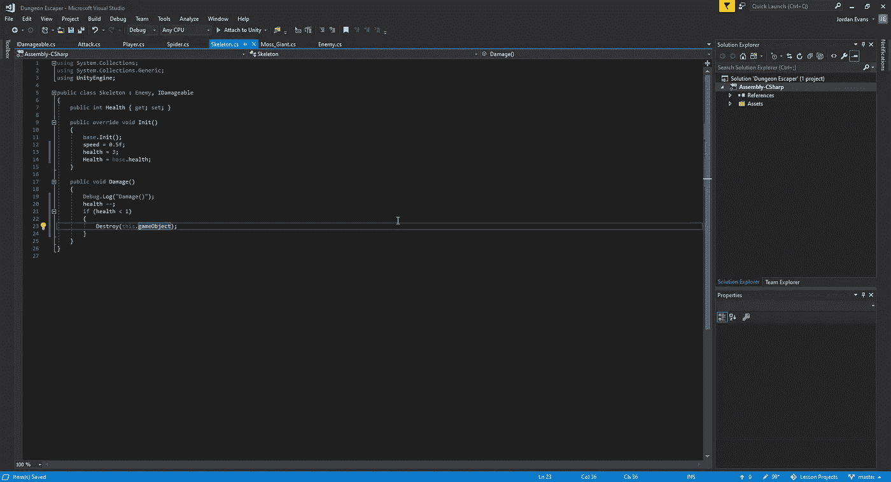

我们所做的是在我们的骨骼单位创造一个简单的健康减少方法。然而，当我们在游戏中测试时，我们会遇到一个小问题:

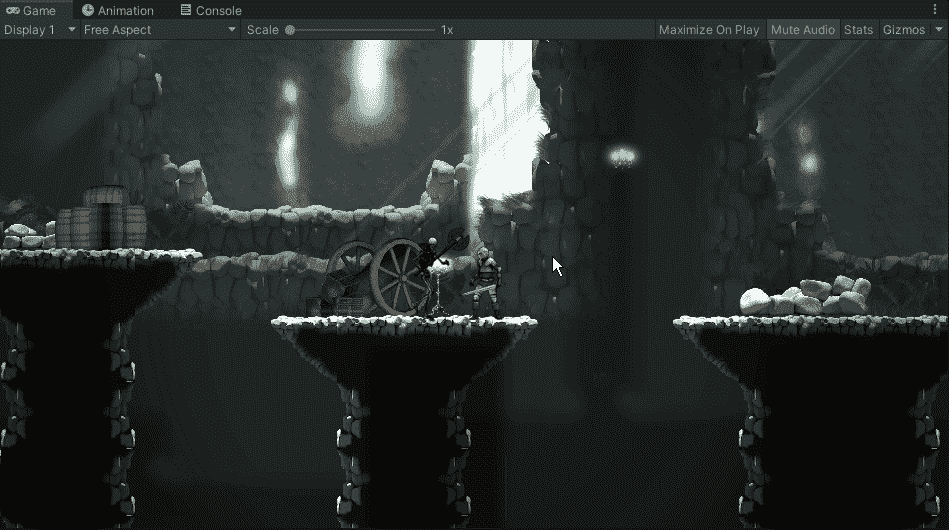

正在发生的是，我们的挥杆在同一次挥杆中成功地多次击中目标。为了解决这个问题，我们必须想出一种方法来允许击中检测的冷却时间，这样如果我们击中了某个东西，它就不会在某段时间后再次被击中:

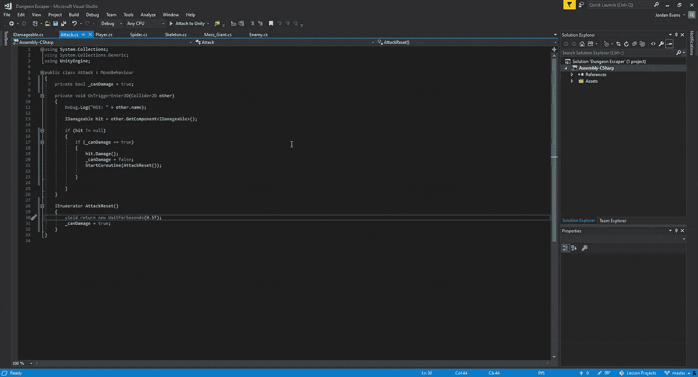

当我们处理一个基于事物间相互作用的时间系统时，最好的方法是使用 IEnumerator。在这种情况下，我们在骨架可以被击中的时间段之间创建 0.5 秒的宽限期。我们必须确保当我们的 can damage bool 为 true 时，我们的 Damage()方法能够被调用:

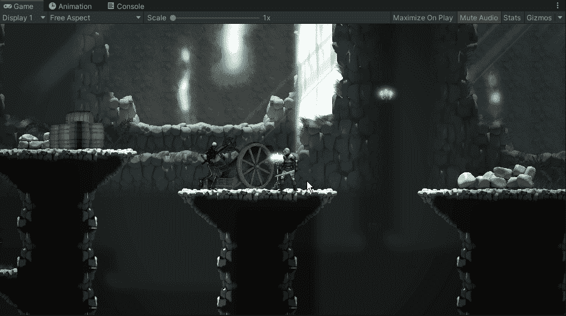

现在我们已经设置好了，所以我们需要 3 次摆动来正确地对付一个有 3hp 的敌人，让我们来制作一个热门动画。我们将像以前多次做的那样添加动画，在我们的 skele 敌人下的脚本中，我们将添加 1 行代码:

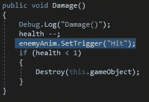

从这里，我们可以在我们的游戏中测试它:

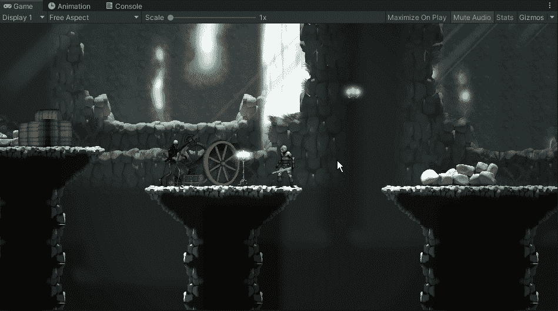

正如我们所看到的，被击中的动画将会播放，但是还有一些问题。首先，我们的骨骼在被击中时保持行走，然后它冻结在空闲状态，因为我们让它在被击中后过渡到空闲状态，几秒钟后才移动。为了解决这个问题，我们将为我们的骨骼创建一个进入战斗模式的逻辑，并保持空闲状态，直到我们的玩家离敌人足够远。首先，我们将让它循环播放空闲动画:

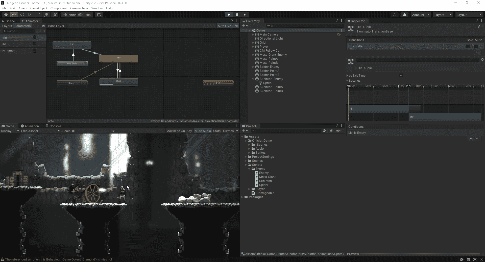

我们所做的是在我们的脚本中，一旦我们的玩家击中了敌人，我们的新收入将被设置为真。正如我们所看到的，它让我们的敌人处于闲置状态，但现在我们需要看看如何调整它，以便一旦玩家足够远，敌人就会回到移动状态。

首先，我们需要创建一种方法来测量我们的对象之间的距离:

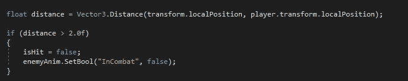

从这里，我们可以测试它是否正确地记录了骨骼和玩家之间的距离。然而，为了让我们做到这一点，我们会想进入我们的 skele 脚本，并在那里快速添加跟踪，这样我们就不会让我们的控制台充满了战场上所有敌人的距离:

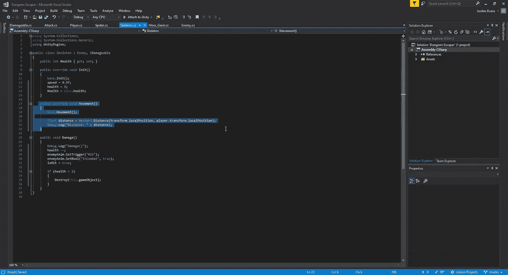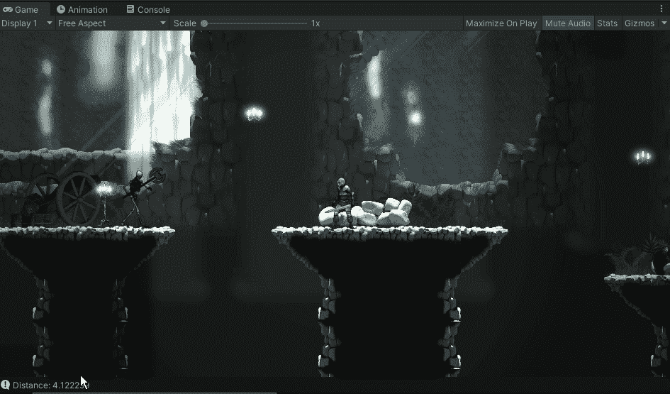

现在我们可以看到它正在被追踪，我们将希望在我们的敌人无效更新中进行快速调整，以便我们能够在玩家击中敌人后重新打开追踪:

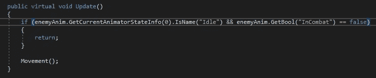

我们这样做是因为如果我们不添加 GetBool，我们的移动方法将永远不会被调用，因此距离跟踪将永远不会发生。一旦我们得到了所有这些工作，让我们看看它如何在我们的游戏中出现:

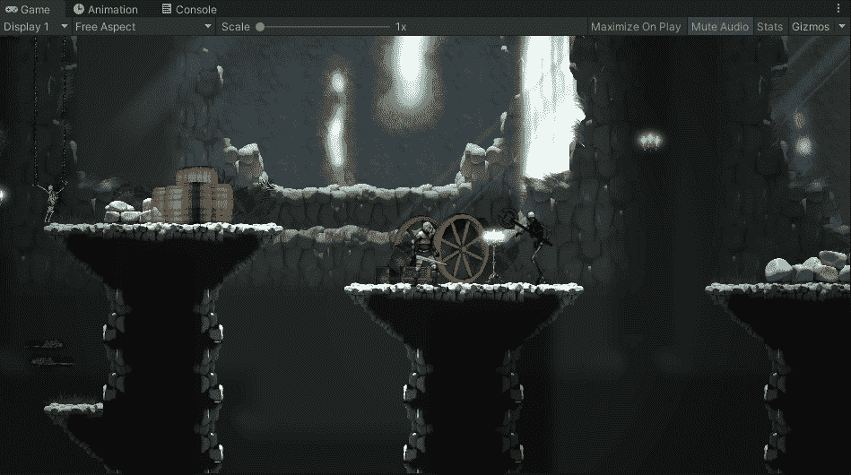

接下来，让我们开始工作，让我们的骨骼摆动回我们的球员。首先，我们要让它在摆动时朝向玩家:

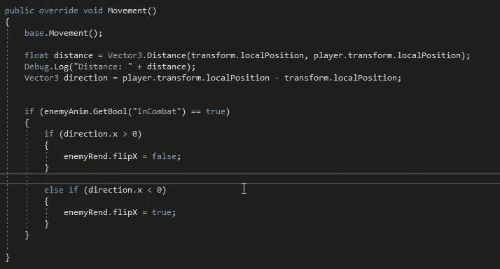

这段代码允许我们根据骨骼和玩家之间的距离在 x 轴上是正还是负来翻转骨骼。我们也只希望这个在骷髅战斗时触发，所以我们也必须指定:

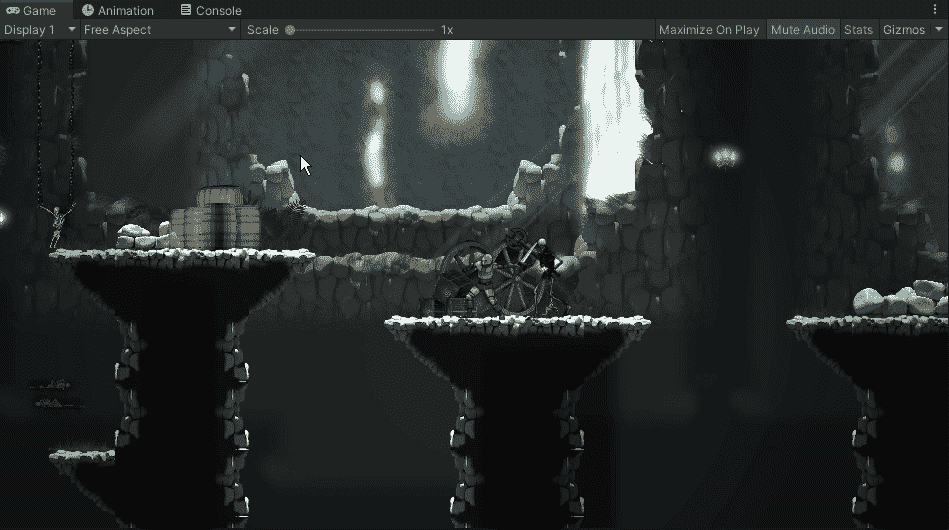

现在我们有了挥向玩家的骨骼，我们只需要在它上面创建一个生命盒，就像我们对玩家挥杆所做的那样:

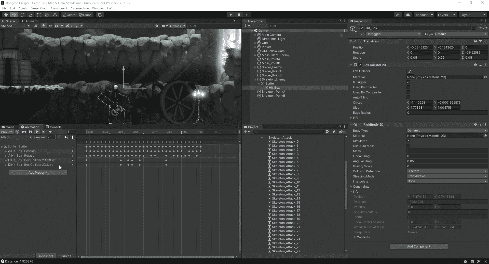

最后，让我们设置我们的播放器，使其内部具有 IDamageable 接口，因为这个特定的脚本并不是只考虑一个对象:

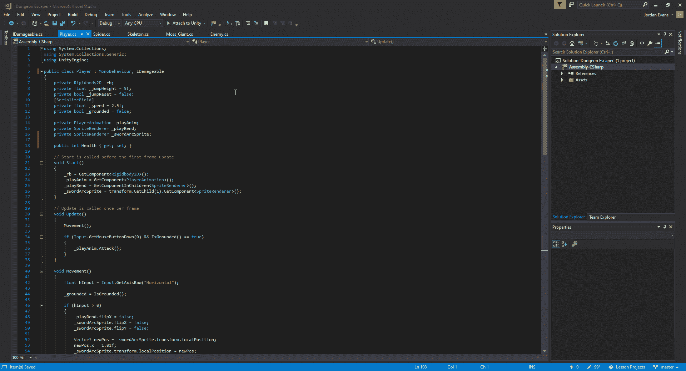

有了这个设置，我们可以检查我们的游戏，以确保当骨骼向我们摆动时它被调用:

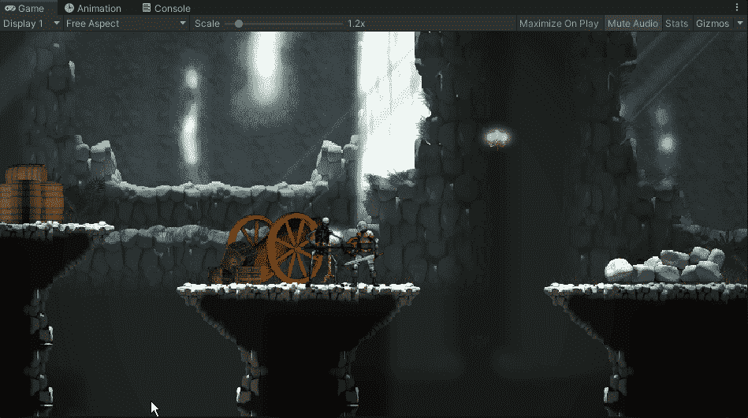

现在我们有了骷髅敌人，我们可以把这个逻辑应用到其他类型的敌人身上，然后继续游戏的下一部分。