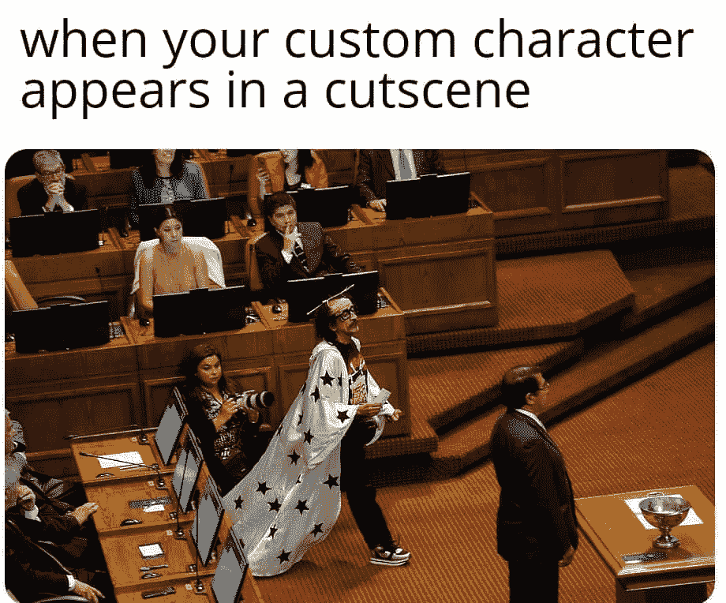
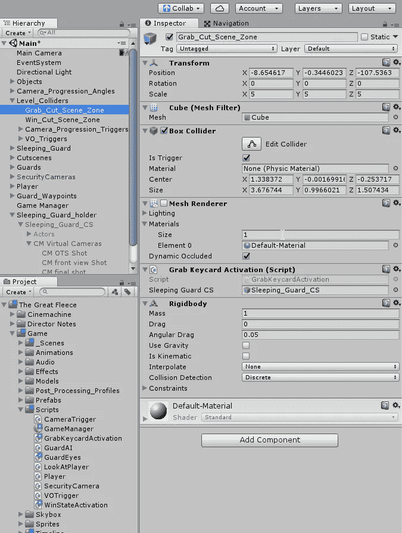
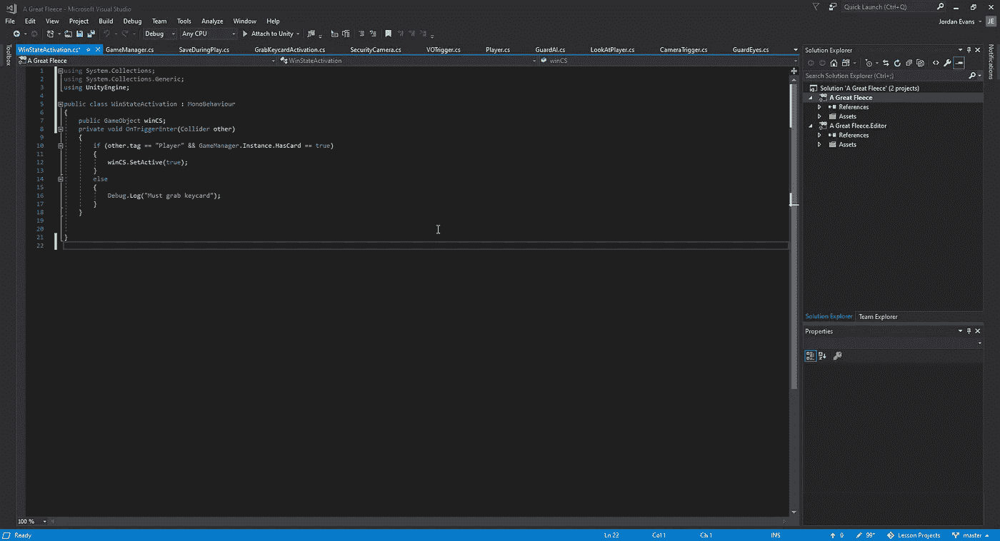
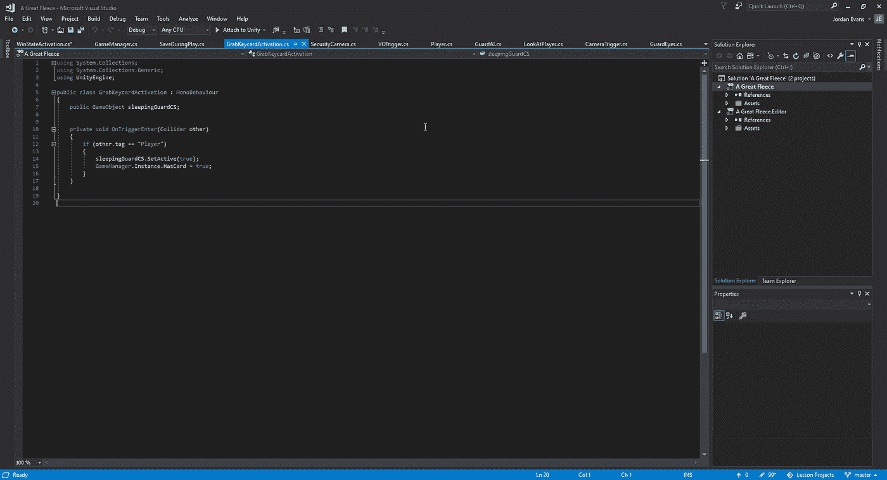
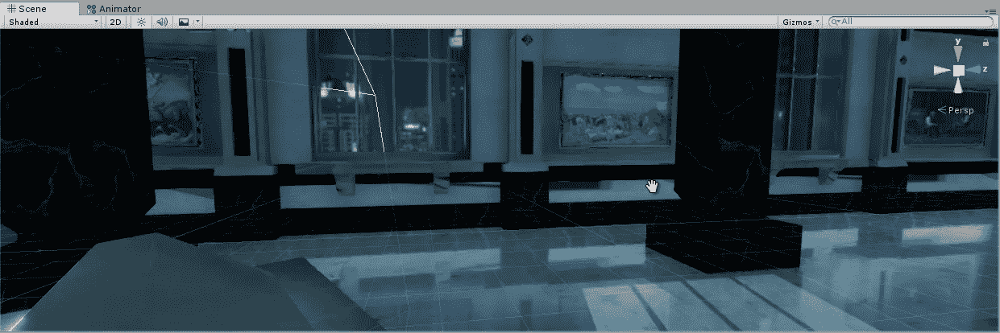
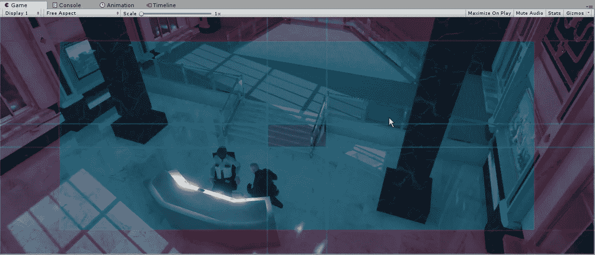
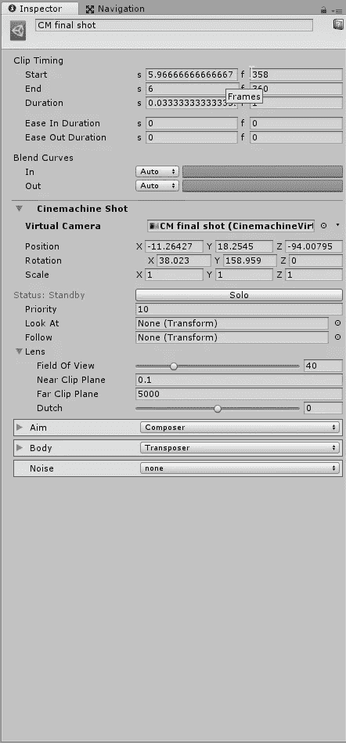
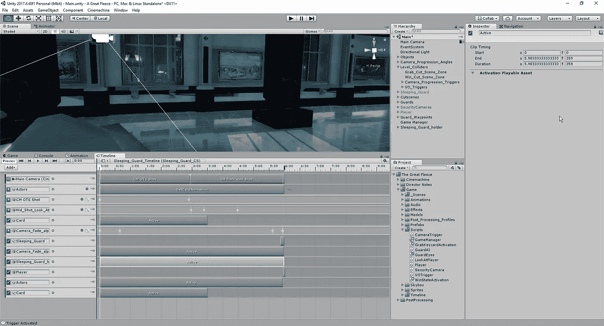
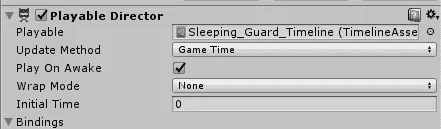

# 过场动画中的建筑

> 原文：<https://medium.com/nerd-for-tech/building-in-the-cutscenes-11e08f016032?source=collection_archive---------13----------------------->

现在我们已经设置了我们的 singleton，让 Unity 知道我们已经完成了从警卫那里获得钥匙卡的程序，我们现在可以看看如何将我们最后的 2 个过场动画嵌入到游戏中了。首先，我们需要在碰撞区域附加一个新的脚本，这样我们就可以指定当我们到达该区域时我们想要播放哪个过场动画:

至于实际脚本中的编码，在我们的 win 激活中，我们需要确保我们在玩那张牌之前拥有那张牌，而在我们的 sleeping guard 过场动画中，我们只需要触发它的激活。当我们试图按原样播放我们的场景时，我们会遇到睡着的守卫的阻碍:

发生这种情况是因为我们目前正在通过我们的第二个镜头镜头。为了解决这个问题，我们只需在电影结束时创建一个新的摄像机角度，在它淡出后过渡到一个更好的角度:

除此之外，我们还可以添加一些新的激活途径:

这个过场动画的最后一部分我们需要对我们的导演做一个快速的改变:

在 wrap 模式下，我们需要将其设置为 none，以便我们可以正确地与我们的 nav mesh 代理进行交互。如果我们不这样做，将会发生的是我们的玩家不能正确地移动到我们点击的位置。

我们已经将过场动画移到了支架中，这样我们就可以在过场动画结束时停用过场动画，防止过场动画中的演员在游戏中逗留。我们让沉睡的守卫和玩家出现在过场动画的结尾，这样他们就不会把我们的游戏资产和电影资产重叠。我们为卡片准备了第二条激活轨迹，因为这条轨迹是为游戏中的守卫准备的，而不仅仅是过场动画，因为它们在我们的游戏中是两个不同的物体。所有这些都准备好了，我们现在可以开始制作最终的过场动画了。这一个将会和我们过场动画的游戏有一些相似之处，因为一旦它结束了，我们就不会再回到我们的游戏中。