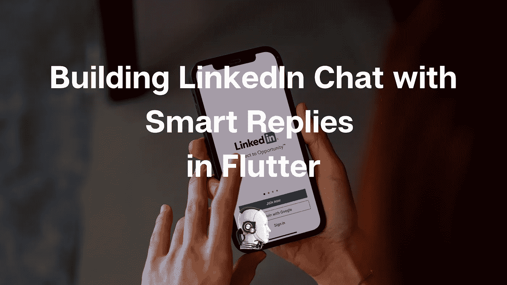
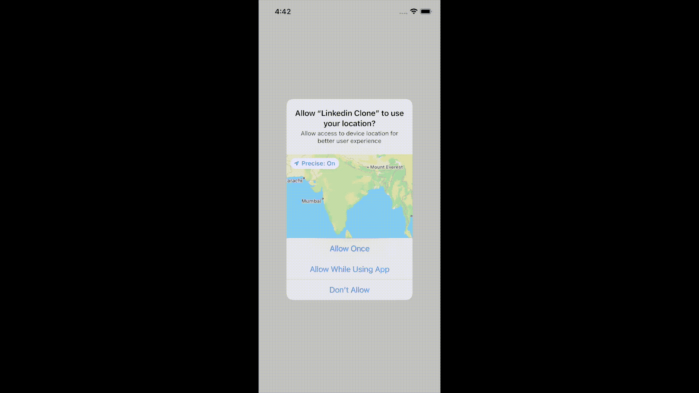
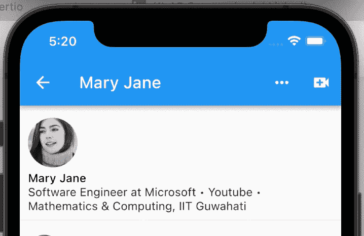
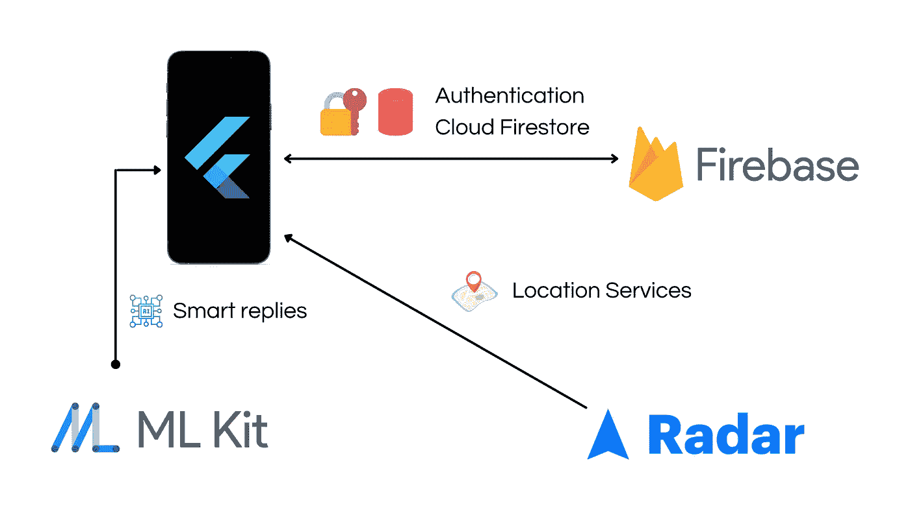

# 在 Flutter 中构建带有智能回复的 LinkedIn 聊天

> 原文：<https://medium.com/nerd-for-tech/building-linkedin-chat-with-smart-replies-in-flutter-eb51066c07b?source=collection_archive---------0----------------------->

想知道 LinkedIn 聊天如何处理那些与你和你的同事的信息相对应的好的小建议吗？好了，不要再想了。在本文中，我们将构建这样的环境。对于本教程，我们将使用 **Flutter** ，这是最著名的跨平台移动应用开发框架之一。除此之外，我们还将学习诸如 **Firebase** 、**雷达**、**谷歌 ML 工具包**等技术



如果你更喜欢视频教程，我会帮你搞定。完整实现看下面视频，我们一起来建设这个项目！

Firebase 是谷歌应用开发的旗舰产品。从技术上来说，它是一个**后端即服务** ( [**BaaS**](https://blog.back4app.com/backend-as-a-service-firebase/) )，这意味着我们可以获得大多数常用的后端功能，从而确保更快的开发周期。在我们的例子中，我们将使用 Firebase 对用户进行身份验证，即 **Firebase Auth** 和它的 NoSQL 数据库 **Cloud Firestore** 。

雷达是一个著名的位置服务提供商，我们将使用它的反向地理编码 API 从用户位置获取地址。

[Google ML Kit](https://developers.google.com/ml-kit) 提供了很多常用的机器学习模型作为移动应用的 API——比如**视觉 API**(物体检测、自拍分割等。)和**自然语言 API**(翻译、文字检测、智能回复等。).我们将对**智能回复 API** 特别感兴趣。让我们现在开始，看看如何使用这些。

您知道我们还可以使用**地图框**进行反向地理编码和其他功能吗？它和谷歌地图一样好，只是更便宜。[在这里](/nerd-for-tech/turn-by-turn-navigation-with-mapbox-16f874567b3c)我将谈论我们如何使用它的导航 API 来构建一个**优步**式的应用程序。

# 入门指南

为了便于入门，我为您准备了一个入门应用程序，您只需做一些更改就可以运行它。该应用程序有一个基本的 LinkedIn 式的用户界面和聊天功能的布局，我们已经实现了 Firebase 和 Radar。您可以在这里找到 GitHub 资源库的链接。

[](https://github.com/Imperial-lord/linkedin-clone) [## GitHub-Imperial-Lord/linkedin-clone:让我们探索 LinkedIn 的所有令人惊叹的功能，并…

### 让我们一起探索 LinkedIn 的所有惊人特性，同时从…构建应用程序

github.com](https://github.com/Imperial-lord/linkedin-clone) 

运行初始应用程序所需的更改可以在我们使用脸书的开源文档工具 **Docusaurus** 构建的文档网站中找到。

 [## LinkedIn 克隆| LinkedIn 克隆

### LinkedIn 是一个非常常用的应用程序，学习如何构建一个将提供深入的见解如何…

帝国领主. github.io](https://imperial-lord.github.io/linkedin-clone/) 

一旦你运行了这个应用程序，它看起来就像这样—



一个 25 秒的 GIF 展示了在做任何改变之前最初的应用程序是什么样子

# 构建聊天用户界面

我们的聊天界面将由 3 个部分(和相应的 3 个部件)组成

1.  **用户信息** —用户的姓名和标题
2.  **聊天窗口** —一个可滚动的消息列表，包含用户详细信息和发送消息的时间戳
3.  **聊天输入** —使用`CupertinoTextField`和动画按钮的输入字段，显示添加图像、gif 等的附加选项。在这里，我们将使用`Chip`小部件提供建议。

## 用户信息

为了构建这个部分，我们将使用我们使用**提供者**和 **MobX** 维护的应用程序范围的状态管理。为了显示用户名和标题，我们只需要在 UI 小部件`UserInfo()`中使用`userStore.name`和`userStore.headline`。这是完成后的样子。



## 聊天窗口

为了建立这一点，我们利用了一个`StreamBuilder`，并听取流:

```
FirebaseFirestore.instance.collection(groupChatId).doc(groupChatId).collection().snapshots()
```

一旦我们从那里获取数据(同时监听变化)，我们使用`ListView.builder()`按照时间降序呈现数据。

我们还利用一个助手函数来知道何时显示名称和时间戳(或者我称之为头)，**只有当两个连续的消息来自不同的用户时才会显示。** *你可以根据自己的需要更改最后一部分，来设计不同的 UX。例如，您可以在两条消息相差特定时间(比如 2 小时或更长时间)时显示标题。*

## 聊天输入

为了构建这个，我们使用`CupertinoTextField`，每当提交输入时，我们使用`ChatStore`中的`onSendMessage`函数将内容存储到 Firestore，如下所示。

我们还添加了一个动画按钮。在它的帮助下，使用`Visibility`小部件，我们创建了这个漂亮的动画来切换查看额外的选项，以添加图像、gif 等。

喜欢这篇文章吗？继续[跟随我](/@absatyaprakash01)，也记得把你自己添加到我的邮件列表中，这样**每当我发布**的时候，你都会收到一封电子邮件！

# 显示智能回复

现在进入最有趣的部分，我们将使用这个插件— [smart_reply](https://pub.dev/packages/smart_reply) ，它利用 **Google ML Kit 自然语言 API**来生成智能回复。最棒的是，由于这些模型在设备上运行，结果比传统上在服务器上运行要快得多。这就是生成建议的函数的样子。

注意，如果旧的建议不同于新的建议，我们在这里重建小部件(这样我们可以确保重建更有效)。建议以字符串数组的形式生成，最大长度为 3。然后，我们利用这些作为芯片的内容，每当芯片被点击以发送消息时，我们就像以前一样调用相同的函数`onSendMessage`。最终的结果看起来像这样(点击下面的视频链接)—

[](https://www.linkedin.com/feed/update/urn:li:activity:6906414938382856192/) [## LinkedIn 上的 AB Satyaprakash:# Docusaurus # flutter # LinkedIn

### 我只是克隆了 LinkedIn 聊天和智能回复🔥你也可以！😄查看评论中的第一个链接，找到…

www.linkedin.com](https://www.linkedin.com/feed/update/urn:li:activity:6906414938382856192/) 

# 结论

就这样，我们实现了一个类似 LinkedIn 的聊天工具，它也支持智能回复。好的一面是，我们可以将本教程中的步骤复制到任何其他项目中，在这些项目中，您可能想要使用聊天功能(以及可选的智能回复功能)。简而言之，这就是最终实现的样子—



如果您有任何问题或建议，请随时联系我。您可以在这些社交媒体平台上关注我，如 [LinkedIn](https://www.linkedin.com/in/ab-satyaprakash/) 、 [YouTube](https://www.youtube.com/channel/UCJ6D0HS8c9Il-eX5lGbAyGg) 、 [Twitter](https://twitter.com/AbSatyaprakash) 、 [Instagram](https://www.instagram.com/absatyaprakash/) 了解更多更新内容！

**一如既往！黑客快乐！😇**

加入我的电子邮件列表，获得更多精彩的教程和编程博客 ❤️