# 使用 Spring Boot + HarperDB 构建微服务并将其部署在 AWS 上

> 原文：<https://medium.com/nerd-for-tech/building-microservices-using-spring-boot-harperdb-and-deploying-it-on-aws-6d9b942501a3?source=collection_archive---------4----------------------->

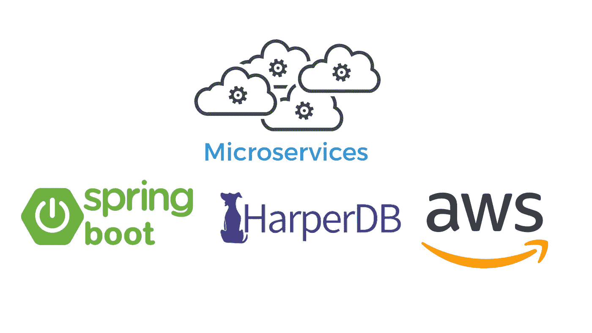

# 介绍

在这篇文章中，你将学习如何使用 Spring Boot 和 HarperDB 来创建一个微服务。稍后，您还将了解如何在 AWS Elastic Beanstalk 上部署完整的应用程序。

您将构建一个员工休假管理系统。该应用程序将负责跟踪员工休假的详细记录。您还将实现添加、编辑和取消假期的功能。

但是首先让我们对微服务有个基本的了解。

# 什么是微服务？

微服务是开发软件的另一种设计架构。在这种情况下，软件由通过 REST APIs 通信的小型独立服务组成。

微服务架构使应用程序更易于开发和扩展。它还使组织能够在以后需要时轻松地发展其技术堆栈。

# 整体服务与微服务

在整体架构中，所有流程都作为单一服务运行，因此，它们是紧密耦合的。这意味着，如果一个进程停止运行，整个应用程序都会受到影响，从而导致单点故障。

此外，随着代码库的增长，增强或添加新特性变得更加复杂。这种复杂性使得试验和实施新想法变得困难。

在微服务架构中，应用程序是通过组合作为服务独立运行的不同组件来构建的。这些服务通过轻量级 REST APIs 的定义良好的接口进行通信。

每个服务负责执行一项任务，由于它们独立运行，因此可以更新、部署和扩展每个服务，以满足应用程序特定功能的需求。

# HarperDB 简介

您将使用 HarperDB 作为您的数据库。HarperDB 是一个完整的数据管理解决方案和分布式数据库，具有本地 SQL 操作，如 join、order by 等。，以及 NoSQL 无模式甚至基于 API 的执行。

HarperDB 最显著的特性是:

*   所有 CRUD 操作都有一个端点
*   对 JSON 数据执行 SQL 查询
*   支持多种插件，如 ODBC、JDBC、Node-RED 等。
*   它同时支持 SQL 和 NoSQL
*   通过以 JSON 数组的形式返回结果，不再需要 ORM(对象关系映射)
*   在 JSON 上执行复杂且符合 ACID 的 SQL 查询，没有任何数据重复

看起来很有趣，不是吗？

# 配置 HarperDB 数据库实例

现在让我们从配置 HarperDB 实例开始:

*   前往[studio.harperdb.io/sign-up](https://studio.harperdb.io/sign-up)
*   请在表格中填写您的详细信息

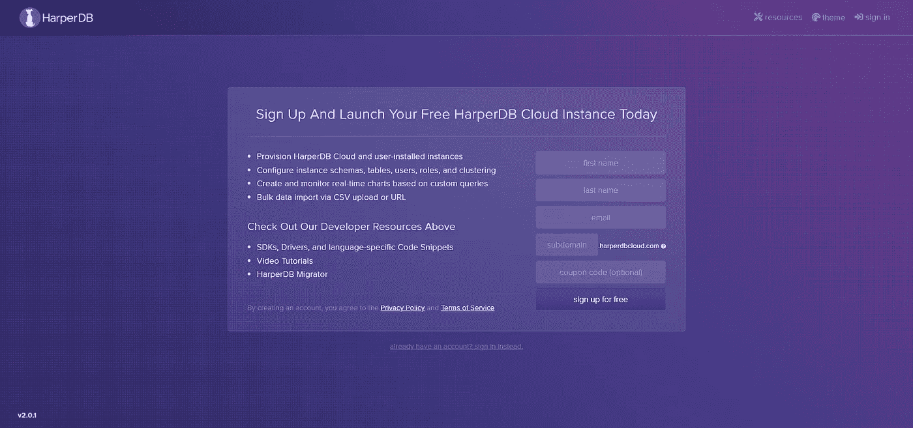

*   点击免费注册
*   然后，您将收到一封类似以下内容的电子邮件:

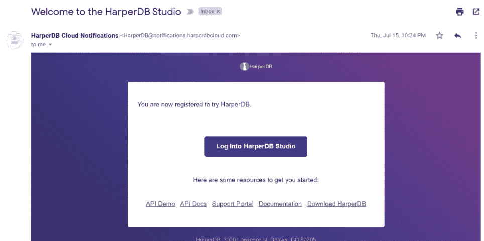

*   点击登录 HarperDB studio

# 创建实例

*   点击创建 HarperDB 云实例

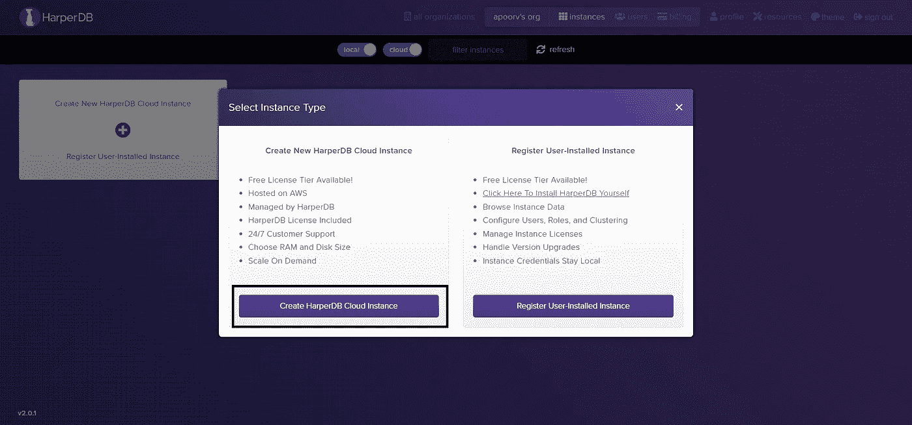

*   输入您的凭据

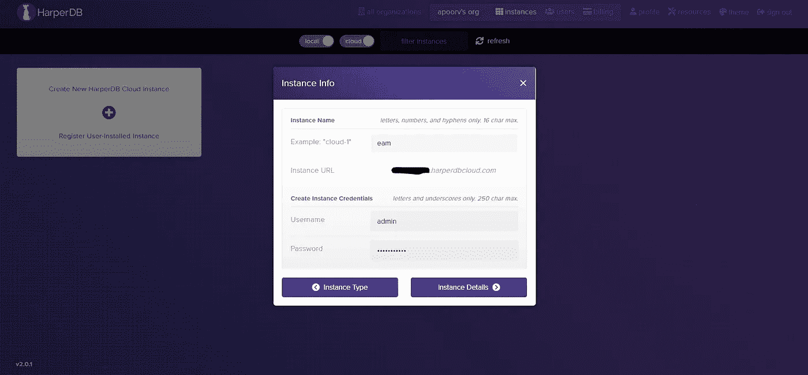

> *注意*:不要将这些凭证与您的工作室帐户混淆。这是为您在此数据库实例上创建的超级用户准备的。用户名不应该是电子邮件的形式。

*   选择你的实例规格。您可以从免费版本开始，以后根据需要进行升级。

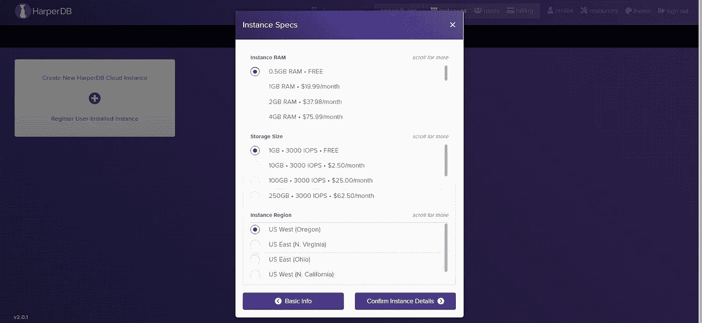

*   接下来，查看您的详细信息，并单击确认实例详细信息
*   最后，单击添加实例

再过 5 到 10 分钟，您的实例将准备就绪。完成后，您还会收到一封电子邮件。

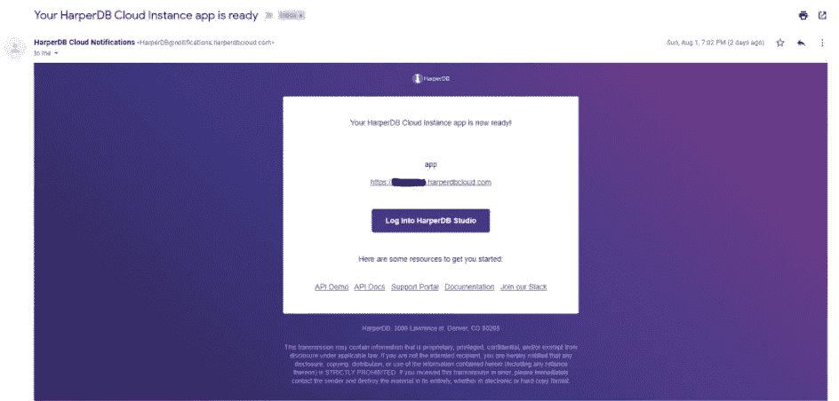

*您收到的实例 URL 就是您如何通过 REST 调用访问 HarperDB 的方法*。

最初，您的实例没有任何模式或表。因此，您需要首先创建它们。

我选择 **Employee_Leaves** 作为我的模式的名称。但是，您可以为您的模式使用任何其他名称，然后单击绿色复选标记保存它。

接下来，您需要创建表。目前，您将建立两个表 **Employee** 和 **Leaves** ，第一个表用于存储所有员工的详细信息，如姓名和员工 id，第二个表用于存储公司员工的假期。

请注意，您现在还不需要添加所有的列，它们会在需要时自动添加。现在，在创建一个表时，您只需要提供一个 *hash_attribute* 名称。*哈希属性用于唯一标识每条记录*。对于这两个表，您可以使用 ID 作为 hash_attribute。

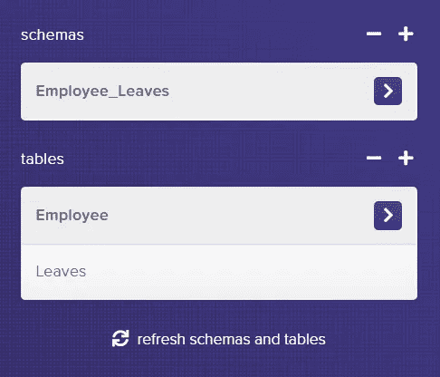

# 创建 Spring Boot 应用程序

从 spring boot 开始，你必须从 [Spring.io](https://start.spring.io/) 创建一个基本的应用程序。

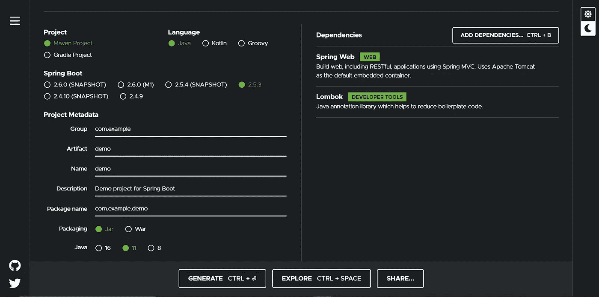

选择`Maven`项目和`Java`语言。对于 Spring Boot 版本，选择 2.5.3。您还必须添加 Spring-boot-starter-web 和 Lombok 依赖项。

或者，填写项目元数据。例如，您可以将组设置为`com.employee`，将工件&名称设置为`attendance`，将包设置为`com.employee.attendance`，最后输入一个简短描述&点击生成。

提取下载的项目，并在您喜欢的 IDE 中打开它。

接下来，要从您的 Spring Boot 应用程序访问 HarperDB 实例，您首先必须下载用于 HarperDB 的 **CData JDBC 驱动程序**。

CData JDBC 驱动程序允许以最直接的方式从任何基于 Java 的应用程序连接到 HarperDB。它包装并隐藏了访问数据的复杂性，并提供了额外的强大的安全特性、智能缓存、批处理、套接字管理等等。

让我们来看看将这个驱动程序集成到您的应用程序中的步骤:

*   导航至—[https://studio.harperdb.io/resources/drivers](https://studio.harperdb.io/resources/drivers)，然后点击下载。

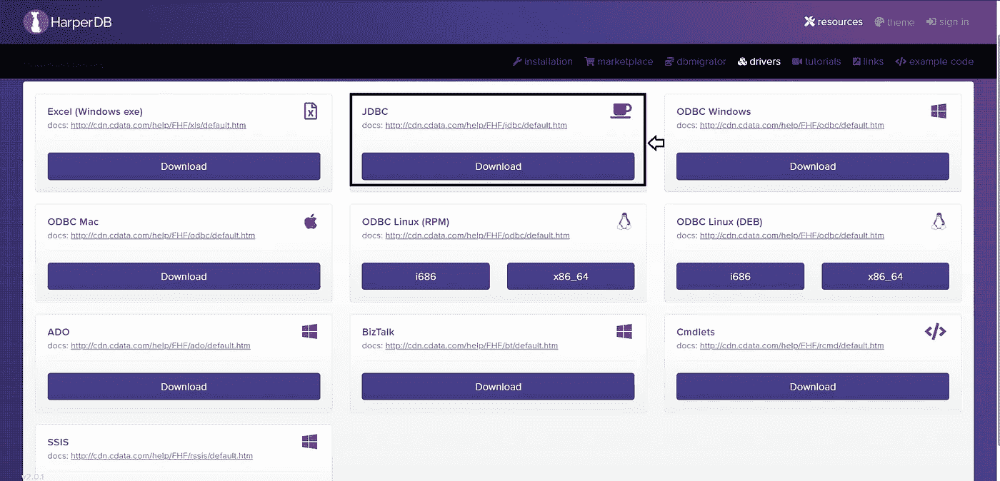

*   回到您的项目根目录，创建一个名为`lib` &的新文件夹，提取这个文件夹中的 zip 文件内容。
*   接下来，要将外部 jar 导入到您的 spring boot 应用程序中，请打开`pom.xml`文件并在其中添加以下依赖项:

```
<dependency>
    <groupId>cdata.jdbc.harperdb</groupId>
    <artifactId>cdata.jdbc.harperdb</artifactId>
    <scope>system</scope>
    <version>1.0</version>
    <systemPath>${project.basedir}/lib/cdata.jdbc.harperdb.jar</systemPath>
</dependency>
```

在这里，`${project.basedir}`指的是保存 pom.xml 的路径，即根目录。如果你在任何其他路径安装了驱动程序，你必须在`<systemPath>`标签中添加它的绝对路径。

这里需要注意的重要一点是，你必须将`<scope>`设置为**系统**，并且在插件内部将`<includeSystemScope>`设置为**真**。

```
<plugin>
  <groupId>org.springframework.boot</groupId>
  <artifactId>spring-boot-maven-plugin</artifactId>
  <configuration>
    <includeSystemScope>true</includeSystemScope>
  </configuration>
</plugin>
```

这是必须要做的，因为您最终将在服务器(AWS)上部署这个应用程序，为了让服务器知道任何外部 **JAR** 文件，这些配置是必要的。

现在，为了在您的应用程序和 HarperDB 实例之间建立一个连接，创建一个新的包并将其命名为`service`。在其中，创建一个名为`ConnectionService.java`的新 Java 文件，并向其中添加以下内容:

```
package com.employee.attendance.service;import org.springframework.stereotype.Service;
import java.sql.Connection;
import java.sql.DriverManager;
import java.sql.SQLException;@Service
public class ConnectionService {
    public Connection createConnection() throws SQLException {
        return DriverManager.getConnection("jdbc:harperdb:Server=https:xyz.harperdbcloud.com;User=admin;Password=1234;UseSSL=true;");
    }
}
```

> **@Service** 注释用于提供一些业务功能的类

这里，您使用在`DriverManager`类下可用的`getConnection()`方法中的“连接字符串”建立与数据库的连接。

或者，您也可以使用 Properties 对象准备连接选项。将 Properties 对象传递给 DriverManager:

```
Properties prop = new Properties();
prop.setProperty("Server","https:xyz.harperdbcloud.com");
prop.setProperty("User","admin");
prop.setProperty("Password","1234");Connection conn = DriverManager.getConnection("jdbc:harperdb:",prop);
```

用您自己的凭证替换服务器、用户和密码，您就可以开始了。

# 设计 REST APIs

现在您的应用程序和 HarperDB 之间已经成功建立了连接，让我们开始创建 Restful APIs。

首先，创建一个名为`controller`的新包。在其中，创建一个新类，并将其命名为`AttendanceController.java`。

控制器类是您将公开所有微服务端点的地方。这些端点是不同的微服务用来相互通信的。

对于此应用程序，您将创建 4 个端点:

*   **GET**`/api/get/all/leaves/{employeeId}`——获取某个员工到目前为止申请的所有假期。
*   **发布** `/api/add/leave` -为员工增加一个新的假期。
*   **放** `/api/edit/leave` -编辑已有休假的日期。
*   **删除** `/api/cancel/leave` -删除一个已有的休假。

下面是添加这 4 个端点后完整的控制器类的外观:

```
package com.employee.attendance.controller;import com.employee.attendance.dto.EmployeeDataDTO;
import com.employee.attendance.dto.EmployeeEditDataDTO;
import com.employee.attendance.service.AttendanceService;
import org.springframework.beans.factory.annotation.Autowired;
import org.springframework.web.bind.annotation.*;import java.util.HashMap;
import java.util.List;@RestController
public class AttendanceController { @Autowired
    private AttendanceService service; @GetMapping(value = "/api/get/all/leaves/{employeeId}")
    public List<HashMap<String, String>> getAllLeavesForEmployee(@PathVariable String employeeId) {
        return service.getAllLeavesForEmployee(employeeId);
    } @PostMapping(value = "/api/add/leave")
    public HashMap<String, String> addNewLeave(@RequestBody EmployeeDataDTO employeeData) {
        return service.addNewLeaveForEmployee(employeeData);
    } @PutMapping(value = "/api/edit/leave")
    public HashMap<String, String> editLeave(@RequestBody EmployeeEditDataDTO employeeEditData) {
        return service.editLeaveForEmployee(employeeEditData);
    } @DeleteMapping(value = "/api/cancel/leave")
    public HashMap<String, String> cancelLeave(@RequestBody EmployeeDataDTO employeeData) {
        return service.cancelLeaveForEmployee(employeeData);
    }
}
```

现在让我们在您之前创建的`service`包中创建另一个名为`AttendanceService.java`的类。在这个类中，您将编写所有的业务逻辑。因此，让我们实现控制器中提到的所有 4 种方法:

```
package com.employee.attendance.service;import com.employee.attendance.dto.EmployeeDataDTO;
import com.employee.attendance.dto.EmployeeEditDataDTO;
import lombok.extern.slf4j.Slf4j;
import org.springframework.beans.factory.annotation.Autowired;
import org.springframework.stereotype.Service;
import java.sql.*;
import java.util.ArrayList;
import java.util.HashMap;
import java.util.List;@Service
@Slf4j
public class AttendanceService { @Autowired
    private ConnectionService connectionService; public List<HashMap<String, String>> getAllLeavesForEmployee(String empId) {
        log.info("Getting all leaves for employee - {}",empId);
        List<HashMap<String, String>> resultList = new ArrayList<>();
        try {
            Connection conn = connectionService.createConnection();
            PreparedStatement statement = conn.prepareStatement("Select * From Employee_Leaves.Leaves where empId = ?");
            statement.setString(1,empId);
            ResultSet resultSet = statement.executeQuery();
            while (resultSet.next()) {
                HashMap<String, String> result = new HashMap<>();
                result.put("date_of_apply",new Date(Long.parseLong(resultSet.getString("__createdtime__"))).toString());
                result.put("last_update_date",new Date(Long.parseLong(resultSet.getString("__updatedtime__"))).toString());
                result.put("leave_applied_for",resultSet.getString("date"));
                result.put("employee_id",resultSet.getString("empId"));
                resultList.add(result);
            }
            conn.close();
        } catch (Exception e){
            log.error("Error occurred", e);
            HashMap<String, String> result = new HashMap<>();
            result.put("Error",e.getMessage());
            resultList.add(result);
        }
        return resultList;
    } public HashMap<String, String> addNewLeaveForEmployee(EmployeeDataDTO employeeData) {
        log.info("Inserting new leave for employee - {}",employeeData.getEmployeeId());
        HashMap<String, String> result = new HashMap<>();
        try {
            Connection conn = connectionService.createConnection();
            PreparedStatement statement = conn.prepareStatement("INSERT INTO Employee_Leaves.Leaves (date, empId) VALUES (?,?)");
            statement.setString(1, employeeData.getDate());
            statement.setString(2, employeeData.getEmployeeId());
            int count = statement.executeUpdate();
            if(count>0) {
                result.put("Message", "Success");
                result.put("Affected rows", String.valueOf(count));
            }
            conn.close();
        } catch (Exception e){
            log.error("Error occurred", e);
            result.put("Error",e.getMessage());
        }
        return result;
    } public HashMap<String, String> editLeaveForEmployee(EmployeeEditDataDTO employeeEditData) {
        log.info("Updating leave for employee - {}",employeeEditData.getEmployeeId());
        HashMap<String, String> result = new HashMap<>();
        try {
            Connection conn = connectionService.createConnection();
            PreparedStatement statement = conn.prepareStatement("UPDATE Employee_Leaves.Leaves SET date = ? WHERE empId=? and date = ?");
            statement.setString(1, employeeEditData.getNewDate());
            statement.setString(2, employeeEditData.getEmployeeId());
            statement.setString(3, employeeEditData.getPreviousDate());
            int count = statement.executeUpdate();
            if(count>0) {
                result.put("Message", "Success");
                result.put("Affected rows", String.valueOf(count));
            }
            conn.close();
        } catch (Exception e){
            log.error("Error occurred", e);
            result.put("Error",e.getMessage());
        }
        return result;
    } public HashMap<String, String> cancelLeaveForEmployee(EmployeeDataDTO employeeData) {
        log.info("Cancelling leave for employee - {}",employeeData.getEmployeeId());
        HashMap<String, String> result = new HashMap<>();
        try {
            Connection conn = connectionService.createConnection();
            PreparedStatement statement = conn.prepareStatement("DELETE FROM Employee_Leaves.Leaves WHERE empId = ? and date = ?");
            statement.setString(1, employeeData.getEmployeeId());
            statement.setString(2, employeeData.getDate());
            int count = statement.executeUpdate();
            if(count>0) {
                result.put("Message", "Success");
                result.put("Affected rows", String.valueOf(count));
            }
            conn.close();
        } catch (Exception e){
            log.error("Error occurred", e);
            result.put("Error",e.getMessage());
        }
        return result;
    }
}
```

完成后，让我们了解这四个功能的用途:

*   `getAllLeavesForEmployee()`。

它将负责从`Leaves`表中获取特定员工的所有假期。您只需建立一个连接，然后根据员工 Id 查询 Leaves 表。

*   `addNewLeaveForEmployee()`

每当一个员工需要申请一个假期，这个函数将被调用，它将接受一个`EmployeeDataDTO`类的对象，并将在数据库的`Leave`表中添加一个新的假期。

*   `editLeaveForEmployee()`

如果员工想要更改之前申请休假的日期，`editLeaveForEmployee()`功能将负责在您的数据库中进行修改。

*   `cancelLeaveForEmployee()`

它将简单地取消员工的特定休假，即从表中删除该行。该函数也将`EmployeeDataDTO`类的对象作为其参数。

接下来的事情是理解`EmployeeDataDTO`和`EmployeeEditDataDTO`类的用法。

这两个类将充当您的数据传输对象或简称为 dto。它们将存储您将在 API 请求体中传递的数据，并通过控制器类将这些数据传递给服务进行处理。

要生成这些 Java 文件，创建一个名为`dto`的新包，并在其中添加两个文件，一个是`EmployeeDataDTO.java`，另一个是`EmployeeEditDataDTO.java`。

下面是内容`EmployeeDataDTO.java`将举行:

*   员工 Id
*   申请休假的日期

```
package com.employee.attendance.dto;import lombok.Data;@Data
public class EmployeeDataDTO {
    private String employeeId;
    private String date;
}
```

并且`EmployeeEditDataDTO.java`将具有以下特性:

*   员工 Id
*   用户想要编辑的前一日期
*   新的休假日期

```
package com.employee.attendance.dto;import lombok.Data;@Data
public class EmployeeEditDataDTO {
    private String employeeId;
    private String previousDate;
    private String newDate;
}
```

> `@Data`是一个有用的注释，它捆绑了`@ToString`、`@EqualsAndHashCode`、`@Getter` / `@Setter`的特性。它在 Lombok dependency 下可用。

# 测试端点

出于测试目的，我已经手动将一些初始数据插入到数据库表中(通过单击表右上角的“+”号):

*   表**员工**

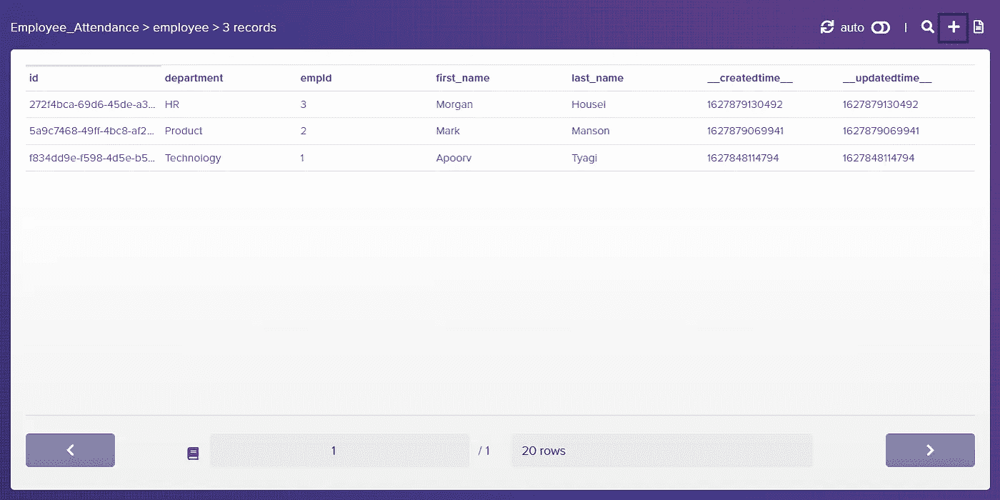

*   表**离开**

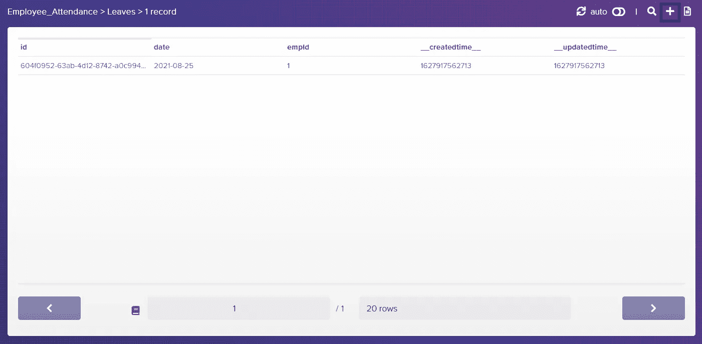

现在，您必须点击这 4 个 API 端点来检查是否一切都按预期运行。

为此，您必须从他们的[官方下载](https://www.postman.com/downloads/)中下载您本地开发环境中的 Postman 应用程序。

下载并成功安装后，打开应用程序并运行您的 Spring Boot 应用程序。

如果您使用的是 IntelliJ IDEA 之类的 IDE，可以按照以下说明运行 Spring Boot 应用程序:

*   点击顶部菜单栏中的`Add Configuration`。

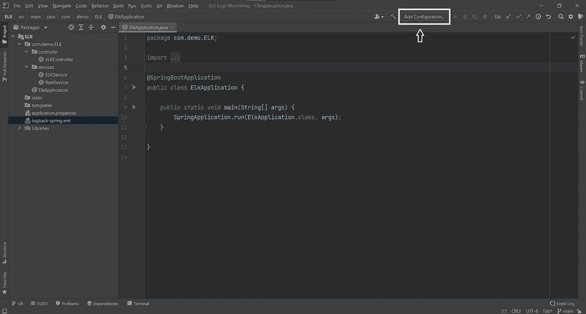

*   一个新的对话框将会打开，点击`Add new run configurations`并从下拉列表中选择`Maven`。

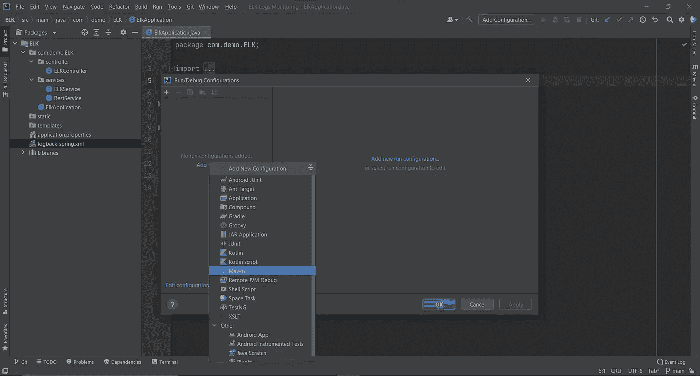

*   为您的运行配置命名。工作目录将被自动选择。你只需要在命令行中输入命令`spring-boot:run`，然后点击应用和确定，最后运行应用程序。

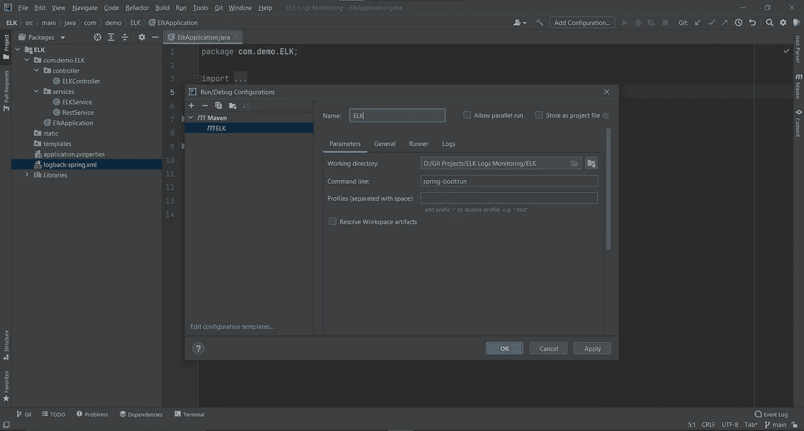

你要做的下一件事是通过邮递员应用程序到达终点:

*   `/api/get/all/leaves/{employeeId}`

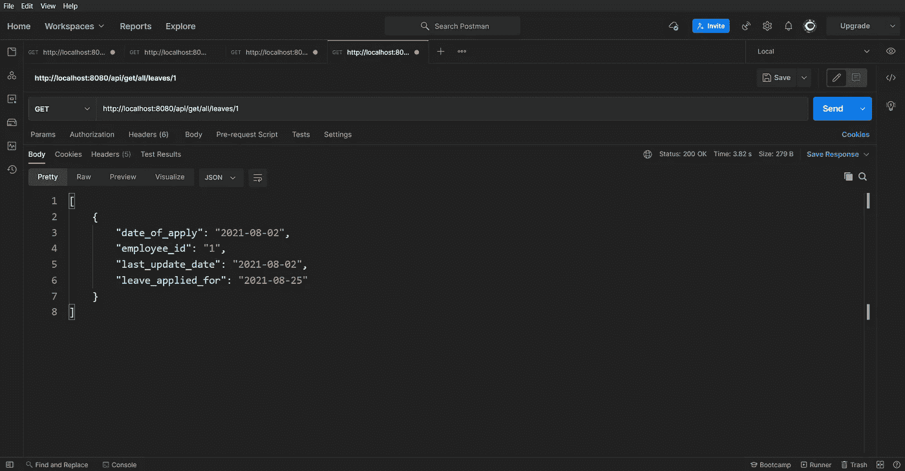

*   `/api/add/leave`

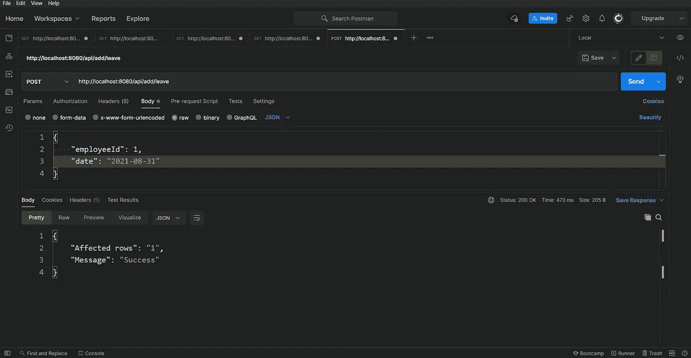

为了检查假期是否添加成功，让我们再次调用您在第一步中使用的`api/get/all/leaves` API:

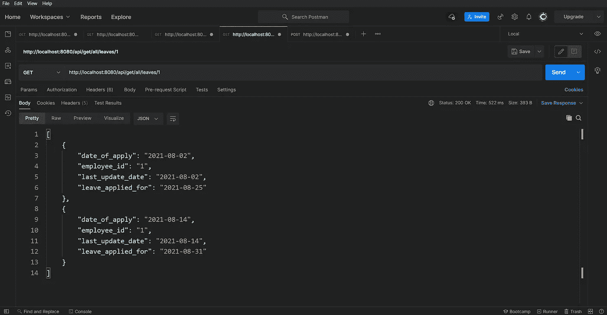

正如您在响应中看到的，ID 为 1 的员工现在有两个假期。这同样反映在数据库中:


*   `/api/edit/leave`

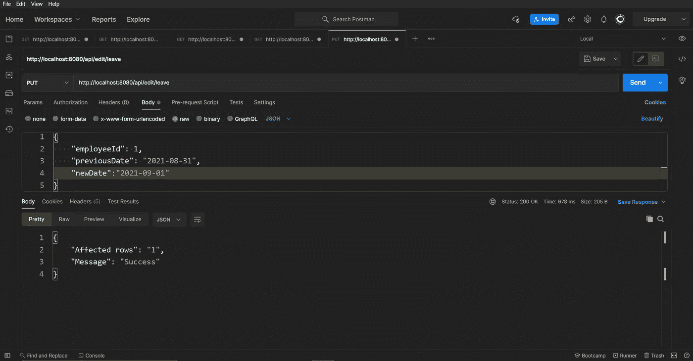

同样，让我们检查之前的日期是否已被修改，您将得到:

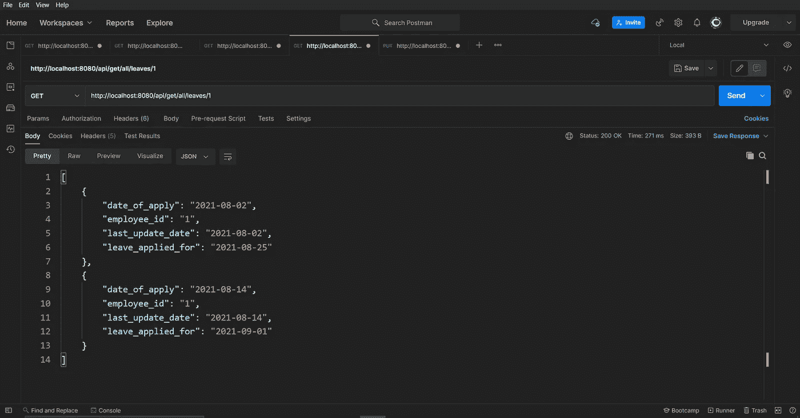

这意味着编辑功能也运行良好。

*   `/api/cancel/leave`

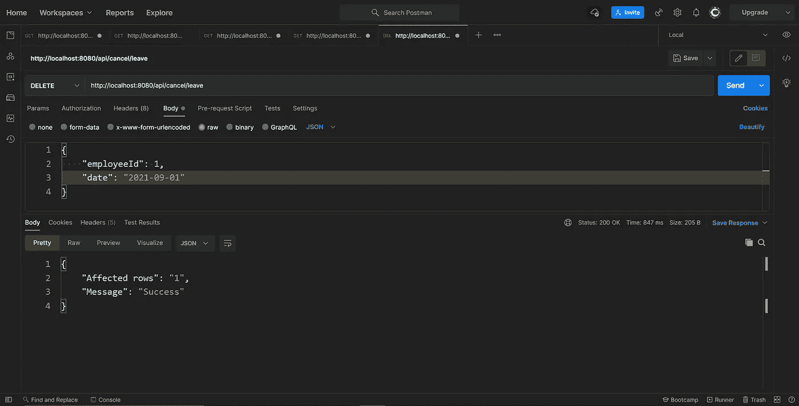

现在点击 GET leaves API，您应该只得到一个响应条目:

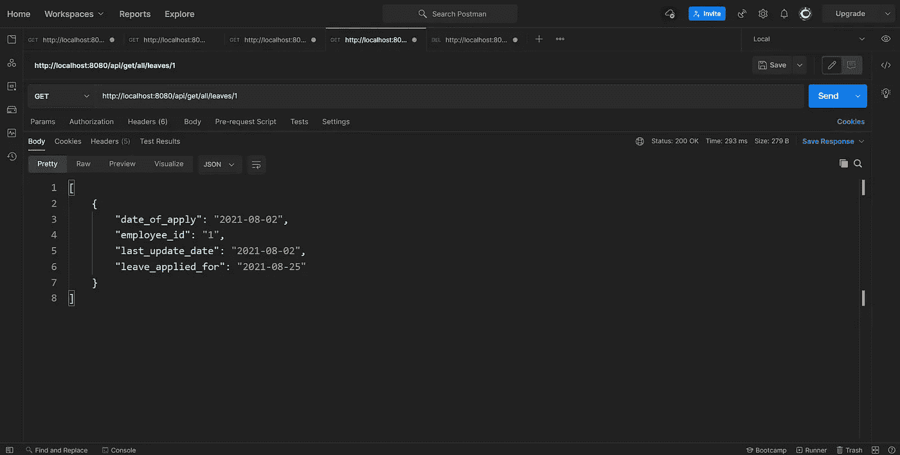

因此，您的所有端点都在本地开发环境中正常工作。让我们继续看如何将这些 API 部署到服务器上。

# 创建 JAR 文件

JAR(Java Archive)是一种包文件格式，用于将所有 Java 类文件以及相关的元数据和资源(文本、图像等)聚集在一起。)合并到一个文件中，以便在 Java 平台上分发应用软件或库。

简单地说，JAR 文件包含。类文件、音频文件、图像文件或其他目录。

要创建 JAR 文件，请确保 Maven 安装在您的本地开发环境中。如果没有，请按照以下步骤配置 maven(在 Windows 操作系统中):

*   导航到官方 [Maven 网站](https://maven.apache.org/download.cgi)并下载 Maven zip 文件。比如:apache-maven-3.8.2-src.zip。
*   解压内容，复制里面的`bin`文件夹的路径。
*   从控制面板打开你的系统环境变量，找到`PATH`变量然后点击`Edit`按钮。
*   在“编辑环境变量”对话框中，点击`New`并添加您刚刚复制的`bin`文件夹的完整路径。
*   最后点击`OK`。要测试配置，打开一个新的命令提示符并键入`mvn –version`。如果您可以看到某个版本，这意味着配置是正确的。

> 如果你使用的是其他操作系统，你可以在 Maven 官方网站上找到安装步骤。关于更详细的步骤，你也可以查看这篇文章。

接下来，为您的应用程序创建一个 JAR 文件，在您的项目根目录中运行命令`mvn clean install`。

将创建一个名为**目标**的新文件夹。在这个文件夹中，您将找到新创建的 JAR 文件。

另一种创建 JAR 文件的方法是从 IDE 中创建。例如，在 Intellij 中，您可以从侧边栏菜单导航到 **maven** 选项卡，然后双击 **Install** 。

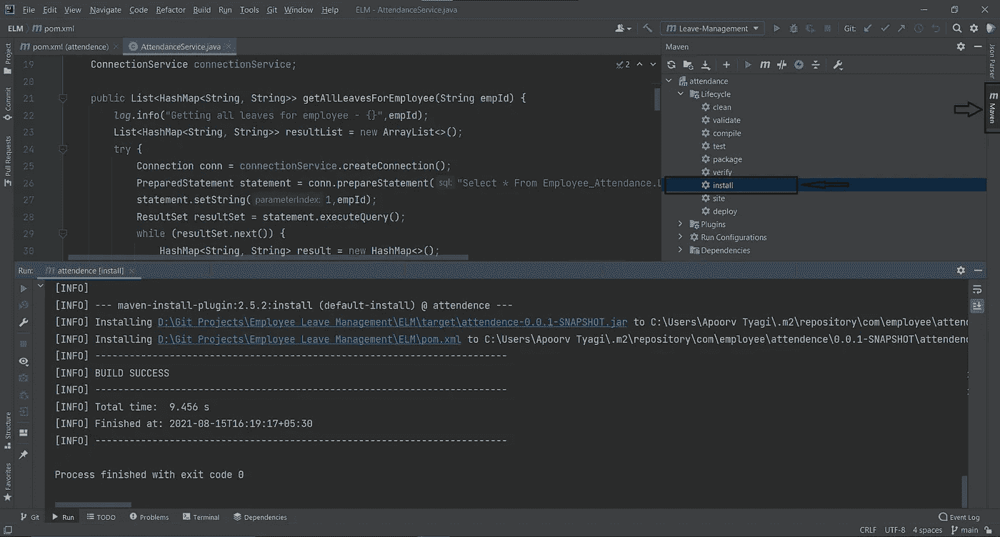

现在，您的完整项目结构应该是这样的:

```
├── lib
├── src
├── target
└── pom.xml
```

在`src>main>java>com>employee>attendance`中，您应该有以下文件和结构:

```
├── controller
│   └── AttendanceController.java
├── dto
│   └── EmployeeDataDTO.java
│   └── EmployeeEditDataDTO.java
├── service
│   └── AttendanceService.java
│   └── ConnectionService.java
└── AttendanceApplication.java
```

# 将应用程序部署到 AWS

最后一步是将您的代码部署到服务器上。在本节中，您将了解如何将应用程序部署到 AWS Elastic Beanstalk。

> 使用 [Elastic Beanstalk](https://aws.amazon.com/elasticbeanstalk/) ，您可以轻松地在 AWS 云中部署和管理应用程序，而无需担心运行这些应用程序的基础设施。它降低了管理的复杂性，而不限制选择或控制。您只需上传您的应用程序，Elastic Beanstalk 就会自动处理容量供应、负载平衡、伸缩和应用程序健康监控等细节。

# 创造弹性豆茎环境

一旦你登录到你的 [AWS 账户](https://aws.amazon.com/)，进入顶部的搜索面板，输入“Elastic Beanstalk”，点击右上角的创建一个新的应用程序。

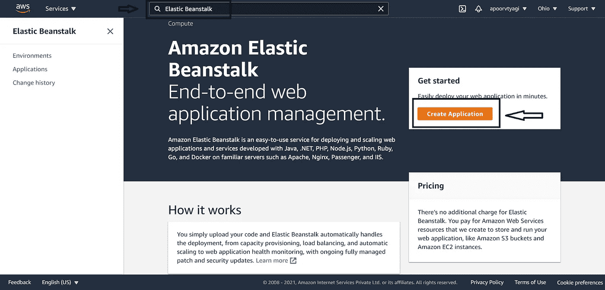

它会询问您:

*   应用程序名称
*   应用程序标签(非强制性)
*   平台
*   应用代码

输入您的应用程序名称，您可以选择为您的 Elastic Beanstalk 应用程序的资源添加多达 50 个标签。

对于平台，从下拉列表中选择“Java ”,它会自动填写“平台分支”和“版本”。

对于应用程序代码，选择 Upload your code，然后选择上一步中构建的 JAR 文件。

检查配置并启动环境。随着应用程序的启动，您将在环境控制面板上看到与此类似的内容:

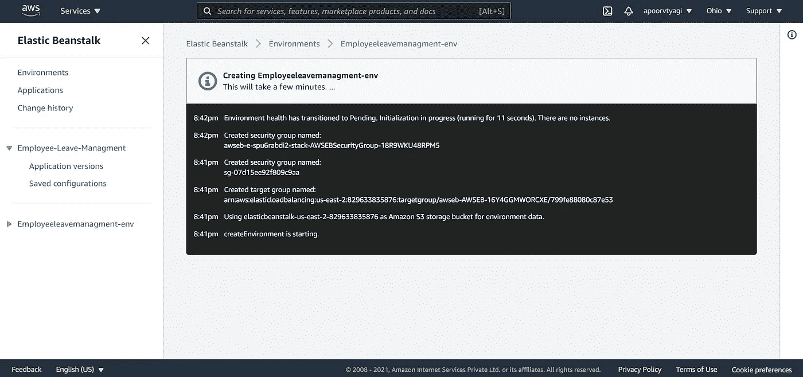

一旦部署了应用程序资源并创建了环境，您会注意到应用程序的健康状况仍然很严峻。这是因为 Spring Boot 应用程序仍然需要一些配置:

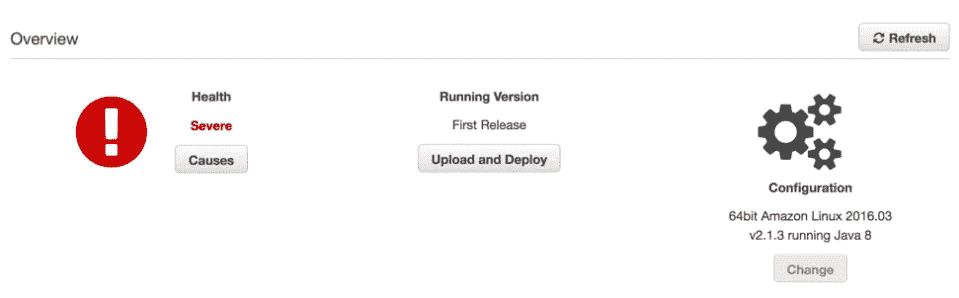

下一节我们来看看怎么解决。

# 通过环境变量配置 Spring Boot

默认情况下，Spring Boot 应用程序监听端口 8080，而 Elastic Beanstalk 希望应用程序监听端口 5000。

有两种方法可以修复这个错误，要么您必须更改 Elastic Beanstalk 配置使用的端口，要么更改 Spring Boot 应用程序监听的端口。对于本教程，您将更改 Spring Boot 应用程序监听的端口，因为这样更容易。

为此，您必须在 Elastic Beanstalk 的环境中定义 SERVER_PORT 环境变量，并将其值设置为 5000。

*   在环境页面的侧边栏菜单中单击配置。
*   在配置页面上，您将看到软件配置，单击编辑:

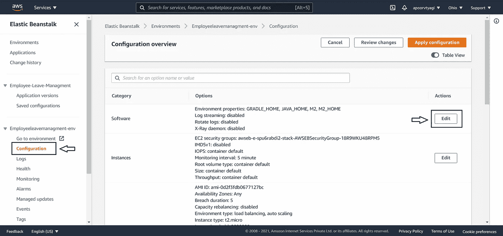

*   接下来，您将看到已经设置了一些环境变量。当被配置为使用 Java 平台时，它们是由 Elastic Beanstalk 自动设置的。
*   要修改 Spring Boot 监听的端口，如上所述，您需要添加一个名为`SERVER_PORT`的新环境变量，其值为 5000。

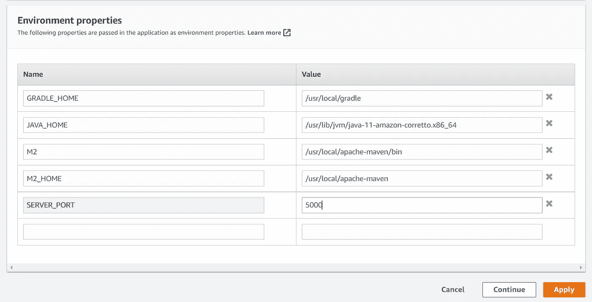

单击应用，配置更改将使应用程序重启。

重启后，它将通过环境变量获得新的配置。大约一分钟后，您将获得一个健康的应用程序实例并开始运行。

# 在云中测试应用程序

一旦部署成功，您将获得您的应用程序基础 URL。您也可以从侧边栏访问相同的内容:

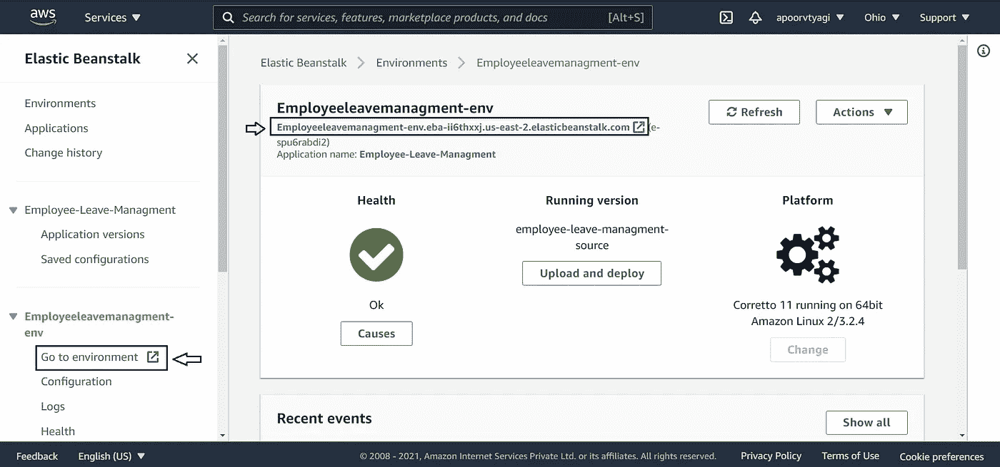

现在用这个新的 URL 替换`localhost:8080`,并尝试访问您的 API 端点之一:

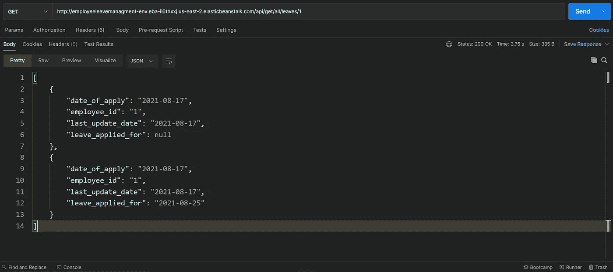

你可以得到正确的答案。这意味着应用程序已经成功部署。

# 结论

至此，本教程到此结束。本教程的目的是使用 Spring Boot 和 HarperDB 来创建微服务。您还了解了如何将相同的应用程序部署到 AWS 的逐步过程。

Spring Boot 和 AWS 都在行业中广泛使用，但 HarperDB 对您来说可能是新的。选择 HarperDB 的原因是因为它易于与 Spring Boot 应用程序集成，以及我在本文开头提到的显著特性。

我希望你学到了新东西。万一你在某个地方卡住了，请随时在评论中射出你的疑惑。

此外，本教程中使用的应用程序的完整源代码可以在这个 [GitHub 资源库](https://github.com/ApoorvTyagi/Spring-Harper)中找到。