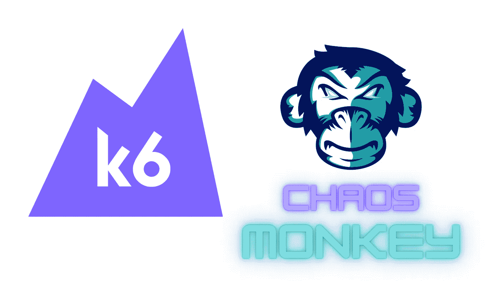
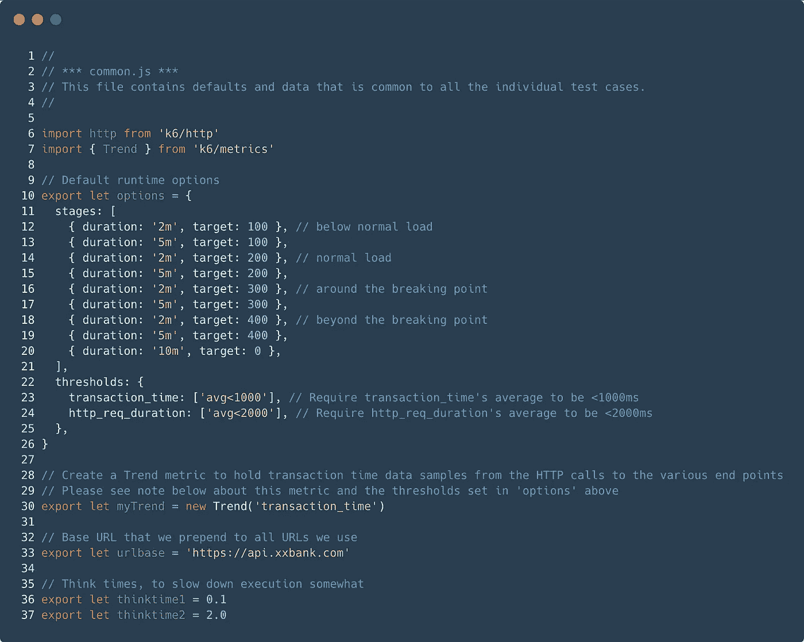
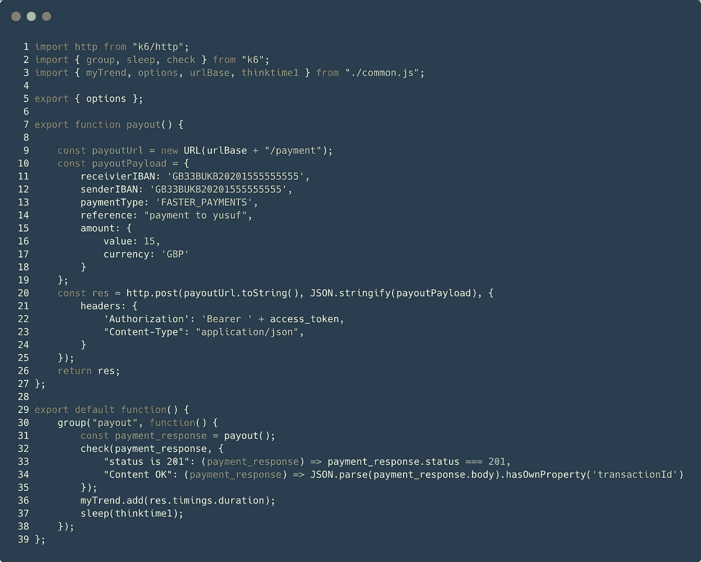
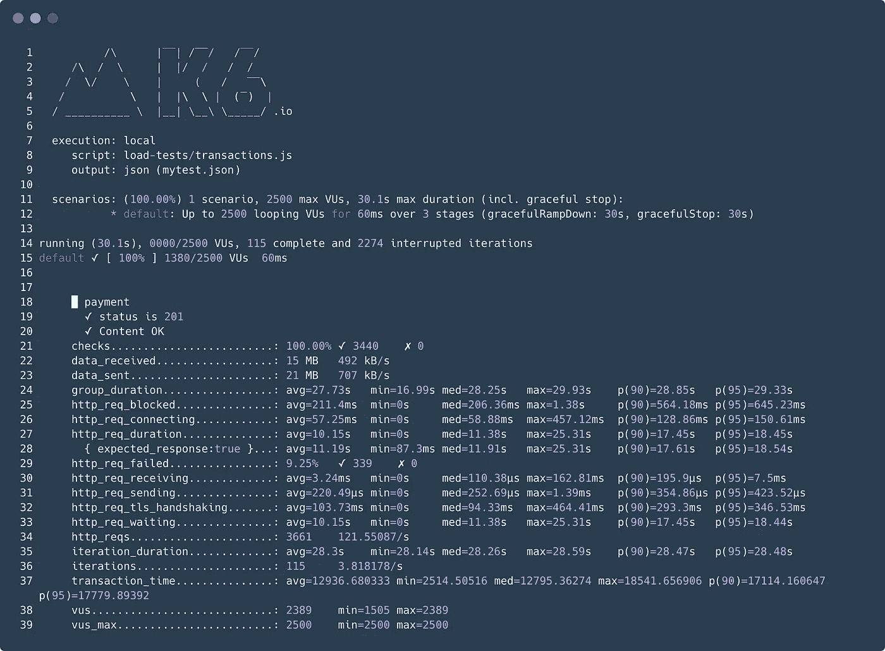
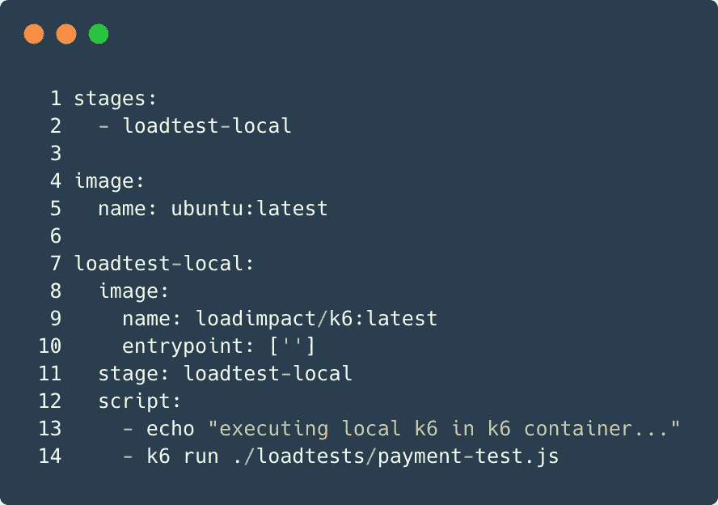

# 使用 k6 构建更稳定的银行即服务

> 原文：<https://medium.com/nerd-for-tech/building-more-stable-banking-as-a-service-with-k6-57ba952eab02?source=collection_archive---------18----------------------->



如果您想要创建一个成功的平台，您必须在当今的条件下构建一个可靠且高性能的平台。尤其是金融机构最近竞争激烈。参与这一竞争的金融科技公司通过保持低收费和改善客户体验，在许多交易的创建中发挥了重要作用。

一般来说，开放银行，即 API 驱动的微系统，处于这些新趋势的最前沿。有了这样的趋势，你一般可以给你的客户提供非常好的客户体验，但是这个系统的缺点很多。虽然为一个客户提供了非常好的服务，但它可能会因不可预见的错误而导致我们失去其他客户。可以列举很多原因，比如失控的中断、客户的金钱损失、无法达成交易等。为了防止这种情况，您应该非常了解您的系统，并且需要尽早注意到系统中的错误。让我们看看如何克服这一点。

首先，让我们从一点信息开始，如果你要建立一个高性能和可靠的系统，你需要采用混沌工程学科。有了这一近年来变得非常普遍的原则，您可以使系统更加可靠和高性能。

> [你可以在这里查看混沌工程的更多细节。](https://principlesofchaos.org/#:~:text=Chaos%20Engineering%20is%20the%20discipline,the%20game%20for%20software%20engineering.)

所以让我们来看看最好的方法是什么。在实践中，混沌工程是衡量性能和可靠性的最好方法。我们必须正确地应用这个原则，这样我们才能看到系统的弹性和系统如何响应。


我们如何应用这一学科？有很多方法可以做到这一点，有很多工具可以做到这一点，你可以使用它们，也可以通过确定你的需求来实现自动化。在本文中，我们将使用 k6 来实现这一点。

## k6 概述

虽然 k6 看起来像一个负载测试工具，但它允许我们执行集成测试和压力测试等测试。我们选择 k6 的原因有很多，有些是；

*   具有开发人员友好的 API 的 CLI 工具。
*   检查和阈值——用于面向目标、自动化友好的负载测试
*   开源、[强大的支持和文档](https://k6.io/docs/javascript-api)
*   轻量级使用 Javascript
*   比其他工具需要更少的资源。

现在来做一个简单的模拟。首先，确定测试的步骤。

*   确定您的系统在极端条件下的表现。
*   根据用户或吞吐量确定系统的最大容量。
*   确定系统的突破点及其故障模式。
*   确定压力测试结束后，您的系统是否会在没有手动干预的情况下恢复。

## 基本脚本的示例

然后，我们将创建一个 common.js，并在 options 对象中定义我们的阈值和阶段，然后我们确定我们的基本参数。



正如您在该文件中看到的，我们已经指定了阶段，并确定了如何在阶段中测试系统以及如何为系统创建负载。使用 Threshold，我们确定了我们对发送的请求的期望，以及值的范围应该是什么。

现在我们可以编写压力测试脚本，它将使用我们确定的值。让我们编写一个简单的支付脚本，我们将观察用户在系统上创建支付流程会产生什么样的结果。



我们已经准备好了脚本，现在让我们来检查一下，我们已经创建了一个简单的付款请求。如上所述，我们可以添加头部和有效载荷，并以非常简单的方式创建我们想要的事务。我们可以将请求分成组，并让不同的组同时工作。使用 Check 方法，我们可以简单地检查我们发送的付款是否正确。让我们使用下面的命令来运行我们的脚本。

```
k6 run payment.js
```

运行我们的命令后，我们得到如下结果。有了这些结果，我们可以很容易地看到系统如何反应。有了这些指标，我们可以发现系统哪里有错误，哪些部分需要纠正。



您可以轻松地使用 Newrelic 或 Influxdb，Grafana 集成来使上述指标更有意义，因此它在监控方面为您提供了很多集成。

## CI/CD 集成

除此之外，由于 CI/CD 集成，您可以通过集成几乎所有的 CI/CD 工具使您的系统更加稳定。下面快速为 Gitlab 做一个实例集成；

我们设置了。gitlab-ci.yml 非常简单如下。由于这种配置，当您从任何存储库推送时，您的 k6 测试将被自动触发。



如果您想用更多的配置和指标来制定适合您公司的计划，您可以使用 k6 提供的文档来访问所有内容。

[](https://k6.io/docs/) [## k6 文档

### Quickstart k6 是一款以开发人员为中心的免费开源负载测试工具，旨在使性能测试变得更加容易

k6.io](https://k6.io/docs/) 

享受您的测试🤓