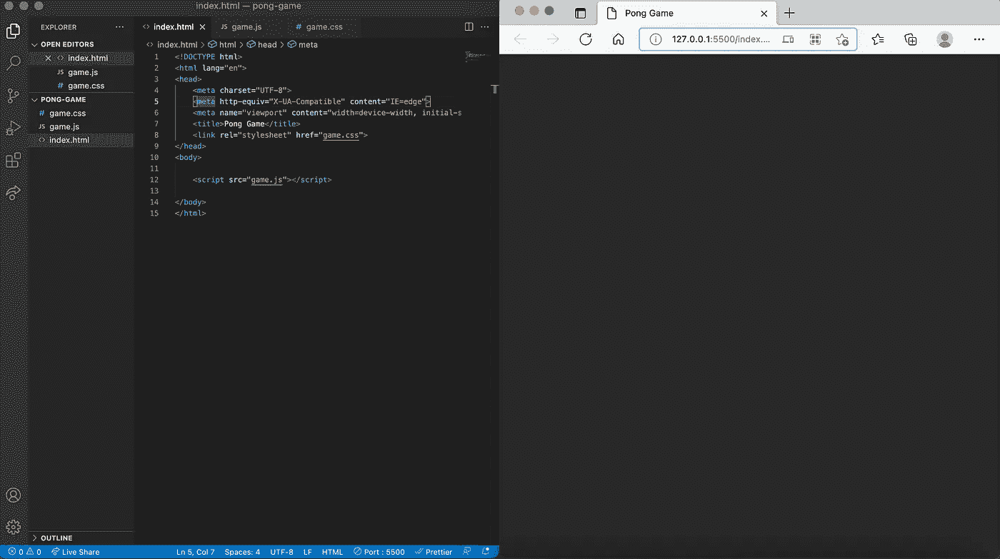
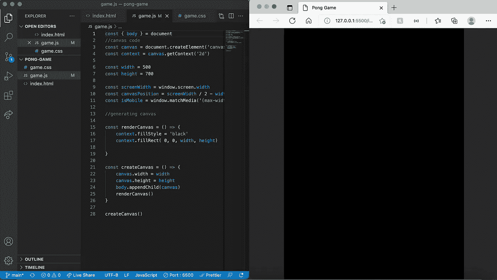
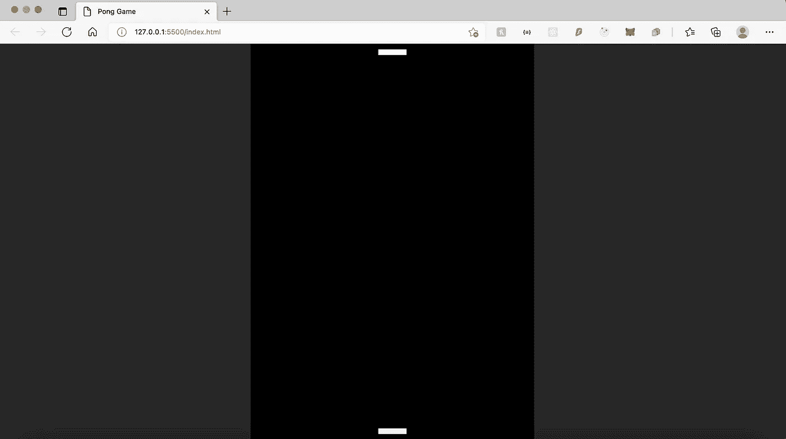
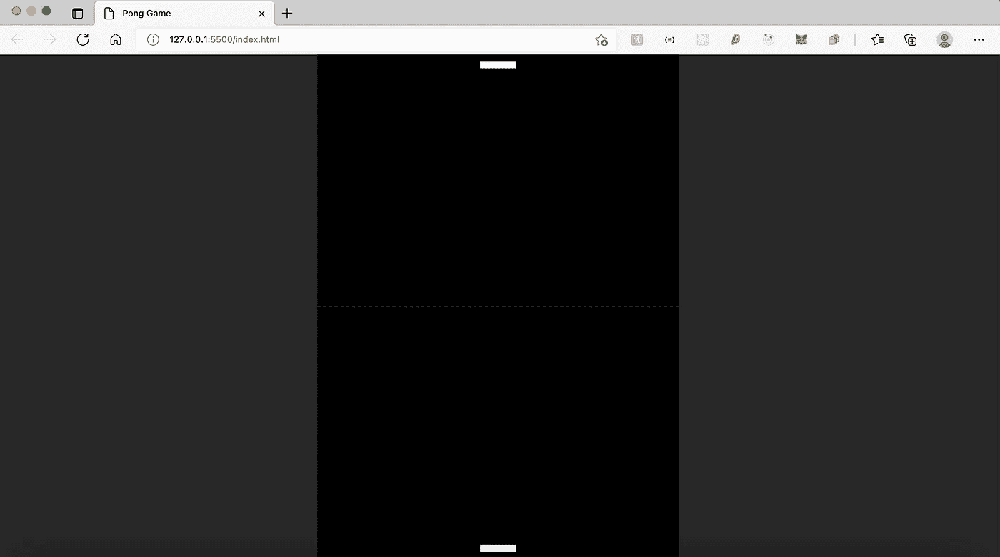
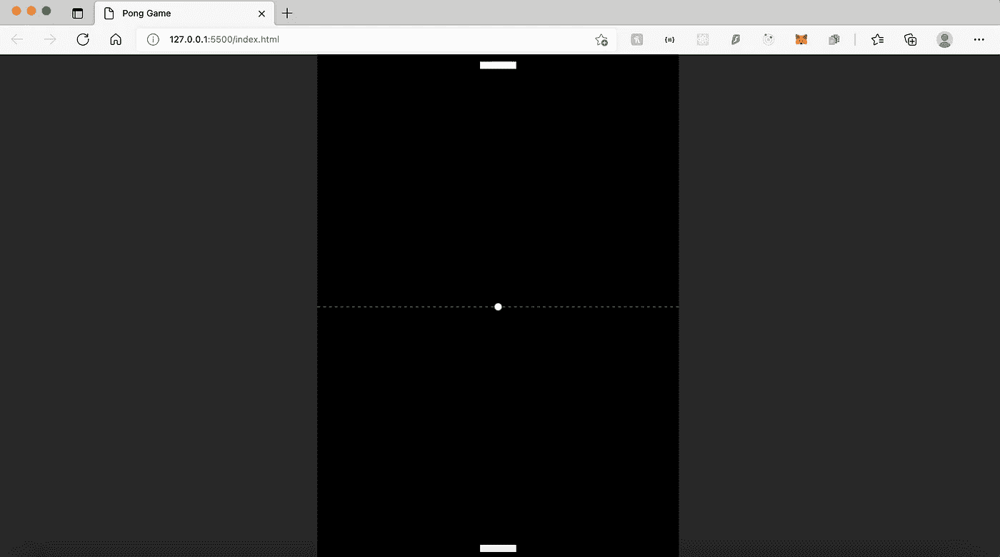
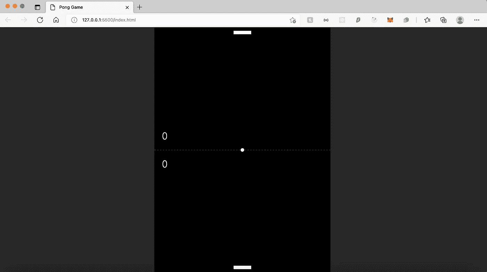
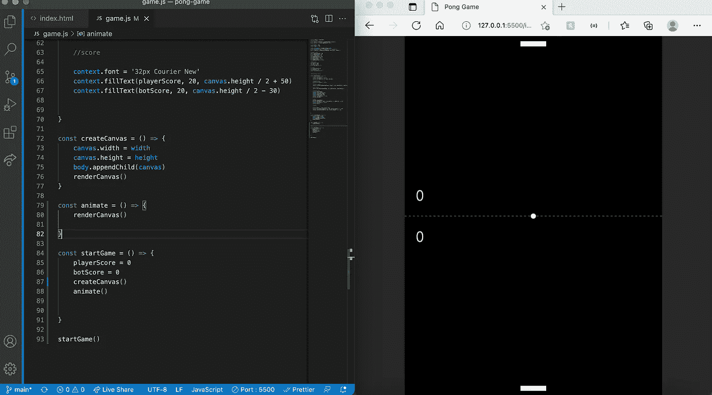

# 用 Javascript 构建 Pong

> 原文：<https://medium.com/nerd-for-tech/building-pong-with-javascript-c0dd0ab79c9c?source=collection_archive---------1----------------------->

这是一个如何用 HTML、CSS 和 JS 构建 Pong 的指南。


图片由 [StartupStockPhotos](https://pixabay.com/users/startupstockphotos-690514/?utm_source=link-attribution&utm_medium=referral&utm_campaign=image&utm_content=593354) 来自 [Pixabay](https://pixabay.com/?utm_source=link-attribution&utm_medium=referral&utm_campaign=image&utm_content=593354)

作为一名刚刚毕业的软件专业学生，我一直忙于申请工作、建立关系网和学习新技术。这个周末，我决定做一些有趣的事情，保持我的求职相对高效，所以我用香草 JS 制作了一个 pong 游戏，我玩得很开心。

我从头到尾记录了代码，这样我就可以和像我一样热爱游戏的开发人员分享，如果你想学习如何只用 HTML、CSS 和 JS 构建 Pong，我就创建了这个指南。

我们开始吧！

# 装置

让我们从使用终端创建一个包含样板文件的文件夹开始

```
mkdir pong-app
cd pong-app
touch index.html
touch game.js
touch game.css
```

接下来，我们进入我们的 html 文件，如果你像我一样使用 VScode，你可以简单地输入 html，emmet 将为你构建 html 模板，然后我们在 HTML 头中添加一个链接到我们的样式表，并在我们的正文中添加 game.js 脚本

```
<!DOCTYPE html><html lang="en">
<head><meta charset="UTF-8">
<meta http-equiv="X-UA-Compatible" content="IE=edge">
<meta name="viewport" content="width=device-width, initial-scale=1.0">
<title>Pong Game</title>
<link rel="stylesheet" href="game.css"></head><body><script src="game.js"></script></body></html>
```

接下来，我们设置一些简单的 css 代码

```
//css codebody {margin: 0;background-color: rgb(39, 39, 39);display: flex;justify-content: center;font-family: "Courier New", Courier, monospace;width: 100vw;height: 100vh;}
```

我选择这个灰色作为我的背景，但是如果你想要一个不同的配色方案，你可以随时更改应用程序背景颜色的值。



是时候开始编码了，下一步是为我们的游戏创建一个画布，你可以看看下面的代码，让我们看看结果。

如果你不熟悉画布，你可以看看 W3School 的这个[文档](https://www.w3schools.com/graphics/canvas_reference.asp)。

```
const { body } = document//canvas codeconst canvas = document.createElement('canvas')const context = canvas.getContext('2d')const width = 500const height = 700const screenWidth = window.screen.widthconst canvasPosition = screenWidth / 2 - width / 2const isMobile = window.matchMedia('(max-width: 600px)')//generating canvasconst renderCanvas = () => { context.fillStyle = 'black' context.fillRect( 0, 0, width, height)}const createCanvas = () => { canvas.width = width canvas.height = height body.appendChild(canvas) renderCanvas()}createCanvas()
```



这看起来棒极了！我们现在得到了正确的画布渲染。

接下来，我们要写桨的逻辑，如大小和定位。

```
//paddle codeconst paddleHeight = 10
const paddleWidth = 50
let paddleBottomX = 225
let paddleTopx = 225
```

这应该通过设置桨的大小并将其放置在中间来处理画布的桨，请记住，由于桨的宽度为 50，因此 500 宽度的中间值将是 225，与桨的偏移量为 50。

接下来，让我们在渲染函数中不用桨来填充画布

```
const renderCanvas = () => {//canvas background
context.fillStyle = 'black'
context.fillRect( 0, 0, width, height)//paddle color
context.fillStyle = 'white//player paddle
context.fillRect(paddleBottomX, height - 20, paddleWidth, paddleHeight)//bot paddle
context.fillRect(paddleTopX, 10, paddleWidth, paddleHeight)}
```



瞧啊。我们有了桨，接下来我们想通过设置从左到右的笔画路径来设置画布的中点。

```
//render function//middle line
context.beginPath()
context.setLineDash([4])
context.moveTo(0, 350)
context.lineTo(500,350)
context.strokeStyle = 'lime'
context.stroke()
```

在这里，我将线条定位在画布的中间，并将颜色设置为复古的酸橙绿色。



接下来，我们在全局变量中创建球逻辑，因为球的 x 和 y 坐标会改变。然后，我们更新渲染函数，为我们渲染一个圆球。

```
//global variableslet ballX = 250
let ballY = 350
const ballRadius = 5// in render function//ballcontext.beginPath()
context.arc(ballX, ballY, ballRadius, 2 * Math.PI, false)
context.fillStyle = 'white'
context.fill()
```



现在球已经渲染好了，我将为玩家和我们的机器人设置一个默认分数，并在全局变量中设置获胜分数。

```
//globally
// scorelet playerScore = 0
let botScore = 0const winningScore = 7//in render function
// scorecontext.font = '32px Courier New'
context.fillText(playerScore, 20, canvas.height / 2 + 50)
context.fillText(botScore, 20, canvas.height / 2 - 30)
```



现在画布已经完成了，我又回到了 refractor，创建了一个启动游戏功能来重置分数，启动画布功能和动画功能。



你可以在左边看到更新的代码，画布仍然在那里，所以我们知道它工作正常。

接下来，我们要处理游戏逻辑，我们从全局设置球速开始。

```
//global variablelet speedY = -1
let speedX = speedY
let computerSpeed = 3
```

接下来，我们编写一个函数让球移动，并在我们的动画函数中调用它。

```
const ballMove = () => {
// Vertical Speed
ballY += - speedY// Horizontal Speed
if (playerMoved && paddleContact) { ballX += speedX }
}
```

接下来，我们为游戏创建一个球重置函数。

```
const ballReset = () => {ballX = width / 2ballY = height / 2speedY = -3paddleContact = false}
```

接下来我们继续讨论球的边界，以决定是玩家得分还是你的机器人得分，并在 animate 函数中调用这个函数

接下来，我们想要构建泰伯，我们可以通过一个简单的函数让机器人跟随球来实现。

```
const botAI = () => { if (playerMoved) { if (paddleTopX + paddleDiff < ballX) { paddleTopX += computerSpeed } else { paddleTopX -= computerSpeed } }}
```

一旦你完成了游戏逻辑的构建，你的动画函数应该包含我们刚刚构建的游戏逻辑以及运行它的频率，接下来我们可以使用 window.requestAnimationFrame 来调用我们的动画函数，每一帧调用一次，每秒 60 帧。如果没有 60fps 的流畅度，这就不是一个玩家制作的游戏了。

瞧啊。球正在正确地运动！我们的下一步是通过在逻辑上写游戏来完成游戏逻辑。

首先我们要全局声明这个游戏是一个新游戏，是一个游戏开始/结束逻辑。

```
///global variables
//score
let isNewGame = true
let isGameOver = true
```

接下来，我们在 startGame 函数中添加' *isGameOver = false'* ,以在游戏开始时将游戏设置为正在运行。

接下来，我们想写一个游戏结束函数，当获胜分数达到时停止游戏，我们在动画函数中调用这个函数。

```
const gameOver = () => { if(playerScore === winningScore || botScore === winningScore) { isGameOver = true }
}
```

现在如果你测试游戏，一旦玩家或机器人达到 7 分，它就会停止。

接下来，我们通过在文档中创建一个包含游戏结束消息的元素来创建一个空的 div。

```
const gameOverDiv = document.createElement('div')
```

接下来，我们创建了一个显示游戏消息的函数，它隐藏了我们的画布，并添加了另一个带有胜利消息的 div，我们还创建了一个带有 onclick 侦听器的按钮，以便在游戏被单击后再次运行游戏。

```
const showGameOverMsg = (winner) => {//hide canvascanvas.hidden = truegameOverDiv.textContent = ''const title = document.createElement('h1')title.textContent = `${winner} Wins!!!`const playAgainBtn = document.createElement('button')playAgainBtn.setAttribute('onclick', 'startGame()')playAgainBtn.textContent = 'Play Again'gameOverDiv.append(title, playAgainBtn)body.appendChild(gameOverDiv)}
```

现在，我们已经完成了在 startGame 函数中添加游戏的逻辑。

```
//inside startGame functionif (isGameOver && !isNewGame) {body.removeChild(gameOverDiv)canvas.hidden = false}isGameOver = falseisNewGame = false
```

就是这样！我们都完了！花了一段时间，但如果你按照这篇文章正确，一切都应该工作。你可以在这里看到我部署的示例，我目前部署的 pong 游戏在移动设备上有点问题，但在桌面上应该运行良好，让我们开始 pc 大师赛吧！它可能看起来与你的略有不同，这取决于你如何做 CSS，如果你需要检查代码，这里是 [github repo](https://github.com/StevenWuTG/pong-game-js) 。

感谢您的阅读，如果您喜欢并关注更多编码和技术内容，请留下您的评论。