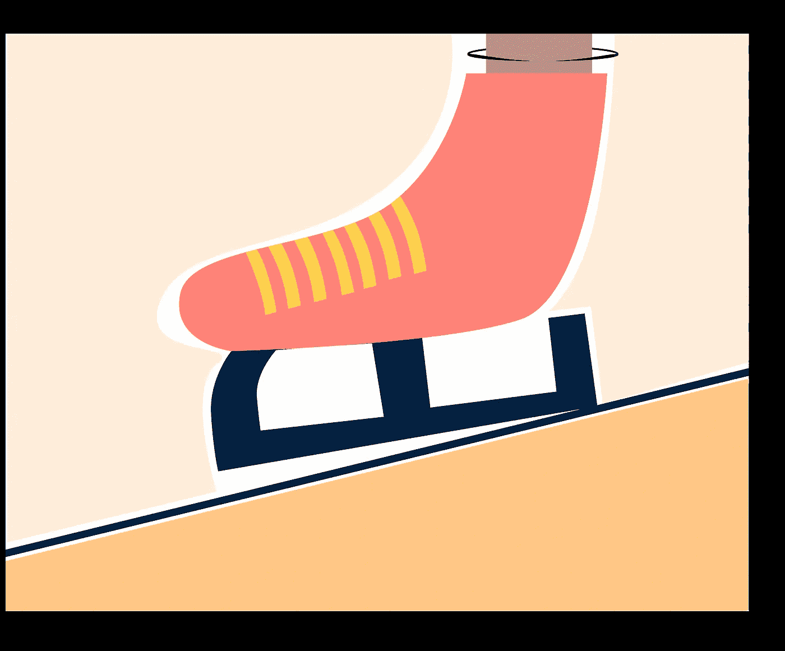

# 构建可靠的下一代 JS 架构

> 原文：<https://medium.com/nerd-for-tech/building-solid-next-js-architecture-a8c6702dc67d?source=collection_archive---------0----------------------->

为 react 应用程序构建可靠的 Next JS 架构。

滑冰界面( [iHateReading](https://ihatereading.in/creativity?id=-MVS_G5kXGdeKzONHYk1&title=Ice+Skating+Shoes)

现在是 2021 年，react 刚刚发布了“**服务器组件**”，去看看吧，它还处于测试模式，但你可以测试它。([服务器组件](https://reactjs.org/blog/2020/12/21/data-fetching-with-react-server-components.html))。

> 一定要看看我们的网站( [iHateReading](https://ihatereading.in/creativity) )寻找设计灵感。

下一个 JS 是一个 react 框架，它提供了像服务器端…