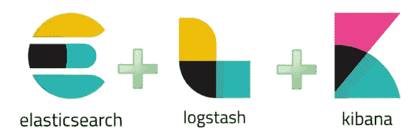
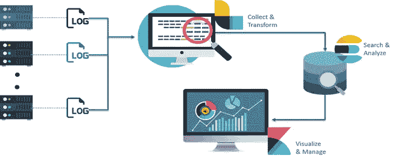
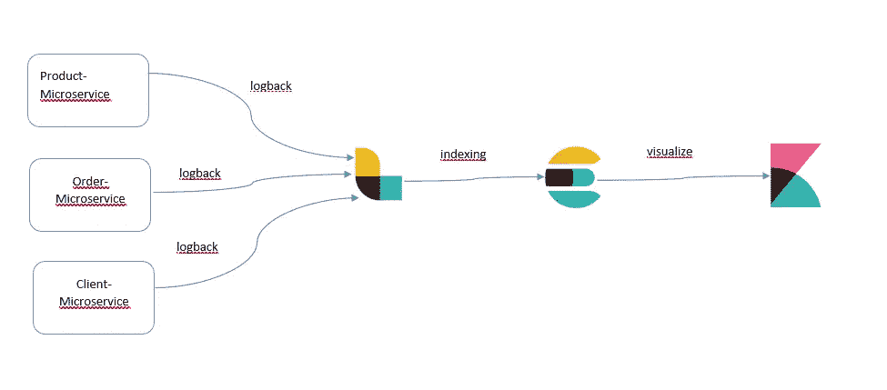
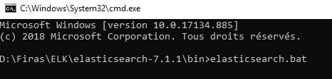
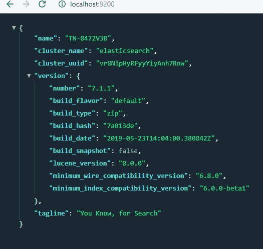
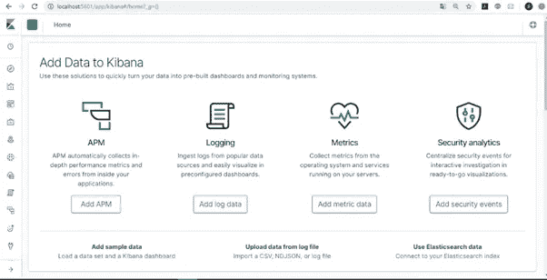
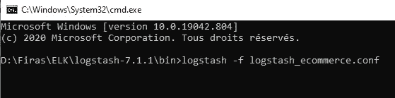
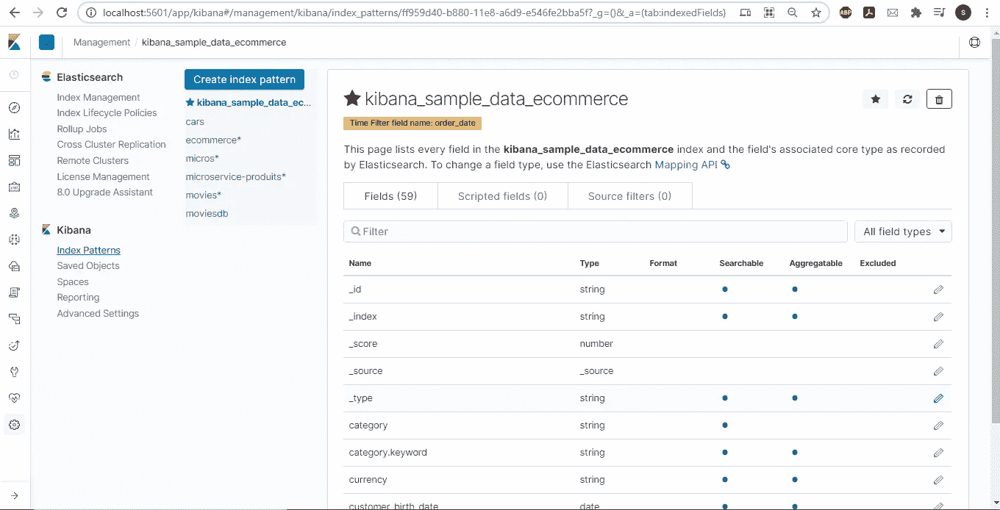
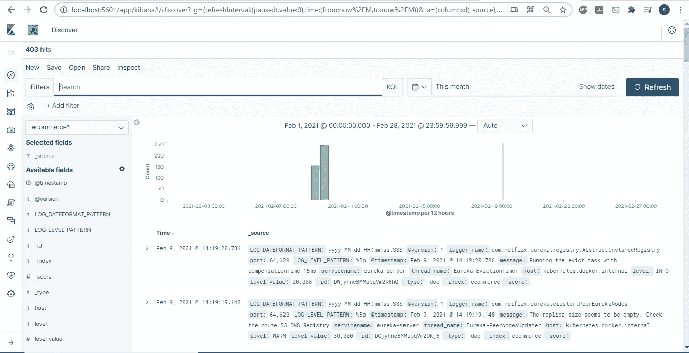

# 构建 Spring Boot 微服务，使用 prometheus 和 grafana 进行监控，使用 ELK stack 进行日志聚合:第三部分

> 原文：<https://medium.com/nerd-for-tech/building-spring-boot-microservices-monitoring-with-prometheus-and-grafana-and-log-aggregation-1e51016210ba?source=collection_archive---------2----------------------->


麋鹿

在之前的[部分](https://firas-messaoudi.medium.com/building-spring-boot-microservices-monitoring-with-prometheus-and-grafana-and-log-aggregation-5ed9ca7dda36)中，我们设法创建了 3 个 springboot 微服务，并与 prometheus 和 grafana 一起监控它们。

在这一部分，我们将重点关注日志聚合和分析。

## 为什么它如此重要？

日志是必不可少的信息，允许我们更好地理解、分析和诊断某些故障，因为它们可以帮助我们跟踪和追踪由我们系统的参与者执行的不同操作。只是，在一个信息系统中，利用如此多的应用程序、设备、服务、系统和受管元素来利用这些关键数据变得非常复杂。


日志分析

作为这个问题的解决方案，我们将使用 ELK stack，它是用于日志聚合和分析的最好、最有效的工具之一。

## 那么什么是麋鹿栈呢？

ELK 由 Elasticsearch、Logstash 和 Kibana 组成，是一个由三个互为补充的开源项目组成的套件。这三个工具将使向系统管理员显示概览成为可能，同时向他提供他所负责的元素的快速图形分析。



麋鹿

**1-elastic search:**elastic search 是一个实时分布式开源全文搜索和分析引擎。它可以从 RESTful web 服务接口访问，并使用 JSON 文档来存储数据。它建立在 Java 编程语言之上，因此 Elasticsearch 可以在不同的平台上运行。它使用户能够以非常高的速度探索大量的数据。

**2-Logstash:** 那时，Logstash 被用来处理来自应用程序的日志，并将它们发送到 Elasticsearch。但是，从那时起，logstash 已经发展成为一个更通用的工具，使它成为一个数据处理管道。

logstash 收集的数据将被处理并运送到一个或多个目的地(Elasticsearch、kafka、e-mail……)。

3-Kibana: Kibana 基本上是一个分析和可视化平台，它让您可以轻松地可视化来自 Elasticsearch 的数据，并对其进行分析以理解其意义。您可以假设 Kibana 是一个 Elasticsearch 仪表板，您可以在其中创建可视化效果，如饼图、折线图等。

## 全球建筑

以下是 ELK 堆栈的架构，显示了 ELK 中日志流的正确顺序。在这里，Logstash 根据提供的过滤标准收集和处理从各种来源生成的日志。Logstash 然后将这些日志传输到 Elasticsearch，后者随后分析和搜索这些数据。最后，使用 Kibana，根据需求可视化和管理日志。



麋鹿建筑

## 带微服务的麋鹿

我们所有的微服务都会把各自的日志推送到 Logstash，Logstash 会用 Elasticsearch 来索引。索引日志可以在以后被 Kibana 使用。

我们将使用 Logback 作为日志框架。

Logback 提供了更快的实现，为配置提供了更多的选项，并在归档旧日志文件方面提供了更多的灵活性。



## 使用 spring boot 微服务设置 ELK

**1-安装弹性搜索**

从 https://www.elastic.co/downloads/elasticsearch[下载 Elasticsearch zip 文件](https://www.elastic.co/downloads/elasticsearch)

解压缩然后运行它。



为了确保一切正常，请打开浏览器: [http://localhost](http://localhost) :9200。您一定会看到类似于以下群集信息的内容:



**2-安装基巴纳**

从 https://www.elastic.co/downloads/kibana[下载 Elasticsearch zip 文件](https://www.elastic.co/downloads/kibana)

解压缩然后运行它。

在浏览器中打开 Kibana，使用: [http://localhost:5601。](http://localhost:5601.)您将看到基巴纳主页。



**3-安装&配置日志存储**

从 https://www.elastic.co/downloads/logstash[下载 Elasticsearch zip 文件](https://www.elastic.co/downloads/logstash)

拉开拉链。

logstash 配置主要包括 3 个阶段:

1.**输入**

配置文件中的输入部分定义了要使用的输入插件。每个插件都有自己的配置选项，您应该在使用前进行研究。在我们的 cas 中，它将是一个从我们的微服务日志中获取的 json 流，我们将使用 tcp 插件来监听任何发送的日志。

2.**过滤器**

配置文件中的过滤器部分定义了我们想要使用的过滤器插件，或者换句话说，我们想要对日志应用什么处理。每个插件都有自己的配置选项，您应该在使用前进行研究。

3.**输出**

配置文件中的输出部分定义了我们想要将日志发送到的目的地(例如 elasticsearch)。和以前一样，每个插件都有自己的配置选项，您应该在使用之前进行研究。

因此，我们的 logstash 文件配置将类似于此:

```
input {
 tcp {
  port => 7000
  codec => "json"
 }
}output {
 elasticsearch {
   hosts => ["localhost:9200"]
   index =>"ecommerce"
 }
}
```

运行它



Losgatsh 将启动并公开两个端口:

*   9600 logstash api 端点
*   先前定义的 7000 tcp 输入监听器。

**4-配置回退**

我们首先需要将这些 maven 依赖项添加到我们的每个微服务中:

```
<dependency><groupId>net.logstash.logback</groupId><artifactId>logstash-logback-encoder</artifactId><version>5.1</version></dependency><dependency><groupId>ch.qos.logback</groupId><artifactId>logback-core</artifactId></dependency><dependency><groupId>ch.qos.logback</groupId><artifactId>logback-classic</artifactId></dependency>
```

然后添加这些配置类:

```
@Configurationpublic class LogbackConfiguration {private static final String LOGSTASH_APPENDER_NAME = "LOGSTASH";private static final String ASYNC_LOGSTASH_APPENDER_NAME = "ASYNC_LOGSTASH";private final Logger LOG = LoggerFactory.getLogger(LoggingConfiguration.class);private final LoggerContext CONTEXT = (LoggerContext) LoggerFactory.getILoggerFactory();private final String appName;private final String logstashHost;private final Integer logstashPort;private final Integer logstashQueueSize;public LogbackConfiguration(@Value("${spring.application.name}") String appName,@Value("${logstash.host}") String logstashHost,@Value("${logstash.port}") Integer logstashPort,@Value("${logstash.queue-size}") Integer logstashQueueSize) {this.appName = appName; this.logstashHost = logstashHost; this.logstashPort = logstashPort; this.logstashQueueSize = logstashQueueSize; addLogstashAppender(CONTEXT);}private void addLogstashAppender(LoggerContext context) {LOG.info("Initializing Logstash logging");LogstashTcpSocketAppender logstashAppender = new LogstashTcpSocketAppender(); logstashAppender.setName(LOGSTASH_APPENDER_NAME);logstashAppender.setContext(context);String customFields = "{\"servicename\":\"" + this.appName + "\"}"; <3>// More documentation is available at: [https://github.com/logstash/logstash-logback-encoder](https://github.com/logstash/logstash-logback-encoder)LogstashEncoder logstashEncoder = new LogstashEncoder();// Set the Logstash appender configlogstashEncoder.setCustomFields(customFields);logstashAppender.addDestinations( new InetSocketAddress(this.logstashHost, this.logstashPort) );ShortenedThrowableConverter throwableConverter = new ShortenedThrowableConverter();throwableConverter.setRootCauseFirst(true);logstashEncoder.setThrowableConverter(throwableConverter);logstashEncoder.setCustomFields(customFields);logstashAppender.setEncoder(logstashEncoder);logstashAppender.start();// Wrap the appender in an Async appender for performanceAsyncAppender asyncLogstashAppender = new AsyncAppender();asyncLogstashAppender.setContext(context); asyncLogstashAppender.setName(ASYNC_LOGSTASH_APPENDER_NAME); asyncLogstashAppender.setQueueSize(this.logstashQueueSize); asyncLogstashAppender.addAppender(logstashAppender); asyncLogstashAppender.start(); context.getLogger("ROOT").addAppender(asyncLogstashAppender); }}
```

最后添加这些属性:

```
logstash.host= localhostlogstash.port= 7000logstash.queue-size= 512
```

现在，让我们运行我们的微服务，并前往基巴纳，开始使用我们的索引。

在 kibana 中，转到管理并单击创建索引模式:



我们将在 logstash 配置文件中找到索引的名称。

现在转到“发现”部分，您会发现由我们的微服务生成的日志流:



现在你可以玩 kibana，根据你的需要生成很酷的 dashbords。

这个项目的最新版本可以在 git 存储库中找到。

[https://github.com/FirasMessaoudi/ecommerce](https://github.com/FirasMessaoudi/ecommerce)