# 构建 Spring Boot 微服务，使用 prometheus 和 grafana 进行监控，使用 ELK stack 进行日志聚合:第二部分

> 原文：<https://medium.com/nerd-for-tech/building-spring-boot-microservices-monitoring-with-prometheus-and-grafana-and-log-aggregation-5ed9ca7dda36?source=collection_archive---------0----------------------->

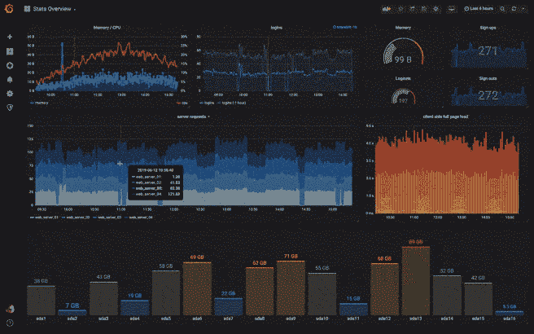

[在第一部分](/nerd-for-tech/creating-spring-boot-microservices-monitoring-with-prometheus-and-grafana-and-log-aggregation-ba4f20496942)中，我们学习了如何通过创建 3 个微服务(产品-微服务、订单-微服务、客户端-微服务)来构建 spring boot 微服务。

到目前为止，一切看起来都很好，但是在使用如此复杂的架构时，我们需要密切关注我们的系统，以防任何潜在的故障。

为此，在这一部分中，我们将了解如何使用 prometheus 和 grafana 来监控、跟踪和观察我们的微服务的行为。

## 普罗米修斯是什么？

Prometheus 是一个开源的时间序列数据库，最初由 SoundCloud 开发。它自带适当的查询语言 PromQL，用于事件监控和警报。

## 为 Spring Boot 微服务添加微米普罗米修斯注册表

Spring boot 使用[千分尺](https://micrometer.io/)一个应用度量门面来集成执行器度量和外部监控系统。

它支持多种监控系统，如 SignalFx、Graphite、Wavefront、Prometheus …

要将 actuator 与 Prometheus 集成，您需要为每个微服务添加以下依赖项:

```
<dependency>
    <groupId>org.springframework.boot</groupId>
    <artifactId>spring-boot-starter-actuator</artifactId>
</dependency>
<dependency>
    <groupId>io.micrometer</groupId>
    <artifactId>micrometer-registry-prometheus</artifactId>
</dependency>
```

和以下属性:

```
management.endpoint.metrics.enabled=**true** management.endpoints.web.exposure.include=*
management.endpoint.prometheus.enabled=**true** management.metrics.export.prometheus.enabled=**true**
```

一旦您添加了上述依赖项，Spring Boot 将自动配置一个`[PrometheusMeterRegistry](https://github.com/micrometer-metrics/micrometer/blob/master/implementations/micrometer-registry-prometheus/src/main/java/io/micrometer/prometheus/PrometheusMeterRegistry.java)`来收集和导出 metrics 数据，其格式可以被 Prometheus 服务器抓取。

要探索 prometheus endpoint，请访问

例如，我们将致力于产品微服务。

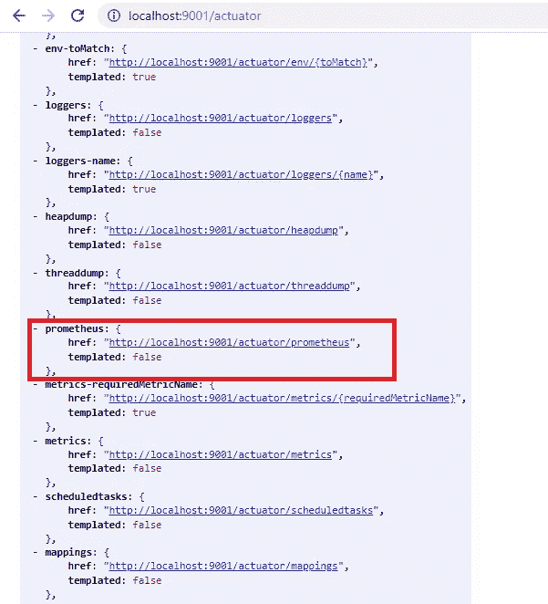

执行机构

如我们所见，actuator 公开了许多端点，我们只关注 prometheus 端点。

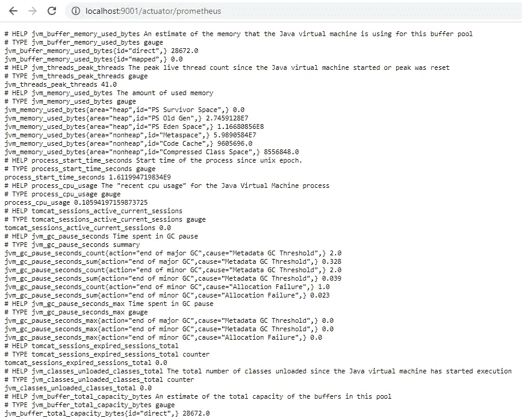

普罗米修斯终点

## 下载并安装普罗米修斯

普罗米修斯是一个 docker 图片，如果你没有 docker，你可以从 https://prometheus.io/download/这里下载。

我们不会与 docker 合作，因为不是每个人都熟悉它。

安装 prometheus(有或没有 docker)后，我们必须创建 prometheus.yml 文件来配置 prometheus 从 Spring Boot 执行器的`/prometheus`端点收集度量数据。

配置应该如下所示:

```
scrape_configs:
  - job_name: 'microservice-product'
    scrape_interval: 2s
    metrics_path: '/actuator/prometheus' ##prometheus endpoint
    static_configs:
      - targets: ['localhost:9001'] ## host and port for your mis
  - job_name: 'microservice-order'
    scrape_interval: 2s
    metrics_path: '/actuator/prometheus'
    static_configs:
      - targets: ['localhost:9002']
  - job_name: 'microservice-client'
    scrape_interval: 2s
    metrics_path: '/actuator/prometheus'
    static_configs:
      - targets: ['localhost:8080']
```

## 运行普罗米修斯

在 prometheus 文件夹中打开终端，运行以下命令:>

```
prometheus.exe --config.file <PATH TO YOUR PROMETHEUS.YML>
```

导航到 [http://localhost:9090](http://localhost:9090) 并探索普罗米修斯。

一旦我们所有的微服务都启动了，我们应该有这样的东西:

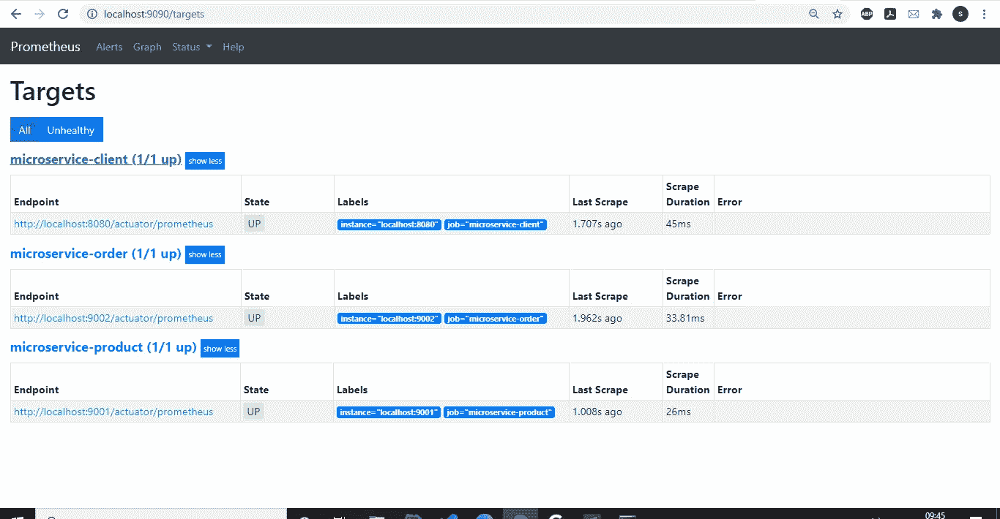

目标

我们现在可以探索 prometheus 中的所有指标，并关注我们的微服务的行为，此示例显示了我们的微服务的系统 CPU 使用情况:

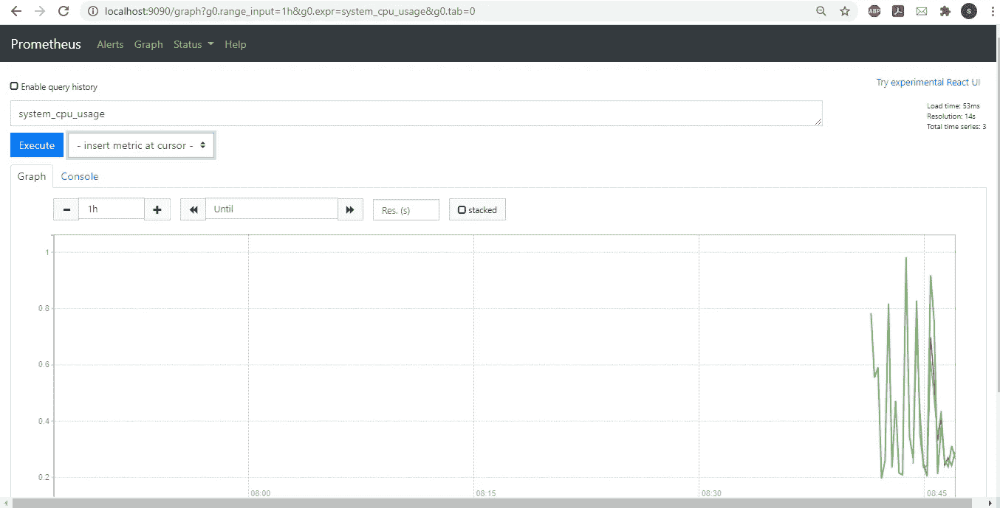

# 格拉夫纳

到目前为止，我们的微服务将 actautor 的端点暴露在 prometheus 服务器中，这非常有趣，但当我们拥有如此大量的信息时，我们需要另一个系统来帮助我们更好地可视化和分析我们的微服务。

Grafana 是开源可视化和分析软件。它允许您查询、可视化、提醒和探索您的指标，无论它们存储在哪里。用简单的英语来说，它为你提供了将你的时间序列数据库(例如普罗米修斯)数据转化为漂亮的图表和可视化的工具。

## 下载和安装 grafana

你可以从 https://grafana.com/grafana/download 的[这里下载 grafana，然后去 grafana 下面的 bin，执行 grafana-server.exe](https://grafana.com/grafana/download)

Grafana 默认运行在端口 3000 上，导航到 [http://localhost:3000](http://localhost:3000) ，用默认用户名`admin`和密码`admin`登录 Grafana。

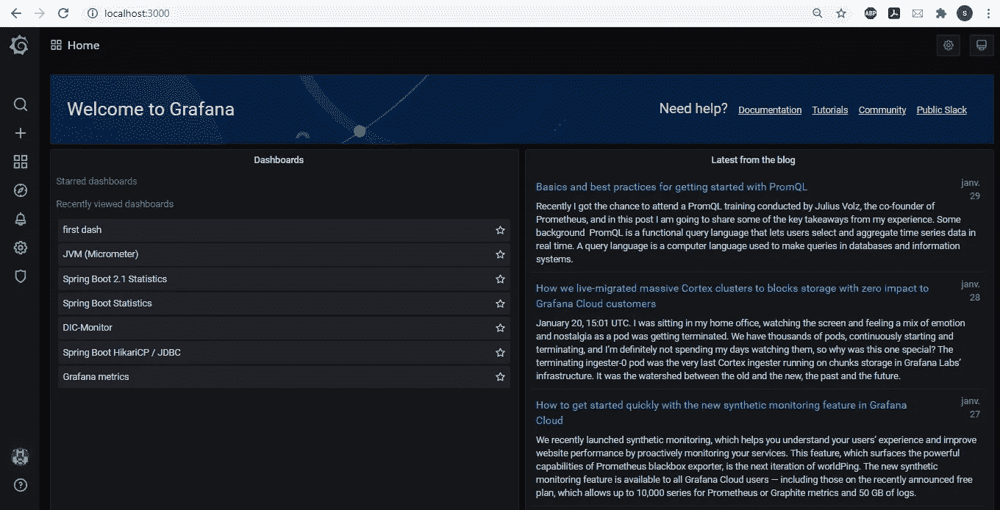

格拉夫纳

## 配置 Grafana 从 Prometheus 导入指标数据

就像我们之前说过的，grafana 从时间序列数据库中导入度量数据以便可视化，为此我们需要配置 grafana 从 prometheus 服务器中导入这些度量数据。

下图显示了格拉夫纳和普罗米修斯是如何互动的:


体系结构

要将 prometheus metrcis 导入 grafana，我们必须遵循以下步骤:

## 1.在 Grafana 中添加 Prometheus 数据源

转到配置/数据源并单击以添加新的数据源

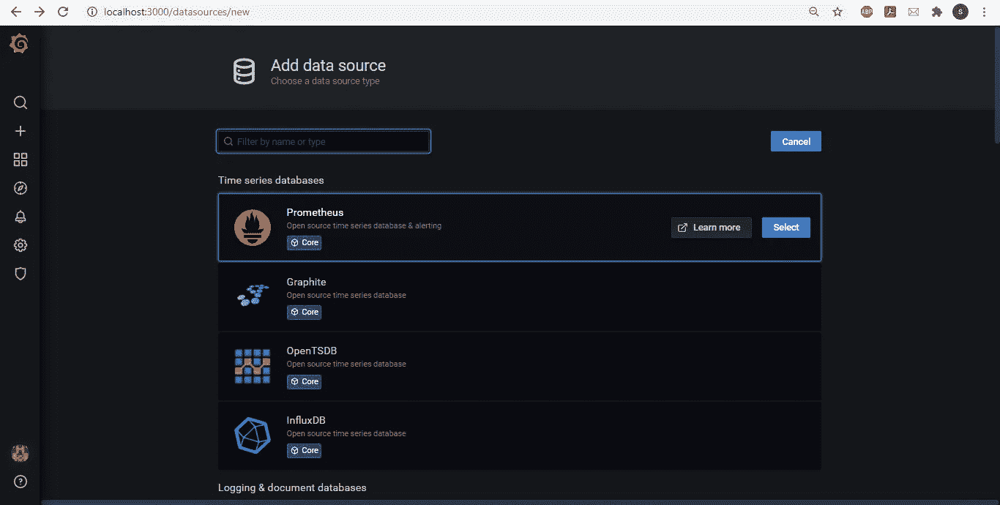

Grafana 提供了很多数据库，我们只需要选择普罗米修斯

选择 TSDB 后，添加以下配置以将 garafana 与 prometheus 服务器连接起来:

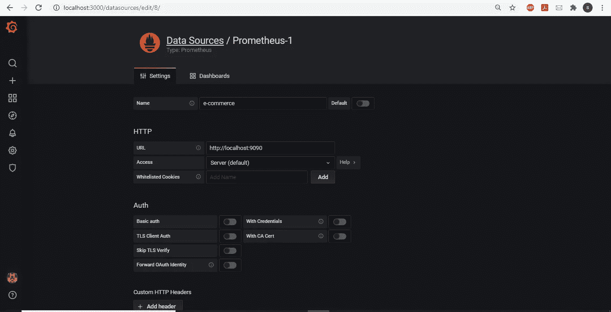

## 2.创建新仪表板

从左侧菜单中选择(+)图标，然后单击仪表板:

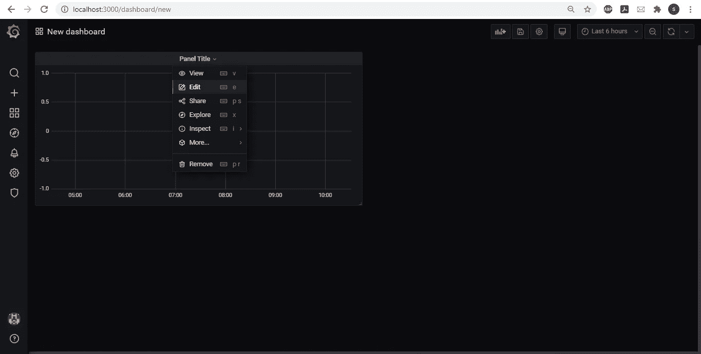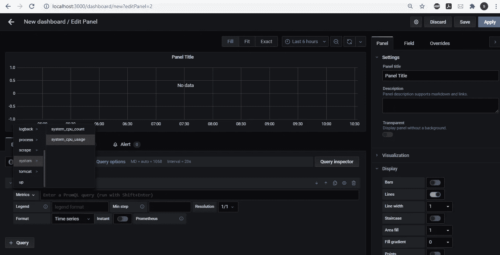

## 3.可视化您的仪表板

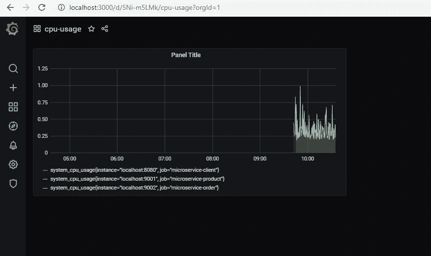

## 导入预建仪表板

Grafana.com 维护着一个共享仪表盘的集合，可以下载并与 Grafana 的独立实例一起使用。使用 Grafana.com“过滤器”选项浏览仪表板，仅查看“Prometheus”数据源。

例如，我们将搜索“spring boot statistics”仪表板:

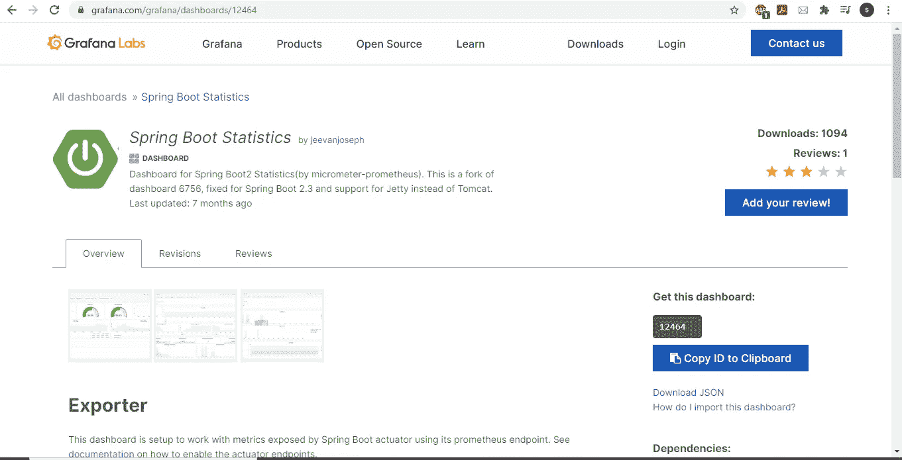

复制 id 并转到仪表板/导入，然后单击加载

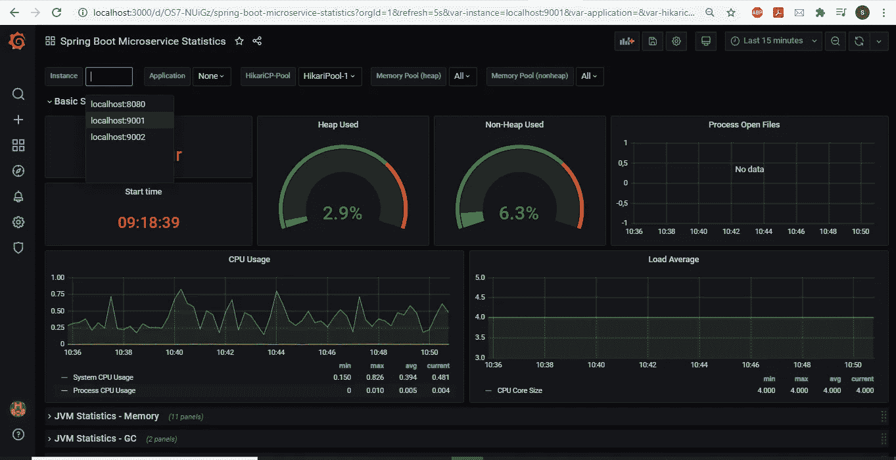

您的仪表板已准备好进行浏览。现在轮到你和你的需求了，你可以做任何你想做的事情，你可以继续关注你的整个系统。
在下一个也是最后一个部分，我们将了解如何使用弹性堆栈聚合微服务日志。

您可以在 git 存储库上找到更新源代码:

[](https://github.com/FirasMessaoudi/ecommerce) [## FirasMessaoudi/电子商务

### 在 GitHub 上创建一个帐户，为 FirasMessaoudi/电子商务发展做出贡献。

github.com](https://github.com/FirasMessaoudi/ecommerce) 

当最终部分准备好了，我会在评论中通知你。