# 在 Dropwizard 中为 JDBI 构建工作单元支持—第二部分

> 原文：<https://medium.com/nerd-for-tech/building-unit-of-work-support-for-jdbi-in-dropwizard-part-ii-4857ca6c48cf?source=collection_archive---------0----------------------->

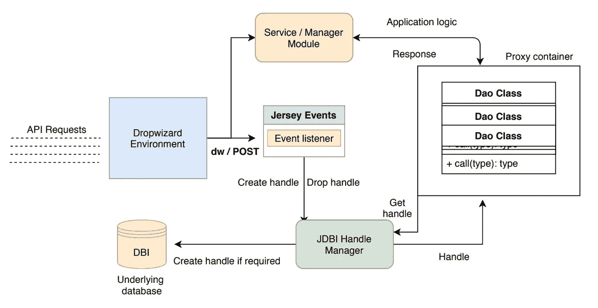

在本文中，我们继续我们的[旅程](/@aman_garg/building-unit-of-work-support-for-jdbi-in-dropwizard-1e6fafbf46d6)在 Dropwizard 中构建对 JDBI 工作单元的支持。

回想一下我们应该遵循的计划:

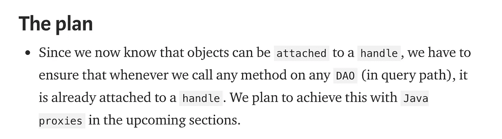

第一部分是关于代码与“混乱”处理逻辑的清晰分离

我们必须确保每个`Dao`方法都被调用，当且仅当它被附加到一个托管的`handle`时。我们可以通过创建一个 Dao 的`proxy`来做到这一点，它在执行任何方法之前将自己附加到一个`handle`上。`proxy`扮演着两个重要的角色。

*   `**Intercept**`所有方法调用，即成为代理处理程序。
*   将底层对象(真实对象)附加到一个`handle`

现在，`**java.lang.reflect**`为我们提供了一种为接口列表生成代理的方法。我们需要做的就是实现`**InvocationHandler**`并提供如何*拦截*调用并好好利用它的实现。

> 注意，只能通过`**InvocationHandler**`为一系列接口创建代理，而不能为抽象类或具体类创建代理。因为我们的`Dao`是一个`SqlObject`，它只不过是一个接口，所以我们准备好了。对于前者，有`[**CGLib**](https://github.com/cglib/cglib)`这样的库存在。事实上，这就是 [Mockito](https://site.mockito.org/) 生成代理的方式。

然而，对于我们必须将`underlying object` 连接到手柄的部分，我们首先需要有`handle`本身。出现了几个问题

*   我们如何得到`handle`？它是全局作用域、请求作用域还是非作用域？
*   谁来清除`handle`？它将如何初始化？

这些都是有效的问题。这绝对不应该是一个`proxy`的责任。我们的代理应该简单地依赖于提供这种功能的`abstraction`。这种`abstraction`的实现可以很容易地交换或修改，而不会影响核心代理。

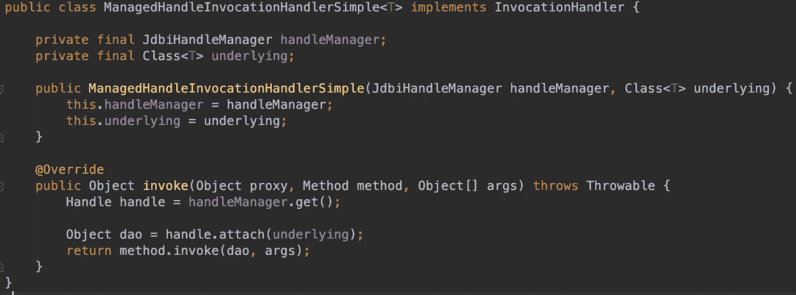

我们的代理蓝图

简单来说，这就是我们的`proxy handler`的样子。我们只是`override`的`invoke()`也就是`InvocationHandler`所指定的契约。这里很少有值得一提的事情:

*   `**JdbiHandleManager**`是我们为解决`handle`的责任问题而创建的抽象。现在我们的`Proxy`仅仅依赖于由`AllArgs`构造器传递的抽象。对`handleManager.get()`的调用给了我们句柄。我们将在后面看到如何实现这样一个 `Handle Manager`
*   `**Class<T> underlying**`保存将为其创建代理的`Dao`的类或类型。
*   真正的方法仍然要在为底层类创建的对象上执行。然而，这一次，由于调用了`**handle.attach(underlying)**`，它将被附加到手柄上
*   敏锐的读者可能会看到，每次调用`Dao`方法都会执行这个方法。但是我们已经覆盖了我们自己，因为`handles`一旦附着到`**SQLObject**`就是幂等的。
*   只要`handle`有效(不是`closed`，多次调用这个方法没有任何意义。如果我们没有这个保证，我们将不得不保留第一个`invocation`的跟踪/计数器，并且只在第一次调用 attach。

如您所见，代理现在给了我们一种方法，以声明的方式将对象附加到一个公共句柄。如果我们没有这样做，我们将不得不用`handle.attach(dao)`调用来丢弃我们的应用程序代码库

现在我们的代理处理程序已经创建好了。让我们演示一下如何创建实际的`**proxies**`。

> 而不是像下面这样创建我们的刀

```
Dao dao = **handle**.attach(Dao.class)
```

> 我们以这种方式创造它们

```
Dao dao = (Dao) **Reflection.newProxy**(Dao.class, new ManagedHandleInvocationHandler<>(handleManager, Dao.class));
```

虽然这一开始看起来很复杂，但是只需要在一个地方完成，在那里你初始化你的依赖项，比如在一个`Guice Module`中

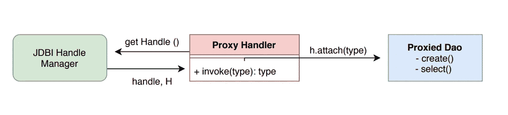

代理对 Dao 的调用，并为每个调用注入一个句柄

有了这个设计，你可能想看看它在现实中是如何实现的。另外,`**handle manager**`只是一个简单的接口。

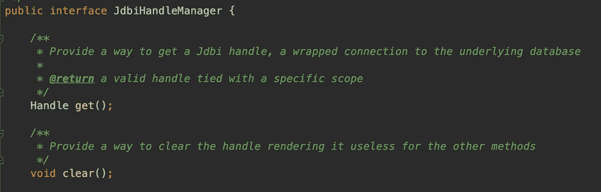

还有更多方法，但与本讨论无关

# 第二部分

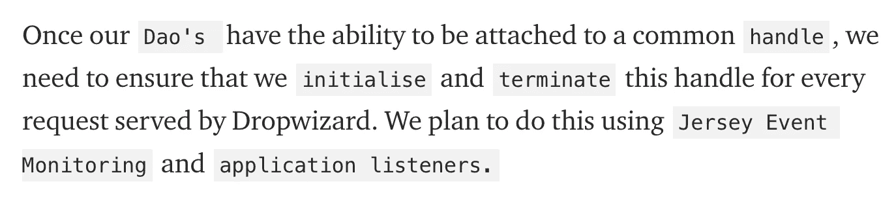

第二部分是关于赋予手柄生命。

为了只见树木不见森林，让我们重新确立我们希望实现的目标。

*   一个`request`被接收并且将由一个`Dropwizard thread`服务。
*   作为读操作的一部分，一个`GET`T5 可以与多个`Dao`对话。通常`GET’s`执行只读操作。
*   一个`POST` `request`可能与多个`Dao`方法对话，即多个`SQL objects`方法，并且希望将它们作为一个公共事务的一部分来执行。
*   可能有`POST` `request`不需要事务开销。
*   请求可以服务于静态资产/回退，而无需与`database`或`Dao`对话

有了这个，我们就知道我们的系统会有什么样的表现了。

*   `**Initialise**`每个需要对话的请求的句柄`Dao`
*   可选地，`**begin**`一个事务，如果一个请求是`POST`并且想要一个事务，还记得我们的中心块`**@JdbiUnitOfWork**`注释吗？理想情况下，只有用这个注释的方法才应该在事务上下文中执行。
*   `**Rollback**`执行过程中出现异常时的事务。
*   总是`**commit**`请求执行成功时的事务。
*   每个请求的句柄

我在**中用粗体**标出了关键功能。我们已经看到 a `Jdbi Handle`为我们提供了这样的操作。

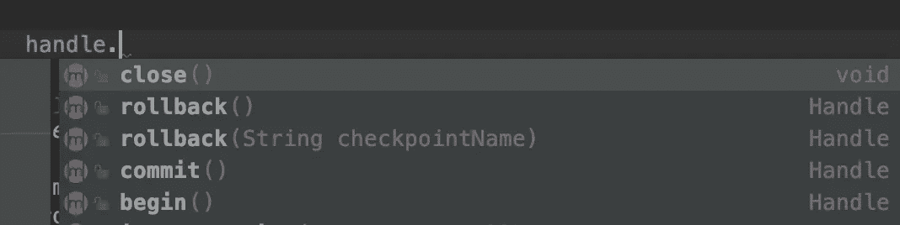

核心句柄 API

这给了我们一个线索，这些只有句柄的函数可以被`delegated`指定给特定的`aspect`或`special wrapper class`。我们稍后将回到这一点。

剩下要解决的唯一问题是干净地实现上面的逻辑，以便它是可维护的。理论上，我们可以做到以下几点:

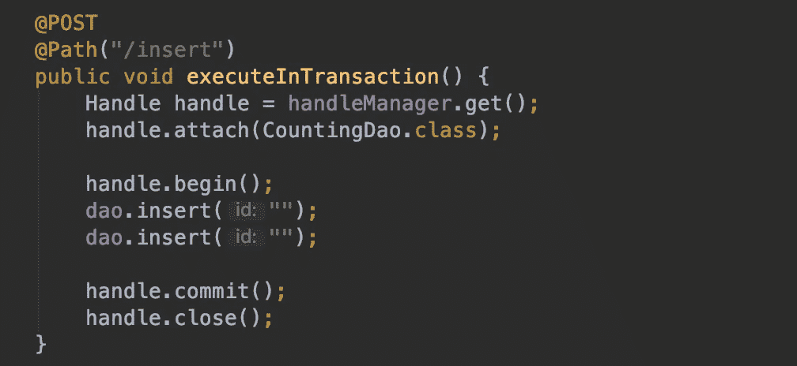

手动摆弄把手

这有以下*缺点*:

*   **破坏了**我们为创建`proxy`所做的所有努力，因为我们仍然必须自己管理句柄操作，比如开始、关闭。
*   容易出错，需要在所有方法中使用`duplicated`。还有，我说了处理`exceptions`吗？

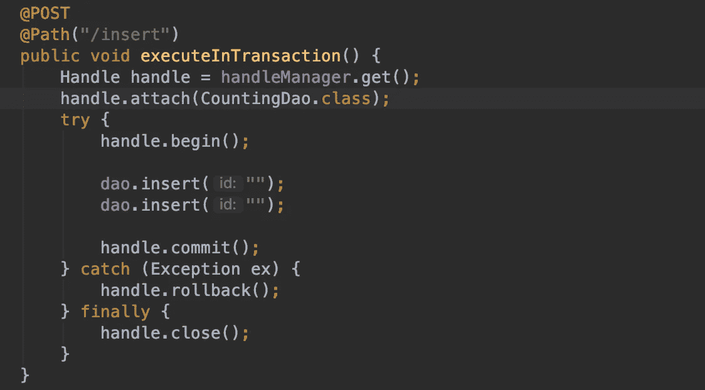

你能想象对每个方法都这样做吗？

如果我们仔细观察，我们所需要的是在执行 a `request lifecycle`期间适当的`hooks`。幸运的是，对我们来说，Jersey 为我们提供了所谓的事件监视器和应用程序监听器。

创建应用程序监听器非常简单。

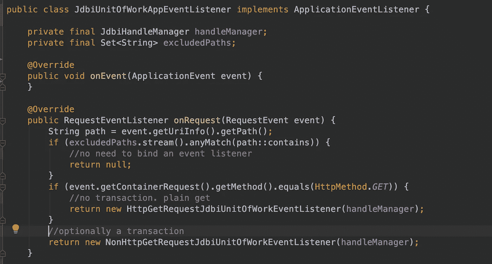

我们实现了由`Jersey`提供的`ApplicationEventListener`,并覆盖了关键方法`onRequest()`,每当环境要为一个新的`request`提供服务时，该方法就会被执行。

*   我们提供了一种不监听在`excluded set`中指定的`URIs`事件的方法。这种设置可以在应用程序的驱动程序中配置，也可以选择`injected`。这样，不与`Dao`对话的请求没有开销。这可以包括来自“ *ELB* ”服务器或“*静态资产*”唯一资源 API 的请求
*   如果请求方法是`GET`，我们将它绑定到一个`Get Request Listener`
*   如果请求方法是`POST`，我们将它绑定到一个`Non GET Request listener`

你可能会问为什么我们在`request type`上创造了`**two**`个不同的`listeners`。这和休息哲学有很大关系。`Get`请求并不意味着在服务器上创建/更新资源。因此，它们不需要在事务中执行。但是，他们仍然需要创建/关闭一个句柄。

## 让我们来看看一个`GET Request listener`是如何实现的

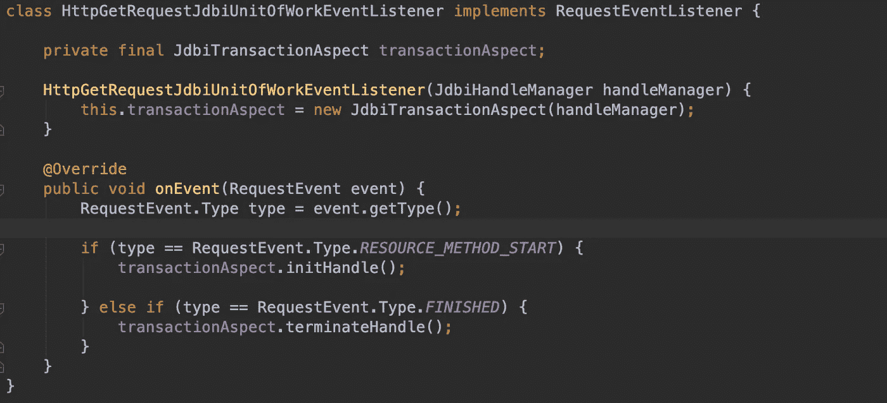

基于请求生命周期，我们初始化并关闭句柄

*   `**Handle only**`特种作战已经转移到一个新的职业，叫做`**JdbiTransactionAspect**`，它很好的完成了这些任务。关键是要注意，每个请求都会创建一个新的实例。它不是单一的。
*   每当一个请求是`matched`到一个匹配的`resource method`，我们初始化`handle`。
*   每当一个`request`为`finished`(不管有无异常)，我们就`close`这个`handle`

*简单的*、*宣示性的*和*美观的*。Jersey " `**FINISHED**`"不管有没有异常，事件都保证会执行，这正是我们想要的。它们有点像我们在上面显式创建的 finally 块。

如果你读过`Jersey Request events`，你会发现我们在`**RESOURCE_METHOD_START**`之前跳过了很多事件，为什么我们不在[更早的阶段](https://github.com/jersey/jersey/blob/faa809da43538ce31076b50f969b4bd64caa5ac9/core-server/src/main/java/org/glassfish/jersey/server/monitoring/RequestEvent.java#L77)初始化一个句柄，而不是在资源方法中？

答案是，这取决于用例。很多时候，服务器上没有与`request`匹配的资源，这就是我们看到`404`没有找到的时候。我们是否希望`**initialise**`和`**close**`为 404 设计一个手柄？

我不这么认为。因此，只有当一个`request`匹配某个特定的方法时，才会执行这个操作。但是，您的里程可能会有所不同。

**让我们看看如何实现非 GET 请求监听器**

上面的实现很简单。有*没有*有`*transactions*`。正如您可能已经猜到的，现在是我们将`request`生命周期事件绑定到适当的`handle`方法的时候了。

您可能想暂停一下，看看在一个`transaction`的上下文中，什么`request event`应该绑定到什么句柄方法。你的小抄是[这里](https://github.com/jersey/jersey/blob/faa809da43538ce31076b50f969b4bd64caa5ac9/core-server/src/main/java/org/glassfish/jersey/server/monitoring/RequestEvent.java#L65)

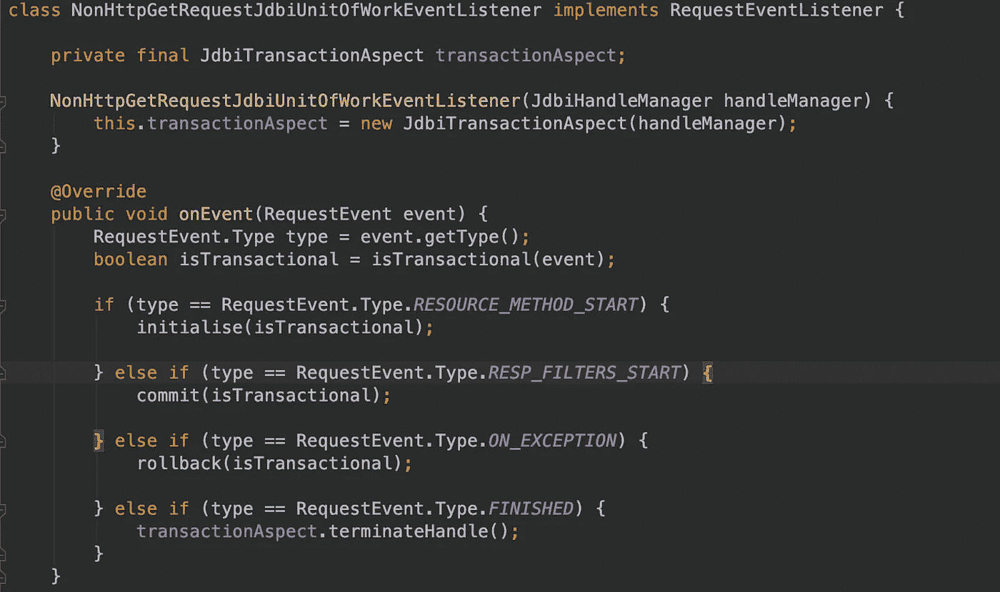

基于请求生命周期，我们还可以选择管理一个事务

如你所见，与`GET listener`有一些相似之处。然而，应注意以下几点

*   这一次，我们的`**initialise**`不仅挂钩`**initialises**`一个句柄，还挂钩`**begins**`一个事务(如果它检测到该方法是事务性的)
*   `**RESP_FILTERS_START**`是我们开始`**committing**`请求的地方。此时，该方法已经提供了响应，这表明执行成功，我们可以提交事务了。
*   `**ON_EXCEPTION**`每当异常上升到顶层时执行。这类似于我们的 `catch(Exception ex)`块，但在`request`级别。当我们看到这一点，我们回滚
*   最后总是执行`**FINISHED**`和`**closes**`我们的句柄。这一步很重要。如果我们没有把手，我们就会泄漏一个把手，很快就会失去把手，这绝对不是我们希望在*生产*中看到的


30 秒是默认的 Tomcat 连接池超时。我们永远不想看到这一幕

> 我们如何知道一个请求需要被包装在一个事务上下文中？

我们转向我们的自定义注释`@JdbiUnitOfWork`如果一个资源方法用这样的注释来注释，我们标记一个事务边界。
注意，这类似于`UnitOfWork`的行为。事实上，这个设计很大程度上受到工作单元方面[实现](https://github.com/dropwizard/dropwizard/blob/master/dropwizard-hibernate/src/main/java/io/dropwizard/hibernate/UnitOfWorkAspect.java)的启发

其余的方法非常简单明了。注意，如果一个资源方法是非事务性的，即没有用`@JdbiUnitOfWork`注释，那么方法`**commit**`和`**rollback**`什么都不做。

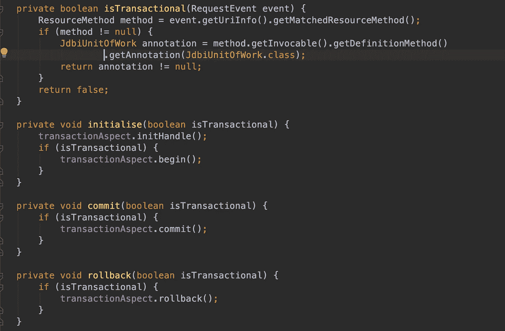

我们的非 GET 事务性请求监听器的缺失和琐碎部分

## 最后一个关键部分，交易方面

注意，在本文的前面，我们讨论了句柄提供的核心功能。我们还讨论了如何抽象核心句柄操作。

`**JbdiTransactionAspect**`就是用来填补这个空白的。它在关键的句柄方法上提供了一个包装器，整个代码都围绕着这些方法旋转。

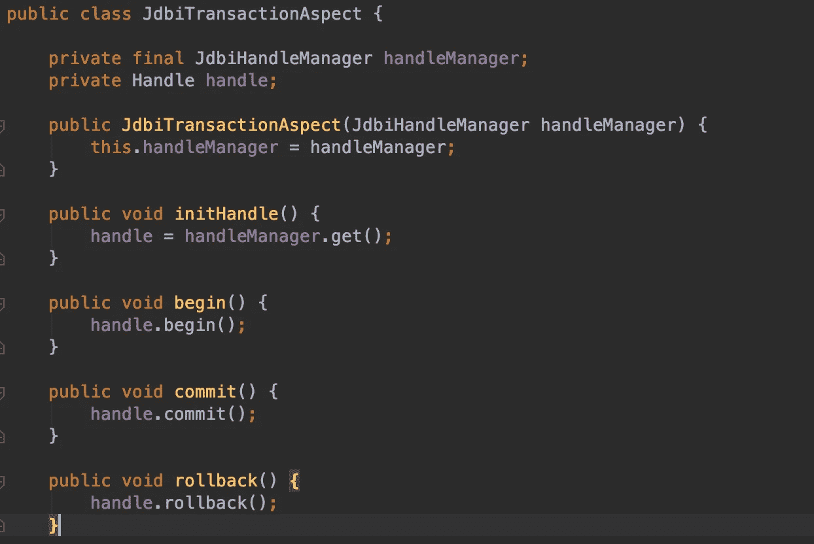

核心句柄操作的简单包装

在实践中，我们有几个 try-catch 来保护句柄上的操作。你可能想看看这里的

我们抽象这些操作的原因是，如果将来`**begin()**`被重命名为`**newBegin()**`，我们只需要修改一个类。另外对付我们自己的`handle manager`比对付一个核心`handle`要好

# 将它们结合在一起

唷，我们已经经历了许多概念和责任。然而，如果我们不能把所有的东西粘在一起，那就什么也得不到。就这么办吧。

*   将`JDBI application listener` 绑在运动衫`environment`上

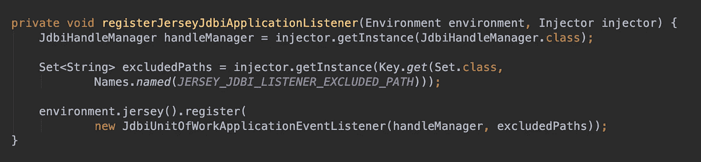

绑定我们的侦听器、排除的路径和句柄管理器

*   所有应用`Dao`都需要`proxied`并注入到自己喜欢的依赖注入框架中。如果你喜欢冒险，你可以手工制作。然而，`[module](https://github.com/isopropylcyanide/dropwizard-jdbi-unitofwork/blob/master/src/main/java/com/github/isopropylcyanide/jdbiunitofwork/JdbiUnitOfWorkModule.java)`可能会让你的生活更轻松。
*   用`JdbiUnitOfWork`开始注释您的资源方法


我们的 POST 方法现在将在事务边界中执行

仅此而已。我们已经实现了。我们的设计是`modular`和`extensible`足以支持`customisation`。例如，您甚至可以选择对`GET`方法和许多其他定制进行交易初始化。

敏锐的读者可能已经注意到以下几点

*   但是我们如何继续谈论 T8 和 T9 呢？
*   我们如何处理`scoping`？或者单个`handle` at 线程、请求、应用。
*   如果我们想在一个请求中创建与不同的`Dao`对话的`multiple threads`呢？我们如何与子句柄共享一个父句柄？

> 这是一篇很长的文章。我想暂时在这里结束。如果你感兴趣的话，我会在第三部分贴出一个[来继续解决上面提到的问题。](/@aman_garg/building-unit-of-work-support-for-jdbi-in-dropwizard-part-iii-d9d0b1e245c3?postPublishedType=initial)
> 
> 像往常一样，这个项目可以在 Github 和 Maven Central 上找到。一定要去看看，留下评论:)