# 在 Dropwizard 中为 JDBI 构建工作单元支持—第三部分

> 原文：<https://medium.com/nerd-for-tech/building-unit-of-work-support-for-jdbi-in-dropwizard-part-iii-d9d0b1e245c3?source=collection_archive---------1----------------------->

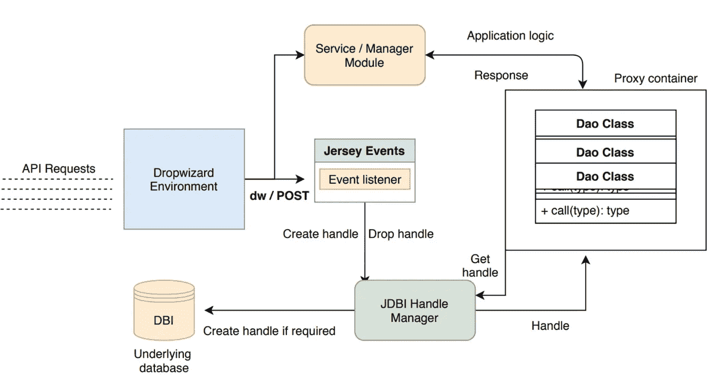

在本文中，我们继续我们的[旅程](/@aman_garg/building-unit-of-work-support-for-jdbi-in-dropwizard-part-ii-4857ca6c48cf)在 Dropwizard 中构建对 JDBI 工作单元的支持。

已经描述了`Jdbi Handle Manager`、`Event listeners`、`Transaction Aspect`和`resource`层如何在联络中工作，现在我们将注意力转向`handle`管理器的可能实现。

回想一下，Jdbi `Handle`经理的合同。

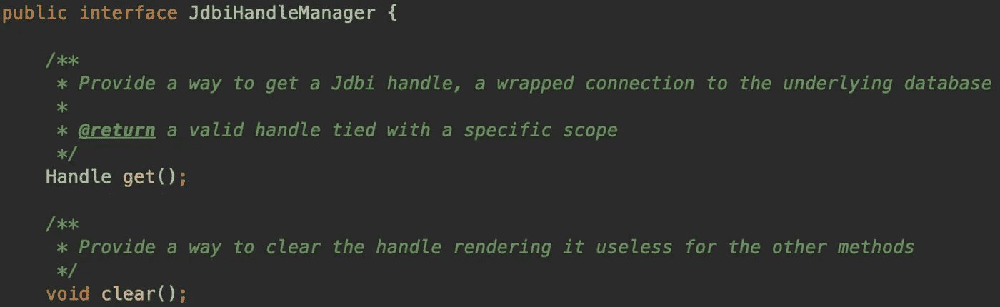

手柄管理器的合同

虽然契约看起来很简单(*和实现太过*)，但是在这里做出了为线程提供`handle`的最重要的决定。

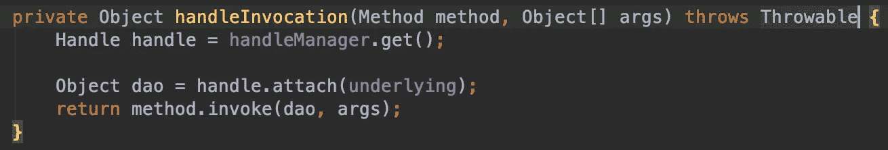

管理器#get()的调用站点

先说说`HandleManager#get()`

我们的`proxied` Dao 需要获得一个活动句柄，然后才能在`SQL Object`的上下文中使用它。如果它没有被提供，或者更糟，为 null，它将在调用堆栈中抛出一个异常。

此外，我们需要提供一种方法来清除`handle`，一旦任务完成，或者池可能很快用完句柄。

**默认 Jdbi 句柄管理器**

那么，实现这样一个句柄管理器的最简单的方法是什么呢？例如，我们可以在每次调用`#get()`方法时使用数据源打开一个真实的句柄。我们的`clear()`实现将会是空的或者抛出一个`NotSupportedOperationException`

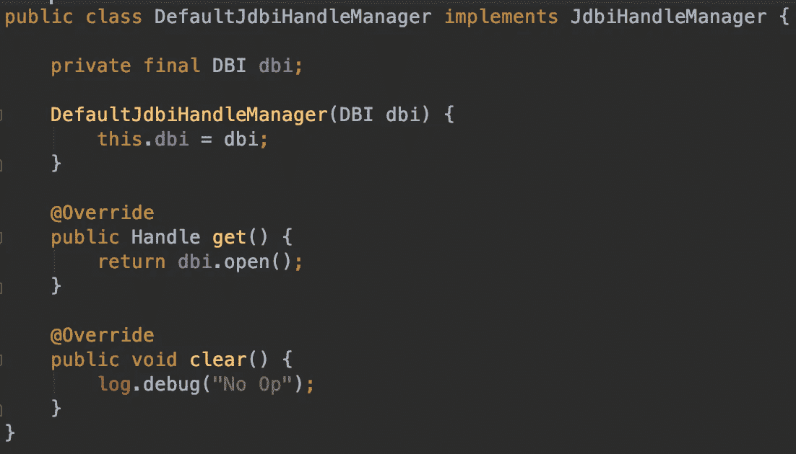

默认 Jdbi 句柄管理器实现

由于每次打开并返回一个新的`handle`，应用程序将很快用完`handles`。

此外，当`Dao`被代理时，如果一个线程对`Dao`的多个方法发出请求，或者对另一个`Dao`的一个方法发出请求，它将创建一个新的句柄。因此，我们没有办法用多种方法实现一个事务上下文。

> *这个实现可以用于服务那些只与单个句柄中的单个方法交互的请求。*

虽然显然不适合生产用例，但它可以在嵌入式数据库测试中找到自己的位置。

**请求范围的 Jdbi 句柄管理器**

考虑到默认经理的局限性，我们意识到我们的`handle`经理需要具备以下能力，以便整合整个画面。

*   服务请求的线程所涉及的每个`Dao`都需要共享一个公共的`handle`。句号。
*   句柄在其生存期内作用于线程。一旦线程完成处理，它应该释放句柄。

以上两个用例要求我们实现一个`[ThreadLocal](https://docs.oracle.com/javase/7/docs/api/java/lang/ThreadLocal.html)`变量，它代表与当前线程相关联的句柄。没有其他线程需要处理这个`handle`(双关语)

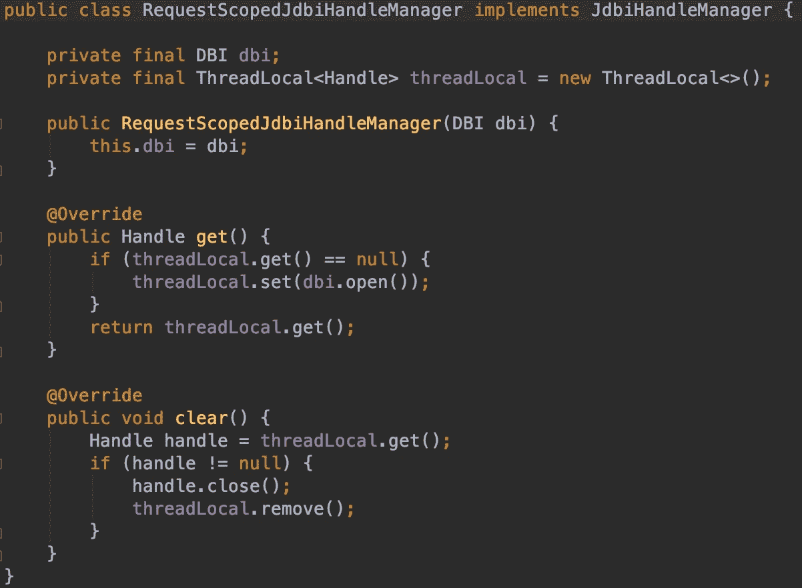

请求范围的句柄管理器(日志省略)

所有的`SQL objects`都连接到一个共同的手柄上。这使得一个事务边界跨越不同`Dao`类中的多个`Dao`访问方法。

这意味着，您现在可以拥有一个跨越由不同的`Dao`类支持的多个数据源/表的事务

**这个管用。确实如此。**
然而，它依赖于我们恰当地调用`#clear()`方法。

我们通过在`JdbiUnitOfWorkEventListener`中处理的`FINISHED` Jersey 请求监控事件调用的`JdbiTransactionAspect`来实现这一点。这两个类在本文前面的部分都有详细的讨论。

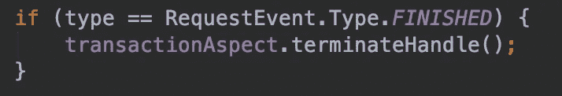

我们的事件监听器清理钩子

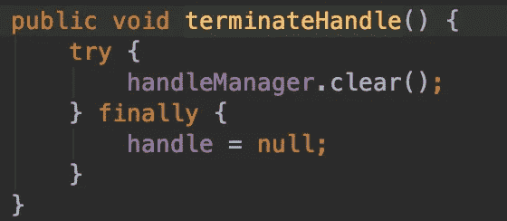

通过方面，我们取消了 finally 块中句柄的引用

虽然我们确实需要考虑这里和那里的异常，但是一个`finally`块总是帮助我们清除句柄。

就是这样。我们现在已经实现了一个请求范围的`handle`管理器，它是由请求`thread`调用的代理`Dao`类调用的，请求`thread`的事件由事件`listener`监控

**请求范围的线程处理程序**适用于大多数生产用例。然而，只有一个小限制。*看看能不能搞清楚。*

因为`ThreadLocal` `handle`被分配给了每个线程，所以单个线程永远不会产生多个并发与数据库对话的 IO 线程。

**为什么是**？因为每个新线程都将获得一个新的句柄，而线程不能继承线程局部变量。这是连 Dropwizard 的原版`@UnitOfWork`都不支持的。而且理由很充分。是不靠谱的。

**链接请求范围的 Jdbi 句柄管理器**

对于需要生成多个线程来从单个请求线程访问数据库的用例来说，这变得[棘手](https://stackoverflow.com/questions/1531073/is-java-sql-connection-thread-safe/1531103#1531103)。

然而，有一个技巧(*虽然不是完全安全的*)可以绕过这个问题，并在新线程之间共享句柄。

由于我们拥有产生多个线程的线程，我们可以使用**定制线程工厂**创建新线程。这个线程工厂构造器利用当前线程的 ID *(唯一单调递增的数字)。*

我们称之为**对话 ID** 。`Thread Id`是确保唯一性的足够好的方法。我们要做的就是在父线程和子线程之间创建一个唯一的标识符。不严格地说，这就是 [Spring 使用](https://docs.spring.io/spring-webflow/docs/current/api/org/springframework/webflow/conversation/ConversationId.html)作为其组件之一的原因

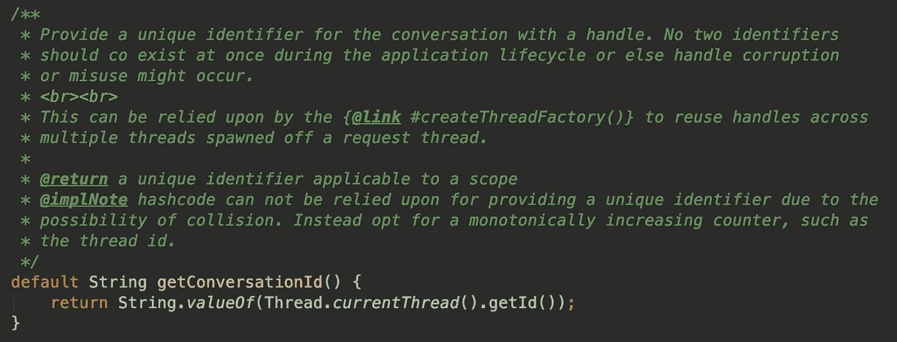

创建对话 ID

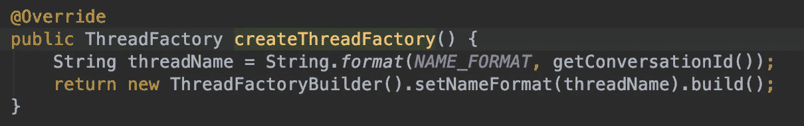

自定义线程工厂来建立对话。

现在，请求线程创建了多个线程，但是它是使用自定义线程工厂来实现的。我们的名称格式如下所示。

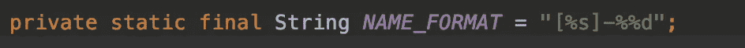

我们知道请求范围的实现从线程本地获取。因此，我们从`ThreadLocal`切换到`ConcurrentMap<String, Handle>`

因为最初的请求线程保证有一个句柄*(已经通过方面事件监听器初始化)*，我们在映射中至少有一个条目，否则我们会崩溃。

每当子线程想要获得句柄时，它就在映射中搜索键。这里有两个问题。

*   我们如何知道一个线程是父线程还是子线程？
    *穿过线厂。由于所有的请求线程都是由一个定制的线程工厂创建的，我们可以使用一些字符串逻辑来查找它们的名字，从而解决这个问题。默认情况下，所有未显式创建的线程都是父线程。*

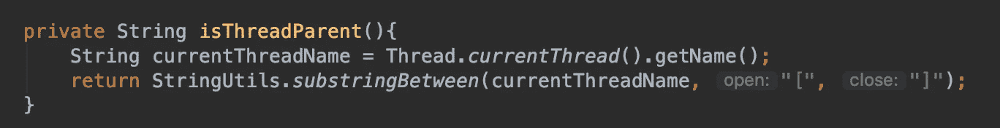

如果一个线程是使用我们自己的 NAME_FORMAT 创建的，它就不是父线程

*   **一个线程最终是如何访问句柄的？** 通过访问以父标识符为关键字的映射。如果线程不是父线程，则返回由其父线程打开的句柄。如果它实际上是父节点，则显式打开一个句柄并将其放入映射中。

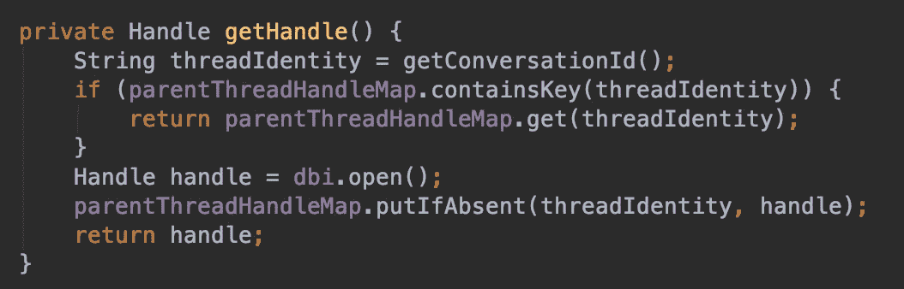

第一次有选择地创建句柄，并为其子线程进行缓存

这里有一个测试，它断言使用指定线程工厂创建的共享相同句柄的新线程。

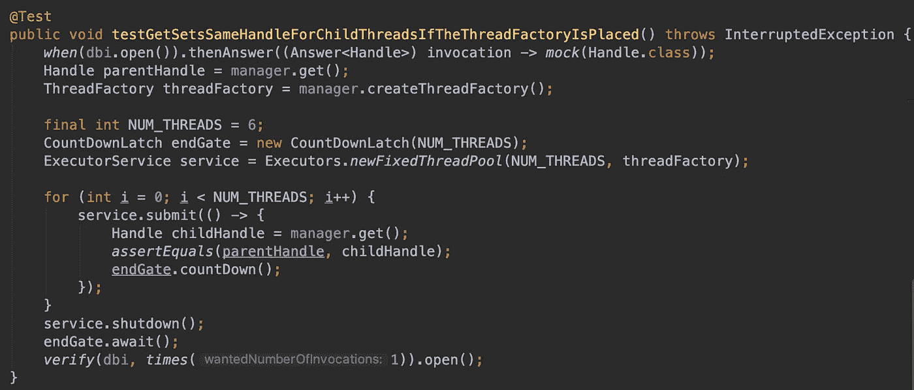

6 个子线程，每个线程同时启动，共享同一个句柄。

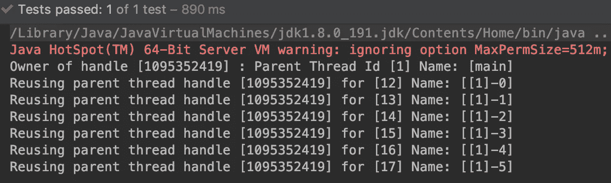

所有 6 个子线程共享同一个句柄。注意记录 main ID 的子线程的名称格式。句柄的 hashcode 与 109532419 相同

另一方面，如果我们不设置自定义线程工厂，测试就会失败，因为每个线程都试图获得一个句柄作为父线程。

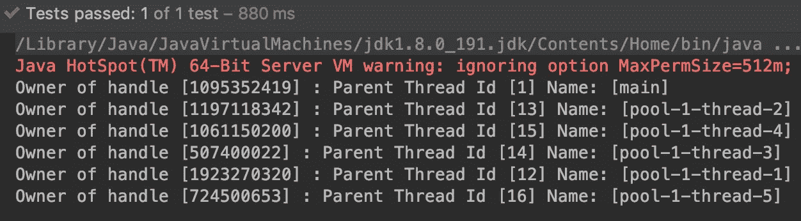

所有 6 个子线程都获得了一个新的句柄。没有线程的名称格式。句柄的 hashcode 是不同的

话虽如此，**链接的 RequestScoped Jdbi 句柄管理器**需要小心使用。玩和依赖一个开发者可以随意违背(难以察觉)的线程工厂格式是不可靠的。

如果你要分发你自己版本的`handle manager`，确保没有**漏洞**。讨论这个实现只是为了证明`JdbiUnitOfWork`可以跨从单个请求线程产生的多个线程工作。

至此，我们完成了构建 Jdbi 后端的 UnitOfWork 替代品的旅程。请务必在这里查看完整的源代码。[https://github . com/异丙醇氰化物/drowizard-jdbi-unit of work](https://github.com/isopropylcyanide/dropwizard-jdbi-unitofwork)

希望你已经找到了一些有用的东西。我确定，我做了。