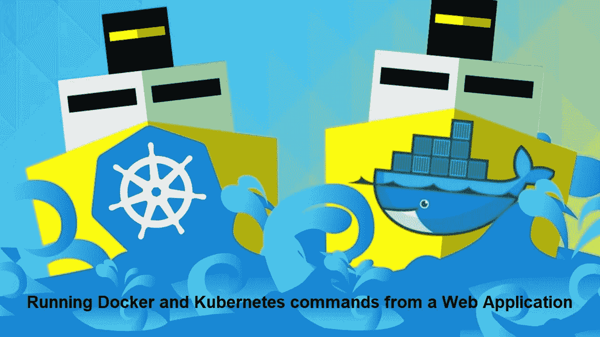
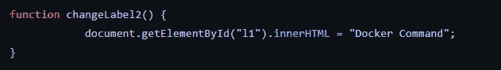
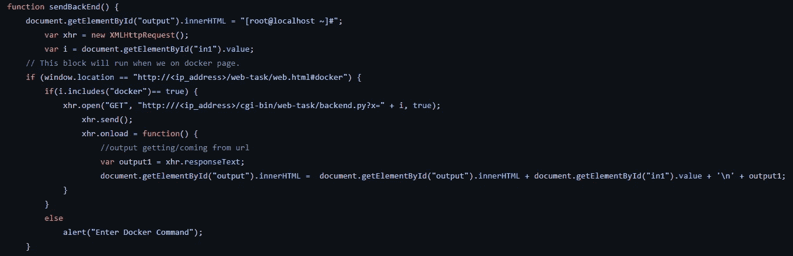

# 构建 Web 应用程序来运行 Docker 和 Kubernetes 命令

> 原文：<https://medium.com/nerd-for-tech/building-web-applications-to-run-docker-and-kubernetes-commands-26e5716e8a7f?source=collection_archive---------12----------------------->



# JavaScript 是什么？

JavaScript(或“JS”)是一种编程语言，最常用于网页上的动态客户端脚本，但它也常用于服务器端，使用 Node.js 等运行时。

JavaScript **不应该和 Java 编程语言**混淆。虽然*“Java”*和*“JavaScript”*是甲骨文在美国和其他国家的商标(或注册商标)，但这两种编程语言在语法、语义和用例上有很大不同。

JavaScript 主要用于浏览器，使开发人员能够通过 DOM 操纵网页内容，使用 AJAX 和 IndexedDB 操纵数据，使用 canvas 绘制图形，通过各种 API 与运行浏览器的设备进行交互，等等。JavaScript 是世界上最常用的语言之一，这要归功于浏览器中可用的 API 最近的增长和性能改进。

# 什么是 AJAX？

Ajax 代表 **A** 同步**J**avascript**A**nd**X**ml。Ajax 只是一种从服务器加载数据和有选择地更新网页的一部分而不需要重新加载整个页面的方法。

基本上，Ajax 所做的是利用浏览器内置的`XMLHttpRequest` (XHR)对象在后台与 web 服务器异步发送和接收信息，而不会阻塞页面或干扰用户体验。

Ajax 变得如此流行，以至于你几乎找不到一个在某种程度上不使用 Ajax 的应用程序。一些大型 Ajax 驱动的在线应用程序的例子有:Gmail、Google Maps、Google Docs、YouTube、脸书、Flickr 等等许多其他应用程序。

> **注意:** Ajax 并不是一项新技术，事实上，Ajax 甚至根本就不是真正的技术。Ajax 只是一个术语，用来描述通过 JavaScript 从 web 服务器异步交换数据的过程，不需要刷新页面。

# 什么是 CGI？

CGI 是通用网关接口支持的缩写。CGI 脚本由 HTTP 服务器调用，通常用于处理通过 HTML `<FORM>`或`<ISINDEX>`元素提交的用户输入。

大多数情况下，CGI 脚本位于服务器的特殊`cgi-bin`目录中。HTTP 服务器将关于请求的各种信息(例如客户机的主机名、请求的 URL、查询字符串和许多其他内容)放在脚本的 shell 环境中，执行脚本，并将脚本的输出发送回客户机。

脚本的输入也连接到客户端，有时表单数据是这样读取的；在其他时候，表单数据通过 URL 的“查询字符串”部分传递。该模块旨在处理不同的情况，并为 Python 脚本提供更简单的接口。它还提供了许多有助于调试脚本的实用程序，最新的功能是支持从表单上传文件(如果您的浏览器支持的话)。

# 我们要把上述概念结合起来吗？

> 答案是**是的！**

我们将利用上述概念以及 HTML 和 CSS 来制作一个 web 应用程序，它可以在浏览器中运行 Docker 和 Kubernetes 命令，并且您可以在屏幕上看到输出。

**先决条件:**

*   HTML/CSS/JavaScript/Python 的基础知识
*   Linux 操作系统
*   在 Linux 中配置的 web 服务器
*   安装在 Linux 中的 Docker
*   Kubernetes 已配置

> 让我们先来构建 Docker 命令的 web 应用程序！

前端可以根据您自己的喜好来构建，我们将更多地关注 JavaScript 和 CGI 部分。



在上面的代码片段中，JavaScript 代码将从输入框中获取具有以下 id 的值(本例中为“l1”)。



这部分代码通过输入框获取用户的输入，并将输入发送到位于 **cgi-bin** 目录中的 python 脚本。

```
import cgi
import subprocess
import time 

print("context-type: text/html")
f=cgi.FieldStorage()
cmd=f.getvalue("x")
#print(cmd)

o = subprocess.getoutput("sudo " +cmd)

print(o)
```

所以这个 cgi 程序将从服务器获得输入，并在浏览器中运行命令。

**子流程**是一个库，用于通过 python 代码创建流程来运行新的应用程序或程序。

下一步是启动服务器，在浏览器中打开网页，并在浏览器中运行 docker 命令。

因此，Docker Web 应用程序已经可以使用了！

> 现在让我们继续为 Kubernetes 命令构建 web 应用程序！

类似地，Web 应用程序可以在浏览器中运行 Kubernetes 命令，以普通的英语口语而不是特定的命令进行输入，然后处理该查询并相应地显示输出。同样，您可以根据自己的需要为 web 应用程序开发自己的前端，JavaScript 代码与上一个类似，只是有一些小的变化。

由于 Docker 和 Kubernetes 命令之间的明显差异，这里的 CGI 略有不同。这里的 admin.conf 文件是 Kubernetes 的配置文件，它将有助于在 Linux 中运行 Kubernetes。

```
import cgi
import subprocess as sp
import time

print("context-type: text/html")
print()
f=cgi.FieldStorage()
query = f.getvalue("x")
if "show pods" in query:
    cmd = "kubectl get pods --kubeconfig admin.conf"
    o=sp.getoutput(cmd)
    print(o)
elif "show deployment" in query:
    cmd = "kubectl get deployments --kubeconfig admin.conf"
    o = sp.getoutput(cmd)
    print(o)
```

因此，通过遵循上述步骤，我们可以构建所需的 web 应用程序。

## 供参考:

*   Docker Web 应用程序的 GitHub 存储库链接:[https://GitHub . com/AmimaShifa/JavaScript-Integration-with-Docker](https://github.com/AmimaShifa/JavaScript-Integration-with-Docker)
*   Kubernetes Web 应用程序的 GitHub 存储库链接:[https://GitHub . com/AmimaShifa/Web-Application-for-Kubernetes-Commands](https://github.com/AmimaShifa/Web-Application-for-Kubernetes-Commands)