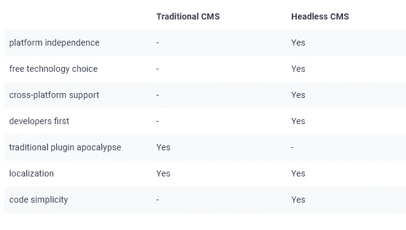
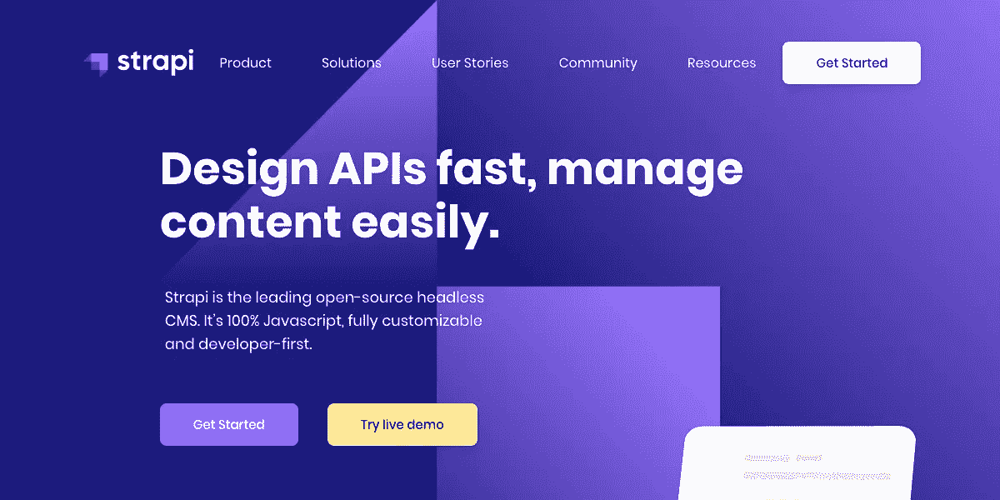

# 使用 Strapi 构建 Web 应用程序和 Jam Stack 概述。

> 原文：<https://medium.com/nerd-for-tech/building-web-applications-with-strapi-and-overview-of-jam-stack-50c2d65a9c3d?source=collection_archive---------26----------------------->

设计和建立一个网站已经变得比前些年使用的技术更加容易。由于框架和 cdn(内容交付网络)的巨大发展，这一切都成为可能。网站开发不会在网站发布后就结束，持续开发的过程必须存在，以保持任何组织的客户/用户基础。为了保持这一过程的连续性，CDN 在管理网络应用/网站方面发挥着至关重要的作用。

(左)单服务器分发(右) **CDN 分发方案**。【来源:维基百科】。

CDN 概念的主要目的是作为一种服务，向大型企业的最终用户提供内容。CDN 通过提供视频流、软件下载、web 和移动内容加速等服务，帮助任何大型企业将内容交付给最终用户，而不是集中的服务器分发。

# 内容管理系统

内容管理系统是用于管理和重新创建 CDN 中的数字内容的软件。CMS 的主要作用是将内容包括在网站/应用程序中，如视频、文本、图像、图形和程序，这将进一步增强与最终用户的交互。除了传统的 CMS，还有一个新概念叫做 headless CMS，在过去的几年里已经成为一种趋势。这个概念在 CMS 的许多组织中被优选地使用，因为主要的优先权被给予存储和结构化内容交付。名称 headless 的由来是因为应用程序的头部(前端)没有被聚焦，只有后端内容被管理以实现一致的操作。下面是传统和无头 CMS 的比较，这可能取决于某些人的要求。

传统 CMS 与无头 CMS 的比较。[来源:互联网]

# **贾姆斯塔克**

Jamstack 是一个现代的架构，它提供了更简单的开发体验，主要优点包括由于 CDN 服务的可用性而带来的高性能，因此在网站上重新加载页面比传统的 CMS 更快。**可扩展性**在意外时间管理巨大的负载能力，以运行应用程序并使其对所有最终用户可用。Jamstack 向来自首选主机服务的主机供应商提供**可移植性**，使网站成为 Jamstack 网站。Jamstack 极大地提升了开发人员的体验，让开发新手尝试使用广泛使用的框架和部署工具。作为 Jamstck 的新开发人员，您需要的只是尝试它的效率和效果。更多福利尽在关于 Jamstack 的 [***链接***](https://jamstack.org/why-jamstack/) 。*【建议在开始使用 Jamstack 之前先看一看】*

# **斯特拉皮**

在 Jamstack 中有超过 80+ 的无头 CMS，如 Ghost、Strapi、Netlify CMS、Direcrtus、Ponzu 等，但我最喜欢的列表是 [**Strapi。**](https://strapi.io/) Strapi 是一款领先的 Javascript**headless CMS，它是从开发者至上的角度创建的。**

****

**[Strapi —开源 Node.js 无头 CMS🚀](https://strapi.io/)**

**因为 Strapi 是一个开源 CMS，所以任何人都可以在 Github 中获得它的源代码，它也由数百个贡献者维护。因此，strapi 有一个强大的贡献社区来进行任何讨论。Strapi 也是可定制的，你可以从管理面板定制 api。这样开发者可以在更短的时间内用自定义插件扩展他们的内容。**

**Strapi 是一个自托管的 headless CMS，其中数据隐私或用户对数据的控制是一个完全的优势，用户自己在任何时候都可以控制一切。这也支持流行的 RESTful 和应用程序以及 GraphQL 库来支持客户端。该功能的亮点是它还通过这些 REST 应用程序支持物联网或移动设备。**

**上面提到的只是将 Strapi 用于任何类型的 web 应用程序的 headless CMS 的几种用法。我也鼓励大家尝试一下 Strapi，体验一下 Strapi 提供的特性和特权。这篇关于 web 开发和 headless CMS 的博客到此结束。====干杯！！！:)====**