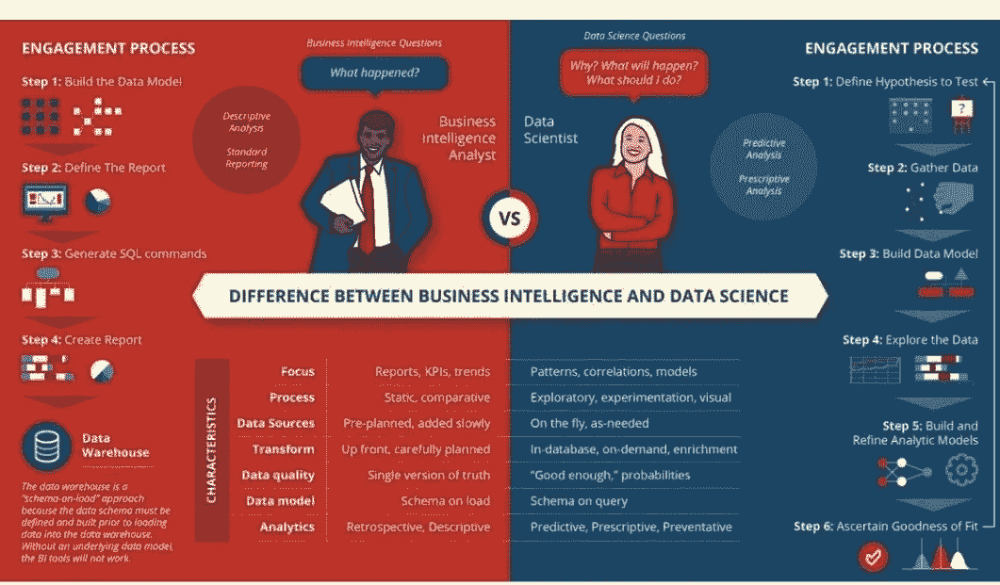

# 商业智能分析师与数据科学家的异同

> 原文：<https://medium.com/nerd-for-tech/business-intelligence-analyst-vs-data-scientist-similarities-and-differences-9f161d1bdba1?source=collection_archive---------8----------------------->

“每个公司的未来都有大数据，每个公司最终都将从事数据业务。”——[*托马斯·h·达文波特*](https://www.tomdavenport.com/)

如果你想比较商业智能分析师和数据科学家的职业道路，但不确定哪种技能适用于每种职业，我整理了这些职业之间的相似之处和不同之处，以提供帮助。

根据美国劳工统计局的数据，到 2028 年，对合格商业智能分析师和经理的需求预计将飙升至 14%，而对数据科学家的需求预计将增长 16 %。

鉴于所有职业的平均增长率约为 5%，这两个不同的领域似乎有更好的前景。然而，商业智能分析师似乎没有数据科学家受欢迎。

# 数据科学家和商业智能分析师之间的相似之处

作为一名数据科学家，您对数据的理解将决定您的模型执行和预测的成功程度。例如，如果您正在构建一个模型来预测地区销售额。你需要知道影响该地区销售的最重要的因素或因素组合是什么。只有这样，您才能将这些因素输入到您的模型中。从而使你的模型能够给出合理的预测。

商业智能分析师还需要能够理解数据。每天，你都会收到大量的业务请求。无论你试图回答什么，业务问题还是关键见解，你都需要对数据有一个具体的理解。例如，在不了解客户历程的情况下，你无法洞察哪类客户会转化为品牌忠诚者。

# 这些职业之间的差异

如今，我发现很多人自称为数据科学家。我认为这是因为这让他们听起来很聪明。但是，你不难搞清楚，大部分只是报数字，不明白为什么会这样。数据科学家和商业智能分析师之间的一个关键区别是他们做了多少报告和分析。

商业智能分析师更有可能使用描述性数据追溯性地检查趋势并报告发生了什么。这些报告经过精心策划，通常每月/每季度提交一次。KPI 经常被比较以发现趋势和其他有用的见解。

数据科学家使用预测性和规范性数据来分析未来决策和增长的可能机会。这种分析通常是探索性的，并使用图像来表示预测。