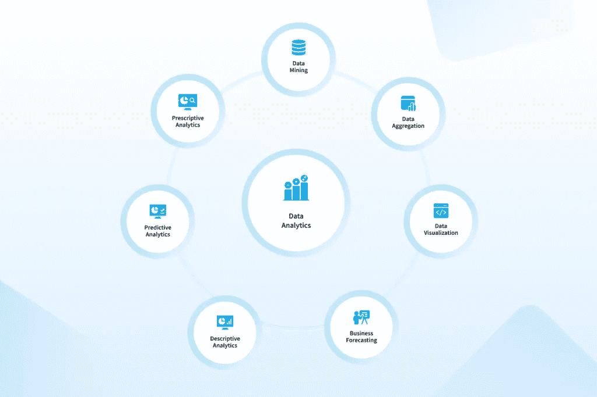
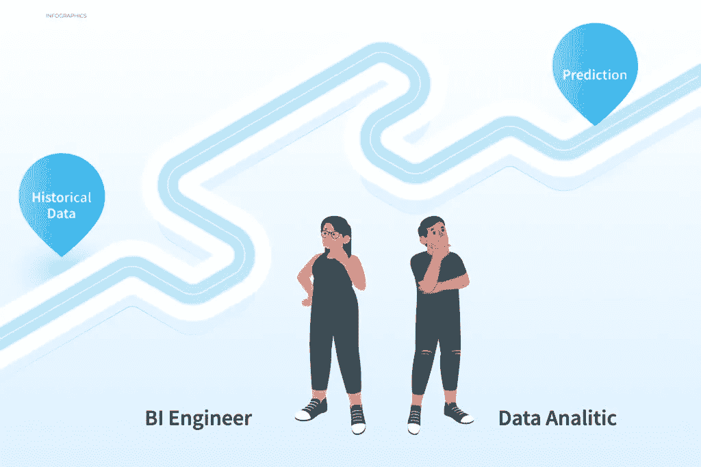

# 商业智能与数据分析:需要了解的 6 个差异— NIX United

> 原文：<https://medium.com/nerd-for-tech/business-intelligence-vs-data-analytics-6-differences-to-know-nix-united-6c908b5dad40?source=collection_archive---------3----------------------->

无论你在哪个领域经营，你的业务的最终目的，你的竞争环境等等，数据在所有现有的行业和工作流程中都是王道。高质量的数据以多种方式推动业务，从概述所有底层流程的详细情况到为未来的改进提供宝贵的见解。

然而，为了达到这种质量并保持其一致性，您不仅必须检查您的数据，还必须熟练地运用相关的方法来收集、分析、处理数据，并以所有其他方式处理数据。这就是清楚理解商业智能与数据分析的关键所在。

这两个术语经常被混淆或互换使用，这就是为什么我们在这里帮助您一劳永逸地区别开来，并开始最终将数据分析和[商业智能解决方案](https://nix-united.com/services/business-intelligence-services-bi/)转化为您的优势。但是让我们从头开始。

可以建立各种生产力基准，发现相关的市场趋势，并根据定期收集的 BI 制定合规性指标。

从长远来看，BI 鼓励关于可验证和具体数据的无错误程序。它还提供有关公司记录的信息，帮助官员评估公司在经济和其他领域的发展。

数据挖掘、数据清理、数据转换和数据管理系统开发的技术过程都包含在数据分析中。为了识别趋势和解决问题，数据分析使用大量数据来分析各种领域，包括政府和研究，而不仅限于企业应用。

所有提到的流程都支持、推动和简化了业务分析的基本方面，例如:

*   数据挖掘(提取和分类大量数据，以找出模式和趋势)
*   数据聚合(收集和组织数据以供进一步分析)
*   数据可视化(将收集的数据转换成图形和图表，以获得更简单的“肉眼”概览)
*   业务预测(分析在一定时期内积累的历史数据，以便对未来的业务成果进行评估)
*   构建预测和其他数据分析模型(在这种情况下，数据分析可能会扩展为一系列具有不同目的的格式)
*   描述性分析(根据历史数据指出主要的业务绩效事件、变化和趋势)
*   诊断分析(了解过去的业务绩效事件、变化和趋势)
*   预测分析(根据历史数据预测未来趋势)
*   说明性分析(提出应对未来业务绩效和趋势的具体行动)

通过这种方式，专门的数据分析师使用专门的工具并采用各种方法，首先汇集所有相关数据并为处理做准备，然后描述、诊断、预测或规定数据洞察力、工作流优化工作以及其他数据驱动的目标和细节。

记住这些信息，让我们深入讨论商业智能与数据分析。

# 两者之间的主要区别

为了让您更全面地了解这幅图，下面简单介绍一下商业智能和数据分析的区别:

*   商业智能是一组专注于现有运营基础的任务和方法。
*   数据分析是一组处理收集的数据的过程(分析、处理等)。)进行进一步的业务改进和创新。

虽然两者都专注于以智能、数据驱动的方式扩展业务潜力，但深入了解数据分析和商业智能之间的差异非常重要。让我们一个方面一个方面地来看看两者之间的主要区别。

# 区别#1:使用数据洞察力

讨论中的两个术语都非常关注以某种方式获取和阐述数据驱动的业务洞察力。然而，最终目标本质上是不同的。

数据分析更多的是关于*创造*洞察力。这可以通过各种方式、各种工具来完成，所有这些都有助于将数据转换、清理和格式化为*可操作的*洞察。然后，可以实现由此产生的有见地的计划来解决各种问题和目标，包括商业智能任务。

商业智能是关于*使用*挖掘出的洞察力。在 BI 性能方面，可操作的见解被视为简化决策制定以及工作流组织、优化、扩展等的基础。

# 区别 2:历史和预测

接下来，在“数据分析时间”方面有一点小小的不同

可以向数据分析提供各种数据输入，包括历史数据，以便通过预测性分析建立预测并概述潜在的未来转变和变化。总而言之，我们可以看到这里明确关注的是数据驱动的未来。

反过来，虽然商业智能有助于为未来实施的业务战略提供信息，但它只关注过去的历史或最近的数据，这些数据有助于更好地理解正在运行的流程。BI 不是预测和预言，而是概括事物现存的相关状态。

# 区别#3:原始数据与结构化数据

商业智能和数据分析所采用的初始数据格式也有所不同。

因此，数据分析中的大多数任务都是从原始的非结构化数据(通常也是实时提取的)开始的。如上所述，任何数据分析师的基本任务是清理数据，并使其有序。

为了执行 BI 任务，专家们采用了之前已经结构化并存储在专门存储中的数据(数据库、数据仓库、[云](https://nix-united.com/blog/data-analytics-in-the-cloud-in-simple-words/)，等等)。基于预先组织好的数据集，他们可以做出描述性的业务总结和报告。

# 区别#4:谁使用什么？

考虑到上面强调的所有细节，不同的专家采用不同的 BI 和数据分析技术就不足为奇了。

数据分析是由专业人员处理的工作，包括数据科学家、数据分析师，在某些情况下，还包括软件开发人员和工程师。这是一个既需要理论知识又需要实践技能的狭窄领域。

相反，BI 是非技术专家的特权，包括高层和项目经理、团队领导、首席信息官(以及其他首席执行官)和财务部门负责人。

然而，尽管对配置文件进行了逻辑细分，您仍然可以偶尔看到处理数据分析和商业智能任务的数据分析师(这更像是一种通用方法，由这些专业人员的深入数据驱动教育实现)。

# 差异#5:业务覆盖面

讨论中的这两个术语涵盖了不同程度的基础业务方面。

数据分析是关于深入，狭隘地聚焦于某个任务或问题，并通过专门的技术分析找到特定的答案或方法。

或者，BI 流程更多的是概述业务工作流的大图和性能细节。许多业务“表面”决策和战略都是根据 BI 进行的，而没有涉及大量的技术细节。

# 区别#6:“肮脏的工作”和干净的策略

为了总结商业智能和数据分析之间的主要差异，我们可以有把握地说，在这两种业务运营计划之间有一条清晰的粗线。

毫无疑问，数据分析是至关重要的，人们可能会认为数据分析是“脏活”，需要专家深入研究与数据相关的核心机制，并使用一系列专家工具来获得结果。

对整体商业成功同样重要的是，商业智能远没有那么细致入微。这里的专家使用全面的报告、预先组织的数据结构和易于掌握的跟踪、监控和可视化工具。

# 基本要点

底线是你可以清楚地看到为什么我们讨论的术语如此频繁地混合、组合或互换使用。在现实世界的实践中，任务、技术和某些其他潜在因素经常从数据分析渗透到 BI 中，反之亦然。

然而，弄清楚所有的细微差别，会让你掌握一些知识，这些知识肯定会帮助你顺利地管理工作流程细节，明确设定业务优先级，甚至通过雇佣[你所需要的专家](https://nix-united.com/blog/business-analyst-vs-data-analyst-which-professional-do-you-need/)来削减成本。请记住，您可以通过数据分析来阐述和设定相关目标，而 BI 技术将帮助您实现这些目标。

为了让你的生活更容易，这里有一个小抄表，应该可以帮助你区分商业智能和数据分析。

# 结果

数据分析与商业智能的争论是一个非常常见的问题，许多公司和企业家都倾向于混淆这两种方法，或者没有对它们的意义给予足够的重视。这只会让他们落后于知识渊博的市场参与者一步，这些市场参与者清楚自己的优先事项，知道实现目标的适当方法。

求助于经验丰富的专业人士，他们将直接指导您了解细微差别，并阐明最有效的数据分析和商业智能方法。在 NIX，我们拥有完全独立的数据科学家和 BI 专家团队，随时准备根据您的业务需求定制高质量数据的能力，为您提供更强的竞争优势并简化销售。

# 商业智能和数据分析是一回事吗？

虽然数据分析和商业智能通常结合使用(数据分析更像是一种 BI 工具)，但它们是绝对独立的概念，具有不同的全球目的、任务和方法。BI 更侧重于概述一系列方法、策略和工具，以挖掘有益的见解，并使业务数据为整体业务成功服务。而数据分析恰好是 BI 概述的那些工作中最重要的一项。

如果我们将数据分析分开，它都是关于处理和分析数据的普通技术部分(从数据挖掘和提取到排序和结构化、格式化和各种类型的分析)。尽管 BI 的目标和结论通常更抽象，但数据分析是关于特定的任务和结果(例如，构建数据以供存储之外的简单进一步使用，基于确定的模式预测利基趋势等)。).

# 数据分析师和 BI 分析师的工作差别有多大？

两种类型的专家在相似的领域工作。然而，数据分析师是技术熟练的专业人员，通常处理原始的非结构化数据。他们工作的主要目标主要是识别有用的数据模式和阐述*可操作的见解*。关于商业智能与数据分析，数据分析师不一定了解业务方面的事情。他们的工作领域涉及编码复杂的数据集中的东西，如编程算法，以及统计分析。

反过来，商业智能分析师可能不一定拥有最强的数学技能，但却精通公司的全球业务。从数据分析师的工作中获得的可操作的见解被传递给 BI 专家，以根据这些见解做出运营决策。现在，BI 分析师的主要任务包括团队领导和管理、制定战略、沟通和谈判以及营销知识。

# 数据分析师必须具备哪些技能？

要从事专业的数据分析，你需要至少拥有计算、统计或任何其他密切相关领域的本科学位。你可能接受过其他教育，但如果你获得了适当的证书，你仍然可以从事数据分析师的工作。就专业能力而言，数据分析师必须精通:

*   数学(本质上是统计和概率)
*   关键决策
*   解决问题
*   关系数据库(和类似的系统)
*   数据收集、存储和清理
*   Python 编程
*   商务智能平台(Tableau、Power BI 等。)

# BI 分析师必须具备哪些技能？

一名优秀的 BI 专家精通数据分析师的工作，但还应该接受过商业教育，以便将所有技术数据分析结果转化为运营工作。为了担任这个职位，你必须精通:

*   企业管理
*   数据分析基础
*   相关 BI 工具和平台
*   财务管理(如预算和会计)
*   沟通、任务分配和时间管理

*原载于 2022 年 8 月 19 日*[*【https://nix-united.com】*](https://nix-united.com/blog/business-intelligence-vs-data-analytics-6-major-differences-you-need-to-know/)*。*