# 给我买那个表情..！

> 原文：<https://medium.com/nerd-for-tech/buy-me-that-look-5473444b1f2d?source=collection_archive---------6----------------------->

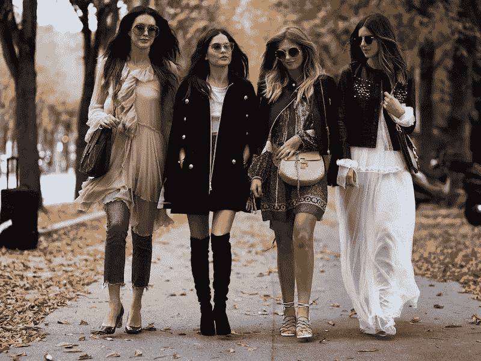

时尚

> “时尚是在日常生活中生存的盔甲”

> *嗨，这篇博客是关于使用深度学习“最先进的”架构“推荐相似的时尚单品”。为了便于阅读，我将整个案例研究分成了两部分。在第一部分，我将讨论直到“掩模 RCNN 模型”，第二部分是致力于其余章节。*

## 目录:

*   引言。
*   商业问题。
*   文献综述。
*   数据概述和 DL 公式。
*   损失函数。
*   掩模 RCNN 模型。
*   三元网络模型。
*   预测。
*   部署。
*   未来的工作。
*   未来连接的配置文件。
*   参考文献。

# **1。简介**

有很多在线平台(Myntra，Amazon，Nykaa)都在处理在线时尚产品。人们可以观察到未来几年时尚行业电子商务业务的潜在增长。在线时尚平台的增长使得时尚产品推荐的重要性成为必然。时尚推荐任务不同于传统的产品推荐。时尚产品由于它们的颜色、质地、设计而使得任务变得困难。此外，我们看到时尚产品经常在各种环境下展示(例如，干净的店内衣服、具有工作室/街道背景的模特所穿的衣服等)，从而使得识别和提取相关产品变得困难。

在线平台中存在的时尚物品通常在人体模型上展示时尚产品。可以看到模特们同时穿着多件时装。这增加了有效推荐的难度。这是因为，即使用户最初可能已经搜索了男式短裤作为主要产品项目，但有时推荐算法可能会推荐(同一人体模型穿的 t 恤、鞋子)这是不正确的。我们将使用基于图像分割和推荐的方法来完成给定的任务。图像分割是给图像的每个像素分配标签的过程。一个区域中的每个像素在颜色、强度、纹理等属性方面与其他像素相似。更准确地说，它被用来寻找一些物体的曲线、直线和边界。在许多应用中，图像分割技术是有用的。

*   测量组织体积、手术计划、虚拟手术导航。
*   人脸检测、行人检测、刹车灯检测。
*   人脸识别、虹膜识别、指纹识别等识别任务。

有许多方法可以完成这项任务。一些流行的方法如下:直方图方法、区域生长方法、阈值方法、区域分割方法、基于神经网络的方法。在本案例研究中，我们将使用基于神经网络的方法来完成图像分割任务。

# 2.商业问题

电子商务企业面临的最大挑战是确保为购物者提供优质的客户服务，帮助他们找到他们想要的东西，并为他们提供指导，这是这一过程的挑战所在。在购物中心、购物商店，我们通常会发现销售人员帮助购物者找到他们想要的东西，并根据他们的偏好和愿望给出建议。电子商务商店有聊天机器人，本来是用来代替销售人员的，但他们被发现不如真正的销售人员有效。产品推荐引擎的引入是为了克服上述困难，推荐引擎的好处是:

## 2.1]改善用户体验:

购物者对电子商务平台有很多期望。使用复杂的推荐引擎可以显著改善用户体验。如果顾客喜欢在你的网站购物，他们会不断回来，最终他/她会成为你的顾客。所以它总是建议电子商务网站有一个推荐引擎。

## 2.2]促进销售:

任何推荐引擎的主要目标都是在合适的时间以合适的价格向客户推荐合适的产品。当这一目标实现时，客户会感到满意，他也会从你的网站上购买一些产品，因为你的智能推荐引擎会推荐他/她最有可能购买的产品。如果一个网站赢得了大量的顾客，并且这些顾客积极购物，那么这个网站的生意/利润显然会增加。

## 2.3]增强客户参与度:

推荐引擎将提高客户参与度，因为这些系统是以这样一种方式建立的，即它们几乎了解客户的一切，如他喜欢什么衬衫，他喜欢在冬天穿什么，他喜欢在聚会时穿什么。这些信息已经由引擎通过分析客户过去在网站上可获得的数据而学习。如果这样，顾客会对购物之旅感到更加满意。一个满意的客户会更频繁地使用网站。改善的客户体验将保证更高的客户参与率。当客户感到有价值，同时发现你的网站用户友好，你参与的机会就会增加。

## 2.4]更多流量:

我们已经讨论过的产品推荐的好处会影响你网站的流量。改善的客户体验，更好的参与度，以及提高销售率的策略为你的网站创造了更多的内部流量。性能数字越大，你的内部流量就越大。点击推荐的人会访问更多的页面，将更多的产品放入购物车。

# 3.文献调查

完成图像分割任务的不同方法有，

## 3.1]基于阈值的方法

该方法是最简单的图像分割方法之一。在这种方法中，根据某个阈值将像素分割成不同的区域。根据我们如何设置阈值，这种方法进一步分为两种类型。

## a]全局阈值

在这种方法中，我们设置一个近似的阈值，比如说 T，并且这个 T 对于整个图像将是常数。设 p(x，y)是像素(x，y)的强度，q(x，y)是输出图像像素(x，y)的强度。

> *q(x，y) = 1 如果 p(x，y) > T 否则 0*

## b]多重阈值

在这种方法中，有一个以上的阈值可用，如“T0，T1，T3，..使用这些阈值，可以如下产生输出，

> *q(x，y) = m 如果 p (x，y) > T1*
> 
> *= n if p(x，y) > T2*
> 
> *= o if p(x，y) > T3*
> 
> *= z 否则 p (x，y) > Tn*

## 3.2]区域生长方法

在这种图像分割技术中，我们首先需要种子点，现在种子点通过根据一些相似性将相邻像素组合成它们自己而开始生长。最终图像 R 分为 R1，R2，R3，…Rn 其中 n 是种子点的数量。R = R1，R2，…，Rn。这些区域必须满足以下属性:

*   次区域联盟 R1、R2……，Rn 必须等于 R 也就是 R1 U R2 U R3 ……..U Rn = R
*   属于每个区域像素必须相互连接。
*   Ri ∏ Rj 必须为空。对于任何 j！=我
*   P(Ri) = True 对于属于某个区域 Ri 的所有像素，一定有某个为真的属性 P。
*   P(Ri U Rj) = False 换句话说，属于不同区域的像素必须不满足相同的属性 p。

## 3.3]区域分割和合并

在这种分割方法中，第一幅完整图像被认为是区域 R。因此，当属于一个区域的像素不相似时，我们分割图像，如图 RSM 所示。分裂阶段将继续进行，直到我们碰到单个像素，或者在属于区域 Ri 的像素中没有不相似之处。在合并阶段，我们将根据某种相似性度量来尝试合并相邻区域。相似性度量可以是强度值、纹理、颜色等。

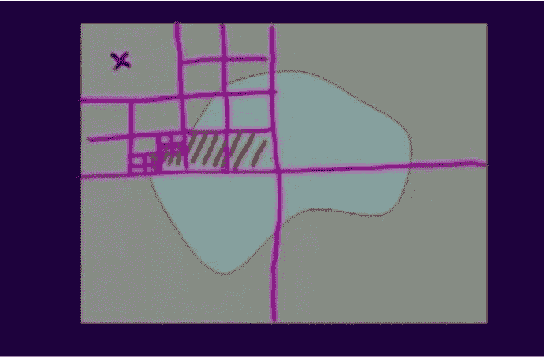

图像分割和合并

## 3.4]基于聚类的方法

以下是进行基于 k 均值的图像分割的步骤。也是一种无监督的学习。

*   初始化 k 个聚类和 k 个聚类中心的数量。
*   对于图像的每个像素，使用下面给出的关系计算图像的中心和每个像素之间的欧几里德距离 d。d = || p(x，y)CK | |
*   根据距离 d 将所有像素分配到最近的聚类中心。
*   在所有像素被分配到一个聚类中心之后，我们更新每个聚类的“聚类中心”,作为属于该聚类的像素的平均值。
*   我们将使用距离 d 将像素重新分配给新的聚类中心之一。这个过程将递归地进行，直到新的聚类中心和旧的聚类中心之间的差小于某个阈值，换句话说，如果聚类中心变化不大，我们将停止。

## 3.5]基于神经网络的图像分割

从 1990 年开始，科学家们开始使用神经网络来完成图像分割任务。许多架构为这项任务提供了良好的结果，其中一些是单层感知器、多层感知器、反向传播神经网络，其中最著名的是卷积神经网络，它最适合处理图像。最近的深度学习架构专注于以这样一种方式寻找嵌入，即模型知道不同类别的时尚产品以及类别内的差异。匡提出了一种通过使用多尺度的全局和局部表示将查询图像匹配到画廊时尚项目的方法。Quintino 提出了一个模型，该模型采用卷积神经网络通过注意力机制来共同学习时尚类别和属性。Kinli 通过使用具有堆叠卷积(SC)和剩余连接(RC)块的基于三元组的胶囊网络作为胶囊层的输入，探索了店内衣服检索问题。我们将使用 Kinli 的方法来获得图像的嵌入。

# 4.数据集概述和 DL 公式

近年来，时尚产品的视觉分析受到了极大的关注。如前所述，从给定图片中提取所有时尚属性可以显著提高销售、使用体验和流量。虽然计算机视觉的早期工作解决了相关的服装识别任务，但这些工作并没有考虑到时尚业内人士的需求，这可能是由于时尚设计和计算机视觉的研究差距。为了解决这个问题，我们首先提出了一个由时尚专家建立的时尚分类法，该分类法由互联网上的产品描述提供信息。为了捕捉时尚对象的复杂结构和从 web 爬行获得的描述中的模糊性，我们的标准化分类包含 46 个服装对象(27 个主要服装项目和 19 个服装部分)和 92 个相关的细粒度属性。我们有大约 50，000 张由领域专家和人群工作者标记的图像，用于精细分割。

> *屏蔽 RCNN 数据集:*[*https://www . ka ggle . com/c/imate rialist-fashion-2019-fgvc 6/data*](https://www.kaggle.com/c/imaterialist-fashion-2019-FGVC6/data)

上述数据将用于从“全尺寸人体模型”时尚产品中提取时尚产品，例如鞋子、裙子、上衣、眼镜、连衣裙(我们将使用 Mask RCNN 来提取属性)。提取产品后，我们需要将相似的产品放在一起，不相似的产品放在一起。换句话说，我们需要嵌入(产品的向量形式表示)。我们将在 street2shop 数据集上训练三元组网络，以获得正确的嵌入。一旦训练完成，我们将饲料的图像推荐给三重模型，并得到嵌入。一旦我们有了嵌入，为了推荐给定产品的相似时尚产品，我们将获取给定产品的嵌入和存储的嵌入之间的余弦相似性。余弦相似性值较高的 topK 产品将被推荐给购物者。

> *Street2Shop 数据集:*[*http://www.tamaraberg.com/street2shop/*](http://www.tamaraberg.com/street2shop/)

# 5.损失函数

## 4.1]屏蔽 RCNN 损耗:

在训练期间的掩模 RCNN 中，我们将每个采样 RoI 上的多任务损失定义为

> *损耗= Lcls + Lbox + Lmask*

Lbox(盒丢失)在我们的任务中并不重要。掩模 RCNN 基于提取感兴趣区域的区域提议方法，细节将在后面讨论。假设建议的 RoI 大小为 M * M，并且有 K 个类别，那么对于每个 RoI，我们将有 K * M * M 个二进制掩码，每个类别一个掩码。与地面真值分类标签对应的掩膜会导致损失，其余掩膜对损失没有任何影响。Lmask 定义为平均二进制交叉熵损失。Lmask 允许网络为每个类别生成掩码，而不存在类别之间的竞争；这与将 FCNs 应用于语义分割时的常见实践不同，后者通常使用每像素 softmax 和多类交叉熵损失。在那种情况下，跨类的掩码竞争；在我们的例子中，对于每像素 sigmoid 和二进制损失，它们没有。Lcls 是分类相关损失，与一般分类损失相同。

## 4.2]三联体网络损耗:

## 4.2.1]损失 1

在三元组网络中，存在三个共享权重的网络。这些网络中的每一个将分别被馈送锚图像、正面图像和负面图像。设 xa、xp、xn 分别为锚点、正像、负像的网络平层输出。三重态损耗定义如下，Loss1 = Ltriplet + alpha * Lembedd，其中 Ltriplet 和 Lembedd 定义如下:

> *Ltriplet = max(0，m+| |(xa—XP)| | |(xa—xn)| |)*
> 
> *莱姆贝德= t *(| | xa ||^2+| | XP | |+||xn||^2)*

在 Ltriplet 术语中，我们确保(xa，xp)和(xa，xn)之间的距离应该大于“m”的余量。Lembedd 项用于确保嵌入保持在边缘“m”的圆之下。alpha > 0 是处理 Lembedd 和 Ltriplet 之间交易的超参数。“t”设置为(1/3d ),其中“d”是嵌入 xa、xp 和 xn 的维数

## 损失 2

Loss2 定义如下:

> *Loss2 = max(0，m+| |(xa—XP)| | |(xa—xn)| |)*

我们已经使用两种损失训练了三元组模型，并且我们对于损失 2 获得了良好的结果，因此我们使用它来创建最终模型。

# 6.掩模 RCNN 模型

## 6.1]数据描述

我已经从 kaggle api 下载了数据集。

```
kaggle competitions download -c imaterialist-fashion-2019-FGVC6
```

运行上述单元后，我们将在 label_description.json 文件中有标签描述，在 train_csv.csv 文件中有遮罩 rcnn csv 文件，在 train_images.zip 文件中有图像

label_decscription.json 文件包含三个主要字段，即 Info、Categories 和 Attributes。在信息字段中，我们有诸如年份、数据版本和文件描述等信息。在 categories 字段中，我们提供了关于数据集中每个类别的信息，它有 4 个子字段 id、name、supercategory、level。例如，['id': 0，' name': 'shirt，shirt '，' supercategory': 'upperbody '，' level': 2]。第三个字段提供关于属性的信息。我们将不使用属性。

train_csv.csv 文件将如下所示，它具有 ImageId、classId、EncodedPixels 等编码像素，这些像素对于在图像上查找属于给定 classId 的像素非常有用。让我们对掩模 rcnn 数据进行分析和预处理。

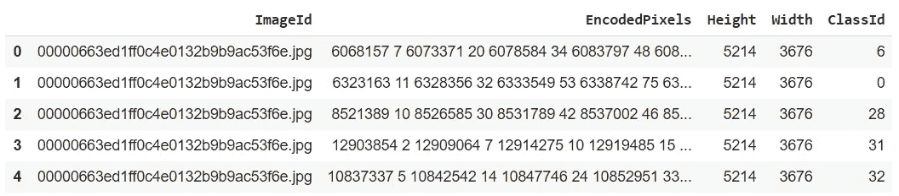

train_csv.csv

## 6.2]数据分析和预处理

## 6.2.1]计数检查

从下面我们可以看到，数据集中总共有 331213 个条目，唯一条目总数为 45195 个。在给定的图像中，我们可以有多个类，对于图像中出现的每个类，train_csv.csv 文件中都有单独的条目。

```
## Output
Total entries = 331213 
Total Unique entries = 45195
```

## 6.2.2]高度或宽度不匹配

在同一个图像中，可能有多个类和这些类的多个实例。通过理解给定 csv 文件的格式，我们知道每个实例都有一个条目。因此，图像将出现在多行中。在解码编码的掩模像素信息期间，图像的高度和宽度信息是重要的。我们必须确保 csv 文件中图像的每个条目都具有相同的高度和宽度，以验证我们将 df 与其自身连接(自连接)。

```
## Output
Mismatched count = 0 0
```

## 6.2.3]删除属性

正如描述文件中提到的，一些时尚产品类别有属性，我们将不使用属性。我们发现只有 3%的条目有属性，为了提高准确性，最好删除这些条目。

## 6.2.4]移除小面具

在分割任务中，如果感兴趣对象的掩模太小，那么模型为这样小的对象产生精确的掩模就变得非常困难。因此，我们决定从 csv 文件中删除这样的小对象条目，首先计算每个感兴趣对象的像素数。如果某个对象的像素数非常小，比如说 50，我们将从 csv 文件中删除该对象条目。上面讨论的逻辑的代码在下面给出，

```
## Output
Min Count = 1 Max Count = 18407571 
Length Before = 319714 
Length After = 316338
```

## 6.2.5]像素计数的方框图

从图中我们可以看到，雨伞、夹克、毛衣、连体裤等类别的平均像素数非常高，而铆钉、皮带扣、拉链等类别的平均像素数非常低。毛衣、雨伞、斗篷、羊毛衫的 pixel_count 变化很大，这意味着它们在数据集影像中以不同的尺寸出现，而眼镜、手表、手套、暖腿套等类别的变化较小，这意味着它们通常具有几乎相同的尺寸。我们可以看到，像袖子、鞋子这样的类别出现的次数非常多，而像暖腿套、披肩、雨伞、丝带这样的类别出现的次数非常少。在培训过程中，我们可能会面临数据不平衡的问题。我们已经删除了一些计数低于某个阈值的类别。

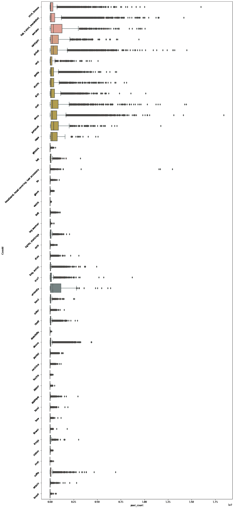

类别上的方框图

## 复制掩码

让我们分析重复的条目，如果对于相同的图像和相同的 classid，它具有相同的掩码，我们认为条目是重复的，使用这个定义，我们没有得到任何重复的条目。接下来，我们考虑如果对于同一图像，相同的掩码用于不同的类，则掩码被破坏。然后删除损坏的条目。

```
## Output
Lenght before duplicates = 316338 
Length After dropping = 316338 
Lenght after dropping corrupted masks 315328
```

## 6.2.7]移除不常见的类别

有些种类在印度很少见。因此，这些类别不会给在印度经营的电子零售公司带来太多利润，因此我选择删除这些类别，如衣领、翻领、袖子等类别将被删除，实例数少于某个阈值的类别也将被删除。

## 6.2.8]完整性检查:

在 csv 文件中，图像中的每个实例都有一个条目。我们将在图像层面上工作。因此，我为每个图像和相关的类实例信息创建了一个条目，关于属于特定实例的像素的信息存储为 list(mask_list 和 classids_list)。

> 对于处理后的任何图像，掩码列表的长度必须等于类别 id 列表的长度。

```
## Output
Length Before 43561 
Length After 43561
```

> *B]编码掩码列表基于像素数。让我们通过一个例子来理解这一点。假设你有一个大小为(256 * 256)的图像，在展平这个图像后，我们将得到一个像素数范围从 1 到(256 * 256)的一维数组。展平可以通过两种方式完成:“C”语言中使用的“C”类型(按行)或 FORTRAN(按列)语言中使用的“F”类型，他们使用了“F”类型展平。使用该像素编号，为每个实例建立编码掩码列表，例如，假设鞋子实例出现在像素编号[1，2，3，4，89，90，91]处，则编码掩码列表将是[1，4，89，3]，意味着从像素编号 1 到 1+(4–1)和像素编号 89 到 89 + (3 -1)鞋子实例出现。我们可以看到，编码掩码中的像素数必须小于或等于(256 * 256，即 65536)，这将是我们的下一个健全性检查。对于一些图像，如果我们有超出定义范围的像素数，那么我们声明该图像是损坏的，我们将删除它。*

```
## Output
CORRUPTED IMAGES COUNT = 0
```

## 磁盘限制

因为数据集中大约有 45000 幅图像。不可能将整个文件解压到 google colab 的磁盘中。我们需要选择图像的子集来处理。我们决定只下载 50%的图像。在选择过程中，我们将拍摄更多不同类别的图像。例如，如果我们有一个包含 15 个不同类别的图像 1 和一个包含 4 个不同类别的图像 2，显然将选择图像 1，因为它是一个信息丰富的图像。

## 6.2.10]最终类别分布可视化

我们可以在图中看到，除了鞋类，数据集中每个类的实例数量几乎相同。做 EDA 后数据集中类的分布是平衡的。我们做得很好，埃达。

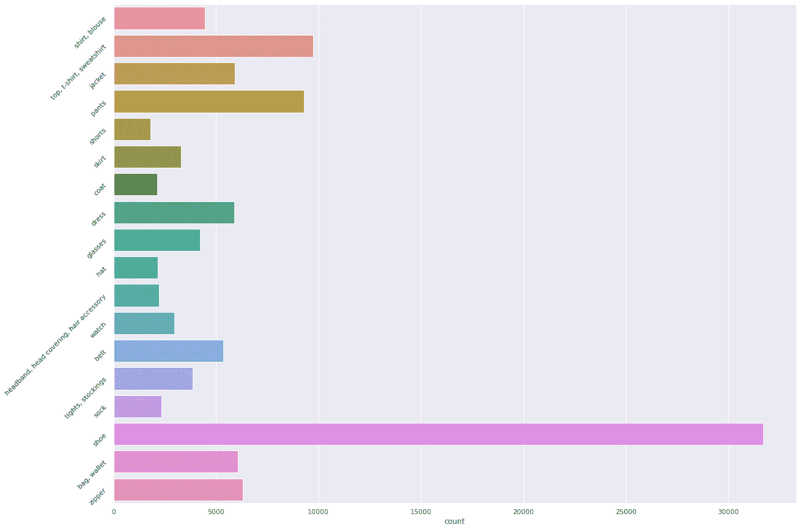

类别分布

## 6.2.11]掩模的可视化

此时，我们已经将映像下载到了驱动器中。我们将从驱动器中选取五个图像，并绘制它们的掩码，以了解我们所拥有的数据。


面具

## 不同的扩充

增强技术有助于摆脱过拟合和数据集非常小的问题，通常深度学习模型需要大量的训练数据。扩充技术对给定图像执行不同的操作，例如翻转、旋转、平移、裁剪和将变换后的图像添加到现有数据集中，因此增加了数据集的大小。当模型在可见数据上表现良好，但在不可见数据上表现很差时，我们说模型过拟合。过拟合也意味着像人类一样记住整个训练数据。如果你记住了答案而没有理解，如果考试中的问题与你记住的问题解决方案变化很小，那么你将无法解决它。深度学习模型也会发生同样的事情。发现过度拟合的一种方法是在训练期间的每个时期绘制训练和验证精度。还有其他技术，例如正则化、迁移学习、退出来处理过拟合问题，但是在图像数据集情况下，增强技术优于所有这些技术。

增强技术将失真的图像添加到数据集，复杂的深度学习模型倾向于记住/过度拟合，但是对于失真的图像，模型很难记住训练数据，并且在试图记住失真/复杂的数据时，模型最终作为副产品更加一般化。增强技术使模型更加稳健。当应用增强时，我们应该记住增强是安全的，这里安全意味着增强后的信息被保留，即，即使在应用变换之后，关于遮罩/标签的信息也不能变得太失真，以至于即使人类也不能提取/理解它，忘记 DL 模型分类或分割它，当这样的情况发生时。不同的增强是可用的，我们将讨论其中的几个，我们将在我们的数据集上使用，我们将讨论的事情，如选择的转换将如何帮助我们，我们如何消除一些不会改善我们的模型的转换，以及在选择不同增强技术可用的良好 hypermeter 之后的输入。

## A]翻转

水平轴翻转比垂直轴翻转更常见。我们将在模型的训练中应用它。我们可以看到，即使在改造后，它并没有成为难以识别的鞋子，眼镜，所以，这种改造是安全的。

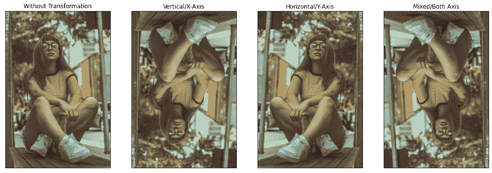

轻弹

## B]旋转

旋转放大通过在 1 到 359 之间的轴上向右或向左旋转图像来完成。旋转增强的安全性在很大程度上取决于旋转度参数。诸如 1°和 20°之间的轻微旋转是有用的，但是随着旋转度数的增加，增强后的信息可能无法保留。在这里，我们正在执行无损旋转，图像的空间维度可能不会保留，但可以使用调整大小功能恢复。

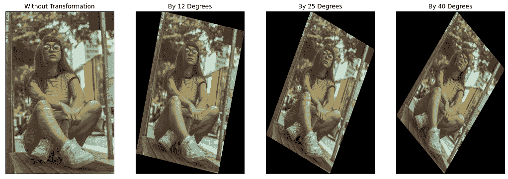

旋转

## C]翻译

平移意味着将图像向左、向右、向上或向下移动，这在处理数据中的位置偏差的各种问题中很有用。在数据中，可以看到时装模特在左、中、右、上、下等位置摆姿势，因此这种转换的图像已经存在于我们的数据集中，我们将避免这种转换。

## D]色彩空间转换

通常数字图像有三个颜色通道[ R，G，B]，也有其他通道，如[ B，G，R ]，[灰度]通道图像。不需要在通道中只存储颜色信息，有时我们可以在这些通道中存储诸如色调、饱和度、值等信息。通过简单的矩阵运算，可以很容易地控制通道值，以增加或减少图像的亮度。这种方法解决了由于模型中的光照效应而引入/增加的偏差。应用这种增强的最快方法是关闭一个通道(使所有值为零)或增加或减少某个通道的像素值。

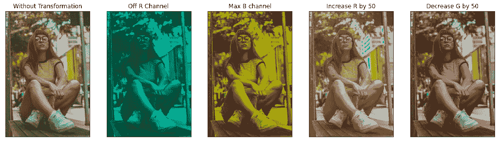

彩色空间

## E]内核过滤器

核滤波器是图像处理中一种非常流行的技术，用于锐化和模糊图像。这些滤波器的工作原理是，使用高斯模糊滤波器在图像上滑动 n × n 矩阵，这将产生更模糊的图像，或者使用高对比度垂直或水平边缘滤波器，这将产生沿边缘更清晰的图像。直观地说，模糊图像以增加数据可能会在测试过程中导致更高的运动模糊阻力。此外，锐化图像以增加数据可能会封装感兴趣对象的更多细节。

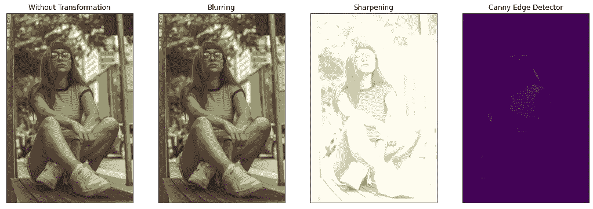

内核过滤器

## 随机擦除

这种增强技术是受退出正则化技术的启发。我们可以实时获得一幅图像，其中感兴趣的对象由于遮挡而部分出现。如果您将这些图像添加到数据集，它将使模型学习预测标签，而不需要对象的整个部分。我们在数据集中发现了许多鞋子、眼镜、裙子、上衣被遮挡的图像，因此我们的数据集内部存在这种转换图像，因此我们决定不应用这种转换。

## 6.3]训练掩码 RCNN

Mask RCNN 是一种深度神经网络，旨在解决机器学习或计算机视觉中的实例分割问题。掩模 R-CNN 通过添加用于预测每个感兴趣区域(RoI)上的分割掩模的分支，与用于分类和边界框回归的现有分支并行，扩展了更快的 R-CNN。


屏蔽 RCNN

掩模分支是应用于每个 RoI 的小 FCN，以像素到像素的方式预测分割掩模。Mask R-CNN 易于实现和训练，具有更快的 R-CNN 框架，有利于各种灵活的架构设计。此外，掩码分支仅增加了少量的计算开销，实现了快速系统和快速实验。屏蔽 RCNN 有两个阶段。首先，它基于输入图像生成关于可能存在物体的区域的建议。其次，在第一阶段的基础上，预测物体的类别，细化包围盒，生成物体像素级的掩膜。两级都连接到主干结构。

为了训练模型，我首先从这个链接[https://www.github.com/matterport/Mask_RCNN.git](https://www.github.com/matterport/Mask_RCNN.git)克隆了模型，然后创建了数据管道。我把训练分成三部分。对于迁移学习，我使用了 coco_weights 我从这个链接下载了权重[https://github . com/matter port/Mask _ RCNN/releases/download/v 2.0/Mask _ RCNN _ coco . H5](https://github.com/matterport/Mask_RCNN/releases/download/v2.0/mask_rcnn_coco.h5)。您可以在下面看到掩码 RCNN 的输出

```
First Stage I LR = 0.0001 Epoch = 8
Second Stage II LR = 0.002, Epoch = 12
Third LR Stage III LR = 0.001, Epoch = 15
```

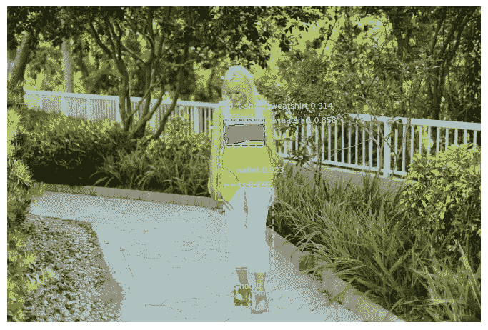

屏蔽 RCNN 输出

## 6.4]绩效指标

性能指标是用来评估模型可用性的工具。如果表现不好，这个模型就没有那么多用处。我们将使用“平均精度”作为性能指标。首先，我们想到了使用 IOU 分数，但后来意识到 IOU 分数对于测量实例分割任务的性能没有用。让我们通过示例来理解它，假设我们有 modelX，它只识别对象的较大实例，如果我们使用 IOU 作为度量，我们将获得相当高的度量分数，因为较大对象的 IOU 将主导该度量，因此，这里我们没有办法知道我们的模型是否在做有用的事情。


为了处理上述问题，我们将使用平均精度度量，如何计算 Map 是一个复杂的过程，让我们一步步理解它。在 Map 中，我们考虑不同的 IOU 阈值，例如[0.5，0.55，0.6，…0.95]。在每个阈值，我们计算 TP、FP 和 FN，并使用这些 TP、FP 和 FN 计算每个阈值的精度分数，然后使用公式*精度分数= [TP / (TP + FP + FN)]* 。我们知道什么是 TP，FP，FN，在两类分类问题的上下文中，类似的东西我们将在这里定义，但在图像的上下文中。我将用*猫=正类= 1，狗=负类= 0* 的类比来解释它们。

> *TP 表示模型正确得到对象 IOU > =阈值【预测为猫的猫】*
> 
> *FP 情况发生在 IOU <阈值时，也包括 IOU = 0 的情况。IOU 不佳的可能原因是，试图将属于 dog 类的像素分类为 cat 类像素的模型将 dog 预测为 cat，因此 IOU 不佳。【狗预测为猫或 IOU <阈值】*
> 
> *FN 表示模型未能检测出图像中存在的类别。也就是说，图像中猫像素的模型没有产生任何遮罩，所有的猫像素都被预测为狗像素。【猫预测为狗】*

它解决了我们在 IOU 分数的情况下所面临的问题，因为在某个阈值处，条件“IOU >阈值”将为假，FP 将增加，这将惩罚模型，模型将被迫在较小的对象上表现良好。首先，我想到将某个图像的特定类的预测实例和实际实例的掩码合并到单个图像中，然后在合并的实际掩码和预测掩码之间计算 IOU。当度量超过不同阈值以获得 TP、FP 和 FN 值时，将使用该计算的 IOU，但是该方法有缺陷。为了理解这个缺陷，让我们采用两个模型 model1 和 model2，如下图所示，两个模型的 IOU 相同，因此地图得分也相同，但是如果你凭直觉思考，你会立即知道 model2 比 model1 好得多，但是使用这种方法，我们无法从 model2 中识别 model1。

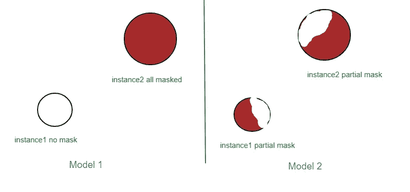

上述问题可以通过分别保持对象的每个实例的预测和实际遮罩来解决。因此，在这个方案中，例如，对于模型 2 的上述情况，我们将有 4 个单独的 IOU，每个 IOU 减少/增加以下三个值 TPs、FPs 或 FNs 中的任何一个，这与之前的方法不同，在之前的方法中，每个对象都有一个 IOU。使用这种方法，如果你计算地图，你会得到更高的模型 2 的地图分数。

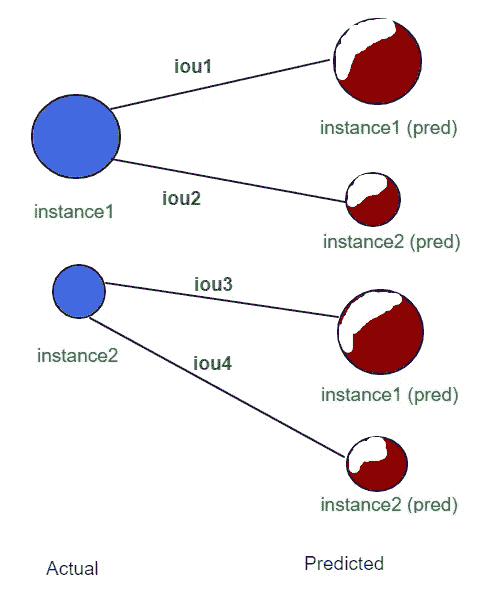

最后，我用下面的算法来计算地图得分。在解释该算法时，我们采用了三个类别(类别 1、类别 2、类别 3)和三个阈值(阈值 1、阈值 2、阈值 3 ),如流程图所示，

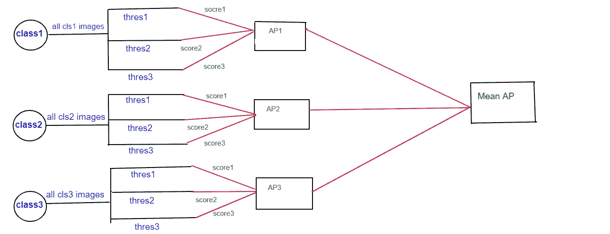

地图流程图

```
scoreX = (TP/(TP + FP +FN)) 
AP = (score1 + score2 + score3)/ 3 
Mean AP (Map) = (AP1 + AP2 + AP3) / 3
```

```
Map Score = 0.2058516045212801
```

在下一部分中，我们将训练三联体模型并进行预测。以下是第二部分的链接:[https://ranveersachin 143 . medium . com/buy-me-that-look-f 003 e 855 c 692](https://ranveersachin143.medium.com/buy-me-that-look-f003e855c692)

Github 链接代码:[https://github.com/ranveerkln/Fashion_Git](https://github.com/ranveerkln/Fashion_Git)

# 11.轮廓

[](https://www.linkedin.com/in/sachin-ranveer-b37360166/) [## Sachin Ranveer -数据工程师-Nykaa.com | LinkedIn

### 经验丰富的数据工程师，有在互联网行业工作的经历。熟练掌握亚马逊红移…

www.linkedin.com](https://www.linkedin.com/in/sachin-ranveer-b37360166/) [](https://github.com/ranveerkln) [## ranveerkln -概述

### 4 月 5 月 6 月 7 月 8 月 9 月 10 月 11 月 12 月 1 月 2 月 3 月 4 月 1 日星期三 Fri ranveerkln 在此期间没有任何活动。已创建…

github.com](https://github.com/ranveerkln) 

# 12.参考

[](https://www.appliedaicourse.com/) [## 应用课程

### 我们知道转行是多么具有挑战性。我们的应用人工智能/机器学习课程被设计为整体学习…

www.appliedaicourse.com](https://www.appliedaicourse.com/) 

[(124)讲座— 31 图像分割— III — YouTube](http://(124) Lecture - 31 Image Segmentation - III - YouTube)

【towardsdatascience.com 中型

[GitHub—sanku-lib/Image _ Triplet _ Loss:使用三重损失的图像相似度](https://github.com/sanku-lib/image_triplet_loss)

[https://arxiv.org/pdf/1703.06870.pdf](https://arxiv.org/pdf/1703.06870.pdf)