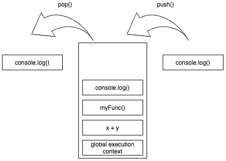
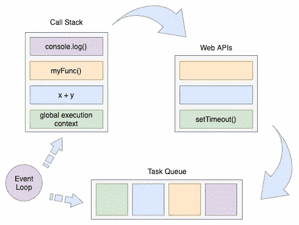

# 初级作者，初学者:调用栈和异步 Javascript

> 原文：<https://medium.com/nerd-for-tech/by-a-junior-for-a-beginner-the-call-stack-async-javascript-21a8f469974f?source=collection_archive---------4----------------------->

## 了解如何逐句通过异步代码


费伦茨·阿尔马西在 [Unsplash](https://unsplash.com/s/photos/javascript?utm_source=unsplash&utm_medium=referral&utm_content=creditCopyText) 上的照片

开始学习 Javascript 的旅程可能会令人望而生畏。有这么多东西要学，从哪里开始呢？有很多教程和指南会告诉你所有的基本语法。如何编写变量，不同种类的数据结构，如何定义和调用函数，等等。很早的时候，你就开始理解如何“单步执行”几行代码。不管你是否在你的旅程中遇到过它，毫无疑问你已经下意识地开始理解*同步* Javascript。

同步代码——最简单的形式——从上到下按顺序执行。当然，其中也有细微差别，比如*提升*，但那是另一篇文章了。由同步代码引起的副作用——有时被用作一个特性——被称为*阻塞*。每条语句必须等到前一条语句执行完毕后才能开始执行。这是因为 Javascript 是一种单线程语言。

单线程可能听起来像一个可怕的技术术语，但我们将揭开它的含义。作为其中的一部分，我们还将看看调用堆栈，以及 Javascript 如何在同步和异步代码的执行中使用堆栈数据结构。我知道你现在在想什么:“哇，我还以为这是一篇关于初学者理解异步 JS 的文章呢？”准确地说！坚持和我在一起；我们将把它们结合成一个巨大的蝴蝶结来帮助你开始理解异步 Javascript。


照片由[水晶球](https://unsplash.com/@cberdion?utm_source=unsplash&utm_medium=referral&utm_content=creditCopyText)在 [Unsplash](https://unsplash.com/s/photos/deck-of-cards?utm_source=unsplash&utm_medium=referral&utm_content=creditCopyText) 上拍摄

# 一摞？…纸牌？

现在你可能很好奇*单线程*和*调用栈*是什么意思。事实证明，它们关系非常密切，就像 PB & J 一样。让我们开始吧！

堆栈抽象数据结构在 1946 年首次出现在计算机科学领域，这要归功于二战中著名的轴心国“英格玛机器”的破译者艾伦·图灵。在 Javascript 中，同步执行的代码队列被称为 c *all 堆栈。*确切地说，它最好被想象成桌子上的一叠卡片。堆栈中的第一张牌很快被埋在底部，调用堆栈一张一张地增长。



调用堆栈可视化

但是，当我们需要拿到卡在底部或底部附近的卡片时，会发生什么呢？我们需要先移除顶部的所有东西才能拿到它！这种方法通常被描述为 ***先进后出*** 。每条语句都按顺序被推到堆栈的顶部。相反，每条语句在完成后都从上至下弹出堆栈。那么单线程呢？本质上，单线程是 Javascript 只有一个调用栈的一种奇特说法。没什么好怕的！

# 异步语言还是同步语言？

***“什么？我以为 Javascript 是异步的？”***……算是吧。你看，年轻的学徒，Javascript 有它自己的绝地思维技巧。不要忘记我们已经了解到它是一种单线程语言，Javascript 确实也能够异步执行代码。

除了调用栈，还要对 ***事件循环*** 有个大概的了解。分解 Javascript 如何处理异步代码的最基本方法是查看四个部分:

*   调用栈
*   Web APIs
*   任务排队
*   事件循环。

之前，我们讨论了如何使用同步代码将每个代码语句推入调用堆栈或从调用堆栈弹出。记住这一点，当遇到像`setTimeout` ( [MDN doc](https://developer.mozilla.org/en-US/docs/Web/API/WindowOrWorkerGlobalScope/setTimeout) )这样的异步函数时会发生什么？您知道 Javascript 是单线程的，所以您可能倾向于认为因为函数已经被调用，所以它会在主线程中立即开始计算超时。我不会责怪你这种想法，这正是我们教你如何一步一步完成代码的！但是，如果是这种情况，剩余的代码将被阻止执行，直到超时完成。

# 欢迎来到事件循环

事件循环是 Javascript 能够执行异步代码的核心。许多人提到事件循环，好像它是运行代码本身的东西，但这实际上有点误解。更具体地说，它监视调用堆栈和任务队列。



调用堆栈、web APIs、任务队列和事件循环流程

让我们暂时回到我们的`setTimeout`例子。我们讨论了如果它在单线程中运行，它将如何阻塞后续代码，直到定时器到期。实际上，Javascript 读取对`setTimeout`的调用，并且——因为它是一个异步函数——将它交给 web API。Web APIs 内置在浏览器中，可以做很多事情，其中之一就是在自己的调用栈中处理 Javascript 的异步函数！

一旦 web API 接收到我们的`setTimeout`，计时器就开始运行。在一个异步函数完成之后——在这个场景中，我们的定时器到期了——在 web API 中，它被移动到任务队列中。这是事件循环工作的地方。它不断地检查调用栈是否为空，如果是，我们的`setTimeout`回调函数现在被推到执行它的栈中。

# 重述和吸收

咻，那是一阵旋风！现在你已经学会了一堆技术术语，希望你能意识到这没什么可怕的。异步 Javascript 最终归结为什么？一个圆圈。让我们应用我们的循环并完成一个代码示例:

在示例代码中，我们总共有 5 个字符串被记录到控制台。从**线开始 5**(`setTimeout → timer1`)**线 11**(`setTimeout → timer2`)**线 17**(`1st log`)**线 19**(`2nd log`)**线 21** ( `3rd log`)。如果您不熟悉`Date.now()`呼叫，请不要担心，只要知道我们正在使用它们来获取当前时间。计时器还将打印自脚本启动以来的总时间(以秒为单位)。您认为所有代码运行完毕后，控制台会是什么样子？


照片由[扎克·卢塞罗](https://unsplash.com/@zlucerophoto?utm_source=medium&utm_medium=referral)在 [Unsplash](https://unsplash.com?utm_source=medium&utm_medium=referral) 上拍摄

准备好你的答案了吗？太棒了。让我们逐句通过代码来理解结果:

```
> 1st log              // line 17
> 2nd log              // line 19
> 3rd log              // line 21
> timer2 : 2 sec       // line 11
> timer1 : 3 sec       // line 5
```

我们遇到的第一个语句在第 **5** 行。这是我们的`setTimeout`，它会将`‘timer1’`记录到控制台。然而，我们知道这是一个异步函数，因此它被放在 web API 中，开始 3 秒倒计时。

与此同时，我们的代码继续运行其单线程，并在第 **11** 行遇到另一个 setTimeout。这个会打印`‘timer2’`。当它倒计时 2 秒时，它再次被放入 web API 中。

接下来的三个语句都是简单的同步控制台日志，位于第 **17** 、 **19** 和 **21** 行。第 17 行被添加到堆栈中并立即执行，将`‘1st log’`打印到控制台。随后，19 号线和 21 号线跟进；将`‘2nd log’`和`‘3rd log’`按顺序打印到控制台。

现在是变得棘手的部分！我们如何处理在 web API 中倒数的那两个`setTimeout`?我们知道在定时器超时后，它们被推到任务队列中，但是按什么顺序呢？

答案比你想象的要简单:`timer2`的延迟比`timer1`短，所以它先被添加到任务队列中！大约又过了一秒钟，`timer1`也被添加到任务队列中。自始至终，事件循环都在监视 Javascript 调用堆栈，等待其同步代码完成和堆栈清空。接下来，`timer2`从任务队列传递到调用堆栈并执行。它将`‘timer2 : 2 sec’`记录到控制台，一秒钟后将`‘timer1: 3 sec’`记录到控制台。就是这样！很简单，对吧？

# 旅程的结束

下面是一些关于单步执行异步代码的要点:

1.  所有同步代码都在事件循环将任何语句从任务队列推送到调用堆栈之前执行。
2.  在 web API 中，两个计时器同时运行它们的倒计时。
3.  如果我们的代码长得多，那么`setTimeout`延迟可能会超过我们设置的 2 或 3 秒。这完全依赖于我们的主线程完成代码的时间。为此，最好将`setTimeout`延迟视为*至少 2000ms* 或*至少 3000ms* (使用我们的示例代码作为参考)，而不是延迟等于总时间。这是因为`setTimeout`回调只有在满足两个条件后才被执行:首先，web API 中的定时器已经到期。第二，调用栈是空的。如果主线程花了 10 秒来执行它的代码，我们的`setTimeout`回调将会等待比我们设置的延迟更长的时间。这意味着它们将在 10 秒的主线程代码完成后立即执行。

这个话题还有很多我们没有涉及到的内容，这确实是一个令人着迷的讨论。最终，我希望你远离这种进入调用堆栈、事件循环和异步代码的感觉，甚至少一点焦虑和不知所措。归根结底，它仍然只是 Javascript。

# 参考

*   [异步 Javascript &事件循环从头开始](https://www.youtube.com/watch?v=8zKuNo4ay8E)，*阿克谢塞尼*
*   [JavaScript 中什么是事件循环？](https://www.educative.io/edpresso/what-is-an-event-loop-in-javascript)， *Edpresso 团队*
*   [JavaScript 调用栈介绍](https://www.javascripttutorial.net/javascript-call-stack/)，*JavaScript 教程*
*   [堆栈(抽象数据类型)](https://en.wikipedia.org/wiki/Stack_(abstract_data_type)#History)，*维基百科*