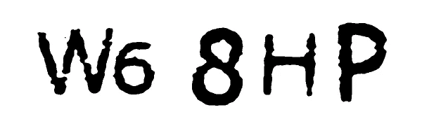

# 使用 2Captcha 和 Javascript 绕过验证码

> 原文：<https://medium.com/nerd-for-tech/bypassing-captcha-using-2captcha-and-javascript-e4cc387024e6?source=collection_archive---------1----------------------->

# 什么是验证码？

任何使用过互联网的人都一定知道验证码。它是一种在线服务，知道一个人正在交互或浏览互联网，而不是一个机器人或自动化软件。

CAPTCHA 代表完全自动化的公共图灵测试，用于区分计算机和人类。

如果没有验证码，将很难确定机器人执行的自动操作和人类执行的手动操作之间的差异。

我们看到的最流行的验证码之一要求用户输入如下图所示的字母。



但是，近年来验证码已经以各种方式发展，比如识别图片识别、小游戏、复选框选择等等。

随着新的方式，验证码已经成为最令人沮丧和无效的用户界面功能之一。让我们探索旨在解决这个问题的 2 章。

# 什么是 2Captcha？

[2Captcha](https://2captcha.com/) 是一款人工图像和验证码识别服务。该服务旨在帮助用户快速准确地解决验证码。

2Captcha 也付钱给你解决验证码问题。验证码通常在图像中包含扭曲的文本。用户需要输入答案才能访问网站，并验证他们不是机器人。

2Captcha 解决各种验证码。为了将 2Captcha 集成到我们的系统中，我们可以在这里引用它们的 API 端点。不同类型的验证码，如 hCaptcha、reCaptcha、图像验证码、普通验证码、文本验证码，可以使用 2Captcha 服务进行解析。我们可以在这里查阅支持的验证码的完整列表[。](https://2captcha.com/2captcha-api#solving_captchas)

# 集成 2 个章节

## 帐户设置

*   如果您已经在 2Captcha 上注册，我们可以跳过这一步。如果没有，我们需要首先使用这个[链接](https://2captcha.com/auth/register)在 2Captcha 上注册。
*   一旦注册，我们将获得我们的 API 密钥，它将在集成过程中使用。要使用 2Captcha 的服务，我们需要为 Captcha 请求和处理支付象征性的费用。

## 使用 2Captcha 和 Javascript 解析 Captcha

我们将为此集成建立一个新项目。打开您选择的 IDE 并创建一个新的应用程序`solve-captcha`。

1.  **在 Mac 上，我们可以在终端中执行下面的命令。**

```
mkdir solve-captchacd solve-captchanpm init -y
```

在最后一步中，我们已经使用`npm`初始化了项目，它直接添加了`package.json`。

**2。创建 index.js 文件**

然后，我们将一个新文件`index.js`添加到项目的根目录中。在终端上，我们可以执行

```
touch index.js
```

**3。安装 2 个 Captcha 和 Axios**

我们可以在这里找到 2Captcha [的 Javascript 包。Axios 是一个基于 Promise 的 HTTP 客户端，用于浏览器和 node.js。](https://www.npmjs.com/package/2captcha)

我们可以执行下面的命令将这两个包添加到我们的应用程序中。

```
npm i 2captcha axios
```

**4。geeksforgeeks.org reCAPTCHA**

当新用户在他们的平台上注册时，很少有网站使用验证码。在我们的集成示例中，我们将使用 [geeksforgeeks](https://www.geeksforgeeks.org/) 。

geekforgeeks 的注册模式就是这样出现的。


如上所述，geeksforgeeks 使用 Google 的 reCAPTCHA 来识别真正的用户。Google reCAPTCHA 集成是使用 sitekey 完成的。我们可以在 [2Captcha 的 API 文档](https://2captcha.com/2captcha-api#solving_recaptchav2_new)中找到 geeksforgeeks sitekey。

简而言之，我们搜索[**www.google.com/recaptcha/api2/anchor**](http://www.google.com/recaptcha/api2/anchor)或者找到 **data-sitekey** 参数。我们复制链接的 **k** 参数的值或者复制 **data-sitekey** 参数的值。geeksforgeeks 的 sitekey 是**6 lexf 0 suaaaaadiqjz 9 BMI srqpritl-tWYDSfWa**。

**5。Javascript 和 2Captcha**

我们开始向 index.js 文件添加更改。

```
const axios = require("axios");
const captcha = require("2captcha");
var FormData = require("form-data");
```

a.我们首先需要必要的集成包。

*   axios 用于 HTTP 请求。
*   2captcha 用于求解 captcha。
*   FormData 用于提交注册数据。

b.使用 2Captcha API 键初始化 2Captcha 解算器

```
const solver = new captcha.Solver("<Our API key>");
```

c.使用 2Captcha 求解器方法求解 Google 的 reCAPTCHA。

2captcha 包公开了一个方法 **recaptcha** 来解析 recaptcha。它期望将 **sitekey** 和 **pageurl** 作为参数。

```
const { data } = await solver.recaptcha(
  "6LexF0sUAAAAADiQjz9BMiSrqplrItl-tWYDSfWa",
  "https://www.geeksforgeeks.org/"
);
```

d.提交表单数据。

一旦我们得到了 **recaptcha** 方法响应，我们就创建表单数据来将必要的数据传递给 geeksforgeeks auth 端点。

```
var bodyFormData = new FormData();
bodyFormData.append("reqType", "Register");
bodyFormData.append("email", "12sam1234@sam.co");
bodyFormData.append("pass", "sam1234!@#$");
bodyFormData.append("institute", "big data");
bodyFormData.append("g-recaptcha-response", data);
bodyFormData.append("to", "https://auth.geeksforgeeks.org/?to=https://www.geeksforgeeks.org/");
```

我们使用 Axios 提交上面生成的表单数据。

```
axios({
  method: "post",
  url: "https://auth.geeksforgeeks.org/auth.php",
  data: bodyFormData,
  headers: {
    "Content-Type": "application/x-www-form-urlencoded",
    "Accept": "application/json, text/javascript, */*; q=0.01"
  },
})
.then(function (response) {
  console.log("In success");
  console.log(response.data);
})
.catch(function (response) {
  console.log("In failure");
  console.log(response);
});
```

整个 index.js 文件如下所示:

```
const axios = require("axios");
const captcha = require("2captcha");
var FormData = require('form-data');const solver = new captcha.Solver("<My API key>");const bypassWebsiteCaptcha = async () => {
  console.log("Initiate captcha process"); try {
    const { data } = await solver.recaptcha(
      "6LexF0sUAAAAADiQjz9BMiSrqplrItl-tWYDSfWa",
      "https://www.geeksforgeeks.org/"
    ); var bodyFormData = new FormData();
    bodyFormData.append("reqType", "Register");
    bodyFormData.append("email", "12sam1234@sam.co");
    bodyFormData.append("pass", "sam1234!@#$");
    bodyFormData.append("institute", "big data");
    bodyFormData.append("g-recaptcha-response", data);
    bodyFormData.append("to", "https://auth.geeksforgeeks.org/?to=https://www.geeksforgeeks.org/"); axios({
      method: "post",
      url: "https://auth.geeksforgeeks.org/auth.php",
      data: bodyFormData,
      headers: { "Content-Type": "application/x-www-form-urlencoded", "Accept": "application/json, text/javascript, */*; q=0.01" },
    })
    .then(function (response) {
      console.log("In success");
      console.log(response.data);
    })
    .catch(function (response) {
      console.log("In failure");
      console.log(response);
    });
  } catch (err) {
    console.log("In catch");
    console.log(err);
  }
};bypassWebsiteCaptcha();
```

**注**

我们在**尝试中添加了步骤 5.c 和 5.d..抓住**挡块。

e.**执行 index.js**

运行以下命令并验证响应

```
node index
```

我们的响应应该如下所示:

```
Alkeshs-MacBook-Pro:solve-captcha alkeshghorpade$ node index
Initiate captcha process
In success
{"extra":"<div class=\"alert alert-info\">An email has been sent to your given address. Please click the link in the mail to continue.<\/div>","code":2000}
```

这意味着我们已经成功绕过了验证码。这里的我们可以参考全代码库[。](https://github.com/alkesh26/solve-captcha)

**注**

很多像 geekforgeeks 这样的网站都在使用验证码。这个博客仅用于教育目的。请不要将以上步骤用于任何恶意行为。

*原载于*[*https://alkeshghorpade . me*](https://alkeshghorpade.me/post/solving-captcha-using-javascript-and-2Captcha)*。*