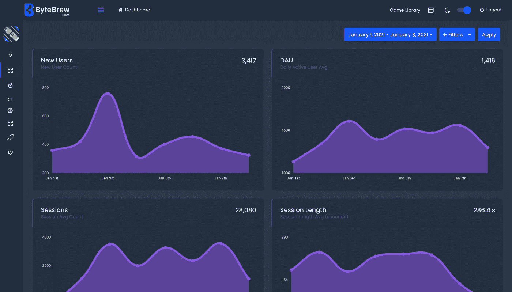
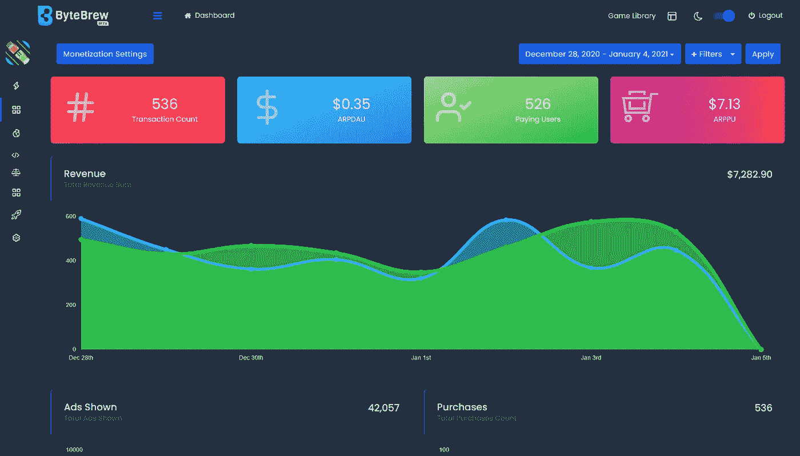
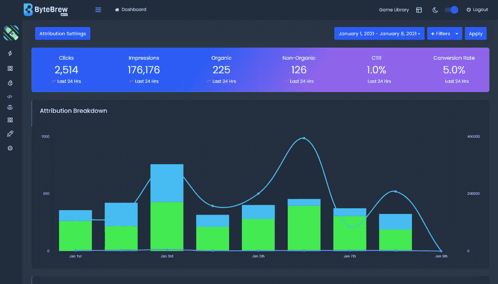

# ByteBrew——手机游戏分析及更多

> 原文：<https://medium.com/nerd-for-tech/bytebrew-analytics-more-for-mobile-games-a21d91b1758?source=collection_archive---------20----------------------->

演职员表:ByteBrew

今天的文章将与我通常写的文章有所不同。我想分享一个即将推出的解决方案，名为 [ByteBrew](https://bytebrew.io/?disccid=gamedevhq#Pre_Register_Section) 。

[ByteBrew](https://bytebrew.io/?disccid=gamedevhq#Pre_Register_Section) 是面向手机游戏开发者的一体化解决方案。他们的平台通过实时玩家分析&货币化跟踪、实时运营工具和广告归属，免费为您提供发展游戏的一切。他们在一个容易集成的 SDK 中提供了所有这些和更多，可用于所有主要平台和引擎，包括 Unity、Unreal、Godot 等。

# 分析学

演职员表:ByteBrew

他们的分析系统通过自定义日期和类别过滤，跟踪从保留到地理分布的最重要的参与度指标。

利用自定义事件跟踪来填充任何应用内事件的用户进度数据。

使用漏斗进展跟踪，创建高级玩家漏斗，查看玩家如何、何时以及在何处与您的游戏互动。

# 货币铸造

演职员表:ByteBrew

开发者可以跟踪所有的应用内购买事件和订阅，通过 [ByteBrew 的](https://bytebrew.io/?disccid=gamedevhq#Pre_Register_Section)收据验证系统防止欺诈来衡量重要的货币化指标。

[ByteBrew](https://bytebrew.io/?disccid=gamedevhq#Pre_Register_Section) 与行业顶级移动广告中介平台相集成，可在游戏瀑布的任何网络中跟踪您的移动广告货币化指标。

通过他们的货币化数据，他们的平台通过将每一个货币化垂直整合到你的游戏中来分析真实的 LTV 和 ROAS 值。

# 远程配置和 A/B 测试

通过远程配置，您可以远程配置游戏中的关键游戏价值，如游戏难度、轮换商店物品甚至广告位置，而无需向应用商店提交新版本。

通过 A/B 测试，您可以创建用户级变量来测试参与度指标的差异，如保留率、ARPDAU 和会话时长。

# 归因跟踪

演职员表:ByteBrew

[ByteBrew 的](https://bytebrew.io/?disccid=gamedevhq#Pre_Register_Section)属性追踪与业内顶级移动广告网络相集成。

他们的归因仪表板测量每个活跃广告网络的营销指标，显示跟踪的活动事件的实时可视细分。

你甚至可以利用 ByteBrew 仪表盘中的 SKAdnetwork 为你的 iOS 游戏创建高级转换设置。

ByteBrew 最近宣布了他们即将到来的开放测试版的预注册，并希望像您这样的游戏开发者能够预注册，以免费获得您需要的工具来帮助您发展您的游戏，而不必支付和实现多个昂贵的平台。在 [ByteBrew](https://bytebrew.io/?disccid=gamedevhq#Pre_Register_Section) 的人本身就是游戏开发者，所以他们知道推出和发展手机游戏所涉及的困难和成本。

# 预注册

如果你想早点进入并测试他们的 SDK，那么查看[预注册](https://bytebrew.io/?disccid=gamedevhq#Pre_Register_Section)链接并注册。

***免责声明:*** 请注意，这不是 ByteBrew 的付费推广，而是我在整篇文章中分享的一个代销商链接。