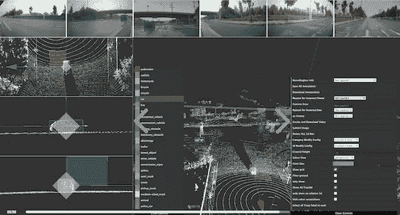

# 字节桥推出 2D-3D 传感器融合标签服务，为自动驾驶行业提供可扩展的训练数据

> 原文：<https://medium.com/nerd-for-tech/bytebridge-launches-2d-3d-sensor-fusion-labeling-service-providing-scalable-training-data-for-b134af5a7985?source=collection_archive---------0----------------------->

2022 年 3 月，技术领先的数据标注服务提供商[字节桥](https://tinyurl.com/2p8nwtyc)宣布正式推出 2D-3D 传感器融合标注服务。注释平台已经运行了一段时间。该公司与汽车制造商、自动驾驶解决方案开发商、政府机构下属的科研中心等开展了合作。标注项目包括定制的三维点云标注和 2D-三维传感器融合标注。

更多阅读:[全球首个移动 3D 点云数据标注服务](https://tinyurl.com/53n48jbz)

字节桥 2D-三维传感器融合标签项目

据称，无人驾驶汽车的关键技术主要包括环境感知、定位导航、规划决策、车辆控制。传感器承担感知工作。自动驾驶汽车可以通过车载摄像头、激光雷达、毫米波雷达等传感器感知周围环境，实时监控变化，并根据获得的信息做出决策，形成安全合理的路径规划。

在传感器中，激光雷达通过多束激光束的高频发射获得的高清 3D 点云可用于检测几乎所有的障碍物，甚至在夜间。因此，激光雷达已经被广泛认为是实现无人驾驶不可或缺的传感器。

几年前，64 多线激光雷达的价格高达 10 万美元，让很多车企望而却步。随着技术的不断进步，激光雷达的成本已经大大降低，价格有望在短期内降到几百美元。因此国内外车企也逐渐应用了激光雷达。

最近，大众汽车首席执行官赫伯特·迪斯(Herbert Diess)分享了一些关于激光雷达重要作用的想法，“激光雷达技术仍然很昂贵，但今天它是为 360°相机系统提供冗余感知的唯一方法，这是必须的。安全在自动驾驶中确实至关重要。对于 3 级驾驶，你需要多余的感知。”

不同的传感器具有不同的探测距离、分辨率、方向性等精度参数，在物体探测、识别、环境适应性等方面各有优劣。例如，激光雷达极易受到恶劣天气的影响。为了获得最佳的检测结果，专家们开始融合来自多个传感器的数据。

根据 Mordor intelligence 的报告，传感器融合市场在 2020 年的价值为 47.2 亿美元，预计到 2026 年将达到 136.2 亿美元，2021-2026 年期间的 CAGR 增长率为 19.2%。

由于传感器融合解决方案已成为无人驾驶技术的主流选择，数据标注项目也相应地从单独的 2D 图像和 3D 点云标注转移到 2D-3D 传感器融合标注。

对于 2D-3D 融合标注项目，定制化程度相对较高。而且一段时间后，标注要求会因为算法的改进而改变。在这种情况下，需要有一个具有丰富项目经验的数据标注团队的协助，来塑造数据需求，获得更适合场景的训练数据。

作为一家技术型公司，[字节桥](https://tinyurl.com/4y7tke22)拥有丰富的研发资源，可以灵活配置贴标流程，满足特殊贴标类型的需求，及时响应贴标需求的变化，定制在线数据交付和审核。此外，ByteBridge 还提供了实时仪表盘和 3D 点云 QC 工具。客户可以实时管理项目并提交同步反馈。

根据世界经济论坛的数据，到 2035 年，预计每年将售出超过 1200 万辆完全自动驾驶汽车，自动驾驶汽车将占全球汽车市场的 25%。

数据的规模是自动驾驶的必然基础。标注越准确，算法性能越好。另外，关于数据偏差，需要找到有问题的场景，补充足够的数据。

[字节桥](https://tinyurl.com/2p8nwtyc)目前与国内外传统整车厂商和知名算法公司合作，提供一站式数据标注解决方案，赋能自动驾驶行业。

**遗言**

如果需要数据标注和采集服务，请看 [bytebridge.io](https://tinyurl.com/2p8nwtyc)

如果您想看一下**现场演示**，请随时联系我们:support@bytebridge.io