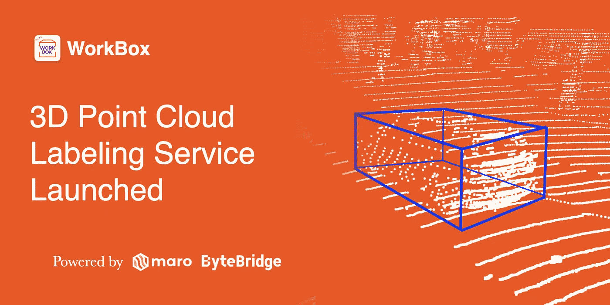
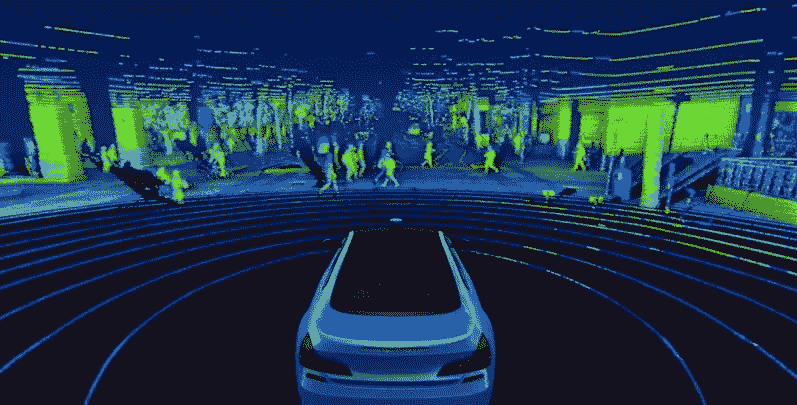

# 字节桥推出全球首个移动 3D 点云数据标注服务

> 原文：<https://medium.com/nerd-for-tech/bytebridge-launches-worlds-first-mobile-3d-point-cloud-data-labeling-service-cf87a4ed2067?source=collection_archive---------8----------------------->

ByteBridge:人力和 ML 驱动的数据标签 SaaS 平台

## [在 Maro 区块链上运营的数据标注服务 ByteBridge](https://tinyurl.com/4x4xe2td) ，推出了全球首个基于移动端的 3D 点云数据标注服务。

ByteBridge 3D 点云注释操作

# 三维点云

3D 点云是分布在 3D 空间中的大量点(数据点)的协作，其中数据点是通过激光雷达等传感器收集的。传感器发射光，并计算光反射回传感器以产生每个点所需的时间。收集到的点被合成，呈现出一个完整的图像，如下图所示。

来源:威力登激光雷达

3D 点云广泛用于建筑、航空航天、驾驶、交通、医疗设备、常规消费品等领域的产品开发和分析。预计未来潜在的使用案例和应用只会增加。

# 3D 点云市场规模

在众多利用 3D 点云的行业中，自动驾驶行业将 3D 点云视为其最重要的组成部分之一……据估计，2020 年自动驾驶行业的市场规模约为 71 亿美元。预计年增长率为 41.0%，预计到 2035 年市场规模约为 11.204 亿美元。

自动驾驶行业的核心技术是传感器，其中最广泛使用的传感器之一激光雷达自 2020 年以来已显示出 113%的增长率。预计到 2025 年，激光雷达的市场价值将达到 17 亿美元。随着传感器的显著增长，3D 点云的应用也有望扩大。 **参考:** [**三重毕马威**](https://assets.kpmg/content/dam/kpmg/kr/pdf/2020/kr-insight69-new-changes-in-autonomous-driving-20200211.pdf) **，** [**国税局格罗博**](https://www.irsglobal.com/bbs/rwdboard/14427)

# 结束

将你的数据标注任务外包给 [ByteBridge](https://tinyurl.com/4x4xe2td) ，你可以更便宜更快的获得高质量的 ML 训练数据集！

*   无需信用卡的免费试用:您可以快速获得样品结果，检查输出，并直接向我们的项目经理反馈。
*   100%人工验证
*   透明和标准定价:[有明确的定价](https://www.bytebridge.io/#/?module=price)(含人工成本)

为什么不试一试呢？

来源:Brian CHEONG(字节桥首席执行官)

## 相关文章:

1 [什么是激光雷达，什么是 3D 点云？](https://tinyurl.com/w3kav68k)

2 [无人驾驶汽车的量产需要多少时间，还要等多久？](https://tinyurl.com/2rvr7kk8)

3[3D 点云在自动驾驶领域的应用](https://tinyurl.com/yxfms9en)

4[2021 年自动驾驶对 3D 点云数据需求增长的三大原因](https://tinyurl.com/4t73drh8)