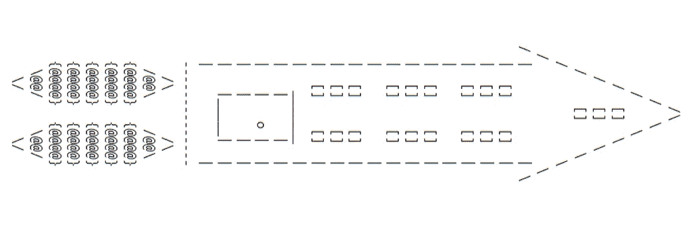

# C++20 三向比较运算符—确保向后兼容性:第 8 部分

> 原文：<https://medium.com/nerd-for-tech/c-20-three-way-comparison-operator-ensure-backward-compatibility-part-8-cae984559a08?source=collection_archive---------4----------------------->

在本系列教程的第一部分到第七部分中，我们学习了如何使用 C++20 的三向比较运算符。在本系列教程的这一部分中，我们将探讨在使用 C++20 之前用三向比较运算符构建的对象时的兼容性问题，以及如何解决这些问题

# 1.介绍