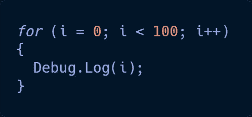

# C#基础:循环第 1 部分

> 原文：<https://medium.com/nerd-for-tech/c-basics-loops-part-1-1f942f1db83d?source=collection_archive---------24----------------------->

什么是循环？

它们是代码中的一组指令，只要特定的环境存在或被破坏，它们就会被反复重复。

在 C#中，有四种类型的循环。

**为循环**

**Foreach 循环**

**While 循环**

**Do While 循环**

现在，让我们把注意力集中在循环的**上。**

循环的**将遵循一组指令，并不断重复，直到完成。这对于计算数值非常有用，不管是计时器还是同时对一群敌人造成伤害。**

这是一个如何编写 for 循环的示例:

这基本上是告诉控制台从 0 数到 99。“I”只是一个变量，从技术上讲，它可以被命名为任何名称，但通常“I”用于循环。我们告诉循环，我们想从零开始；只要不到 100，我们就想去；我们希望每次增加 1。有了这些指令，我们就有了一个基本的计数系统。如果您想要间隔计数，您可以使用“yield return new waitforseconds”并给出数字之间的时间值。不要忘了尝试这些说明，看看你能去哪里！