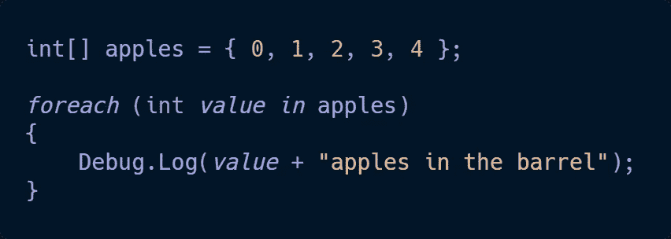

# C#基础知识:循环第 2 部分

> 原文：<https://medium.com/nerd-for-tech/c-basics-loops-part-2-18b3aa02d03a?source=collection_archive---------17----------------------->

C#中第二种常见的循环类型是 **foreach** 循环。

假设我们收集了一批苹果。每个苹果代表它自己的值，而桶代表苹果所在的组(或者用编码术语来说，是一个数组/列表)。使用 foreach 循环，我们可以一次将一段代码应用于每一个苹果，但是如果我们只想做一部分，我们需要使用 for 循环。for 循环也可以对桶本身进行更改，而 foreach 循环只能接触苹果。foreach 循环也不能像 for 循环那样访问苹果的*索引*值。

听起来 for 循环可以做很多 foreach 循环做不到的事情，那为什么还要为后者费心呢？

foreach 循环得到了简化。它不需要像 for 循环那样多的分类，所以如果您只需要对一组值进行简单的处理，那么尝试一下 foreach 循环将是一个明智的决定。

下面是一个 **foreach 循环**的语法:

