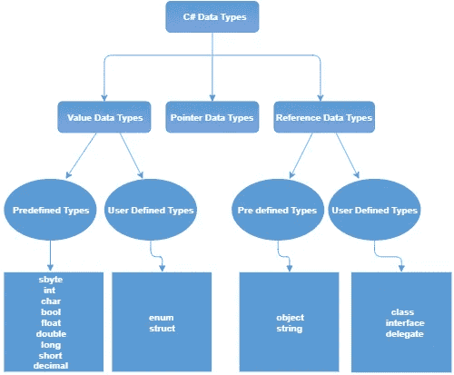
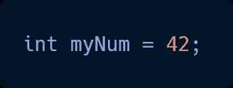
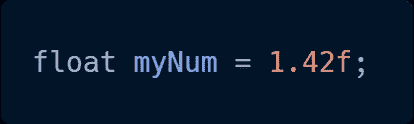
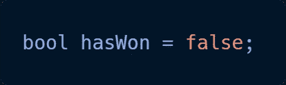
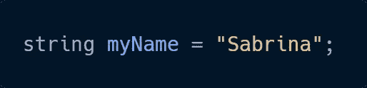
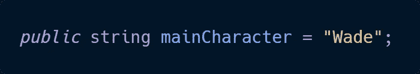

# C#基础知识第 1 部分:变量

> 原文：<https://medium.com/nerd-for-tech/c-basics-part-1-the-variable-cac0a2277254?source=collection_archive---------10----------------------->

变量是事物变化的一部分。在代码中，变量可以指的是像一个角色的名字，一件武器，一个能量，或者一个分数，等等。

任何可以保存信息的东西都可以是变量。

在处理脚本时，变量的一个重要组成部分可以决定谁有权访问代码。设置一个公共变量允许任何人看到它，如果连接到 Unity，这个变量可以直接从 Unity 程序中访问。另一方面，Private 只允许脚本本身接触变量。

你怎么知道该用哪一个？

如果信息需要被玩家或者其他人看到，变量应该被设置为 public。这可能包括健康、分数、魔法点数、库存等。

但是任何在后台运行的看不见的变量，有时这可能是敌人造成的伤害，可以设置为私有。最终，这是基于个案的。永远想想你想让每个人都能接触到什么。

下一个组件涉及**数据类型。**

让我们来分解一些更常见的数据类型:

**Int:** 这个用于整数。任何具有-2，147，483，648 到 2，147，483，647 之间的整数值的变量都可以使用 int 数据类型。

**Float:** 和 int 一样，这是用于数字的；但是，float 可以存储最多 6 或 7 位小数。(还要记住在您使用的号码末尾键入“f”。)

**布尔值:**这是预先确定的，因为布尔值只能是两种情况之一:真或假。在游戏中，变量可能是一个是或否的问题，用于检查是否满足某个条件。这种数据类型可能在“如果-那么”场景中有很多用处，我们将在后面的文章中讨论。

**String:** 用于包含一个以上字符的变量(如 type，而非 games)。这可以用于创建消息、显示姓名等。文字确实需要引用。

另外，不要忘记，每个变量都需要一个*名*。

你可能已经注意到了，有一种通过*猎取*来命名的常见方法。这意味着如果名称包含多个单词，第一个单词不大写，而后面的单词大写。这使得在检查代码时容易阅读并且高效。

变量不一定是常数。一旦一个变量被赋值，这个值可以通过脚本的代码重新赋值，或者当变量被公开时通过 Unity 重新赋值。假设你正在制作的游戏的主角被正式命名为 Wade，但是你希望玩家能够自己命名。

这里，变量“mainCharacter”被赋值为“Wade”作为公共变量，通过一系列的编码步骤，我们将在下一篇文章中讨论，玩家可以重新分配变量。所以 mainCharacter 将等于玩家选择的名字，这个值将被使用，除非变量被重新赋值。

这是变量的基础，它们会在任何编码中持续存在。还有许多类型可以满足特定的需求，但是它们应该遵循相同的基本原则。祝编码愉快！