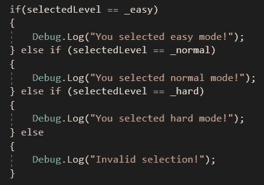
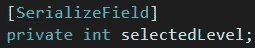
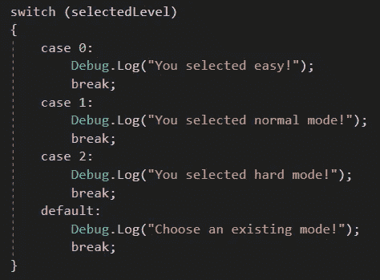

# C#基础:Switch 语句

> 原文：<https://medium.com/nerd-for-tech/c-basics-switch-statements-c8f303c2d98c?source=collection_archive---------25----------------------->

**什么是开关语句？**

像“if”语句一样，switch 语句根据多个值检查一个条件；然而，如果我们要检查单个条件的多个值，使用 switch 语句会更有效、更简洁。

例如，我们可以为级别选择器编写一个 if/else 语句。它看起来会像这样:

它可以工作，但是它使用了大量的代码，占用了大量的空间。想象一下，如果您有一个条件，必须检查更多的值，那么代码的长度将变得令人望而生畏，并占用大量时间。

我们可以创建一个叫做 cases with switch 语句的东西，其中每个值被分配一个数字。如果该数字与大小写匹配，则执行适当的代码。

我们只需要一个变量来表示条件，而不是每个模式都有一个变量。

对比一下看起来有多干净:

“打破；”对代码来说是必要的，以便知道该案例何时结束，下一个案例何时开始。您还可以有一个默认情况，如果弹出的值与该条件下的任何现有值都不匹配，则执行代码。

这是 switch 语句的基础！