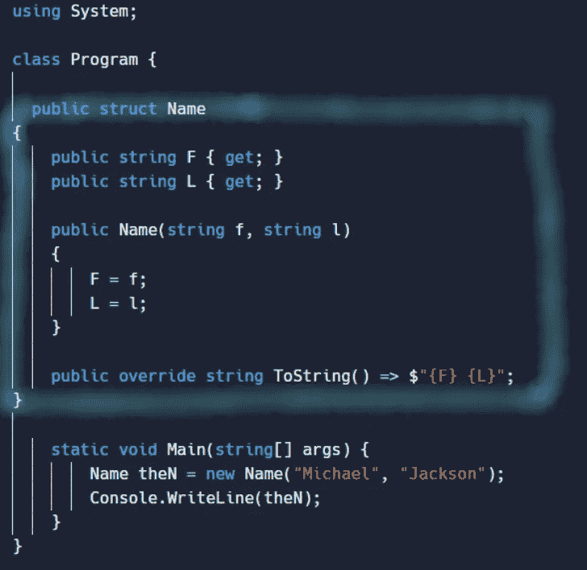
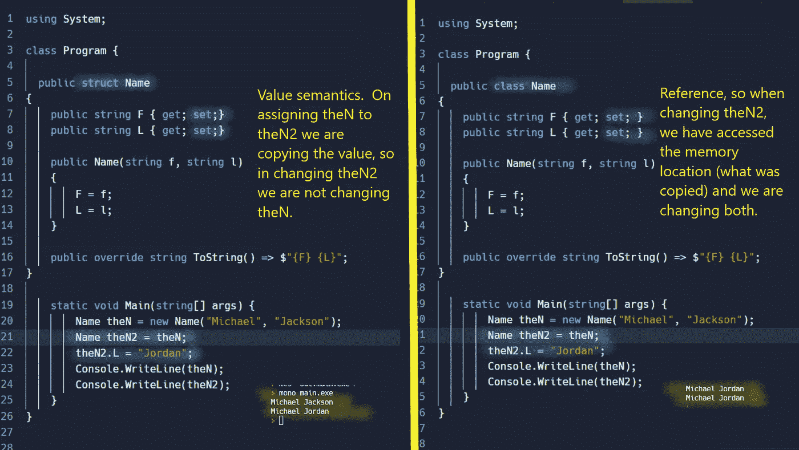

# C# —类、结构、记录、记录结构

> 原文：<https://medium.com/nerd-for-tech/c-class-struct-record-record-struct-d3b21c57d9bb?source=collection_archive---------0----------------------->

我想是时候花时间去了解他们了。这是我的尝试。

我不打算详细介绍类，因为它们是最常用的，本文主要解释什么时候使用结构就足够了，以及记录的用途。

# 1-概述如何定义它们，无示例。

从 MS 文档中。

**记录:**一个**类或结构**，它为使用**数据模型**提供了**特殊语法** **和行为**。

**类:**一个构造，通过将其他类型、方法和事件的变量组合在一起，使您能够创建自己的自定义类型。

**Struct** :一种值类型，通常用于封装相关变量的**小组**。

**Record Struct** :与 Record 类似的定义，但是当您想要指定它将用于一个 Struct，而不是一个类。

这很好，但还不够。在引入记录之前，我们有类和结构。我们先去那些吧。

# 2 —结构(struct)与类(class)。

让我们看看这里的一个结构，它看起来很像一个类:



从 MS 文档中:

**结构类型有*值语义*。类类型有*引用语义*** 。这听起来很重要:-)。



# 2 —关于结构的更多信息

同样来自 MS docs:通常，您使用结构类型来设计以数据为中心的小型类型，这些类型提供很少或不提供行为。因为结构类型具有值语义，我们建议您定义*不可变的*结构类型。

为了使上面的结构不可变，我们可以对它使用 readonly(c# 7.3 及更高版本)。

```
public **readonly** struct Name
```

如果我们这样做，我们需要删除设置；从 F 和 L 属性中，它可以编译。一旦我们这样做了，我们就可以在构造函数中为结构的只读字段/属性设置值，但仅此而已。这意味着，即使是结构的成员也不能更改这些字段/属性。

注意:如果我们有一个引用类型，比如一个列表，它将是不可变的，因为你不能给它赋值，但是它可以改变自己，因为列表可以添加和删除元素。

我们的结构现在可以是:

```
public **readonly** struct Name
{
     public string F { get;  }
     public string L { get;  }
     **public List<string> SomeList { get; }** public Name(string f, string l)
     {
          F = f;
          L = l;
          SomeList = new List<string>();
          SomeList.Add("how");
          SomeList.Add("are");
          SomeList.Add("you");
          SomeList.Add("?");
     }
     public void ChangeList()
     {
          **this.SomeList.Add("??");**
     }
     public override string ToString() => $"{F} {L}";
}
```

在结构上调用 ChangeList 方法将起作用。？将被添加。然而，试图用同样的方法给 SomeList 分配一个新的列表会产生编译错误。

从 C#9 开始，属性也可以获得一个 **init 访问器**。仅 init 设置器仅在对象构造期间为属性或索引器元素赋值。这增强了不变性，因此一旦对象被初始化，就不能再被更改。

在上面的结构中，我们可以

```
public string? F { get; **init**; }
public string? L { get; **init**; }
//the constructor has not changed//then create it like
Name theN = new Name { F**=** "Michael", L**=** "Jackson"};
```

从 C#10 开始，你也可以拥有一个结构，并创建它的副本，只改变一些字段。举个例子更简单。使用前面的结构，您可以这样创建 3 个实例:

```
Name name1 = new Name { F= "Michael", L= "Jackson"};
Name name2 = name1 **with** { L = "Jordan" };
Name name3 = name1 **with** { L = "Knight" };Console.WriteLine(name1);
Console.WriteLine(name2);
Console.WriteLine(name3);Michael Jackson
Michael Jordan
Michael Knight
```

# 3 —关于结构和类的更多信息。

如前所述，结构是值类型，类是引用类型。除此之外:

结构类型不能从其他类或结构类型继承，也不能是类的基。但是，结构类型可以实现接口。

不能在结构类型中声明终结器。

在 C# 11 之前，结构类型的构造函数必须初始化该类型的所有实例字段。

在 C# 10 之前，你不能声明一个无参数的构造函数。

在 C# 10 之前，不能在声明时初始化实例字段或属性。

结构通过值传递，尽管您可以使用 ref 来指示它应该通过引用传递。

从 7.2 开始，您还可以用 ref 关键字将结构声明为引用类型，但是它们的局限性超出了本文的范围。

# 4 —记录与类和结构

记录给了类和结构一点额外的东西。如果你打算在一个类中使用它们，就用 record 代替 class，如果你打算在结构中使用它们，就用“record struct”。也可以做“记录类”但没必要。

您可以使用位置参数来创建和实例化具有**不可变**属性的类型。

```
public record Name( string first, string second );//create with
Name name = new Name("Michael", "Jackson");Console.WriteLine(name); //Name { first = Michael, second = Jackson }
```

在类中使用引用相等的相同方法和操作符(如[O](https://docs.microsoft.com/en-us/dotnet/api/system.object.equals#system-object-equals(system-object))objects。Equals(Object)和==)，表示记录中的 [v](https://docs.microsoft.com/en-us/dotnet/csharp/language-reference/builtin-types/record#value-equality) 值相等。

```
public **record** RecordName( string first, string second );public **class** ClassName
{
   public string First { get; set; }
   public string Last { get; set; }
   public ClassName(string first, string last)
   {
      this.First = first;
      this.Last = last;
   }
}
...
RecordName recName1 = new RecordName("Michael", "Jackson");
RecordName recName2 = new RecordName("Michael", "Jackson");
ClassName className1 = new ClassName("Michael", "Jackson");
ClassName className2 = new ClassName("Michael", "Jackson");
Console.WriteLine(recName1.Equals(recName2));//**True**
Console.WriteLine(className1.Equals(className2));//**False**
```

您可以将**和表达式**一起用于记录(就像上面显示的以 c# 10 开始的结构)

记录的`ToString`方法创建一个格式化的字符串，显示对象的类型名及其所有公共属性的名称和值。

一个记录可以从另一个记录继承。记录不能从类继承，类也不能从记录继承(对于记录类类型，而不是记录结构类型)。

```
public **abstract record** RecordName
{
   public string **First** { get; set; }
   public string **Last** { get; set; }
}
public record **RecordNameDer : RecordName**
{
   public string **Middle** { get; set; }
}
...
RecordNameDer name = new RecordNameDer  { **First** = "Michael", **Last** = "Jackson", **Middle** = "Joseph" };//or could have also done
public abstract **record RecordName**(string First,string Last);
public **record RecordNameDer**(string First, string Last, string Middle) **: RecordName**(First, Last);
...
RecordNameDer name = new RecordNameDer ("Michael", "Jackson","Joseph" );
```

记录结构与结构的不同之处在于编译器综合了相等的方法和`ToString`。编译器为位置记录结构合成了一个`Deconstruct`方法。

要使两个记录变量相等，**运行时类型必须相等**。这意味着，如果我们有 2 个不同类型的记录，它们来自同一个库，并且有相同的字段和值，它们仍然是不同的，因为它们的类型不一样。

# 5 —那么什么时候使用记录呢？

当您的数据不应该更改时，记录很有用。记录可以从其他记录中继承，所以当你不需要一个完整的类来满足你的需求时，拥有这样的记录是很好的。

当您希望基于值对实例进行比较时，记录也很方便。

至于结构和类，结构更受限制，所以当你需要继承和引用比较时，你可能需要类。

到目前为止就是这样。希望能再清楚一点。