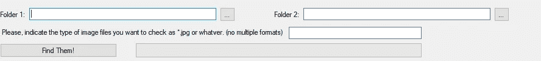
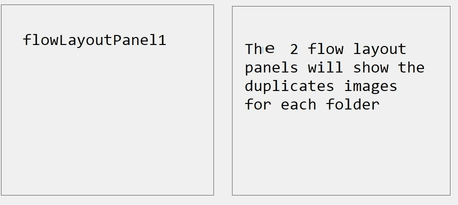

# C# —比较图像，以便删除重复的图像

> 原文：<https://medium.com/nerd-for-tech/c-compare-images-so-you-can-remove-duplicates-b313539b68cb?source=collection_archive---------6----------------------->

你会一直保存你的照片吗？会仔细查看日期以确保你不会一遍又一遍地保存同样的照片吗？我知道，但不知何故，我总是在不同的文件夹里找到相同的照片。这让我抓狂，所以我决定写一个小工具来找到它们。

这些是守则的要点。

您可以输入想要比较的两个文件夹。最初我也有它只是采取一个文件夹，并通过所有的子文件夹循环，但这可能会结束与吨的迭代，所以最好还是选择你的文件夹。



我不包括关于点击[…]按钮来获取文件夹之类的任何东西的代码，只是与图像有关的代码。

我创建这个结构只是为了跟踪图片所在的两个文件夹中的名称:

```
private struct DuplicatePicNames{
   public string nameInFolder1;
   public string nameInFolder2;
}
```

我有一个方法接受一个文件名数组，以及它们的路径。它返回重复名称的列表:

```
private List<DuplicatePicNames> findDuplicatePics(string[] originalArray1, string[] originalArray2)
```

要调用上面的方法，我们需要我们想从目录中获取的文件的类型，所以对上面方法的调用是(类型是*。jpg 或任何文件类型)。我没有任何验证，因为这只是为了让我找到它们:

```
List<DuplicatePicNames> duplicatesNamesList = this.findDuplicatePics(**Directory.GetFiles(path1, type)**, Directory.GetFiles(path2, type));
```

我将比较一个文件夹中的每张图片和另一个文件夹中的每张图片，因此进度条的最大值将是:

```
this.progressBar1.Maximum = originalArray1.Count() * originalArray2.Count();
this.progressBar1.Value = 1;
this.progressBar1.Step = 1;
```

对于循环，我有这个。我不得不添加使用，因为否则没有足够的内存来处理这个。

```
foreach (string filenameMain in originalArray1)
{
   **using** (imageMain = getImageForFile(filenameMain))
   {
      foreach (string filenameAux in originalArray2)
```

getImageForFile 只是从传入的文件名中获取图像:

```
private Bitmap getImageForFile(string filename)
{
   Bitmap image = new Bitmap(filename);
   return image;
}
```

对于外部 For each 的每次迭代，更新进度栏:

```
this.progressBar1.PerformStep();
```

之后，在内部 foreach 中再次使用 using:

```
using (imageAux = getImageForFile(filenameAux))
```

一旦我们有了两张图片，一张来自第一个文件夹，一张来自第二个文件夹，比较就开始了！

```
//if the sizes are not the same they are not the same image
if (imageMain.Width != imageAux.Width || imageMain.Height != imageAux.Height)
{
   imageIsDifferent = true;
   continue;
}
```

比较的一种方法是遍历图像的像素，如果其中一个像素不同，您就知道它们不是同一个图像:

```
for (int i = 0; i < imageMain.Width; i++)
{
   for (int j = 0; j < imageMain.Height; j++)
   {
      imgMain_ref = imageMain.GetPixel(i, j).ToString();
      imgAux_ref = imageAux.GetPixel(i, j).ToString();
      //if one pixel is different we know this one is not duplicate
      if (imgMain_ref != imgAux_ref)
      {
         imageIsDifferent = true;
         break;
      }
   }
}
```

C#还提供了一个带有一些很酷的方法的 **ImageComparer** ，当我有了一些这样的例子时，我会更新这篇文章。[图像比较器。](https://docs.microsoft.com/en-us/dotnet/api/microsoft.visualstudio.testtools.uitesting.imagecomparer.compare?view=visualstudiosdk-2017)

我将相同的图片添加到重复图片名称列表中，如上所述，该列表包括两个文件中相同图片的名称。很多时候，只要有相同的名字就足以知道这是同一张照片，但并不总是如此。另外，我可能重命名了一些图片，所以不同的名称并不意味着图片是不同的。

为了显示重复的图片，我使用了这个:



首先，重置面板(请不要介意名称):

```
this.flowLayoutPanel3.Controls.Clear();this.flowLayoutPanel1.Controls.Clear();
```

接下来，我将遍历重复列表来显示它们。我创建了一个 PictureBox 来显示在面板中。我为每一个设置了一些属性，包括一个工具提示。即使你看到了，也很难在一个有大量图片的文件夹中找到一张图片，所以工具提示帮了大忙。

对于列表中的每个迭代，对第一个文件夹上的名称执行此操作，然后对第二个文件夹上的名称执行类似的操作，并将其添加到第二个面板(名为 3)。注意再次使用。

```
PictureBox pic = new PictureBox();
**using** (tmp = new Bitmap(dup.nameInFolder1))
{
   pic.Image = new Bitmap(tmp);
}pic.ClientSize = new Size(100, 100);
pic.SizeMode = PictureBoxSizeMode.Zoom;
pic.Name = dup.nameInFolder1;
ToolTip toolTip = new ToolTip();
toolTip.SetToolTip(pic, pic.Name);pic.Parent = this.flowLayoutPanel1;
```

这是两个文件夹。

对于一个文件夹，当你有一堆子目录和一堆子目录时，这需要很长时间。为此，我试着添加了一个按钮，这样用户在浏览了几个文件夹后必须点击下一步。我在这里添加这个只是作为一般信息，因为，如果你有许多子文件夹，它仍然是不切实际的。

在你的班级上创建这个:

```
TaskCompletionSource<bool> _tcs;
```

然后，在您希望等待用户输入的每一点上，都应该这样:

```
this._tcs = new TaskCompletionSource<bool>();
await this._tcs.Task;
```

然后在按钮上，用户将按下指示代码可以继续，你有这个:

```
this._tcs.SetResult(true);
```

这将使 await 等待完成，之后的代码将继续执行。

任何想法请让我知道。我想我已经摆脱了我的副本，但我肯定我最终会有新的:-)

感谢阅读！