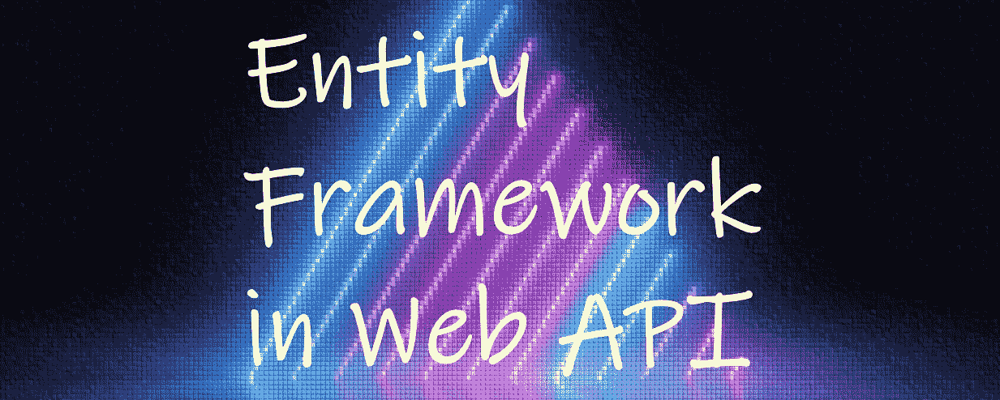
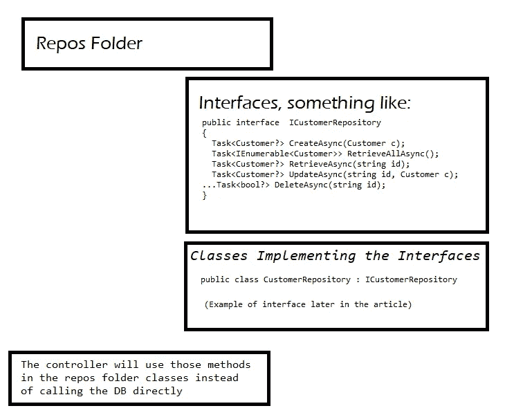

# C#继续实体框架代码项目— 2

> 原文：<https://medium.com/nerd-for-tech/c-continue-with-entity-framework-code-project-2-9ed21aaf34e6?source=collection_archive---------3----------------------->



这篇文章是第一篇文章的后续，所以如果你还没有阅读第一篇文章的话，请阅读第一篇。

在其他文章中，我在歌曲表的控制器中有以下代码(不检查空值或错误，保持简短):

```
[Route("api/[controller]")]//this will determine the url to call the action
[ApiController]
public class SongsController : ControllerBase
{
  private APIDbContext _dbContext;
  public SongsController(APIDbContext dbContext)
  {
   _dbContext = dbContext;
  }  

  [HttpGet] //could just name it Get
  public IEnumerable<Song> GetSongs()
  {
   return _dbContext.Songs;
  }

  [HttpGet("{id}")] 
  public Song GetSong(int id)
  {
   return _dbContext.Songs.Find(id);
  }

  //add FromBody to let it know that the data we need to add is coming 
  //from the body of the request.
  [HttpPost]
  public void PostSong([FromBody] Song song)
  {
   _dbContext.Songs.Add(song);
   _dbContext.SaveChanges();
  }

  [HttpPut("{Id}")]
  public void PutSong(int id, [FromBody] Song song)
  {
   Song s = _dbContext.Songs.Find(id);
   s.Title = song.Title;
   s.Language= song.Language;
   _dbContext.SaveChanges();
  }

  [HttpDelete("{id}")]
  public void Delete(int id)
  {
   Song s =_dbContext.Songs.Find(id);
   _dbContext.Songs.Remove(s);
   _dbContext.SaveChanges();
  }
 }
```

请注意，在上面的代码中，方法不是异步的，这是可行的，但是，您也可以使用更高效的异步代码。

如果我们想拥有异步方法，我们需要使用`async` 和`await` 关键字并返回`Task`或`Task<T>`。让我们一次看一个方法。还需要`using System.Threading.Tasks;`

这个:

```
[HttpGet] //could just name it Get
public IEnumerable<Song> GetSongs()
{
   return _dbContext.Songs;
}
```

变成这样(也将结果更改为 IActionResult，与异步更改无关):

```
public async Task<IActionResult> GetSongs()
{
   return StatusCode(StatusCodes.Status200OK, await _dbContext.Songs.ToListAsync());
}
```

类似地，代码的其余部分将像这样更改(注意，返回类型将取决于您想要返回的内容，这只是一个指南):

```
[HttpGet("{id}")] //could just name it Get
public async Task<Song> GetSong(int id)
{
   return await _dbContext.Songs.FindAsync(id);
}

//add FromBody to let it know that the data we need to add is coming from the body of the request.
[HttpPost]
public async Task<IActionResult> PostSong([FromBody] Song song)
{
  await _dbContext.Songs.AddAsync(song);
  await _dbContext.SaveChangesAsync();
  return StatusCode(StatusCodes.Status201Created);
}

[HttpPut("{Id}")]
public async Task<IActionResult> PutSong(int id, [FromBody] Song song)
{
   Song s = await _dbContext.Songs.FindAsync(id);
   s.Title = song.Title;
   s.Language= song.Language;
   _dbContext.SaveChanges();
   return StatusCode(StatusCodes.Status202Accepted);
}

[HttpDelete("{id}")]
public async Task<IActionResult> Delete(int id)
{
   Song s = await _dbContext.Songs.FindAsync(id);
   _dbContext.Songs.Remove(s);
   await  _dbContext.SaveChangesAsync();
   return StatusCode(StatusCodes.Status200OK);
}
```

注意这里没有 RemoveAsync。

# 当代码不那么简单时

我们的代码非常短，部分原因是我们什么都不检查，而且也不涉及业务逻辑。通常不会是那样的。最好有一些额外的文件来处理这个问题。这些文件将是存储库和它们的接口。在这种情况下你会。



该接口及其相关类将基于每个表。每个表仍然有它的控制器。

其中一个类的示例可能是(我考虑过删除处理 _customerMap 的部分，但是，留下它，您可以忽略它，它不是特定于概念的):

```
public class CustomerRepository : ICustomerRepository
{
   //use to cache customers
   private static ConcurrentDictionary<string, Customer> _customerMap = new ConcurrentDictionary<string, Customer>();
   //not static, should not cache
   private APIDbContext _context;

   public CustomerRepository(APIDbContext injectedContext)
   {
      this._context = injectedContext;
      if (_customerMap is null)
      {
         _customerMap = new ConcurrentDictionary<string, Customer>(this._context.Customers.ToDictionary(c => c.CustomerID));
      }
   }

   public async Task<Customer> CreateAsync(Customer c)
   {
      c.CustomerID = c.CustomerID.ToUpper();
      EntityEntry<Customer> added = await this._context.AddAsync(c);
      int affected = await this._context.SaveChangesAsync();
      if (affected == 1)
      {
         if (_customerMap == null)
         {
            return c;
         }
         else
         {
            return _customerMap.AddOrUpdate(c.CustomerID, c, UpdateCache);
         }
       }
       else
       {
          return null;
       }
   }

   public Task<IEnumerable<Customer>> RetrieveAllAsync()
   {
      return Task.FromResult(_customerMap is null ? Enumerable.Empty<Customer>() : _customerMap.Values);
   }

   public Task<Customer?> RetrieveAsync(string id)
   {
      id = id.ToUpper();
      if (_customerMap is null) return null!;
      _customerMap.TryGetValue(id, out Customer? c);
      return Task.FromResult(c);
   }

   private Customer UpdateCache(string id, Customer c)
   {
      Customer? old;
      if (_customerMap is not null)
      {
         if (_customerMap.TryGetValue(id, out old))
         {
            if (_customerMap.TryUpdate(id, c, old))
            {
               return c;
            }
         }
      }
      return null;
   }

   public async Task<Customer?> UpdateAsync(string id, Customer c)
   {
      id = id.ToUpper();
      c.CustomerID = c.CustomerID.ToUpper();
      this._context.Update(c);//we did not use Update in the previous ex.
      int affected = await this._context.SaveChangesAsync();
      if (affected == 1)
      {
         return UpdateCache(id, c);
      }
      return null;
   }

   public async Task<bool?> DeleteAsync(string id)
   {
      id = id.ToUpper();
      Customer? c = this._context.Customers.Find(id);
      if (c is null) return null;
      this._context.Remove(c);
      int affected = await this._context.SaveChangesAsync();
      if (affected == 1)
      {
         if (_customerMap is null) return null;
         return _customerMap.TryRemove(id, out c);
      }else
      {
         return null;
      }   
    }
 }
```

一旦你有了它，在你可以在控制器中使用它之前，你需要进入你的 program.cs，就像我们对 APIDbContext 所做的那样:

```
builder.Services.AddScoped<ICustomerRepository, CustomerRepository>();
```

然后在歌曲控制器、客户控制器等上:

```
...
public class CustomerController :ControllerBase
{
   private readonly ICustomerRepository repo;
   public CustomerController(ICustomerRepository repo)
   {
      this.repo = repo;
   }

    [HttpGet]
    [ProducesResponseType(200, Type = typeof(IEnumerable<Customer>))]
    public async Task<IEnumerable<Customer>> GetCustomers(string country)
    {
       if (string.IsNullOrEmpty(country) || string.IsNullOrWhiteSpace(country))
       {
          return await repo.RetrieveAllAsync();
       }            
       else 
       {
          return (await repo.RetrieveAllAsync()).Where( c => c.Country == country);
       }
     }
...
```

# 当您需要多个 Get(或任何其他动作)时

如果你有两个 HttpGet 方法，你会得到一个错误，因为代码不知道使用哪一个。您需要创建第二个方法，以便它有一个不同的路径。

你会有这个:

```
[HttpGet("{id}")] //could just name it Get
public async Task<Song> GetSong(int id)
{
   return await _dbContext.Songs.FindAsync(id);
}
```

您现在可以添加类似这样的内容:

```
[HttpGet("[action]/{id}")]
public async Task<Song> GetSomeOtherName(int id)
{
   return await _dbContext.Songs.FindAsync(id);
}
```

它的 url 应该是:`localhostOrWhateverServer/api/songs/GetSomeOtherName/1`

/api，因为这是控制器已经设置好的(`[Route(“api/[controller]”)`)。

# 带 EF 的 Linq

用 EF 获取数据的时候可以用 linq。我只举几个例子。

```
//get only the songs that have id>4 and don't get all cols, just id and lang
public async Task<IActionResult> GetSongs()
  {
   var myList = await (from s in _dbContext.Songs
       where s.Id > 4
       select new
       {
        id = s.Id,
        lang = s.Language
       }).ToListAsync();                      

   return StatusCode(StatusCodes.Status200OK, myList);
  }
```

结果是:

```
[
    {
        "id": 5,
        "lang": "Russian"
    },
    {
        "id": 6,
        "lang": "Portuguese"
    },
    {
        "id": 7,
        "lang": "Valencian"
    },
    {
        "id": 8,
        "lang": "Arabic"
    }
]
```

如果您有歌曲，并且您还有一个将每首歌曲链接到歌曲所在国家列表的表，那么您可以在获得歌曲时获得这些国家，代码类似于下面的代码。

请记住，为了能够拥有他们国家的歌曲，您需要这样的代码:

在 DbContext 类中，除了 Songs DbSet 之外，还需要 countries。它应该与表名相匹配:public `DbSet<SongAndCountry> SongAndCountries { get; set; }`

在 Song.cs 本身，`public ICollection<SongAndCountry> SongAndCountries { get; set; }`

然后在 SongController.cs 中，您可以获得带有特定 id 的歌曲以及它们各自的国家，如下所示:

`var myList = await (_dbContext.Songs.**Where(s => s.Id == 3**).**Include**(c => c.SongAndCountries).ToListAsync());`

与上面类似，但是多了一个过滤器，您可以:

```
IQueryable<Category>? categories = db.Categories?.Include(c => c.Products.Where(p => p.cost < 50));

IQueryable<Product>? products = db.Products?.Where(p => EF.Functions.Like(p.ProductName, "Ch%"));
```

# 页式算法

假设我们希望用户能够告诉我们他/她想要什么页面，以及每页有多少条记录(这是在我们不想同时发送所有记录时使用的)。

我们可以获取一个 pgNum 和一个 pgSize(比如每页 10 条记录)，然后我们会用

`Songs.**Skip**( (pgNum -1) * pgSize).**Take**(pgSize)`

到目前为止就是这样。