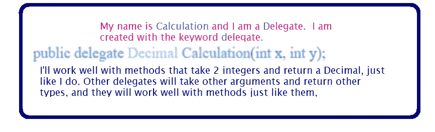
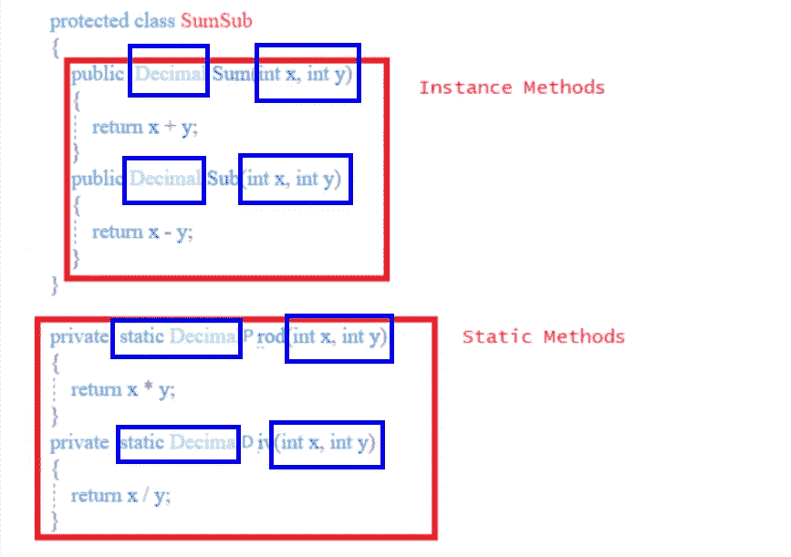
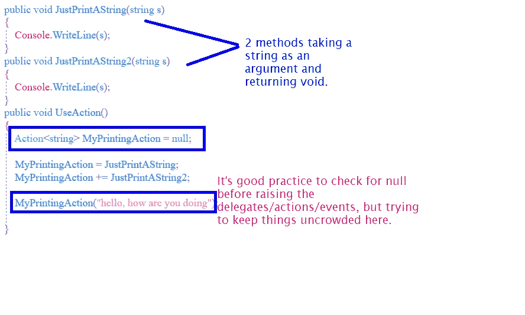
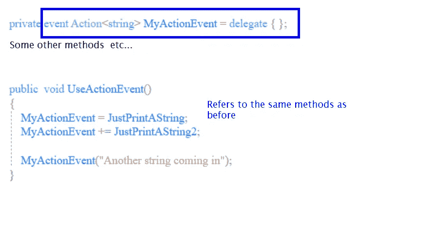
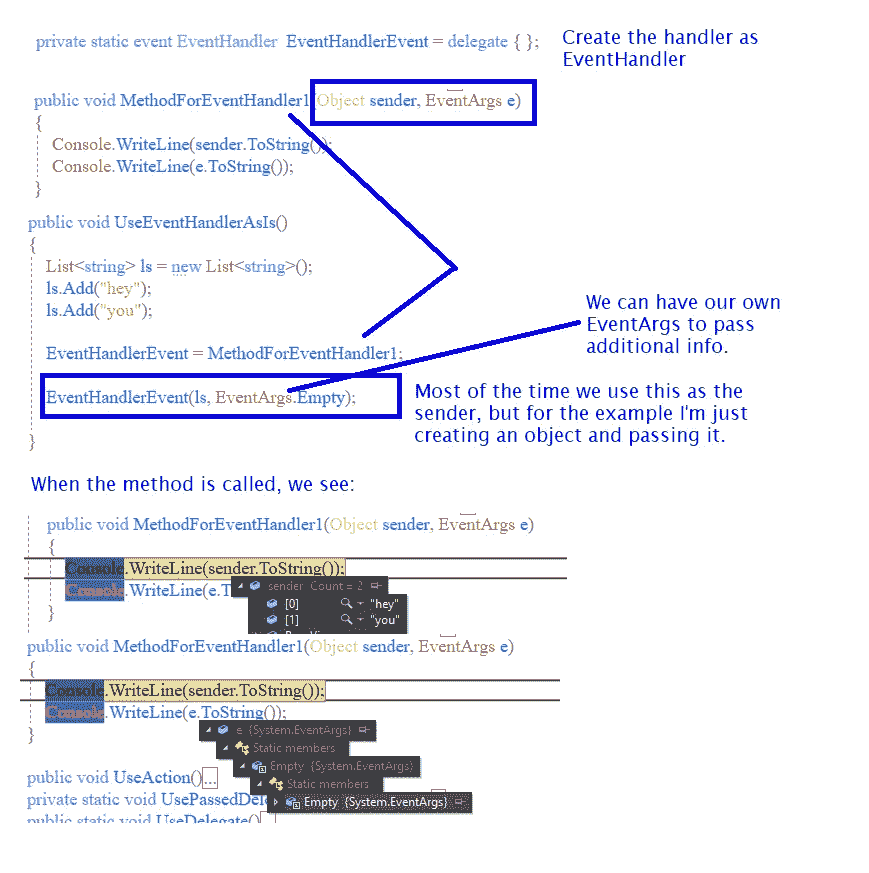
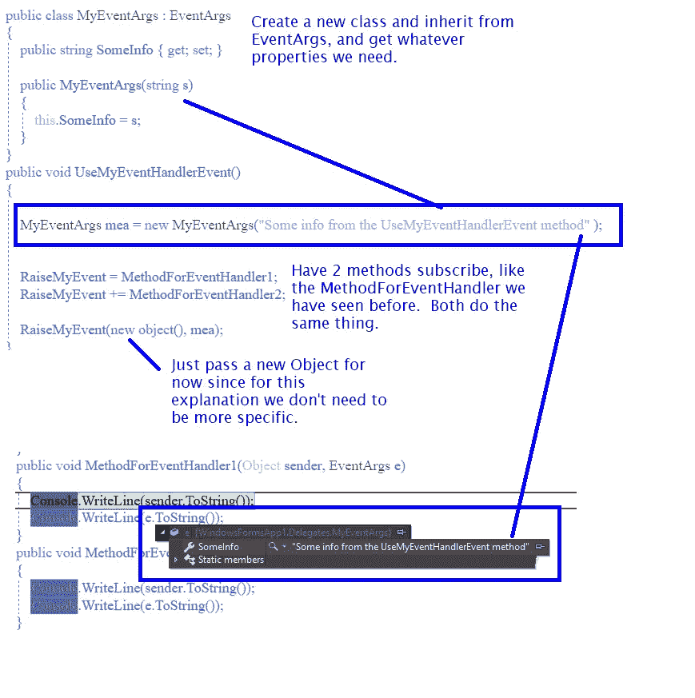
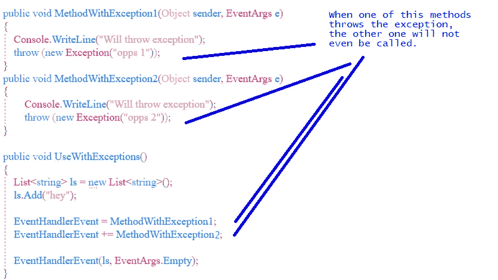
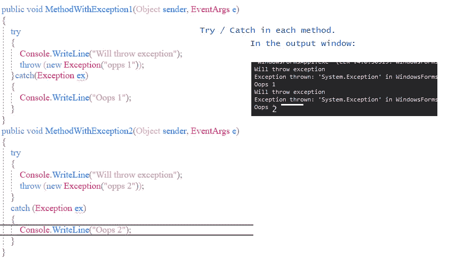
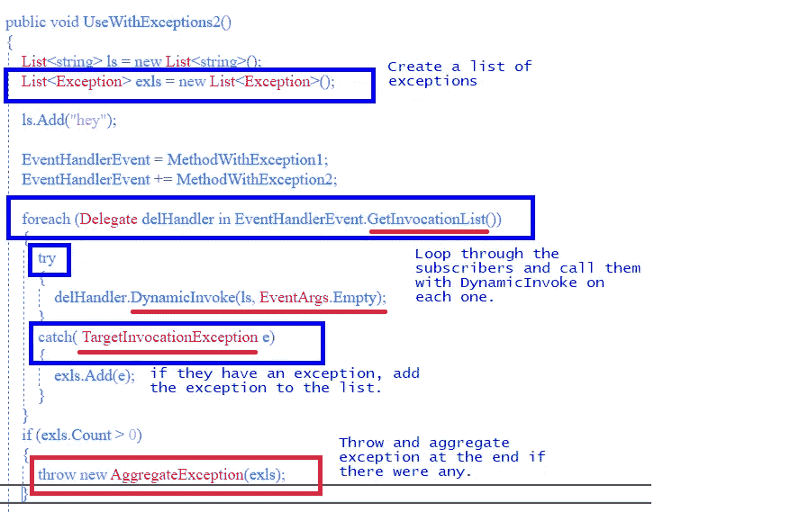

# C# —委托、动作、事件。请总结！

> 原文：<https://medium.com/nerd-for-tech/c-delegates-actions-events-summary-please-8fab0244a40a?source=collection_archive---------0----------------------->

我不知道我是否是唯一的一个，但出于某种原因，我已经“明白”了很多次，也忘记了很多次，也困惑了很多次。我试着为自己写一些清晰的笔记，也许也能帮助别人。清楚是这里的关键词。我会试试看。

我想提一下代表，然后。NET 类型，我们可以在某些情况下将它们用作委托。我们走吧！

# 普通代表

C#中的委托是一种引用带有**参数列表和返回类型**的方法的类型。委托用于将**方法作为参数**传递给其他方法。

好吧，这是正确的，但我不能说回来，即使读完它。让我们先见一位代表。



委托并不关心这些方法是否是静态的，所以这两种类型都能很好地工作。下面是一些适用于该委托的方法示例。



我们可以设置一个或多个方法用一个委托来运行。在我们从方法中返回一个值的情况下(就像上面的 Decimal ),根据某些情况将委托设置为一个特定的方法是有意义的(因为我们必须将返回值存储在某个地方),就像您在下面的代码中看到的那样:

```
Decimal result = 0;
//Use the Calculation type of delegate
**Calculation** **delegateCalcHandler** = null;var random = new Random();
int x = random.Next(1, 5);// random number 1-4//class just to indicate we can use static or instance methods
SumSub sumSub = new SumSub();//just to assigned some method at random
switch (x)
{
     case 1:
          **delegateCalcHandler** = sumSub.Sum;
          break;
     case 2:
          delegateCalcHandler = sumSub.Sub;
          break;
     case 3:
          delegateCalcHandler = Prod;
          break;
     case 4:
          delegateCalcHandler = Div;
          break;
     default:
          delegateCalcHandler = sumSub.Sum;
          break;
}
//call the delegate, which will call whatever method was assigned at random
**result = delegateCalcHandler(3, 4);**
```

如果我们想用同一个委托调用不止一个方法，我们可以用类似这样的东西替换上面的随机赋值。

```
//have the delegate handler call all the methods**delegateCalcHandler** = sumSub.Sum;
delegateCalcHandler **+=** sumSub.Sub;
delegateCalcHandler += Prod;
delegateCalcHandler += Div;delegateCalcHandler(2, 1);//will call all the methods.
```

方法不能保证按照它们被添加到委托的顺序被调用。委托是对象，因此它们也可以传递给其他方法。在那个例子中，一旦我们有了 delegateCalcHandler，我们可以像这样把它传递给另一个方法:

```
//pass the delegate to UsePassedDelegate
*UsePassedDelegate*(**delegateCalcHandler**);private void *UsePassedDelegate*(**Calculation** calc)
{
     Decimal d = calc(3, 2);
}
```

就像可以用 **+=** 符号向委托添加方法一样，可以用 **-=** 符号移除方法。

# 行动

当我们使用的方法返回 void 时，我们可以使用 C#提供的动作类型。。NET 提供了一组动作类型，从没有参数的动作到有 16 个参数的动作(Action，Action <t1>，Action <t1 t2="">…)。</t1></t1>

动作也可以用于静态和实例方法，但是为了简单起见，我不再使用静态方法。



用于操作的参数可以是任何东西，它们不必都是相同的类型。

当你在一个类中创建动作委托时(在我的例子中我把它放在方法中)，它们被创建为带有 set 和 get 方法的属性，所以类外的代码可以访问它们。您可以给它们添加关键字`event`，然后它们被创建为字段而不是属性。

# **更新功能< >** :

正如有人在评论中指出的，值得一提的是，与动作类似，你也有**功能**。当方法返回 void 时，使用动作，而使用 Funcs，您将有一个返回值。但是，与上面的操作示例类似，如果我这样做，最后一个操作将会成功:

```
public string ReturnAdd(int x, int y)
{
   return (x + y).ToString();
}
public string ReturnMult(int x, int y)
{
   return (x * y).ToString();
}
//take 2 ints, return a string
Func<int, int, string> myFunc = ReturnMult;
myFunc += ReturnAdd;
Console.WriteLine(myFunc(3,3));//the console will print 6, and if I change the order in which
//they are assigned, 9\. **Last one in wins**
```

所以这说不通，那还有什么意义呢？对于初学者来说，Func 是一个委托对象，而不是一个方法，所以你可以传递它。你可以有这个，它会工作。

```
public void **TakeAFunc( Func<int,int,string> arg)**
{
   Console.WriteLine(" in TakeAFunc");
   Console.WriteLine(**arg(3, 3)**);
}Func<int, int, string> myFunc = ReturnMult;
TakeAFunc(myFunc);
```

就像你可以传递它一样，你也可以用对象做其他的事情。你也可以这样做。

```
Func<int, int, string>? myFunc = null;
var rand = new Random();
int i = rand.Next(0, 10);
if (i < 5)
{
   myFunc = delegate (int x, int y)
   {
      return ((x * 10) * (y * 10)).ToString();
   };
}
else
{
   myFunc = delegate (int x, int y)
   {
      return ((x + 10 + y).ToString());
   };
}
Console.WriteLine(myFunc(3,3));
```

或者更好，而不是在上面的赋值中使用委托方式:

```
myFunc = (x, y) => { return ((x * 10) * (y * 10)).ToString(); };
...
myFunc = (x, y) => { return ((x + 10 + y).ToString()); };
```

# 带有事件关键字的操作

当您将动作创建为类中的事件时，它们被创建为字段，而不是具有 get 和 set 属性的属性。此外，它们在创建时被分配了一个委托，因此在调用它之前不需要检查是否为 null。



# 如果要使用事件，请使用 EventHandler 而不是事件操作

处理事件的更好方法是使用 EventHandler。它之所以更好，是因为它允许订阅者获得有关事件的数据。

如果我们使用事件处理程序，我们可以使用的方法需要有参数`(Object sender, EventArgs e)`



我们可能需要向这些方法传递一些定制的信息，我们可以通过创建一个从 EventArgs 继承的类来做到这一点。

在这种情况下，事件是这样创建的:

`private static event **EventHandler<MyEventArgs>** RaiseMyEvent=delegate{};`



# 处理异常

如果我们有不止一个订户，并且我们没有处理异常，会发生什么？



我们可以这样处理这个问题:



如果我们不想在每个方法中都有 try-catch 块，我们也可以这样做:



这些是我到目前为止对代表、行动和事件的笔记。

如果你读到这里，我希望这有所帮助。如果你认为有些事情不对劲或令人困惑，请告诉我。

谢谢大家！