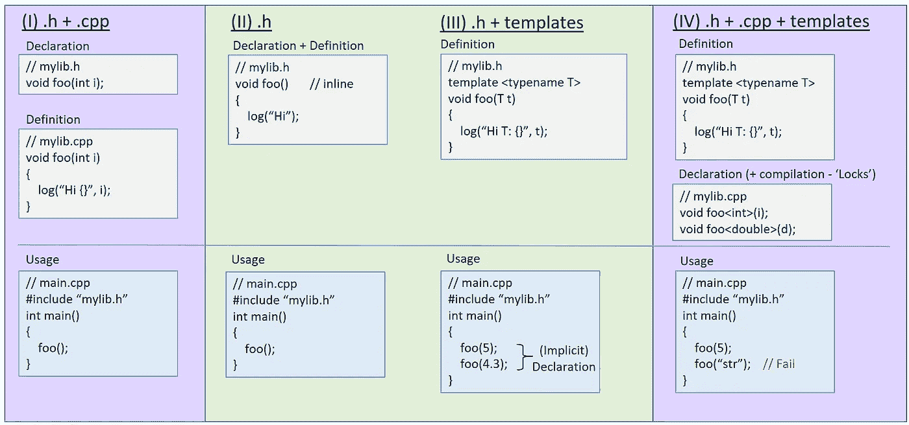
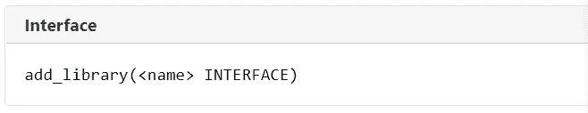
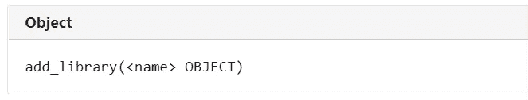
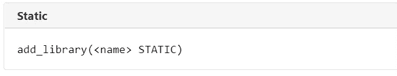
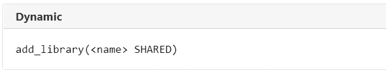
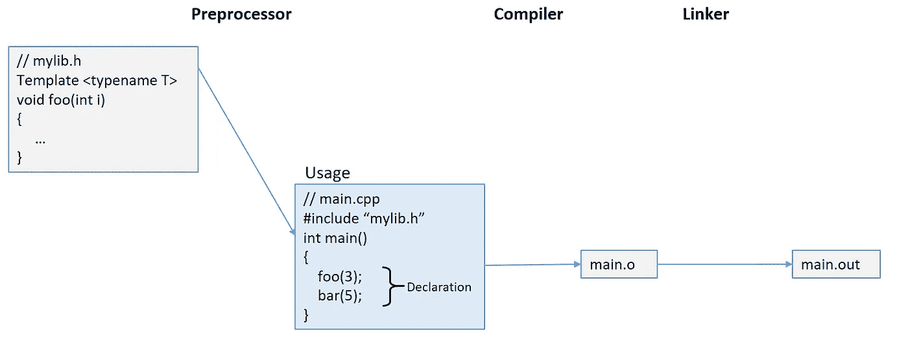
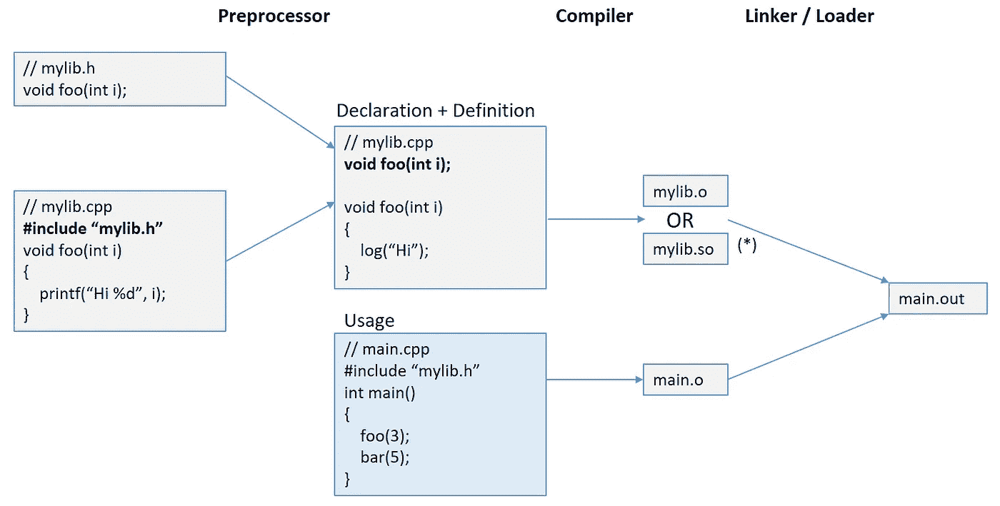
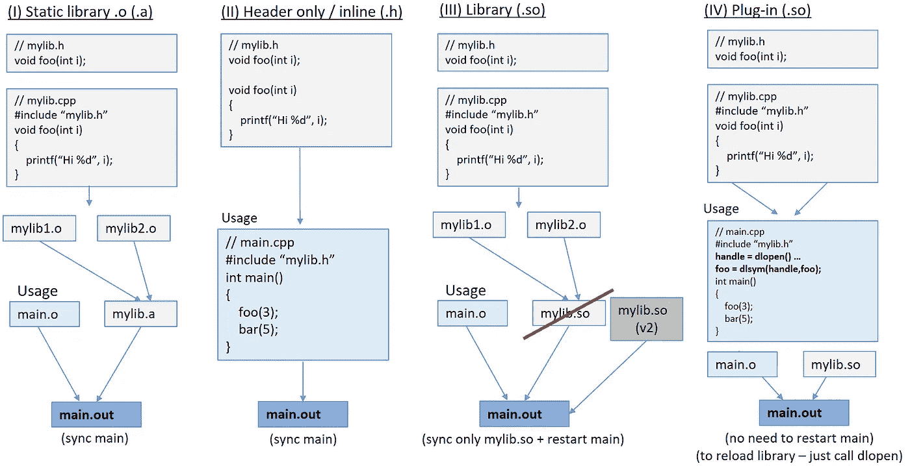
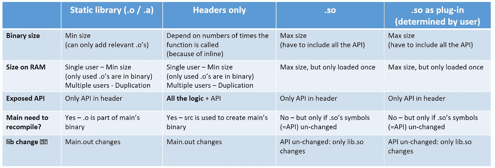

# C++库—第二部分:实现

> 原文：<https://medium.com/nerd-for-tech/c-libraries-part-ii-implementation-44dab21e50ae?source=collection_archive---------4----------------------->

这篇博文是 [C++库的延续——第一部分:设计](https://inballevi.medium.com/c-libraries-part-i-design-9ed997dca8f3)

在这一部分，我们将回顾创建 C++库的基础知识。

# 二。为 C++库创建代码的技术

C++提供了多种创建库代码的方法:

**(I)和(IV)可以打包成一个包(。o /。a /。so)，而(II)和(III)必须作为源代码提供。**

# 三。打包库代码的技术

(注意:博客的其余部分将解释创建库的技术细节。示例和说明假设基于 Linux 的操作系统使用 CMake 工具，基于 Windows 的操作系统具有非常相似的过程)

正如在上面的“代码合成”一节中详细提到的，一般来说，用户有三种主要的方式来使用库:

1.  **使用库源代码** —这通常与上面的选项(III)一起使用，因为模板可以用来“按需”创建代码，但是你也可以轻松地将源代码打包到库中。
2.  **与库静态链接** —库代码将作为使用程序的一部分嵌入**(库代码将是二进制的一部分)。
    该库可以作为:
    -一个目标文件(。o)
    -目标文件的集合(“目标库”)
    -与“索引”文件打包在一起的目标文件的集合。一)
    (一个“档案库”)**
3.  **与库动态链接** —用户代码将**引用库代码**(符号)。当运行用户代码时，加载程序将库加载到 RAM 中，并且**提供这些引用**。
    在这种情况下，**定义组合的是库**提供的符号(ABI——应用二进制接口)。
    如果库不能提供它们(在编译时，被链接器发现，或者在加载时，被加载器发现)**我们将得到一个链接器/加载器错误。**

还存在其他类型，但在本文中不会讨论。

以上所有选项都可以在库项目(或文件夹)的 CMakeLists 文件中配置

1.  对于源库—创建“接口”库。

2.创建对象/静态库:

。o(目标库)

。a(静态库—存档)

3.创建动态库:

。so(共享对象)

有关如何在 gcc 中手动创建每个选项的更多细节和技术规范，请参见:[https://www . c programming . com/tutorial/shared-libraries-Linux-gcc . html](https://www.cprogramming.com/tutorial/shared-libraries-linux-gcc.html)

# 四。用用户代码组成库

这是创建 main.out 可执行文件的过程。

## 用用户代码构成源代码库

编译源代码时，“main.out”是唯一需要在目标上的文件。

## 将库组成为对象(静态/动态库)

重要的是:以防万一。因此，main.out 将不包含库的二进制文件。相反，加载程序将加载。所以当 main.out 被执行时。

# 动词 （verb 的缩写）交付新图书馆的方式

C++提供了交付库的多个原因(部分列表):

**(*)重要提示:注意(III)和(IV)的区别仅在于出现在主文件中的预期用途(而不是库的创建)。**

以上选项之间的比较:

最小大小:只有用户使用的那部分代码的大小(如果分成。o 文件—只有。o 包含用户调用的函数)

最大大小:库中所有代码的大小(因为动态链接不知道用户将使用代码的哪一部分，所以。所以必须包含所有代码)

## 与表格相关的附加信息的链接:

*   相同的代码可以用多种方式创建:
    [库-设计-允许用户-仅在头间决定-和-动态-克林](https://stackoverflow.com/questions/25606736/library-design-allow-user-to-decide-between-header-only-and-dynamically-linke)
*   静态与动态库大小:
    [静态链接的二进制文件比动态链接的二进制文件小多少](https://stackoverflow.com/questions/27728385/how-statically-linked-binaries-could-be-smaller-than-dynamically-linked-binaries)

# 不及物动词收场白

当然，还有其他的主题需要解决，这篇博客试图涵盖最基本和最常见的技术。

C++20 支持“可组合”代码的新结构形式，这可以改变构建库的过程，特别是——消除对头文件的需要。这种形式被称为*模块*。这是一个完全不同的话题，值得单独发表。

感谢 Hana Dusíková和 Billy Baker 审阅这篇文章。

感谢您的阅读，希望这篇博文对您有所帮助。:)

更新(2022 年 3 月):我已经创建了 [TestCMake](https://github.com/inbal2l/TestCMake) repo，其中包含针对静态和仅头文件库的 CMake 文件的简化示例(很大程度上与[官方教程](https://cmake.org/cmake/help/latest/guide/tutorial/index.html#)一致)。