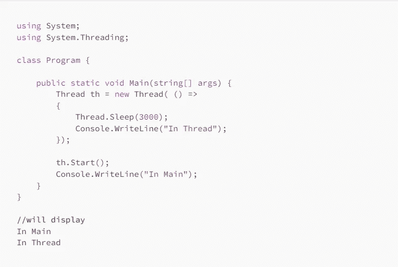

# C# —线程摘要

> 原文：<https://medium.com/nerd-for-tech/c-threading-summary-758a6909e152?source=collection_archive---------0----------------------->



这是另一篇总结 C#线程基础的文章。包括线程和任务。也异步/等待

我想首先要说的是，不要从一个线程或任务中更新 UI，因为它们将在不同的线程中运行，所以它们不能真正访问 UI 元素。

# 线

线程将运行到完成，因此应用程序在线程运行时不会结束。只要线程处于活动状态，您就可以更改该线程的优先级。你也可以中止一个线程，但是资源可能会被阻塞。

一个线程不能将结果传递给另一个线程，但是它可以接收数据。

线程中发生的异常应该在线程内部被捕获。

先说一个基本的例子。该线程将等待 3 秒钟，然后将一些内容打印到控制台。main 方法将继续运行并打印“In Main ”,而不等待线程，线程运行在…不同的线程:-):

```
using System;
using System.Threading;

class Program {      

    public static void Main(string[] args) {           
        Thread th = new Thread( () => 
        { 
            Thread.Sleep(3000);
            Console.WriteLine("In Thread"); 
        });

        th.Start();
        Console.WriteLine("In Main");
    }
}

//will display
In Main
In Thread
```

但是如果我们想告诉线程打印什么呢？我们可以为线程设置参数，让它拥有一些数据，并用这些数据做一些事情，然后为了创建线程，我们只需要传递这些数据。

在下面的示例中，传递的参数必须是 object，而不是您自己的对象类型。此外，不要使用匹配 MyObject 的匿名类型调用，因为这样做不起作用。

```
public class MyObject{
  public int j {get;set;}
  public int k {get;set;}
}

public static void Main(string[] args) {           
  ParameterizedThreadStart p = new ParameterizedThreadStart((object o) => { 
    MyObject obj = (MyObject) o;
    Console.WriteLine($"Got {obj.j} and {obj.k} to get {obj.j + obj.k}");
   });   

   Thread th = new Thread(p);
   MyObject mo = new MyObject();
   mo.j = 10; mo.k = 20;
   th.Start(mo);
 }
```

您可以通过创建方法(而不是使用匿名方法)并传递该方法来实现同样的目的。请记住，它的参数中仍然必须有 object，所以它与 ParameterizedThreadStart 所期望的相匹配。

```
public class MyObject{
  public int j {get;set;}
  public int k {get;set;}
}

public static void MyMethod(object o){
  MyObject obj = (MyObject) o;
  Console.WriteLine($"Got {obj.j} and {obj.k} to get {obj.j + obj.k}");
}

public static void Main(string[] args) {           
  ParameterizedThreadStart p = new ParameterizedThreadStart(MyMethod);   

  Thread th = new Thread(p);
  MyObject mo = new MyObject();
  mo.j = 10; mo.k = 20;
  th.Start(mo);
 }
```

我们也可以这样做:

```
public class MyObject{
  public int j {get;set;}
  public int k {get;set;}
}

public static void Main(string[] args) { 

  Thread th = new Thread( (data) => {
    MyObject obj = (MyObject) data;
    Console.WriteLine($"Got {obj.j} and {obj.k} to get {obj.j + obj.k}");
  } );
  MyObject mo = new MyObject();
  mo.j = 10; mo.k = 20;
  th.Start(mo);
}
```

我们已经看到，当我们启动一个线程时，Main 会继续处理而不会等待。线程的全部意义在于我们没有在等待，但是，如果我们想等待呢？用`Join()`

如果我们将 Join()添加到之前显示的代码中:

```
static void Main(string[] args) {            
  Thread th = new Thread(() => {
  Thread.Sleep(3000);
  Console.WriteLine("In Thread"); 
  });

  th.Start();
  th.Join(); //JOIN and it will print In Thread, In Main.
  Console.WriteLine("In Main");
}
```

如果我们正在处理不同的线程，一个线程也可以等待另一个线程。

```
static void Main(string[] args) {            
  Thread th_1 = new Thread(() => {
    Thread.Sleep(3000);
    Console.WriteLine("th_1"); 
  });

  Thread th_2 = new Thread(() => {             
    th_1.Join();//JOIN THE OTHER THREAD
    Console.WriteLine("th_2"); 
  });

  th_1.Start();
  th_2.Start();
}
```

就像我之前说的，你不能把数据从一个线程传递到另一个线程。您可以访问相同的变量，但是在这种情况下，您应该锁定这些变量。

```
using System;
using System.Threading;

class Program {      
    public static string _something = string.Empty;
    public static object _lock = new object();

    static void Main(string[] args) { 

        Thread th2 = new Thread( () => { 
            lock(_lock){
                _something = DateTime.Now.ToString();  
            }
        });

        Thread th1 = new Thread( () => {     
            th2.Join();
            Console.WriteLine(_something); });

        th2.Start(); //start this one first
        th1.Start();

    }
}
```

# 任务和并行运行

任务是一个表示将要执行的工作(方法)的对象。

任务是作为后台进程创建的，因此如果前台进程完成，它们甚至可以在完成之前结束。任务没有优先级。

这里我们创建 2 个任务动作，然后用**并行启动它们。调用**

```
using System;
using System.Threading;
using System.Threading.Tasks;

class Program {      

    static void Main(string[] args) {  
        Action task1 = new Action( () => {
            Thread.Sleep(2000);
            Console.WriteLine("task1");
        });
        Action task2 = new Action( () => Console.WriteLine("task2"));
        Parallel.Invoke (task1, task2);
    }
}

//displays
//task2
//task1
```

也可以这样做:

```
static void Main(string[] args) {                 
  Parallel.Invoke ( 
    () => { Thread.Sleep(2000); Console.WriteLine("task1");}, 
    () => Console.WriteLine("task2")
   );
 }
```

到目前为止，我们已经通过一些动作(可能是方法)创建了任务，并使用 Parallel.Invoke 启动它们。

我们可以有这些方法:

```
public static void Method11()
{
  Console.WriteLine("method 1");
}
public static void Method22()
{
  Console.WriteLine("method 2");
}
public static void Method33()
{
  Console.WriteLine("method 3");
}
```

我们可以用这个为这些方法创建任务:

```
//START will be first, but the order of the other ones we don't know.
Console.WriteLine("START");

Task T1 = new Task(Method11);
T1.Start();

Task T2 = Task.Factory.StartNew(Method22);

Task T3 = Task.Run(Method33);

Console.WriteLine("END");
```

你可以**等待任务**，就像这样。在这里你不会看到结束，直到你看到“我是新任务”。

```
Console.WriteLine("START");

Task newTask = new Task(() => { 
  Thread.Sleep(2000); Console.WriteLine("I am the new task"); });

newTask.Start();
newTask.Wait();

Console.WriteLine("END");
```

您还可以使用`Task.WaitAll`(要等待的任务的数组或列表)来等待一个任务数组。

**任务可以返回结果。**

```
Task<String> newTask = Task.Run(() => { 
  Thread.Sleep(2000); return ("I am the new task"); });
newTask.Wait();
Console.WriteLine(newTask.Result); //I am the new task 
```

我们也可以用 **ContinueWith 继续一个任务。**

```
Console.WriteLine("START");

Task<String> newTask = Task.Run(() => { 
  Thread.Sleep(2000); return ("I am the new task"); });  

  newTask.ContinueWith((prevTask) =>
   {
    Console.WriteLine("I continue from newTask and I print its result");
    Console.WriteLine("Result of new task: " + prevTask.Result);
    return "I am the 2nd task";
   }).ContinueWith( (prevTask2) =>
   {
    Console.WriteLine("I am the 3rd task and I print the 2nd's one result");
    Console.WriteLine("Result of 2nd task: " + prevTask2.Result);
   }).Wait();

  Console.WriteLine("END");

//displays
//START
//I continue from newTask and I print its result
//Result of new task: I am the new task
//I am the 3rd task and I print the 2nd's one result
//Result of 2nd task: I am the 2nd task
//END
```

一个父任务可以创建**子任务**。子级可以是附加的(真实子级)，也可以是不附加的(称为嵌套的)。如果它们是附加的，则在子级完成之前，任务不会完成。

```
Task parent = Task.Factory.StartNew(() =>
{
   Console.WriteLine("parent task started");

   Console.WriteLine("starting indepdent nested task");
   Task.Factory.StartNew(() => { Thread.Sleep(4000); Console.WriteLine("Indep nested task after 4 secs"); });

   Console.WriteLine("starting child task - attached");
   Task.Factory.StartNew(() => { Thread.Sleep(2000); Console.WriteLine("attached child after 2 secs"); }, TaskCreationOptions.AttachedToParent);

   Console.WriteLine("parent child ending");

});

parent.Wait(); //Wait for attached
Console.WriteLine("Parent Done Waiting ");
```

# 异步/等待

你可以等待一个任务完成，但是你要等待一个返回一些东西的任务。你不能这么做。

```
Task t = new Task(() => { Console.Write("hey");  });

await t.Start();// WIll not compile
```

但这是可行的(await 应该在标记为 async 的方法中使用)。

```
Console.WriteLine("START");

Task t = new Task(() => { Console.Write("hey");  });

await  Task.Run(() => { Thread.Sleep(2000); Console.WriteLine("Running Task"); return "hello"; });    

Console.WriteLine("END");

//displays
//START
//Running Task
//END
```

# 一些并行操作

就像我们有一个 **foreach** 一样，我们也有一个并行 foreach。它将并行运行我们想对每一项做的任何事情，但是不能保证事情发生的顺序。

```
List<string> l = new List<string>();

l.Add("1");
l.Add("2");
l.Add("3");
l.Add("4");
l.Add("5");

Parallel.ForEach(l, (item) => Console.WriteLine(item));

//could print
//1
//4
//5
//3
//2
//or some other order
```

对于循环，我们也有同样的选择**(同样不保证订单)。**

```
//Notice that the 0 is inclusive, but the 2nd argument is EXCLUSIVE, 
//so don't subtract 1.
Parallel.For(0, l.Count, (i) => Console.WriteLine(i + "-" + l[i]));
```

我们还可以在 for 中添加一个**停止条件**。对于与上述相同的列表:

```
ParallelLoopResult res = Parallel.For(0, l.Count,
            (int i, ParallelLoopState st) => {
             Console.WriteLine(i + "-" + l[i]);
             if (i == 2) { st.Stop(); }
            });

  Console.WriteLine(res.ToString());

//displays
//0-1
//2-3
//1-2
//System.Threading.Tasks.ParallelLoopResult
```

ParallelLoopState 也可以与 foreach 一起添加。

我们也可以使用 **linq** 进行并行编程。

```
var res = from item in l.AsParallel()
    where (item == "2" || item == "4")
    select item;
```

处理顺序没有保证，但是，您可以做`**.AsParallel().AsOrdered()**`来保存顺序。

也可以做`**.AsParallel().AsSequential()**` 来顺序处理。

我们也可以在结果完成之前开始迭代，如果我们这样做:`res.ForAll(p => { Console.WriteLine(p.Age); });`

如果任何查询抛出异常，它们将在最后作为 AggregateException 抛出。

暂时就这样了。