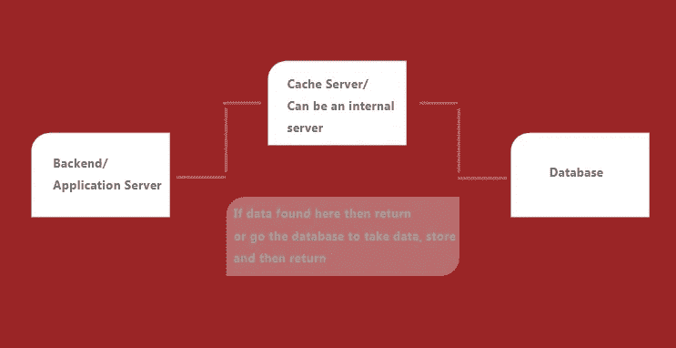
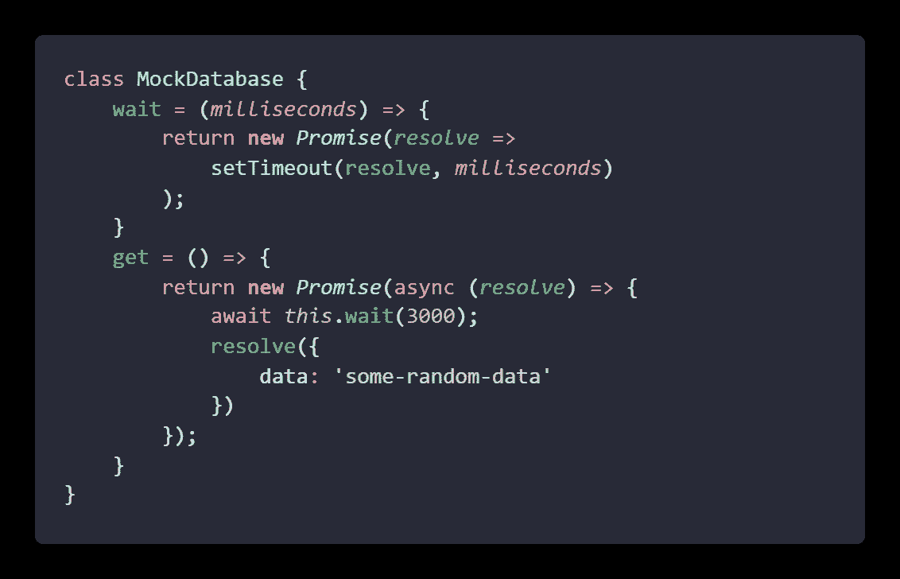
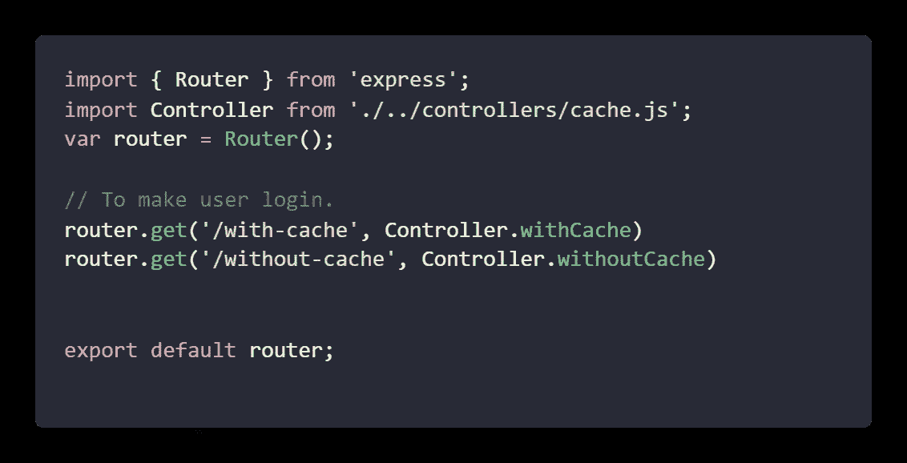
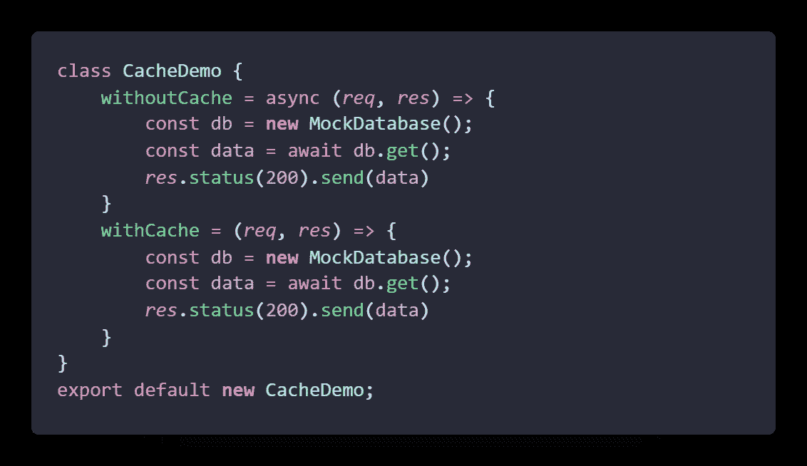
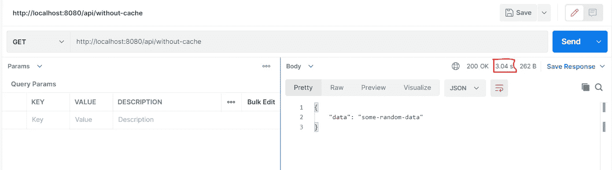
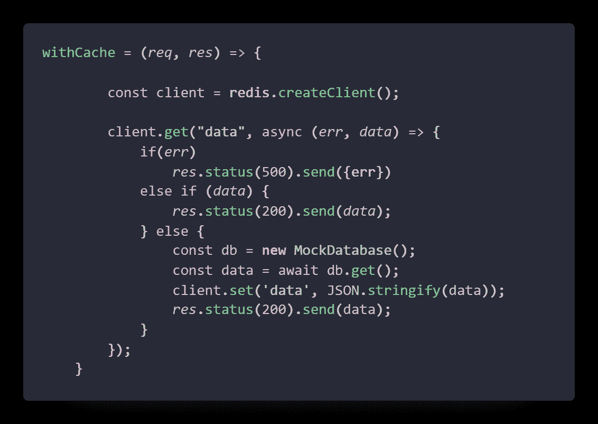

# Express 应用程序中的缓存

> 原文：<https://medium.com/nerd-for-tech/caching-in-express-app-ada148fa7a70?source=collection_archive---------10----------------------->

玛利亚·博布罗娃在 [Unsplash](https://unsplash.com?utm_source=medium&utm_medium=referral) 上的照片

你有没有觉得你应该更快，性能更好，但你不能控制的东西，对不对？但是，如果您将数据处理从终端移除，肯定会节省您的时间。缓存作为一种拯救来了，你可以将数据存储在 ram 中，只要需要，它就会迅速出现，原因很简单，缓存是从 RAM 而不是从磁盘存储器提供的。但问题是，我们应该缓存所有东西吗？让我们详细讨论一下这个事情。

## 什么是缓存？

每当我们将任何数据集/数据库用于任何类型的应用程序时，它都会从磁盘内存和使用内部排序机制(称为索引)中获得更快的响应时间，但可能会出现数据量变得巨大且磁盘处理将花费一些时间的情况。那么作为一个软件人员，我们应该推荐缓存作为解决方案之一，它将数据存储在 RAM 中，并在需要时从那里而不是从磁盘提供服务。这是这个概念的直观表示。

缓存架构

## 用在哪里？

这取决于用例，但是大多数缓存都是通过静态数据或用户间的相同数据进行的。个性化内容不喜欢存储在缓存机制中，因为它会在每次请求时改变。

## 怎么用？

我使用节点来演示缓存流以及 *Redis* ，还有其他几个选项，如 *Memcached* 、 *Mongo、*或任何键值对数据集等等。我将使用这个[回购](https://github.com/Piyush-Use-Personal/Role-Based-Access)作为开始，您可以像专家一样切换分支进入我上一篇关于[基于角色的访问的文章。文章的完整代码可以在同一个 repo 的分支](https://piyush-d-11623.medium.com/role-based-access-like-a-pro-eb8f1207ca29)[缓存](https://github.com/Piyush-Use-Personal/Role-Based-Access/tree/caching)中找到。可以通过运行***NPM run dev/node index***打开服务器。

为了给你演示这个功能，我创建了一个名为 **MockDatabase** 的类，每当我们调用这个类的 get 方法时，它会在 3 秒钟内给我们一些数据

这是我们正在使用的模拟类的代码，这将有助于我们维护基础中的奇点。 *get* 方法将为我们提供数据，而 *wait* 方法将让我们在这里创建我们想要的延迟。

接下来，我们将更新路线，我为本文的目的创建了两条路线*/带缓存*和*/不带缓存*，这将帮助我们了解每条路线的时间延迟。

不要担心，你会在文章的顶部和底部找到带有回购链接的完整源代码。

现在，更新路由的控制器以调用我们之前创建的 DB 来获取。

我们现在对这两个函数调用完全相同的代码。

路线的控制器功能

现在，如果您移动到任何路线，您将看到以下结果，但有 3 秒钟的延迟。

注意用红框突出显示的区域，你可以看到延迟。

现在，我们将在小应用程序中集成缓存。我们将使用 [Redis](https://www.npmjs.com/package/redis) 包来缓存我们的数据。

首先，您需要下载 Redis 并在本地安装它，要在本地安装 Redis 包中使用它，请编写命令 ***npm i redis***

并像这样用缓存控制器更新它们，

不要忘记导入顶部的 Redis。

在代码片段中，如果你看到，我们显然是在为我在文章开头使用的图表编写代码。首先，我们检查 Redis 是否有数据，如果有，就直接发送给客户端，如果没有，就调用数据库并存储它，然后用我们用来获取数据的同一密钥将数据发送给客户端。注意- Redis 不存储直接对象，首先我们需要将它字符串化或者使它成为缓冲区，如果你想做一些处理，你可以使用 JSON parse 使它再次成为 JSON。

一旦你这样做了，当你刷新服务器并再次点击请求时，你将再次看到变化。

也就是说，我们将在这里结束，你可以在这个[分支](https://github.com/Piyush-Use-Personal/Role-Based-Access/tree/caching)找到完整的源代码。希望你们喜欢这篇文章并获得一些知识，保重。