# 用同位素沉淀计算地下水年龄 Piper 图地下水化学分析

> 原文：<https://medium.com/nerd-for-tech/calculate-age-of-groundwater-by-isotopic-precipitation-analyze-ground-water-chemistry-from-piper-fb67f989569e?source=collection_archive---------12----------------------->

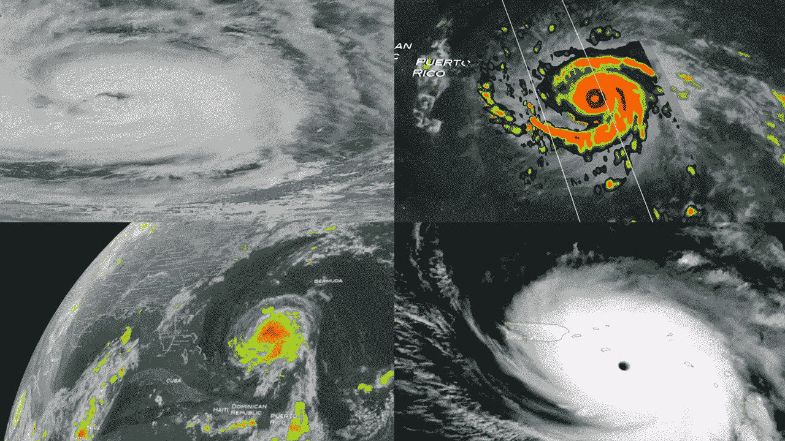

***Piper 图用于分析地下水中阳离子和阴离子的浓度。同位素沉淀本质上是大气降水。***

# 同位素沉淀:

***同位素降水与热带风暴的关系:***

*由于水蒸气穿过大陆地区向内陆移动，蒸发和冷凝的过程会重复多次。地下水同位素丰度数据表明存在大气降水，并用于确定地下水水文过程的年龄。*

*   [***热带风暴***](https://www.nature.com/articles/s41467-019-12062-3) ***补给地下水中的同位素*** *，而*
*   ***它的缺失提高了*** [***同位素丰度比***](https://www.sciencedirect.com/topics/chemistry/isotope-ratio-mass-spectrometry) *。怎么会？*

> **在热带风暴中，氘等流星元素进入地球表面，这导致氘的同位素百分比增加。**

> 所以根据这里解释的公式:

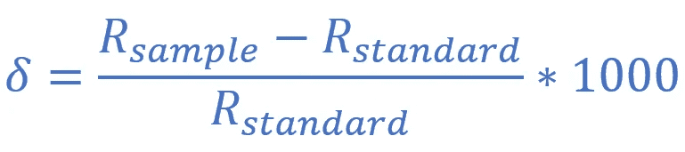

**同位素丰度比**

***R(样品):指 O-18(天然有效氧-18 同位素)与 O-16*** 的同位素比值

***R(标准):指 H-2(氘)与 H-1 的同位素比***

***δ(*𝛿*):是同位素丰度值***

> ***年龄测定:*** *从热带风暴和大气相互作用的事件中，人们可以通过放射性衰变定律来确定地下水的年龄。*


# 有趣的事实！！！

> 风暴具有破坏性，但它们会在地球上留下痕迹，给我们提供关于环境和地球起源的信息。

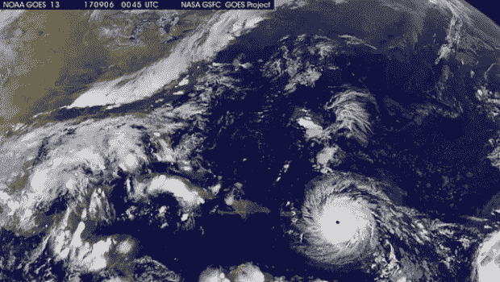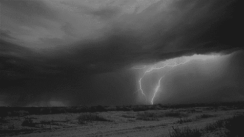

## 稳定同位素化学

***在地下水中发现了溶解的大气惰性气体以及水的稳定同位素(16O，18O，1H，2H)的浓度，它们提供了含水层演变的信息。***

**同位素丰度**以千分之几表示， **𝛿** 通过了解 **𝛿.的比率图，给我们提供了混合物中是否存在稀有的重同位素**

***它表示为:***


**同位素丰度比**

## ***支持公式:***

*在液态下，即水中，重同位素与轻同位素的浓度比，在气态下，重同位素与轻同位素的浓度比表示为:*

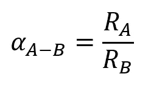

***分馏系数表示为 A 相与 B 相的比值***


***分馏因子(液体变成水蒸气)***

> [大气降水线](https://www.researchgate.net/publication/325577426_Isotopic_study_of_intraseasonal_variations_of_plant_transpiration_An_alternative_means_to_characterise_the_dry_phases_of_monsoon)由标准机构和组织预测，以了解特定持续时间跨度内的降水、同位素存在和气候变化等现象的偏差。大气降水线是一个线性( **y = mx + c** )型公式，对全球大气降水线保持不变。有地中海、维也纳、中亚和太平洋的气象水线。GMWL 是克雷格在 1961 年创建的。

## 雨水线:

大气水线是氘和氧的天然稳定同位素(氧-18)的散点图。[全球大气降水线](https://wwwrcamnl.wr.usgs.gov/isoig/period/o_iig.html) (GMWL)是从全球各地的降水中获得的，具有优于 0.95 的 R2 评分。它还表示，从单个地点收集的任何局部大气降水线(LMWL)的斜率和截距都可能显示出与全球大气降水线的显著差异。

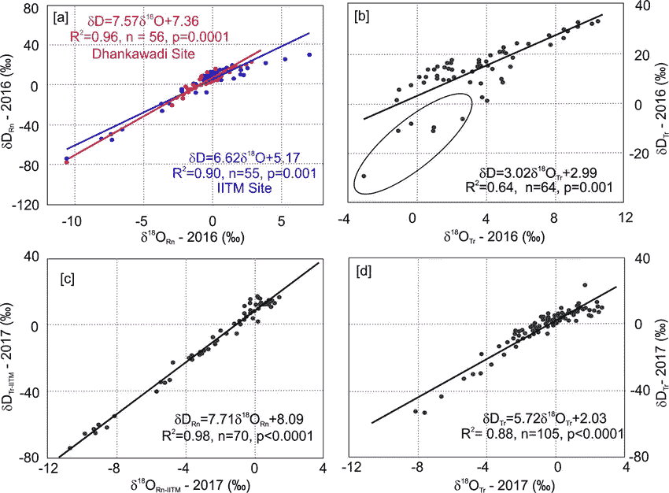

**Dhankawadi 场地和 IITM 场地的当地水气象线**


# 另一个有趣的事实！！！

> 风暴命名的标准可能是基于该地区风暴的可能性和影响！！！

# 派珀图:

> 以下是从不同含水层**采集的地下水样品中 **Ca2+、Mg2+、K+、Na+、HCO3-、SO4 2-、Cl-** 阳离子和阴离子的数据。**

[](https://docs.google.com/spreadsheets/d/1x3vt9Ls9E6iJIN786oYkr6o5-ENWNIam5ZAtpXwb_Lo/edit?usp=sharing) [## 风笛图

### 表 1 钠、钾、镁、钙、碳酸盐、硫酸盐、氯-24.2、25.3、74、284.95、18.84、44、97.6、9.2、6.5、42.4、7，145…

docs.google.com](https://docs.google.com/spreadsheets/d/1x3vt9Ls9E6iJIN786oYkr6o5-ENWNIam5ZAtpXwb_Lo/edit?usp=sharing) 

***什么是含水层***[](https://www.youtube.com/watch?v=0cUEuMUXrVU)****？****

> *[含水层](https://www.youtube.com/watch?v=0cUEuMUXrVU)是一个土层，它可以蓄水，和/或透过水，即能够渗水或将水限制在封闭空间内。*

*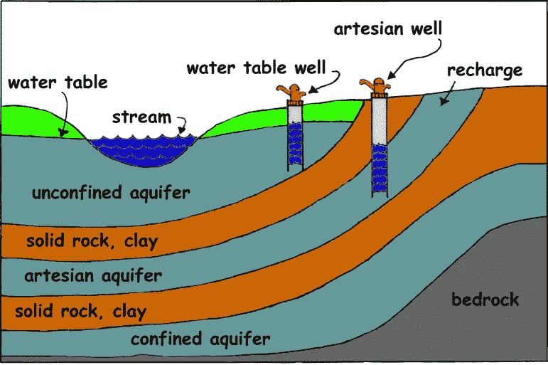*

***含水层的图示***

> *这是从含水层的地下水样本中获得的阳离子和阴离子数据的 [piper 图](https://www.hatarilabs.com/ih-en/what-is-a-piper-diagram-and-how-to-create-one)。*

# *一号含水层*

*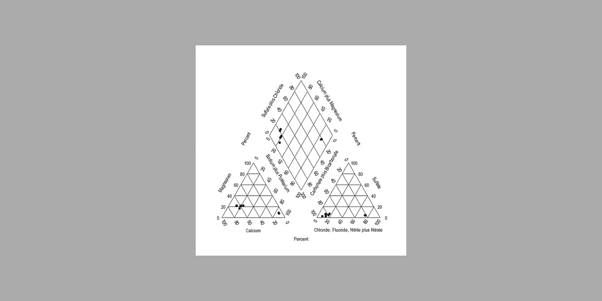*

***一号含水层***

## ****含水层 I(调查结果)****

****弱酸 vs 强酸:*** 从图中发现，弱酸如碳酸盐在地下水中的浓度较高，通常用 meq 表示。每升/升(毫当量)。强酸如氯化物和硫酸盐的浓度较低。*

****碱金属 vs 碱土金属:*** 钙、镁等碱土金属的浓度大于钠、钾等碱金属。*

*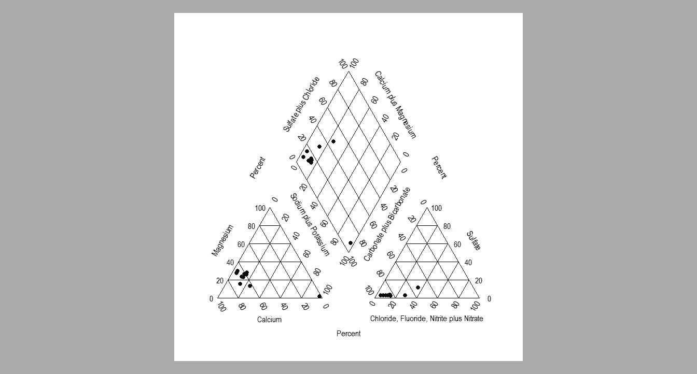*

***二号含水层***

## *二号含水层(调查结果)*

*二号含水层也有同样的趋势。你可以观察到钙的含量大于镁的含量。需要注意的是，水中存在的离子是碳酸氢根型的，而不是硫酸根型的。*

*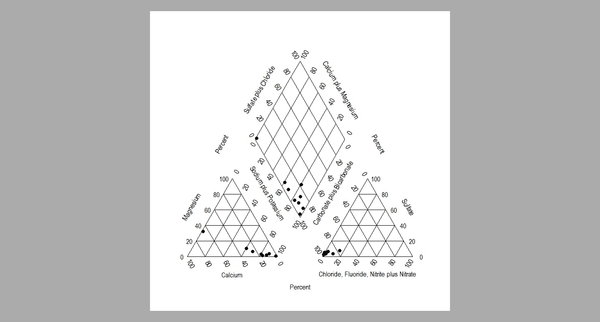*

***第三含水层***

## *第三含水层(调查结果)*

*在含水层 III 中，趋势是碱金属离子多于碱土金属离子。该图表明碳酸氢钠型比碳酸氢镁型存在更多。*

*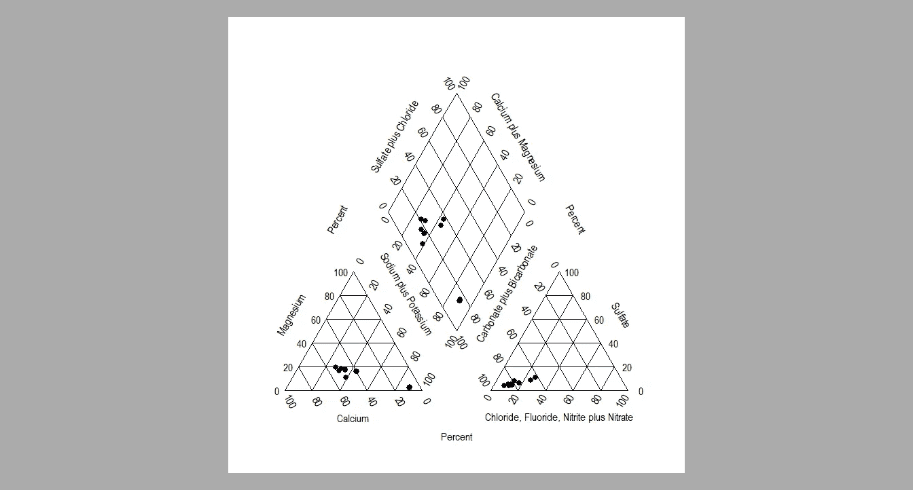*

***第四含水层***

## *第四含水层(调查结果)*

*第四层仍然是弱酸，比强酸突出，这可能表明地下水中的污染较少。其他因素有所不同，但与含水层 I 和 II 相比变化不大。*

# *彩色风笛图*

**

***风笛图细节***

# *如何生成 Piper 图*

****风笛图剧情使用*** [***微软 R 开***](https://github.com/USGS-R/smwrGraphs)*

```
***# import library smwrGraphs, install the library using remotes**
library("smwrGraphs")**# read csv downloaded from the google drive excel file**
df = read.csv("piper-Diagram.csv")**# plot piper plot**
piperPlot(
          xCat = df['Ca'], 
          yCat = df['Mg'],
          zCat = df['Na_plus_K'], 
          xAn = df['Cl_minus'],
          yAn = df['Carbonate'], 
          zAn = df['Sulfate']
)*
```

> **[***质量作用定律***](https://www.vedantu.com/chemistry/law-of-mass-action) ***是什么状态？:*** *质量作用定律说明平衡与反应物和产物的相对浓度成正比。***