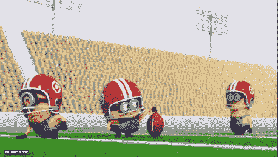
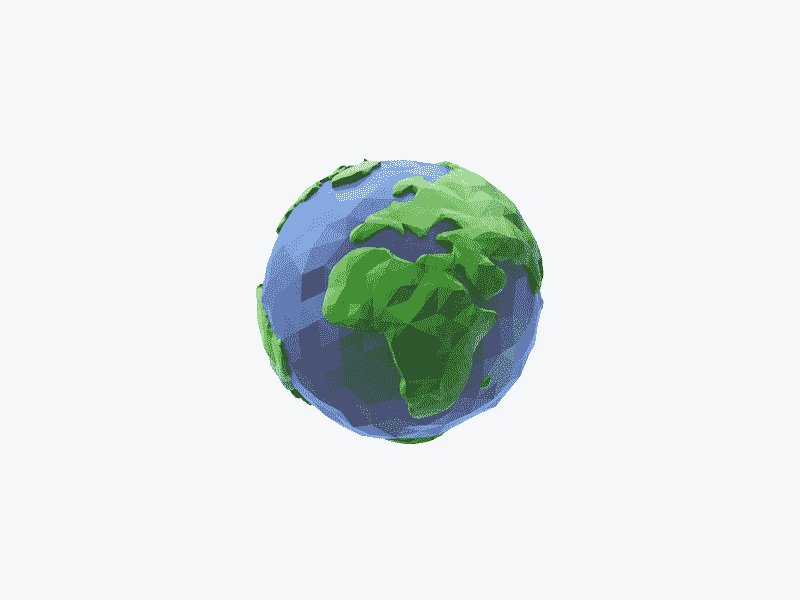
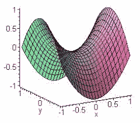
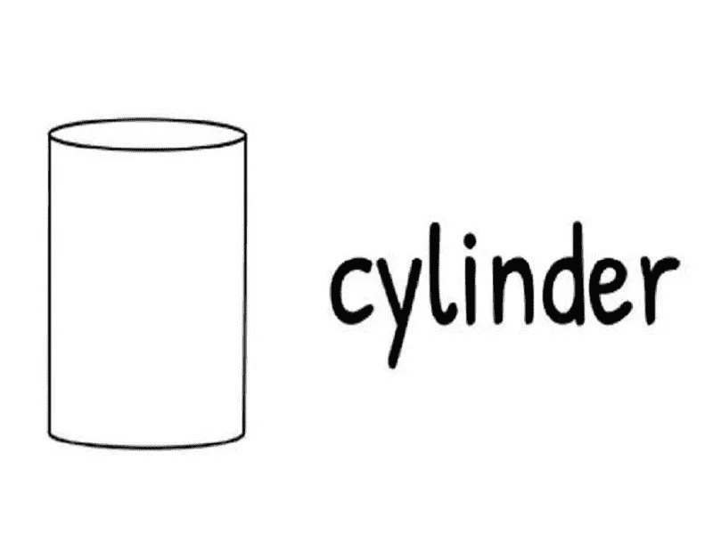

# 微积分—曲线

> 原文：<https://medium.com/nerd-for-tech/calculus-curves-55a9280b386f?source=collection_archive---------7----------------------->

曲线可以隐式(间接)或参数化定义。如果曲线是参数化的，我们可以指定像 x=4 或 x=y 这样的坐标。

## 二次曲面:

**长椭球体:**细长如鱼体，或形似橄榄球。a = b < c

**扁球体**:这里的扁球体看起来像地球。然而，扁圆是受宠若惊的两极。a =b > c

运球

**双曲面**:双曲面的形状看起来很像沙表或者 myta power。同样，考虑如果 a=b=c，那么椭球的方程是负的。

**椭圆抛物面:**

*   它是线性的。
*   椭圆抛物面看起来像日食。换句话说，如果有一个肠道形状，那么它被认为是椭圆抛物面。

**双曲抛物面:**有鞍顶(马带)的外观

**圆锥**:

[西格蒙德](https://unsplash.com/@sigmund?utm_source=medium&utm_medium=referral)在 [Unsplash](https://unsplash.com?utm_source=medium&utm_medium=referral) 上拍照

**圆柱体**:看起来像椭圆形、抛物线形或超抛物线形。它是三维的。

谢谢你…

[阅读更多文章:](/analytics-vidhya/learn-statistics-for-data-science-72fec5372abe)

 [## 你需要知道的统计基础知识

### 不对称的测量:

medium.com](/be-open/a-summarization-of-statistics-598986c34dc5)  [## 统计学中的数据可视化概念

### 了解数据是如何以不同方式可视化的

medium.com](/be-open/data-visualization-concepts-in-statistics-704a7e8ef212)  [## 统计学的基础是什么？

### 统计学基础

medium.com](/nerd-for-tech/what-are-the-fundamentals-of-statistics-a636dcaafc4d)