# 呼叫电梯

> 原文：<https://medium.com/nerd-for-tech/calling-the-elevator-54eeb9877f07?source=collection_archive---------20----------------------->

现在我们已经具备了先决条件，让我们让电梯动起来吧！如果您已经跟随移动平台脚本，这将是非常熟悉的！

让我们通过复制它来准备我们的电梯，把它移动到它应该去的地方，我们称它为点 b，再复制一次，称它为点 a。

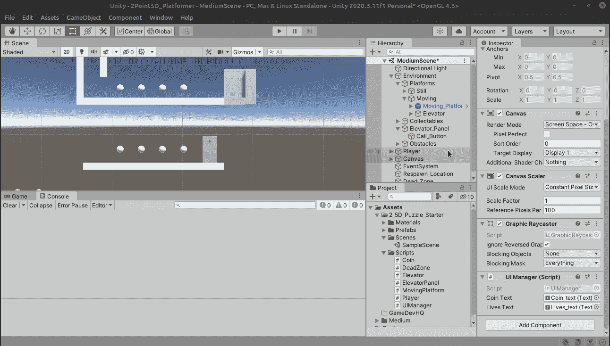

因为我们只需要变换信息，所以选择两个点并删除除变换以外的所有内容。我再次使用下拉菜单中的“删除组件”选项。抱歉中断窗口。

下一步，保持东西有组织，创建一个名为电梯持有人的空白，并在其中放置电梯和点。

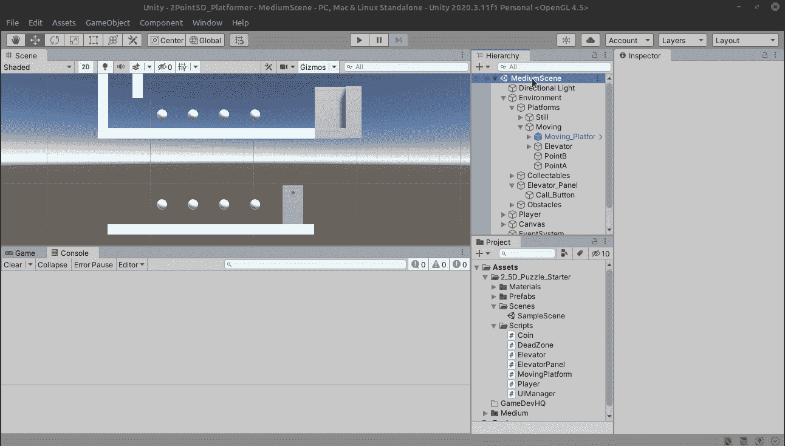

我们已经准备好开始行动了！创建一个名为 Elevator 的新脚本，并将其拖动到 Elevator 对象(而不是 Elevator Holder)中。

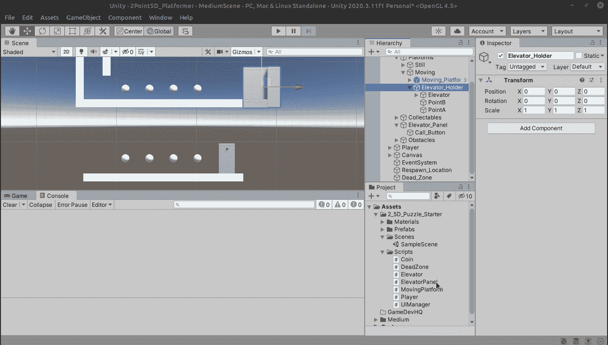

让我们为 PointA 和 PointB 创建容器

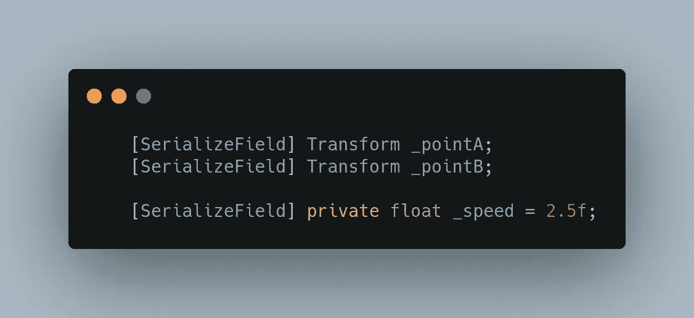

还不如加入一个速度变量。现在让我们把这些点拖到它们适当的位置。

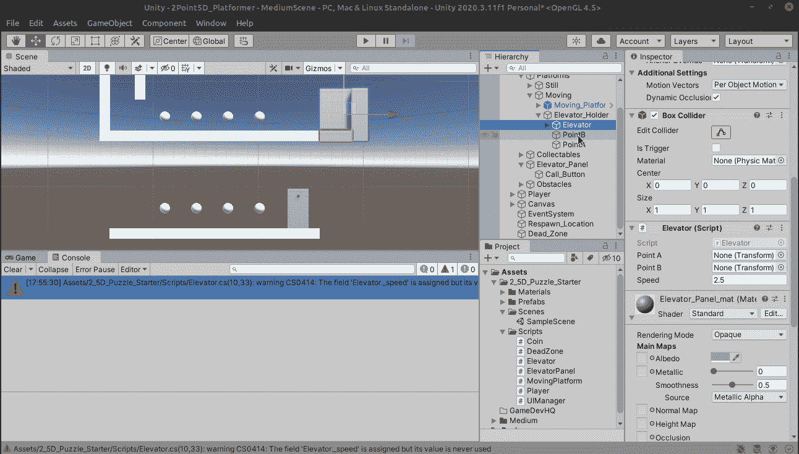

我们想知道电梯是否会下降，所以为它创建一个布尔值是个好主意。

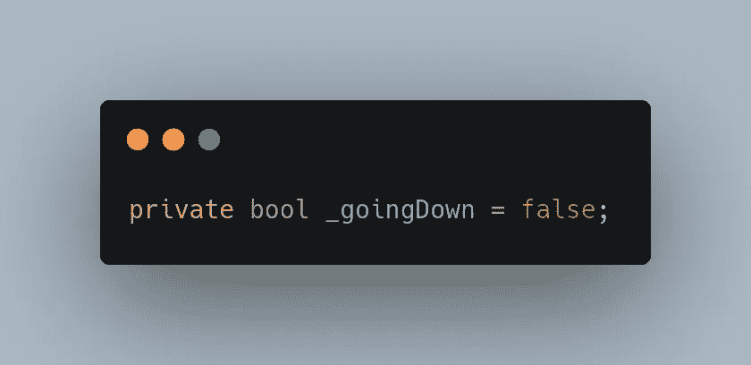

在我们开始编写任何逻辑之前，让我们创建一个 FixedUpdate，它实际上将我们的电梯带到点 b。我们将使用在移动平台教程中学到的相同方法。

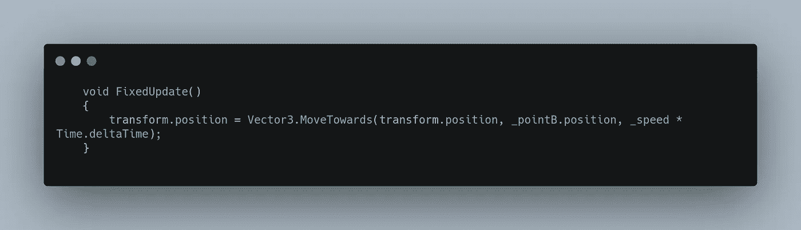

让我们来运行这个游戏:

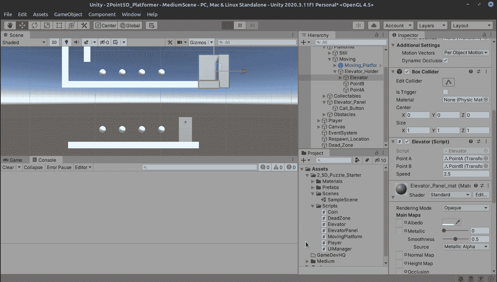

好吧！现在我们要去的地方！现在我们只希望电梯在我们调用它的时候移动，我们的 boolean _goingDown 已经是 false 了，所以让我们用它包装一下。

因此，现在我们需要创建一个到电梯面板的连接，我们将创建一个名为“CallElevator”的方法，在调用它时，我们将把 _goingDown 设置为 true。

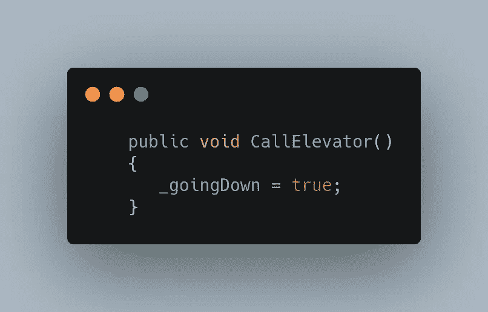

现在让我们从 ElevatorPanel 脚本中调用它！

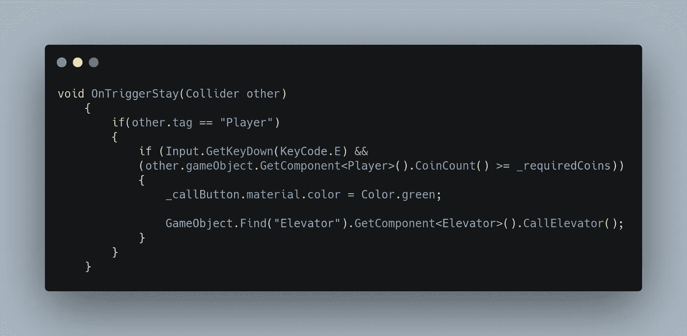

因为我们在脚本之外寻找一个组件，所以进行空检查通常是一个好主意，如果没有找到，它会通知我们，我们可以进行一些调试。

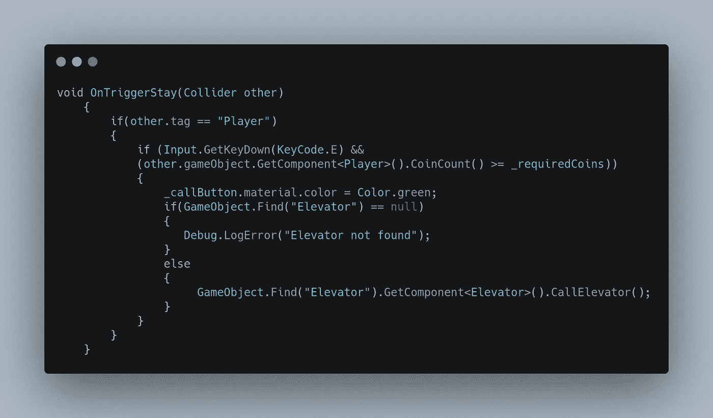

好了，编码够了，让我们运行这个东西吧！

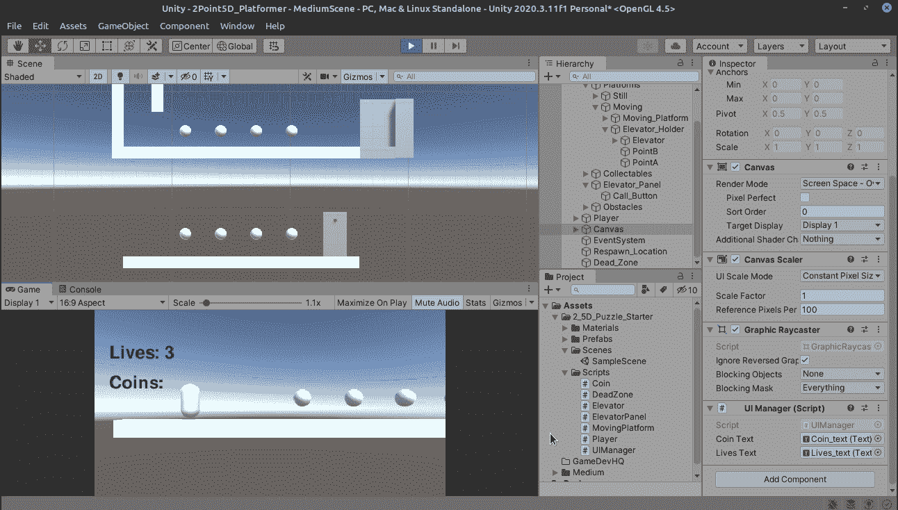

厉害！我们现在有一部随时待命的电梯了！但下来只是战斗的一半，明天我们将完成它返回的逻辑，并修复任何可能出现的问题。