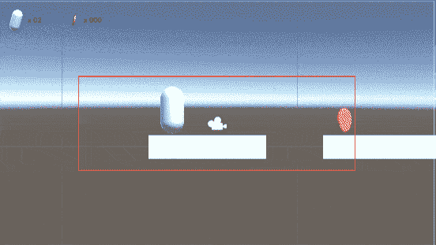
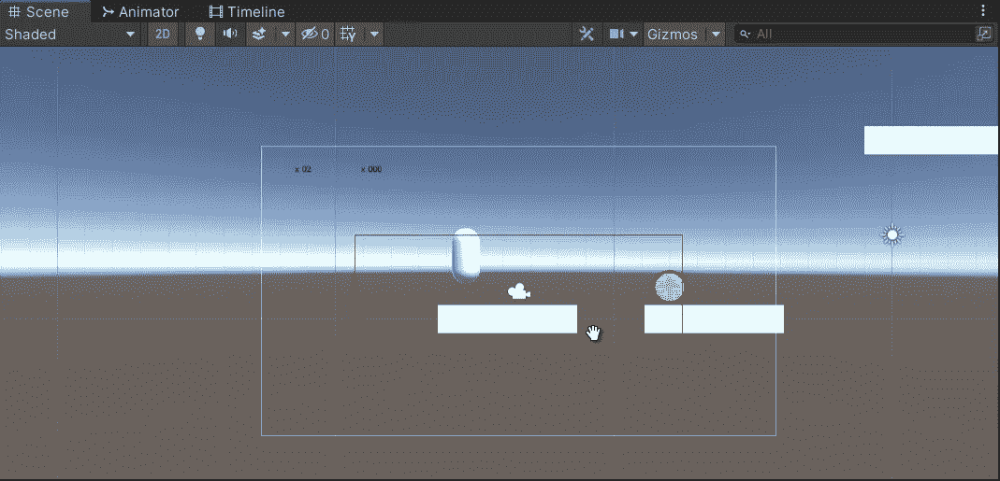
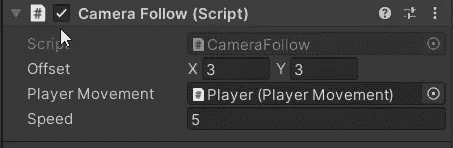
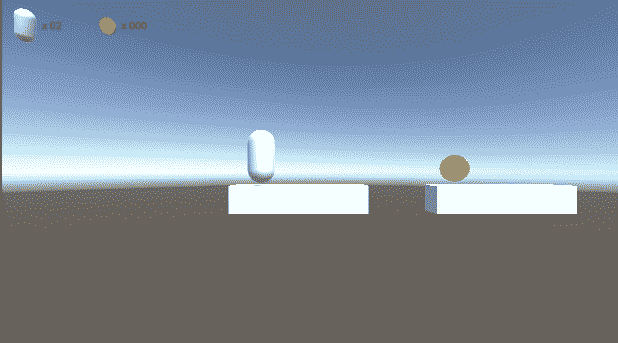

# 相机跟随逻辑

> 原文：<https://medium.com/nerd-for-tech/camera-follow-logic-37aa550f3409?source=collection_archive---------6----------------------->

**目标**:让摄像机跟着角色…但不只是跟着，不只是一直跟着

前面有很酷的东西！

我想让摄像机在移动时跟随球员，但并不总是这样。我的意思是，我不希望摄像机固定在播放器上，并总是随着它移动。

为此，你只需要让相机成为玩家的孩子，设置一个相对位置，当环境在玩家周围移动时，玩家就会固定地出现在屏幕上。我不喜欢它。

我在寻找更类似于《超级马里奥世界》的东西:你可以在屏幕上移动马里奥，而不用让摄像机跟着他，直到他在每个方向(上、下、左、右)达到某个阈值。在这种情况下，只有在这种情况下，摄像机移动并跟随他。

为了更清楚，让我们看看这个。

红色的矩形是一个**小发明**，画在屏幕上，如果你愿意，也可以是相机。它代表了我们的阈值:当角色到达它的边界时，我们必须用相机适当地跟随它，但是如果我们停留在它里面，相机就静止不动。

让我们建立这个，包括小发明！

我们将有一个脚本附加到摄像机上， *CameraFollow。*让我们从矩形计算开始。

**摄像机的正交尺寸**属性是以像素为单位的屏幕宽度的一半，而纵横比是纵横比(例如 16:9)。

我们的阈值将存储在 vector2 字段中，我们只需要一半的测量值，因为检查将在两个方向上进行。我们从屏幕尺寸中减去一个偏移值(也存储在 vector2 字段中):值越大，阈值矩形越窄，如果为零，我们将屏幕作为阈值，只有当我们到达屏幕边界时，摄像机才会跟随。

现在我们想画矩形，这样我们就可以通过 inspector 来调整它，并对将要发生的事情有一个更清晰的了解。

> 记住小发明是画在场景视图上的，而不是游戏视图上。

方法`OnDrawGizmos()`在场景视图上连续绘制小控件。我们选择颜色，通过计算设置阈值，然后画一个立方体，立方体的中心是摄像机的位置，尺寸是一个向量 3: x 和 y 是阈值乘以 2，z 无关紧要。

现在是遵循逻辑的时候了。

它比看起来简单得多。这个方法将在`Update()`中被调用，所以每一帧:我们计算角色和摄像机之间在 x 和 y 轴上的距离，作为 x 和 y 分量差的简单绝对值。

我们将摄像机位置存储在一个变量中，如果距离大于相应的阈值，我们用相应的球员位置替换位置分量:如果我们正好在阈值之上，新的摄像机位置必须具有与球员位置相同的 y 和 x。

现在下面，如果我们设置新的摄像机位置，我们将有一个快照效果(不难看，但不是我们想要的)。相反，我们将使用`MoveTowards()`方法设置该位置(忽略本地属性，由`transform.Translate()`考虑)。

至于速度:我们将有一个自定义的速度，但由于玩家可以克服这一点(例如，在下降和积累速度)，我们将使用这个自定义速度和实际玩家速度之间的最大值，以避免两个主要缺陷:

1.  相机跟随太慢(相机速度比玩家一慢很多)
2.  微捕捉(相反的情况)

让我们看看结果，无论是在游戏中还是在场景视图中。

