# Unity 中的摄像机观察系统

> 原文：<https://medium.com/nerd-for-tech/camera-look-system-in-unity-3404fb7071a0?source=collection_archive---------8----------------------->

我让我的球员在移动，现在我需要摄像机跟踪他们。

你能做的第一件事是把你的照相机设置到你想要的地方，并把它交给播放器。这将使摄像机跟随玩家。

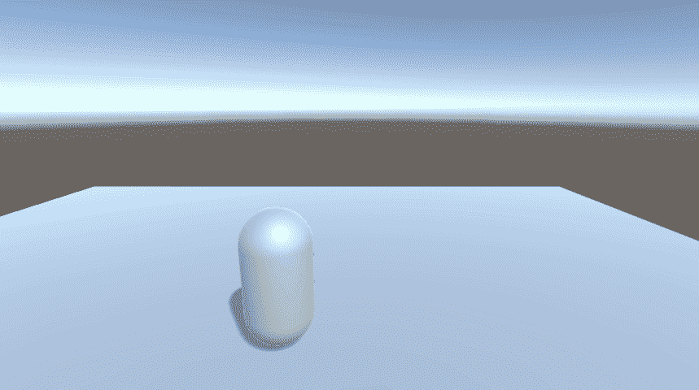

在玩家脚本中，您将需要设置对主摄像机的引用。

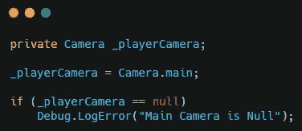

创建一个新方法来保存相机控件的代码。创建两个变量来保存鼠标在 x 和 y 轴上的移动值。

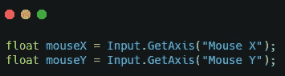

要让玩家左看右看，创建一个新的向量 3，它将是玩家的 transform.localEulerAngles。将向量 3 的 y 值设置为正，等于 mouseX 输入乘以一个灵敏度值。使用**四元数设置玩家的旋转。AngleAxis(currentRotation.y，Vector3.up)** 。

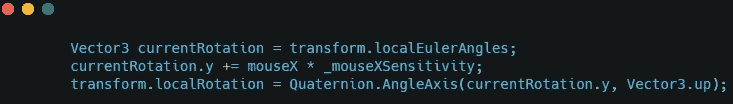

注意:你可以在脚本的顶部设置一个敏感度变量，就像玩家速度变量一样

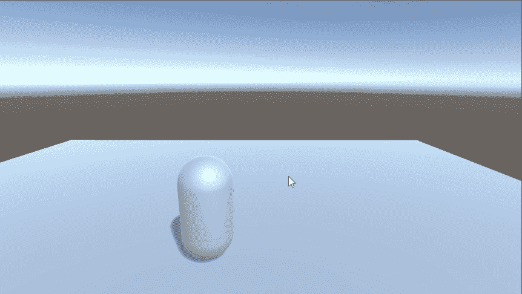

对于垂直相机运动，你做一些非常类似的事情。唯一的两个区别是，你将减去 moveY 输入，你将钳制 x 值，这样它们只能向上和向下看。

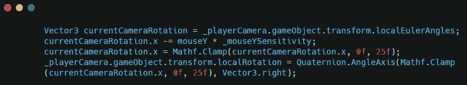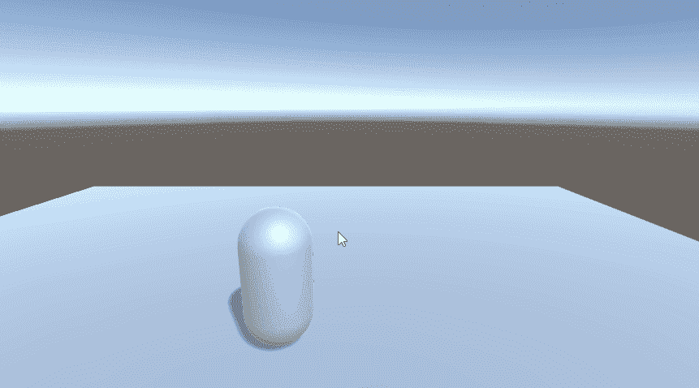

这样的话，你也会注意到玩家并没有朝着摄像机面对的方向移动。

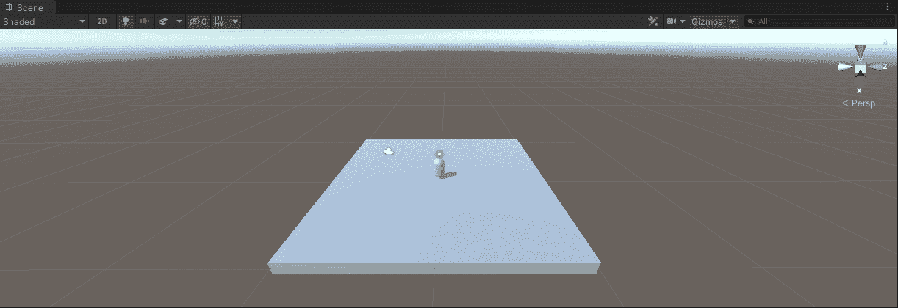

这是因为你需要将玩家的速度从局部空间转换到世界空间。这是通过使用 transform 完成的。TransformDirection()。

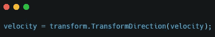

这将解决该问题。

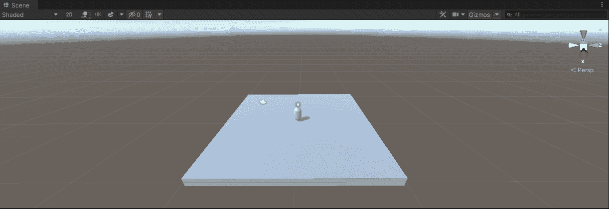

你可以做的最后一件事是像大多数射击游戏一样将光标锁定在屏幕中央。

这可以通过使用 CursorLockMode 在游戏开始时锁定光标，并通过点击 escape 键来解锁光标来实现。

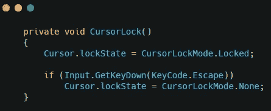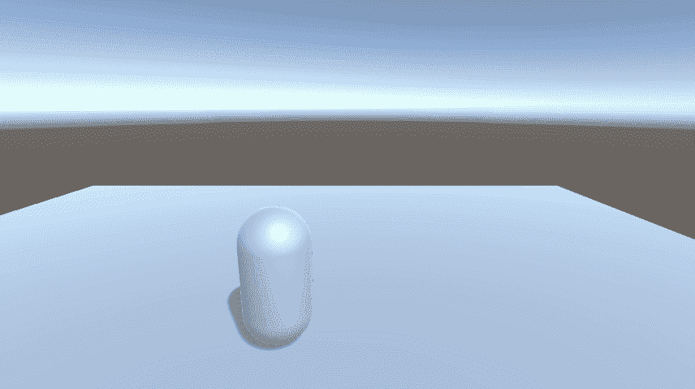