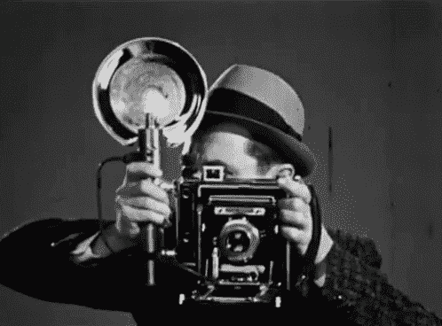
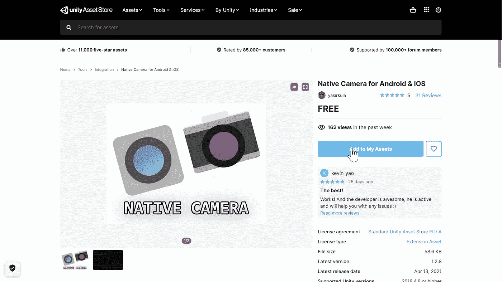
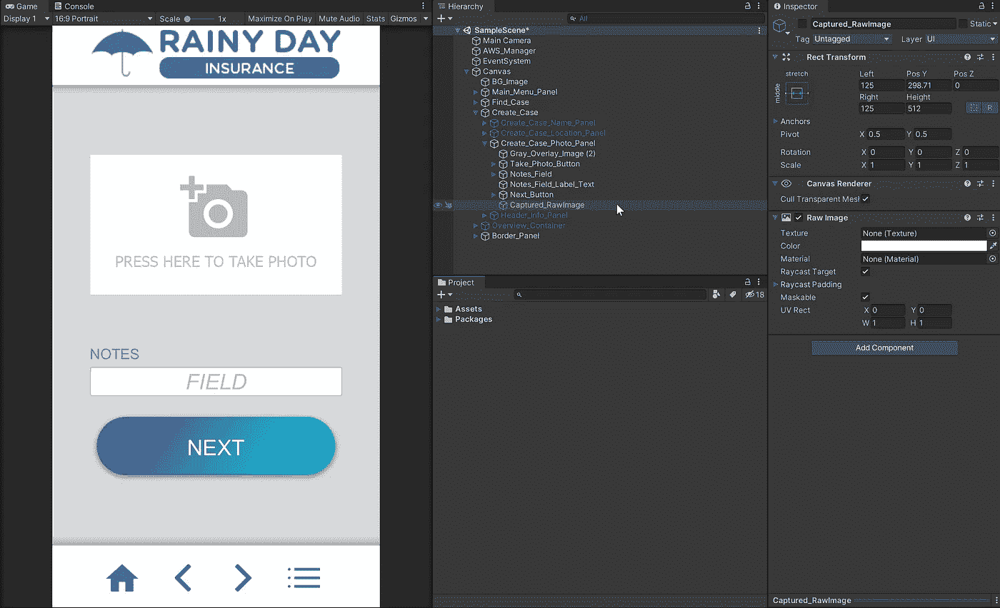
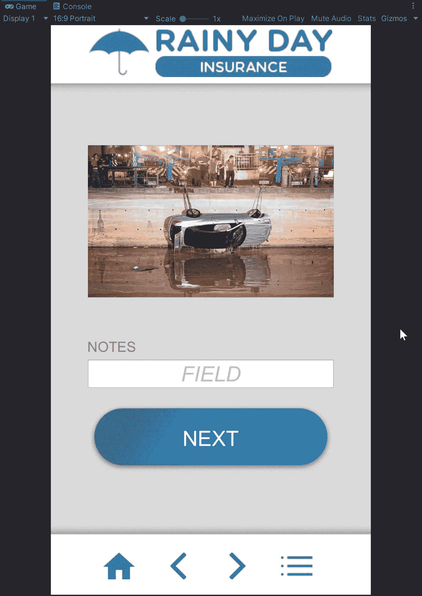

# Unity 的摄像头插件

> 原文：<https://medium.com/nerd-for-tech/camera-plugin-for-unity-4722908eb943?source=collection_archive---------9----------------------->

## 在 Android 和 iOS 上捕捉照片和视频

说茄子！

为我们的保险应用程序创建案例的下一步是允许用户拍摄碰撞现场的照片。访问设备的外设可能很棘手，因为可能的配置范围非常广泛。与其构建一个系统来从各种设备中检索照片，不如让我们在 Unity Asset Store 上找到一个适合我们需求的插件。

我将使用的是一款名为 Android & iOS 的[原生相机。](https://assetstore.unity.com/packages/tools/integration/native-camera-for-android-ios-117802)

打不过免费的！

如果我们是为 Android 构建的(我们是),那么在我们导入包之后，就不需要进一步的设置了。我们现在需要的是编码行为。

大部分代码将来自[插件的 GitHub](https://github.com/yasirkula/UnityNativeCamera) 中的例子。

除了实际拍摄照片的插件作者的片段之外，我们需要完成以下具体步骤:

> 将相机捕捉的纹理分配给 Captured_RawImage 对象的纹理
> 将 Captured_RawImage 对象设置为活动状态
> 保存捕捉图像的路径以备后用

代码方面，C#看起来像这样:

photoTaken 变量在检查器中被分配给场景中的 Captured_RawPhoto 对象。当它被激活时，它会成为用户界面的顶部元素，并隐藏拍照按钮。

哎呀。

这就是我们所需要的！

明天，我们将把用户输入的所有信息打包，用 AWS S3 发送到云端！在那之前。

