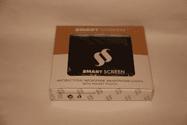
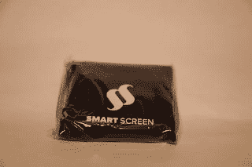
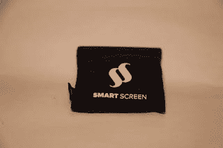
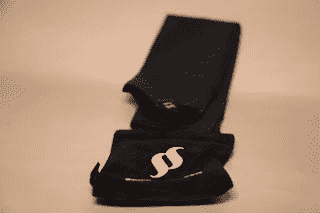
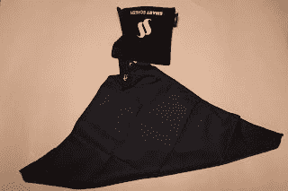

# 一块布能有这么巧吗？

> 原文：<https://medium.com/nerd-for-tech/can-a-cloth-be-this-clever-22fcece59c64?source=collection_archive---------7----------------------->

苹果公司推出了一种名为“抛光布”的新产品，这是一种用于清洁屏幕的微纤维布，富含水果味，价格也很实惠。

所以现在有了[智能屏幕](https://www.smartscreen.store)，一种抗菌的微纤维智能手机布。

这种布装在一个盒子里，显然是为零售设计的，因为顶部有一个塑料标签，上面有一个孔，适合挂在什么东西上。

打开盒子是一场斗争，因为内部是在一个标签后面，看起来应该拉，但只需要稍微移动。

布出来了，但它被密封在一个密封的塑料包装里。这似乎是不必要的，因为它首先被密封在盒子里。撕开开口，露出装有布的袋子。

这个袋子大约 2 英寸见方，里面装着折叠的布料，布料由一片材料固定，由一个弹起器支撑。

然后布料展开

这种布料浸有蓝盾纳米银粒子，据制造商称，这种粒子可以杀死 99%的细菌，并且在 30 度下洗涤 15 次后仍能存活。

作为一种布料，它确实可以清洁屏幕(尽管不可能测试杀菌性能的准确性)。

直接从[智能屏幕](https://www.smartscreen.store)购买只需 9.95 英镑，尽管高端市场的“金色”版本售价为 11.50 英镑(或 4.40 英镑的替换金色布料)。

标准颜色包括海军蓝、石板灰、粉蓝、藏红花黄、极地白和驼色。

我猜它的功能和水果味的一样(尽管从未测试过那种特殊的布料)。

*原载于*[*http://eurotechnews.blogspot.com*](https://eurotechnews.blogspot.com/2021/12/can-cloth-be-this-clever.html)*。*