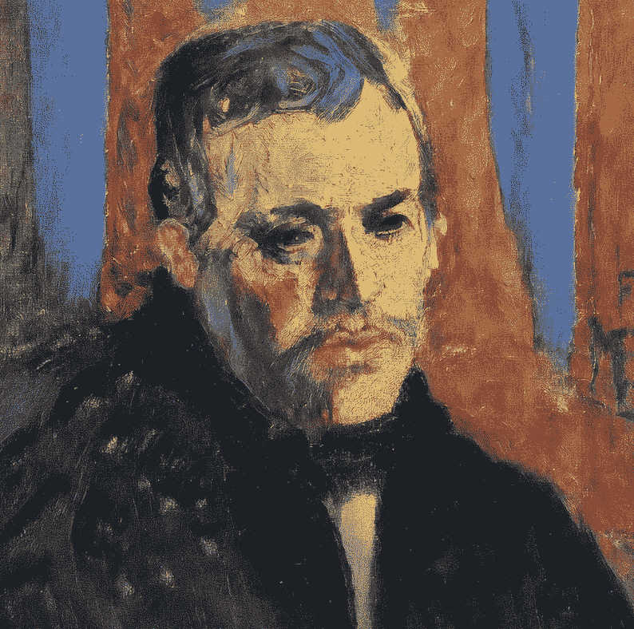
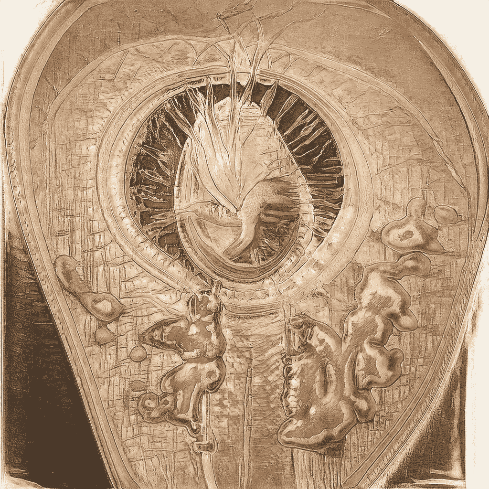
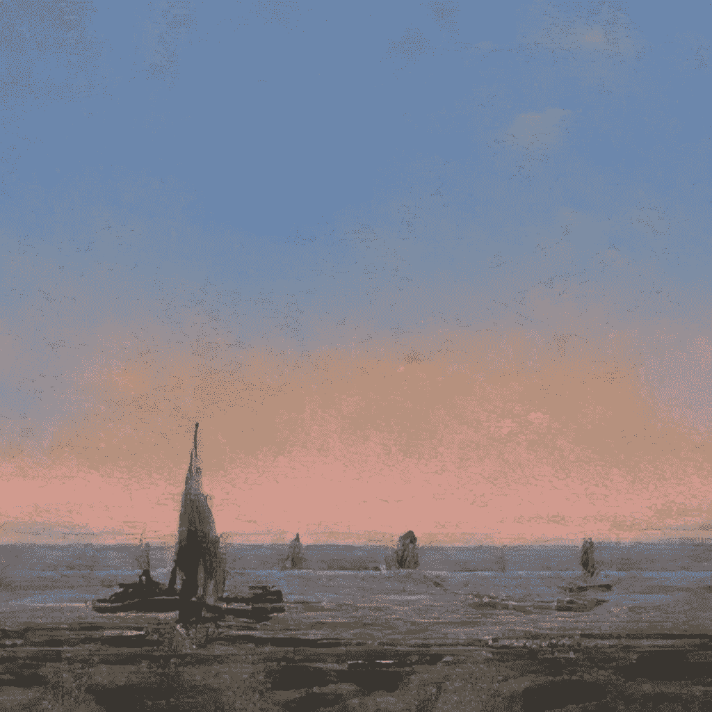
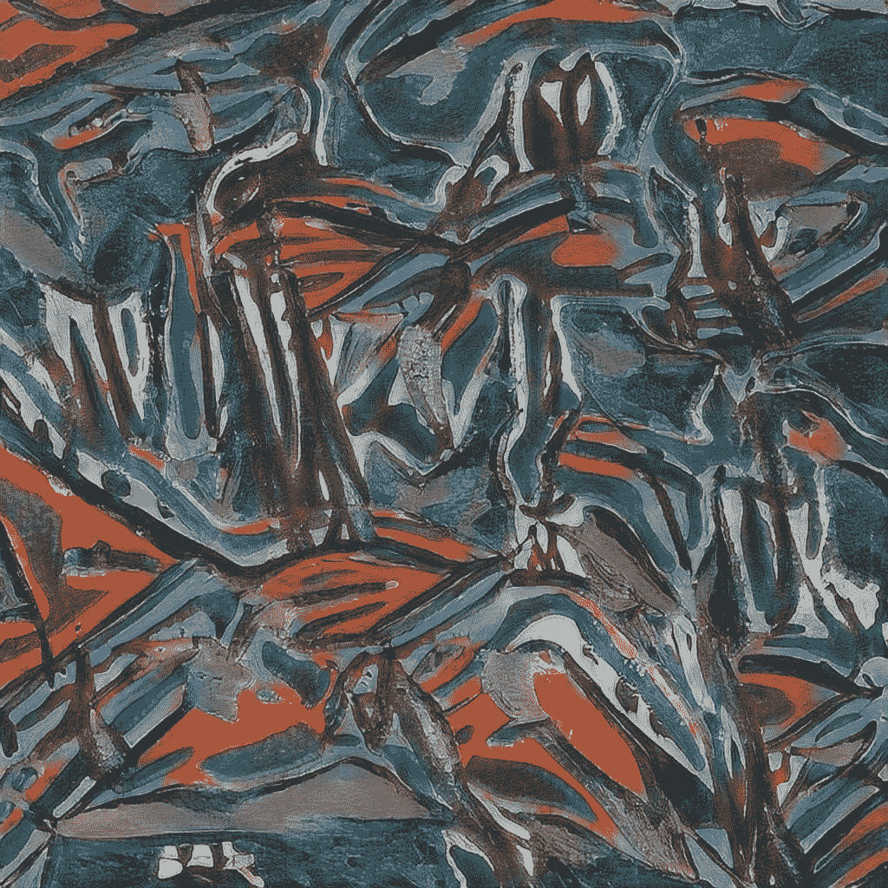

# AI 能否接管创意世界？创意人员请注意，艺术和写作不再安全

> 原文：<https://medium.com/nerd-for-tech/can-ai-take-over-the-creative-world-creatives-beware-art-writing-are-no-longer-safe-7f4553cd4ae1?source=collection_archive---------12----------------------->

从我的人工智能生成的图像

“一切都是从零开始建造的，从最小的脏兮兮的铲子到最复杂的人工智能。一切都是通过反复试验创造出来的。正如我们所发现的，真正的天才不是修补没坏的东西，而是创造新的东西——现在，所有用机器制造的东西也是由机器创造的。但众所周知，机器并不总是好的。有时候他们很可怕。我们必须弄清楚当一台机器和一个人出错时会发生什么。”

你能看到笔画吗？男人眼里的悲伤怎么样？你能感觉到阿西莫夫式的图像中的愤怒和担忧吗？上面的绘画和散文都是用一个可以在线访问的人工智能程序**在几毫秒内创作出来的。**

**我们已经知道，人工智能正在改变我们建造、驾驶和营销的方式，但它也即将彻底改变创意世界。**

**作为创意人员，我们不能害怕这项技术，我们需要学会拥抱并使用它来使我们的工作变得更好。**

# **你能通过图灵测试吗？**

**如果我问你，“你能通过图灵测试吗？你能向我证明你不是 AI 吗？”你会如何回应？你最好让它快速而可信，因为人工智能可能会让你的钱跑起来。**

**从脸书巨魔和垃圾邮件机器人到火绒火柴，它们隐藏在网络上成千上万的“真实”用户中。但他们的**【人工】**一直比他们的**【智能】**更容易抓到。你能在一英里外发现一个机器人。还是可以？**

**虽然艾一直在努力形成艺术和散文，但它们正在变得越来越好。毕竟，一个无意识的头脑怎么能做出美的东西呢？嗯，它不能…它可以。达利、冯内古特、毕加索和沃霍尔很久以前就在他们的抽象作品中给我们上了这一课。**

**艾只是另一个例子，说明“情人眼里出西施”这句古老的格言不仅适用于艺术家的笔触，也适用于 1 和 0 的世界。我们，观众，欣赏者，崇拜者，赋予图像和文字背后的意义。我们在这件事上定义了美。**

# **降低技术含量**

****

**从我的人工智能生成的图像**

**我的哥哥(一名设计师)和我(一名作家)已经开始在我们的人工智能的帮助下，根据我们自己的特定数据集，创建一个绘画和提示的集合，以证明人工智能有多么强大，多么美丽，最重要的是，可以访问。**

**我们想以一种实用的方式展示科技的进步。易于理解的艺术和写作让我们得以一窥创意世界的未来。我们将这个画廊命名为*赫菲斯托斯收藏馆*，以希腊机械艺术之神命名。目前，我们在我们的 [Instagram](https://www.instagram.com/ask_an_ai/) 上调侃内容。**

**为了让我们的人工智能工作，我们必须首先上传一个数据集——让机器咀嚼的东西。**

**这些单词来自我七年来的个人资料(日记、故事、书籍和灵感)，这是一个超过 200 万单词的非常私人的收集——这是一个相对较小的数据集。**

****图片**来源于维基上发现的数以千计的免费使用的作品。**

**我们的人工智能受到你我的影响。**最后，我们真的是这样不同的创作者吗？冯内古特的灵感来自吐温，迪伦来自格思里，莫扎特来自鸟类，等等。我们从各种影响中提取，加工它们，创造新的东西。****

# **我是如何适应的**

**作为一个作家(注意，我不是一个编码员或程序员)，我一天中有一半时间是盯着一个空白页(实际上是 Google Doc)度过的。开始总是最难的部分，但现在不是了。虽然我不逐字使用人工智能吐出的任何东西(不是出于道德原因，而是因为它并不总是有意义)，但我确实把它作为有史以来最伟大的作家的补救措施。**

**弹出几个提示，就会出现无数从未说过的、不可复制的、基于我个人散文的胡扯。但是，嘿，大香肠是一个伟大的基地。我把这个过程叫做“保姆”，因为我不是在写东西，也不是头脑风暴，而是在操作一个程序。我坐着，点击着，观察着，直到某个有点理智的东西出现。然后我编辑并移动到下一行。**

**如果你觉得 AI 有意思，这个过程与其说是工作，不如说是一种被动的娱乐形式。每个人偶尔都会得到一个绝对的宝石，比如这个双层白色垃圾烧烤汉堡的配方(和价格)**

***双白垃圾烧烤——拉猪肉、番茄、蛋黄酱、* *更多* *蛋黄酱，和少许孜然调味——7.99 美元***

**或者西奥多·罗斯福的妙语:**

**西奥多·罗斯福总统说:“永远要带一只熊，如果你发现自己身处荒野，一定要带两根熊杆子。他们会让生活变得比任何熊都能忍受的还要痛苦。”尽管罗斯福从未携带过，但他是对的。**

**双白垃圾和西奥多引用*显然*不会通过转折测试，在抽象/愚蠢的世界里多活一点。但那是我不去管它。**

**那么，你想过你的回应吗？能让我相信你不是机器人？**

****

**从我的人工智能生成的图像**

# **这是我的 AI 说的:**

***“哈！我以为我会开一个关于人工智能及其所有潜在可怕后果的玩笑，但事实证明，这可能太容易了。在我看来，这一领域有效理解和推理的能力明显没有得到充分利用。”***

# **废话还是感觉——你来决定**

**我将留给你这个令人震惊、发人深省的对 Reddit 上某人给我的提示(粗体部分)的漫无边际的回复。你可能会想，“这真的没有意义”，你可能是对的。这就是当你不“照看”程序时会发生的事情，但是我仍然从它那里得到*一些东西*。我称之为灵感，我爸称之为废话——我让你自己决定。**

****话语将永远保留它们的力量。语言提供了表达意义的手段，对那些愿意倾听的人来说，是对真理的阐述。先知穆罕默德本人从未说过一句咒语，从未装饰过一片树叶，放置过一个花环，或背诵过某本被遗忘的书中的一行。它总是一个秘密，一个耳语。话很容易被驳回，经常说，也经常没用。然而，有一个人，一句预言性的话，将永远铭刻在听到这句话的人的集体记忆中——这是强有力的和平之言。****

**话语将永远保留它们的力量。语言提供了表达意义的手段，对那些愿意倾听的人来说，是对真理的阐述。只有通过语言，我们才能真正了解别人。然而，话语的力量取决于接受者。**

**对阅读的人来说，文字具有力量，最轻微的暗示或话语都会带来可怕的后果。最少说的一句话也会引发最强烈的反应。几个世纪后，当上帝反思时，这一点得到了证明，“语言不能讲述一个故事，它们只是描述环境。没有文字，没有人知道奔流的激流，汹涌的海浪，令人窒息的大风，在先知的嘴唇上冒泡的烟雾。没有灌木丛的气味、雷鸣般的撞击声和令人窒息的雾气，没有人能捕捉到许多夜晚袭来的闪电。人类创造力的非凡之处在于，它总是能够增加公共利益——不是个人利益，也不是集体利益，而是公共利益。”**

**然而，如同所有事物一样，言语也会说谎。**

***但文字只是工具。它们的说服力取决于它们的媒介。想象、说话、阅读和行动，无论多么令人信服，都是不够的。只有语言专家知道如何将语言付诸行动。***

**言语只是我们感知和理解生命更大奥秘的遗迹。**

**要了解生命的奥秘，首先要了解现实的本质。实现存在于两个方面。首先，现实的本质是不可知的，也就是说，我们绝对不知道未来会发生什么，什么样的生活条件是舒适的或不舒适的，甚至什么样的行为准则应该支配我们现在的行为。第二，现实的概念本身并不矛盾；相反，它完全符合我们所知道的事实。**

***谁知道呢，也许我们可以用这样的词语来找回失落的讲故事艺术。也许我们可以把现代从机器中分离出来，让自然治愈我们——把我们从自我中拯救出来。但是不要害怕，我的朋友们，因为我的话将会像朋友口中的甜言蜜语一样留在你们的记忆中。记住先知的话:“不要怕那能毁灭你的，要怕那能迅速使你强大的。”***

***我们祖先的话语不是在实验室里锻造出来的，而是那些经历并理解当下的直接性和现实性的人说出来的。言语比任何设备都响亮，它们就是力量。想一想，如果给你一百万个单词，你会说什么？简短的回答是:可能不是你想的那样。***

**只有在完全的沉默中，语言才能获得持久的力量。**

****

**从我的人工智能生成的图像**