# 集合方法能预测未来的干旱条件吗？

> 原文：<https://medium.com/nerd-for-tech/can-ensemble-methods-predict-future-drought-conditions-534919b13290?source=collection_archive---------11----------------------->

Lambda 学校第二单元组合项目

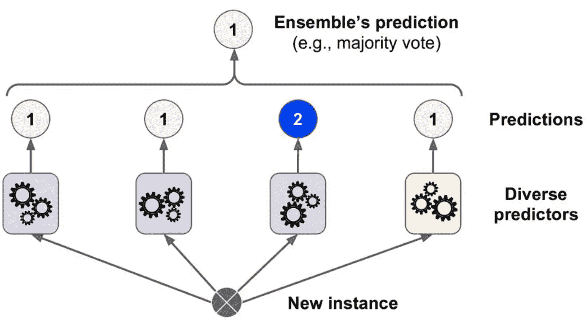

Bagging 整体方法示例

# 预测天气状况

你曾经试图预测天气吗？你有没有穿上一件夹克，以为几个小时后就会下雨，结果却是清晨天空的云彩在下午就消失了？专业天气预报员怎么会给出不准确的预测呢？

这比大多数人想象的要困难得多！

过去四周，我一直在研究有监督的机器学习，将输入/输出示例提供给计算机，然后让它学习一个函数，根据之前输入的示例将未来的输入映射到输出。具体来说，我研究了如何为了预测建模而设计监督学习方法，在预测建模中，过去的归纳推理用于对不远的将来进行预测。

在我的研究接近尾声时，我尝试了*集成方法、*机器学习技术，这些技术将多个模型结合起来，以产生一个最佳的预测模型。我掌握的更简单的模型(线性、岭型、逻辑、决策树)只能进行归纳预测，而基于集合的模型(随机森林、梯度推进)、**meta**-归纳预测是可能的！当预测可以基于先前事件所做的预测时，基于先前事件所做的预测有什么好处呢(比如预测明天早上太阳将从东方升起)！

考虑到这一点，我用一个相当困难的任务挑战自己，**预测整个美国大陆的干旱情况**。我希望确认这些集合方法是否足以做出可靠的天气预报，或者我是否需要更多的 ML 技术。有什么比这个项目更好的方法来衡量我的技能？

# 争论我们的数据

我们将使用由 Christoph Minixhofer 提供的来自 Kaggle 的数据集，该数据集测量了美国大陆的干旱严重程度。这些数据集是通过美国宇航局的地球科学/应用科学计划、内布拉斯加大学林肯分校的国家干旱缓解中心和协调世界土壤数据库获得的。

我们将使用的主要数据集包含 2000 年至 2020 年的天气数据和干旱信息，已经预先分为训练集、验证集和测试集。这使我们的工作变得容易得多，因为我们的工作不仅容易访问，而且是预先配置好的！有了验证数据，我们就可以运行度量测试来比较我们的预测模型的性能，而无需让他们查看测试数据集。这允许我们回过头来调整我们模型的超参数，根据验证集测试它的指标，并在需要时再次调整。

我们手头的补充数据包括土壤条件的信息。我们将使用这个额外的数据集向我们的模型添加更多的功能。我确信他们会改进我们将要做的预测！

## 读入它

在将我们的四个 CSV 文件分配到文件路径并将它们读入各自的 pandas 数据帧之后，我查看了这些列。我们的目标向量“得分”列配备了从 0.0 到 5.0 的干旱严重程度，但也有相当多的空值。最初，我对此感到困惑。为什么最重要的列中会缺少值？

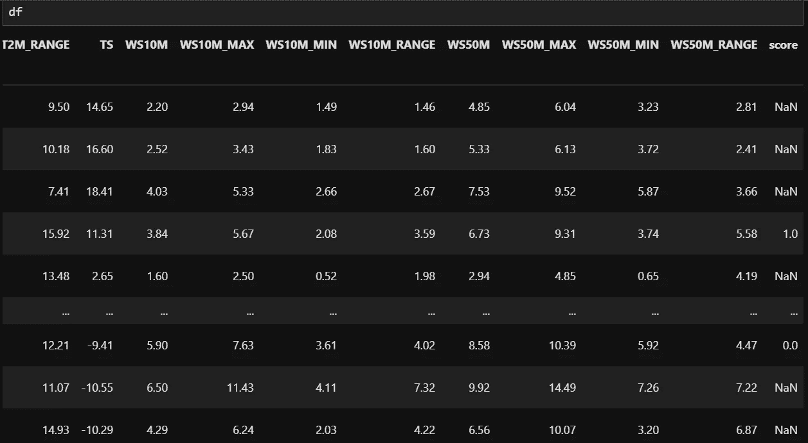

我忧心忡忡地回到 Kaggle，查看我们数据集的描述，以及它的创建者与对他提供的内容感兴趣的其他数据集的对话。我发现他实际上只获得了**每周**的干旱严重程度分数，而气象指标(我们的数据帧列/变量)包含了**每天**的数值。

## 电子设计自动化(Electronic Design Automation)

回到我们的笔记本，我用 pandas-profiling 进行了一次自动化的探索性数据分析，以更好地了解我们这里有什么。

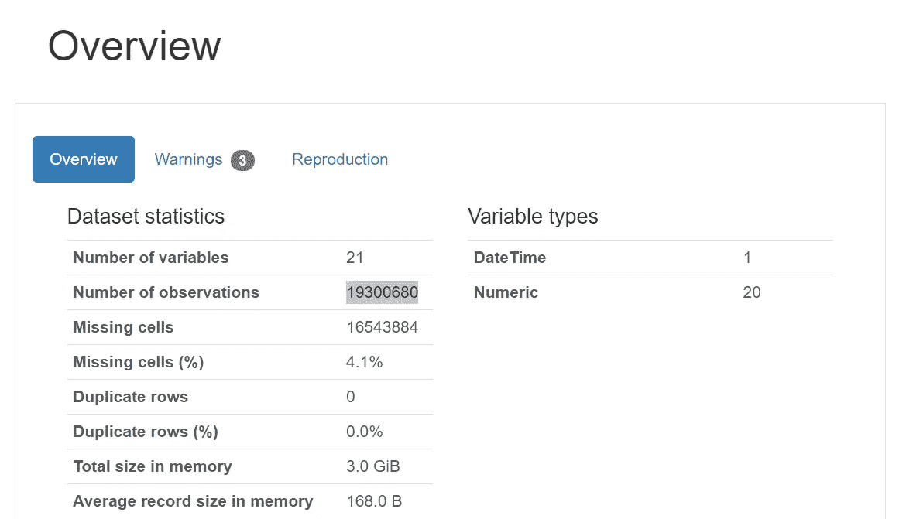

有了 19，300，680 **百万**次观察，我根本无法在我的电脑上训练基本模型，更不用说*调优的集合模型*。如果我配备了 GPU，我将能够处理这个数字，这将允许我处理无数必要的计算，以使我的模型适合这些复杂的元算法，但它们太贵了，而且供应不足。

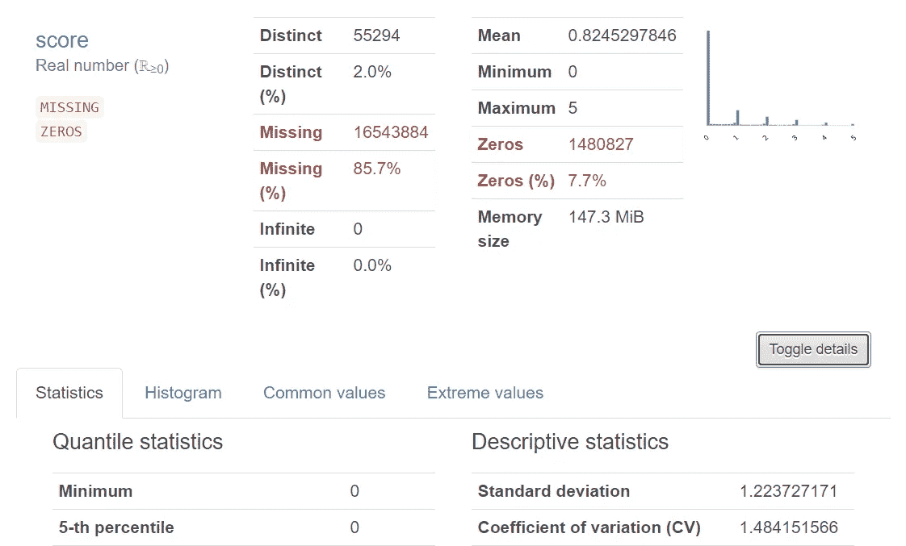

从概要报告中，我还发现对于那些*不为空的值，它们甚至没有被分成 6 个不同的类！这些值中的许多不仅仅是 0.0、1.0、2.0、3.0、4.0、5.0，而是 0.84892、1.63519、2.64792、4.89992！数值不是**离散**，而是**连续**！*

如果我们稍后将使用的模型和度量标准是为解决分类问题**而构建的，那么它们将无法很好地处理连续值。如果我们继续使用这些连续的值，我们必须把这个分类问题当作一个**回归问题。****

**在这一点上，我甚至怀疑我是否能运行一个模型，更不用说获得可靠的预测了。用有限的计算资源处理太多的数据，以及一个不能明确说明是分类还是回归的问题？我正要放弃并重新开始这个项目…但是…**

## **切割范围**

**鉴于我们的数据集提供者声称他实际上只有每周干旱分数，我想知道他是如何处理这个数据集的。在同样张贴到 Kaggle 的入门笔记本中，我发现他使用内插法用他实际拥有的周值来填充那些缺失的值。这些平均值可能是正确的，符合当时真正的干旱严重程度，但它们是计算出来的，T2 的猜测，而不是实际记录的。所以我放弃了！我还将这些值向上取整，使它们按照我想要的方式离散！**

**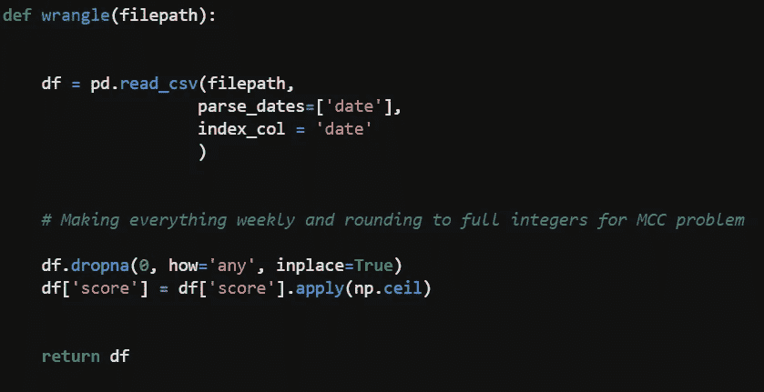**

**所有这些都在一个可重复的 wrangle 函数中完成**

**嘿，为什么要让我们的工作变得不必要的复杂呢？**

**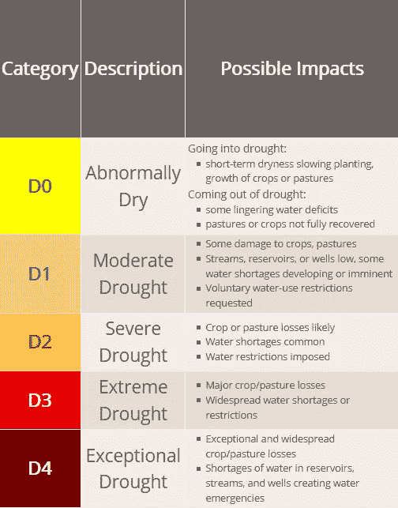**

**干旱严重程度分类词典**

**我们专栏里的分数和上面的不太一样。用这个编码“得分”值不会有帮助，因为 0.0 代表没有干旱，这不包括在国家干旱缓解中心的分类中。**

****干旱严重程度评分词典**:**

*   **0.0 = **无干旱****
*   **1.0 = **D0** : *异常干旱* —进入非干旱期。短期干燥或长期缺水**
*   **2.0 = **D1** : *中度干旱*——一些水资源短缺正在发展或即将到来。对农作物和牧场的一些损害**
*   **3.0 = **D2** : *大旱*——缺水是常事。限制用水。可能的作物和牧草损失**
*   **4.0 = **D3** : *极度干旱*——大范围的水资源短缺和/或限制。农作物/牧草的重大损失。**
*   **5.0 = **D4** : *异常干旱*——水库、溪流和水井中的水资源短缺引发了水资源紧急事件。异常和广泛的作物和牧草损失。**

**阅读和探索我们的土壤数据集是没有麻烦的，不需要任何类型的特征工程或争论！**

**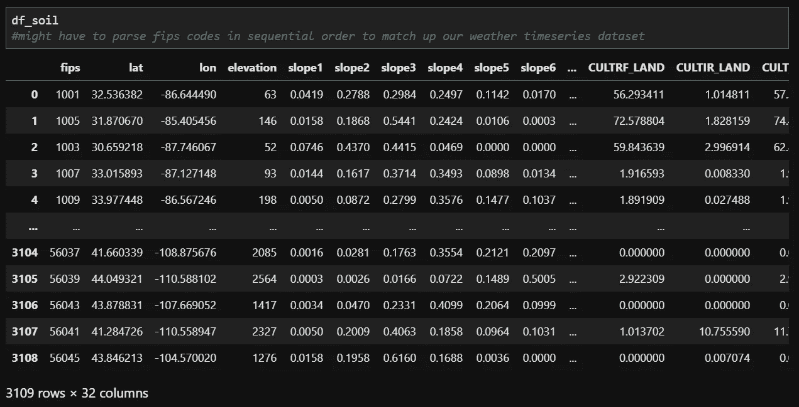**

## **合并数据集**

**现在，为了利用我们的补充土壤数据集中的要素，我们必须将它们合并。他们都有一个“fips”专栏，所以我们就在那里做。**

**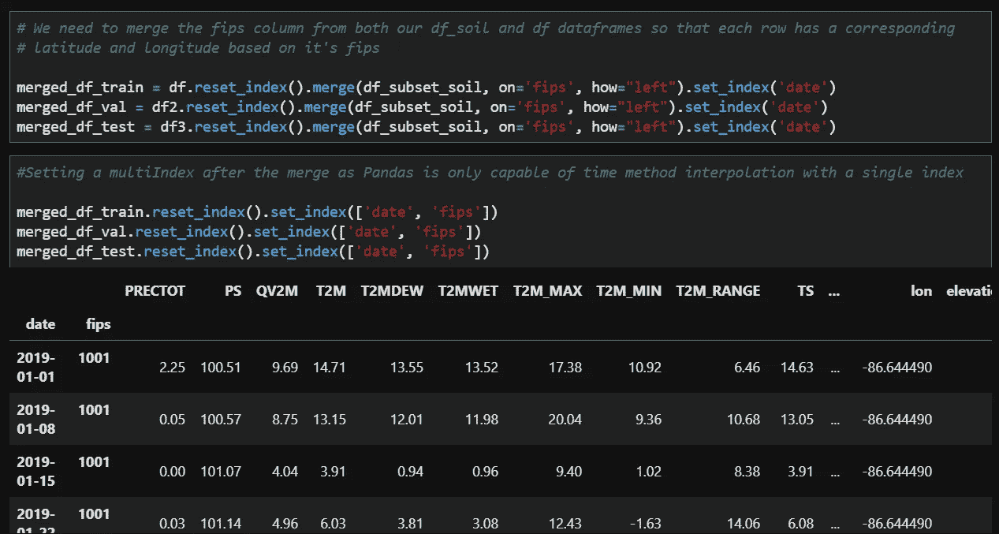**

**合并土壤和天气/干旱预分割数据集**

**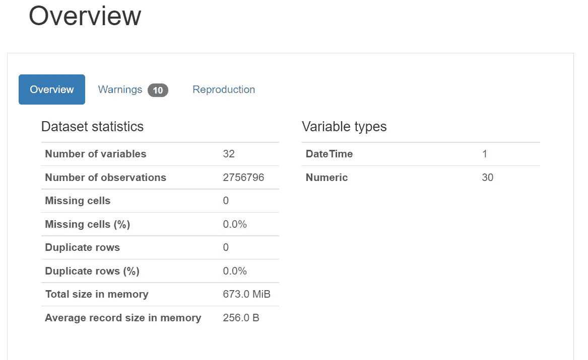**

**完整训练数据集的概况报告**

**一个数据字典，这样我们就可以知道和理解这些特性是什么，以及它们如何影响我们模型的性能。**

## **完整的数据字典**

*   ****WS10M _ MIN**—10 米处的最低风速(*米/秒*)**
*   ****QV2M**—2 米处的比湿度( *g/kg* )**
*   ****T2M _ 范围**—2 米处的温度范围**
*   ****WS10M**—10 米风速(*米/秒*)**
*   ****T2M**—2 米处的温度**
*   ****WS50M _ MIN**—50 米处的最低风速( *m/s* )**
*   ****T2M _ 最大值**—2 米处的最高温度**
*   ****WS50M**—50 米风速(*米/秒*)**
*   ****TS** —地表温度**
*   ****WS50M _ RANGE**—50 米风速范围(米/秒)**
*   ****WS50M _ MAX**—50 米处的最大风速(米/秒)**
*   ****WS10M _ MAX**—10 米处的最大风速(米/秒)**
*   ****WS10M _ RANGE**—10 米风速范围(米/秒)**
*   ****PS** —表面压力( *kPa***
*   ****T2 mdew**—2 米处的露点/霜点**
*   ****T2M _ 最小**—2 米处的最低温度**
*   ****t2m Wet**—2 米处的湿球温度**
*   ****PRECTOT** —降水量( *mm 天-1***
*   ****fips** :美国县 fips 代码**
*   ****纬度**:纬度**
*   ****经度**:经度**
*   ****标高**:中间标高(米)**
*   ****WAT_LAND** :映射的水体**
*   **NVG 土地:贫瘠/植被非常稀少的土地**
*   ****URB _ 土地**:建设用地(住宅&基础设施)**
*   ****GRS _ 土地**:草地/灌木丛/林地**
*   **林地:林地，根据 2000 年森林资源评估土地统计数据校准**
*   ****CULTRF_LAND** :降雨耕地，根据 GMIA 4.0**
*   ****CULTIR_LAND** :灌溉耕地，根据 GMIA 4.0**
*   ****CULT_LAND** :总耕地**

**我们终于完成了清理和争论我们的数据！2，756，796 百万行更易于管理。我一想到如果*我真的*试图*跑完全部 2100 万*会发生什么就不寒而栗！**

**这样一来，让我们来构建您的模型吧！**

# **这是什么类型的问题？**

**在我们建立我们的模型之前，我们需要确定什么问题或模型是要解决的，要么是**分类**要么是**回归。**预测建模就是解决如何训练计算机将函数从输入映射到输出的问题。对于回归问题，我们打算解决训练机器预测连续量的输出的问题。而对于分类问题，我们要解决的是离散类标签的预测输出。**

**我们希望预测干旱严重程度的等级，用浮动值 0.0、0.1、0.2、0.3、0.4 和 0.5 表示。这给了我们六个类，比通常在分类问题中发现的两个二元类多。这意味着我们有一个**多类分类问题**。**

**我们正在构建这个模型，以便如果它能够根据我们的测试数据(*2000-2016 年干旱得分*)可靠地预测我们的测试数据(*2019-2020 年干旱得分*)而不会过度拟合，我们可以配置它以预测整个 2021 年及以后的干旱得分。对于这个项目，我们只关心根据我们的测试数据确定我们的模型的可靠性或性能。这里没有全面部署，那要等等了！**

## **建立基线**

**在将我们的数据框架分成目标向量和特征矩阵之后，我们在训练它之前，测量我们的模型能够多好地做出预测*。如果不超过 50%，那么一个随机的猜测就和我们的模型一样有预测能力。如果低于这个值，我们需要更多的特征或者更多的观察。***

**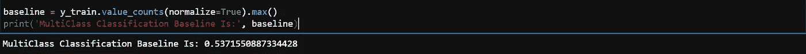**

**这比随机猜测稍微好一点。希望能高于 53%。我们只需要训练它，看看它是否有进步。**

# **“助推和装袋”**

**集成方法可以组合多个估计量的预测，以提高单个估计量的稳健性。集合方法有三种，*装袋*、*助推*、*收缩*。**

***Bagging 方法*使用 bootstrap 创建同一个训练集的多个副本，然后为每个副本拟合一个单独的决策树。一旦我们森林中的所有树都被拟合，它们就被组合起来创建一个单一的预测模型。**

***Boosting 方法*类似于 bagging，尽管它们的不同之处在于决策树是顺序生长的，其中每个连续的树在生长之前使用它前面的树的计算误差率。鉴于此，最终的提升树将被用作我们唯一的预测模型。由于每棵树都是按顺序生长的，所以它们不能像套袋法那样相互平行。它慢得多，但也准确得多。**

**由于我缺乏收缩的经验，我将集中讨论前两种方法。**

## **随机森林模型**

**对于装袋模型，我选择了 scikit-learn 的， **Random Forest。****

**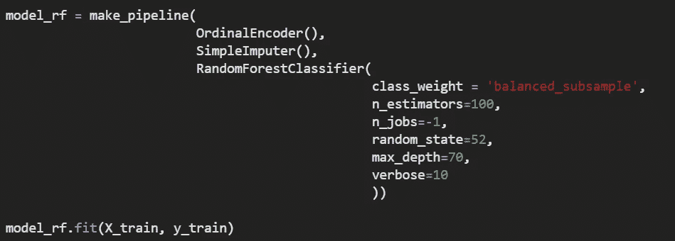**

## **XGBoost 模型**

**至于我们的 boosting 模型，我选择了 XGBoost，因为它的算法优于 sci-kit learn 的 GradientBoost。**

**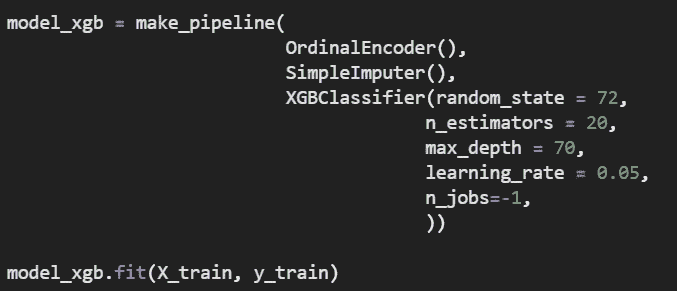**

# **确认模型性能**

**似乎过了几个小时，两个模特终于完成了训练。现在，我们需要运行一些指标来确认它们是否在准确性方面有所提高。**

## **模型的准确性**

**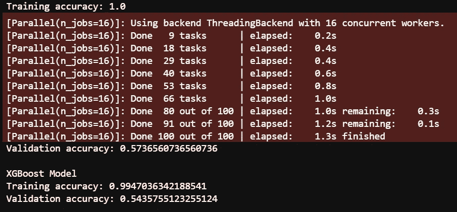**

**我们的训练精度太好了，而我们的验证精度几乎没有提高。随机森林胜出。**

## **模型的 MAE**

**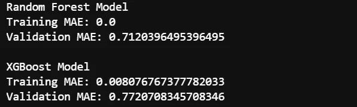**

**使用平均绝对误差作为模型性能的另一个度量，我们看到训练并不像上面的准确度分数那样过度拟合，但是不存在？这不是好兆头。**

## **分类报告**

**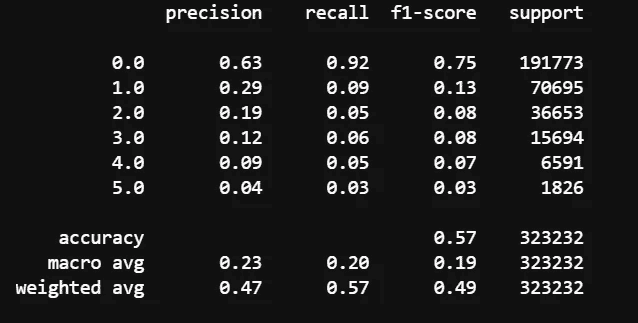**

**随机森林分类报告**

**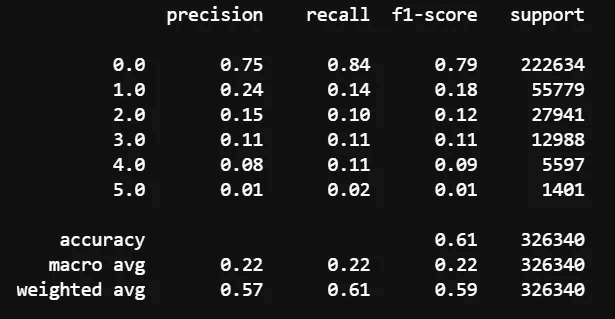**

**XGBoost 的分类报告**

**我们两个车型的 f1 分数看起来都相当不错。也许这是确认模型性能/预测能力的最佳指标？**

## **最重要的功能**

**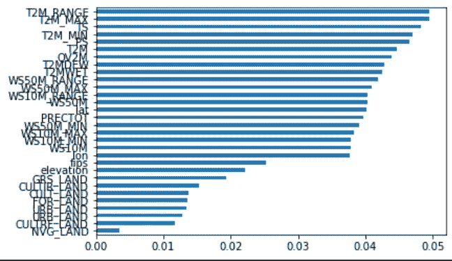**

**随机森林最重要的功能**

**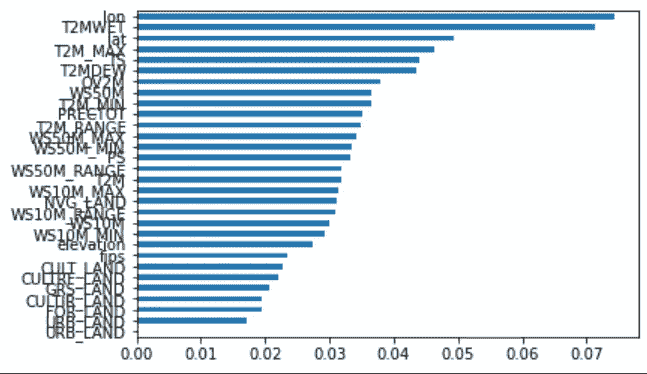**

**XGBoost 最重要的特性**

**我们两种型号最重要的特性列表。看起来我们的 XGBoost 模型是最准确的，因为经度是最重要的。这将映射到这样一个事实，即我们的大部分干旱发生在这个国家的南部，在加利福尼亚、内华达、亚利桑那、德克萨斯等州周围。今后我们将选择这种模式。**

**我也很困惑降水率没有温度范围重要，所以我做了一个可视化来更好地了解它与干旱严重程度评分的关系。**

**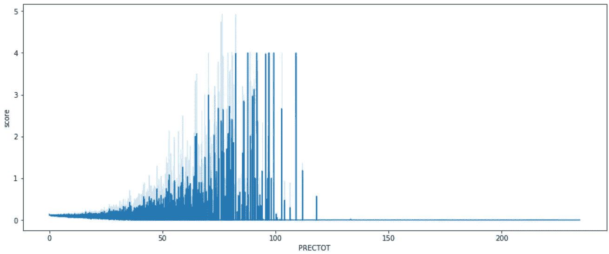**

## **混淆矩阵**

**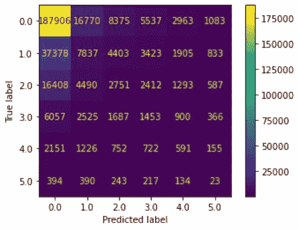**

**XGBoost 模型的混淆矩阵**

**使用我们的最终指标，我们可以确认我们的模型可以预测整个美国大陆的大部分地区**不会**经历干旱。而少数地区则处于温和范围内。**

**我承认我对 ML 模型度量的解释缺乏经验和无知。我没有花足够的时间来检查它们，所以我只能在运行这些度量所基于的函数之后，关闭我收到的输出值。也许我预测天气状况的尝试来得太早了。**

# **我们能处理所有这些数据吗？**

**我会回去调整我们的模型，但是有 300 万个观察值和这么多的 RAM，我会冒着杀死我的 Jupyter 笔记本的内核的风险。为了调整而通过交叉验证来重新训练我们的模型在计算上太昂贵了。这是我们的极限。**

# **干旱严重程度**

**在对美国大陆地区陷入轻度干旱的可能性进行预测后，我选择了我们测试数据的最后一周，*2020–12–29*。**

**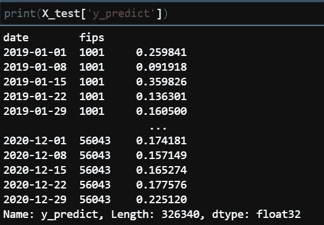**

**概率列在右栏**

**这些概率太低了。看来我们最好的集合方法模型失败了。**

**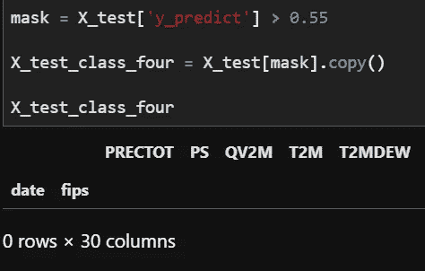**

**我们的 XGBoost 模型甚至不能预测确定性超过 *50%* 的轻度干旱的概率！这实际上比纯粹的猜测更糟糕。**

# **结论**

**我对这次尝试的野心太大了。我们的模型根本无法预测天气状况。不管这次失败，我获得了一些关于机器学习工程固有的困难和复杂性的有价值的见解。**

**坦率地说，如果我真的能在仅仅 4 周的学习后*预测天气状况，我就已经有工作了！***

***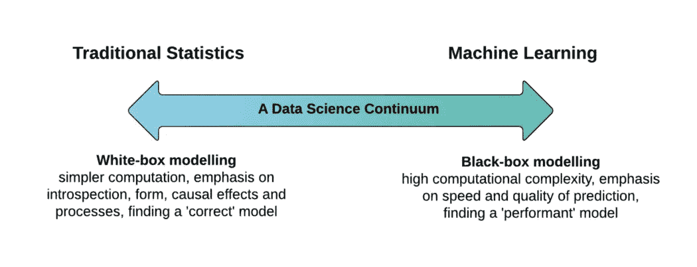***

***与我的第一个投资组合项目相比，我实际上能够为我正在处理的变量建立精确的线性回归模型。这一次情况不同了。我将不得不把上面的图片记在心里，开始学习！***

***一旦我真正熟悉了无监督和深度学习模型，我不仅能够回到这个项目并完善它，而且我将能够调查我的实际目标:**对 ML 的认识论基础发起批判**。***

***敬请关注。~***