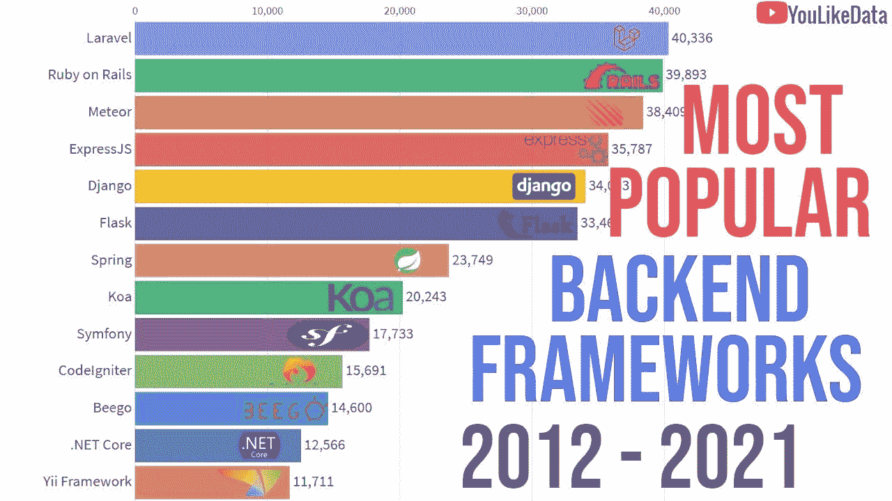
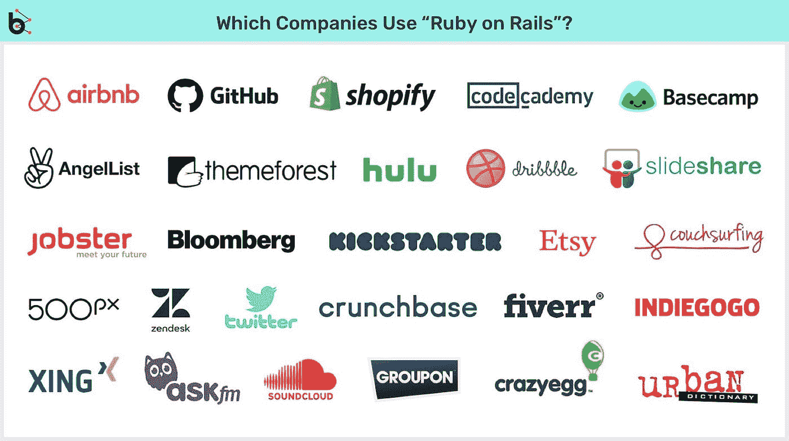
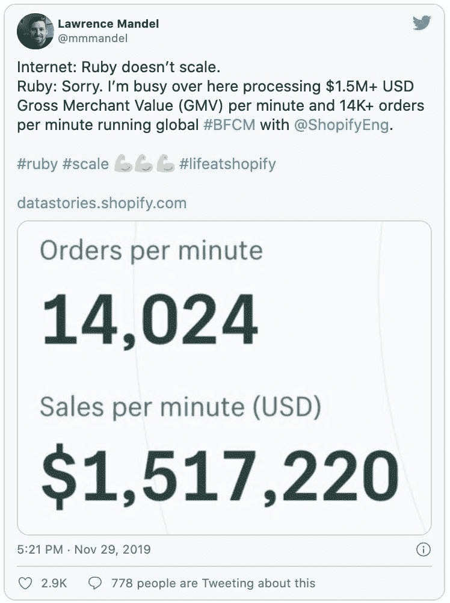

# 我可以用 Ruby on Rails 构建一个完整的市场网站吗？

> 原文：<https://medium.com/nerd-for-tech/can-i-build-a-whole-marketplace-website-with-ruby-on-rails-ab8e9c18560c?source=collection_archive---------4----------------------->

22%的 Ruby on Rails 开发人员使用这个框架已经有 10-13 年了。 [Ruby on Rails 应用程序开发](https://www.botreetechnologies.com/ruby-on-rails-development)的流行是因为开发人员可以简单地构建动态解决方案。

由于框架现在已经是一个成熟的框架，开发者对它有最大的控制权。实施问题更少，生产率更高。

公司可以用 Ruby on Rails 构建快速且可扩展的[网络应用。有多种安全措施和安全层来保护敏感数据免受网络威胁。作为一个高度直观的框架，Ruby on Rails 使开发变得更加容易，并提高了开发过程的效率。](https://www.botreetechnologies.com/blog/why-ruby-on-rails-is-widely-used-for-web-application-development/)

来源:[https://www.youtube.com/watch?v=57awvPsBE0w](https://www.youtube.com/watch?v=57awvPsBE0w)

> **阅读更多:** [**最佳 Ruby on Rails 项目示例**](https://www.botreetechnologies.com/blog/best-ruby-on-rails-projects-examples/)

# 你能用 Ruby on Rails 做一个网站吗？

Ruby on Rails 是构建强大网站的完美框架。它是一个后端框架，允许开发人员轻松地编写代码，并在几周内交付一个工作产品。

是的——Ruby on Rails 快速应用程序开发可能是该框架的最大优势。然而，你需要前端开发人员用一个类似 Ruby on Rails 的 web 应用程序框架来构建一个完整的网站。

虽然大多数公司雇佣 Ruby on Rails 开发人员来构建动态 web 应用程序，但这对于静态网站来说也是一个不错的选择。该框架对于创建金融、保险、医疗保健、物流、电子商务、娱乐、房地产、娱乐和其他行业的不同类型的网站非常有用。

# 有哪些大公司使用 Ruby on Rails？

现在 [Ruby on Rails 应用开发](https://www.botreetechnologies.com/blog/project-management-methodology-for-ruby-on-rails-app-development/)是全球许多公司的首选。从电子商务到项目管理，许多大公司都在他们的技术栈中使用 Rails。

当谈到使用 Ruby on Rails 的[公司时，人们应该知道这个框架是在巨大的社交网络平台 Twitter 的最初开发栈中。](/@botreetechnologies/top-10-ruby-on-rails-web-development-companies-in-2020-c27d793994e5)

以下是使用 Ruby on Rails 的顶级公司列表

*   **Airbnb —** 点对点在线住宿市场
*   **GitHub** —软件开发&版本控制的提供者
*   **Shopify** —建立网上商店的电子商务平台
*   **CodeAcademy —** 免费编程课在线平台
*   **AngelList —** 连接创业公司、投资者&求职者的网站
*   **Basecamp —** 面向开发者的交互式项目管理平台
*   **Kickstarter —** 面向创意专业人士的全球众筹平台

还有数百家其他公司也在使用 Ruby on Rails。这是一个高度可扩展的框架，可以同时处理数千个请求。因此，即使是每月驱动巨大流量的网站也可以轻松地为其网站使用 [Rails 应用开发](https://www.botreetechnologies.com/blog/rotate-log-files-in-rails-application-with-logrotate-in-ubuntu/)服务。

来源:[https://www . blue bash . co/blog/why-startups-should-choose-ruby-on-rails-for-web-applications/](https://www.bluebash.co/blog/why-startups-should-choose-ruby-on-rails-for-web-applications/)

> **访问这里:** [**依赖 Ruby on Rails 的 15 大理由**](https://www.botreetechnologies.com/blog/top-15-reasons-to-rely-on-ruby-on-rails/)

# 为什么使用 Ruby on Rails 进行市场开发

在疫情期间，许多零售商和公司从实体店转向电子商务和市场网站等在线购物渠道。对他们来说，重要的是通过销售产品来保持相关性，即使客户不能离开他们的家。

使用 Ruby on Rails 构建您的市场是最好的选择。Ruby 是一种简单的编程语言，它的语法几乎与英语相似。即使是初学者也能理解项目中发生的事情，然后开始构建。

开发一个[在线市场](https://www.botreetechnologies.com/case-studies/ecommerce-marketplace)需要购物车、结账、支付网关、库存等功能。最棒的是 [Ruby on Rails 有很多 RubyGems](https://www.botreetechnologies.com/blog/ruby-on-rails-gems/) 或者插件来实现这些功能。使用 Rails 构建市场不需要从头开始编写代码。

如今，企业都在竞相通过在线渠道快速满足客户需求来获得竞争优势。Ruby on Rails 通过提供具有更好功能的快速产品来帮助企业领先。

以下是[公司使用 Ruby on Rails 进行市场开发的原因](https://www.botreetechnologies.com/blog/why-is-ruby-on-rails-worth-investing/)

**开发速度提高 25%—40%**

*   为什么公司要用 Ruby on Rails 构建[电子商务平台？主要是因为它们可以比其他框架更快地完成工作。](https://www.botreetechnologies.com/blog/ecommerce-marketplace-case-study-with-ruby-on-rails/)
*   Ruby 是一种简单、易于读写的编程语言。它消除了复杂性，节省了开发时间。然后，它是一个不需要大量定制的框架，为开发人员提供了更多的时间。
*   除此之外，还有 RubyGems。它们是库&第三方插件，使开发人员无需从头开始编写代码就能添加功能。例如，有 gems for payment gateway integration，允许开发人员毫不费力地添加支付网关。
*   更快的发展速度使得它非常适合那些想要快速推出市场的初创公司。巧合的是，Rails 也被称为“创业技术”

**对电子商务安全有用**

*   建立一个网上市场必然会带来网络攻击的威胁。随着越来越多的人继续进行网上支付，网络犯罪分子经常寻找方法来利用他们的敏感数据。
*   使用网络钓鱼和引入恶意软件的信用卡欺诈是获取客户支付信息的最常见的网络攻击。因此，数据安全应该是重中之重。
*   Ruby on Rails 电子商务平台有一个额外的安全层。内置的安全措施消除了对跨站点脚本、SQL 注入和跨站点请求伪造的任何担忧。
*   最重要的是，用户可以使用双因素身份验证来登录他们的帐户。有一个特殊的 gem(设计-双因素认证)来集成这个特性，而无需编写大量代码。

**易于扩展的市场**

*   Ruby on Rails 软件开发支持构建一个易于扩展的市场。这个框架非常强大，还有面向对象的 Ruby 编程语言。
*   人们经常评论 [Ruby on Rails web 开发服务](https://www.botreetechnologies.com/blog/saas-solutions-built-with-ruby-on-rails/)对于构建可伸缩网站是否有用。但这是给他们的-

来源:https://blog.forestadmin.com/why-use-ruby-on-rails/

*   Shopify 在电子商务商店中有超过 300，000 项活动，专有平台是用 Ruby on Rails 构建的最佳电子商务平台之一。
*   然而，如果企业不想局限于 Shopify 的特性，他们可以[雇佣有经验的 Ruby on Rails 开发者](https://www.botreetechnologies.com/blog/guide-to-hiring-ruby-on-rails-developers/)从头开始构建一个定制的 Rails 市场。他们可以使用 Spree Commerce 平台创建进一步整合的市场。

> **check out:**[**Ruby on Rails 对于 Web 开发的利与弊**](https://www.botreetechnologies.com/blog/pros-and-cons-of-ruby-on-rails-for-web-development/)

**包装**

在构建市场网站时，Rails 应用程序开发服务非常受欢迎。电子商务应用程序需要方便、易用和直观——所有这些框架都能轻松提供。今天，许多在线市场都是使用 Ruby on Rails 构建的，因为它们可以执行得更快，获得更好的结果。

因此，如果公司想在他们的在线市场上获得竞争优势，Ruby on Rails 开发服务是一个不错的选择。

*原载于 2021 年 8 月 30 日*[*【https://www.ezpostings.com】*](https://www.ezpostings.com/can-i-build-a-whole-marketplace-website-with-ruby-on-rails/)*。*