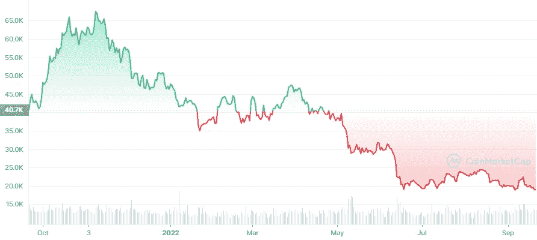

# 在这个加密市场低迷时期，你能开展加密货币交易业务吗？

> 原文：<https://medium.com/nerd-for-tech/can-you-start-a-cryptocurrency-exchange-business-during-this-crypto-market-dip-43fbfc0719d5?source=collection_archive---------8----------------------->

## 加密货币市场一直面临着重大的市场崩溃。但是，开创一个基于密码的行业好吗？让我们看看吧！

现在是开始加密交易的好时机吗？

最近，NFT 和元宇宙等区块链相关行业正在崛起。但在上述领域扮演重要角色的加密货币呢？

在过去的三个月里，加密货币市场一直是熊市(面临可怕的价格下跌)。

图片来源:coinmarketcap

因此，许多密码交易商正在处理他们的数字资产，以从这次熊市中恢复过来。嗯，加密下跌不仅影响了加密交易商，也让加密创业者陷入了是否可以开始加密交易业务的两难境地。

基于我在这个领域的经验和与 cryptopreneurs 的多次茶叙，我起草了这篇文章。我希望这篇文章能让你摆脱困境。

# **加密货币兑换业务——剖析**

自从比特币被接受以来，它已经打开了大量商业机会的大门。一旦加密货币作为数字资产蓬勃发展并用于支付，加密货币交换平台和加密支付网关就开始发展。币安、比特币基地和本地比特币等流行的加密货币交易所在转型期间流行起来。不仅仅是加密货币交易所，它们正在彻底改变加密市场，并激励许多基于加密的企业家开始新的加密货币交易所。目前，大约有 500 家加密货币交易所，并且数量还在增长。随着加密货币交易商的统计。

随着密码社区的快速增长，许多密码创业者对利用该社区并从中开展业务感兴趣。

# **加密货币波动和加密兑换业务:**

如果你知道什么是加密货币，那么你可能会知道加密货币的波动性。 ***加密货币波动性很大，价格经常面临大起大落*** 。许多日内交易者通过实施战略基本面分析，利用这个秘密市场的波动性赚取高额利润。

而加密货币交易所通过提供创新的加密交易服务赚取了巨额利润。这是加密货币交易所业务和加密熊市相遇的地方。人们几乎一致认为，熊市对现有的加密交易所没有影响。

但那些都愿意推出加密货币交易所的萌芽期加密创业者呢？

# 在这个加密市场低迷时期，你能开展加密货币交易业务吗？

首先，以下是在密码市场低迷期间，萌芽中的密码创业者提出的一系列问题。

1.  我可以在这个加密 dip 期间开始一个新的加密交换吗？
2.  在这个市场低迷时期，开办一个加密交易所会有利可图吗？
3.  如果我现在开始加密交换，会成功吗？

好的好的好的。

> 当前的加密市场下滑不会影响你启动加密货币交易。

密码市场是不稳定的，这是不可否认的。也许在牛市中购买了加密货币的资深加密交易员可能会持有他们的数字资产，等待价格上涨。但新的加密交易商利用这一市场下跌来购买新的加密货币资产。

> **许多金融顾问表示，市场下跌是购买新加密货币的最佳时机**

简单的答案是，加密市场不会影响新加密货币交易所的推出。

*   只要加密货币在市场上，加密货币兑换的需求就不会减少。
*   加密货币给许多投资者留下了良好的印象。所以，你可以依靠这个加密市场，毫不犹豫地开始你的加密货币交易平台。
*   如果你的加密交易所是高度安全的并且有最好的交易报价，你的加密交易所可能有比平常更多的交易量，即使在加密崩溃的时候。
*   立即推出加密交易所将有助于您利用加密货币市场的低迷，并接触到更多的受众。
*   无论加密货币的价格如何，加密货币交易所都会收取一定比例的交易费用。

嗯，通过经历加密市场下滑的各个方面，它充满了大量的机会。

如果你有兴趣开始一项加密货币兑换业务，那么你可以选择最高效、最具成本效益的选项和备受青睐的选项，即白标加密货币兑换软件。

# **什么是白标加密货币兑换软件？**

白标加密货币交易软件是一个预先开发的软件，包含加密货币交易平台的所有功能和安全级别。随着加密交易类型的变化，它有不同的类型。无论是基于订单簿的系统，还是点对点加密货币交换，或者基于用户到管理员的加密交换，都有不同的白标解决方案。

**使用白标加密货币兑换软件的商业利益:**

1.  **轻松定制** —比特币兑换软件是一款完全可定制的软件，让你可以毫无麻烦地端到端定制软件。
2.  **功能丰富** —加密交换软件充满了市场流行的功能。您也可以添加任何新的流行功能。
3.  **即时部署** —这是一款完全开发好的可随时部署的软件。您可以使用白标加密交换软件在短短 15 天内启动加密交换。
4.  **经济高效** —与传统方法(7 万美元)相比，使用白标加密交换软件只需花费约 6-8 万美元。
5.  **高创收** —当您使用白标加密交易所软件时，您可以轻松地将额外的创收模块集成到交易所中。

## **如何入门白标加密货币兑换软件？**

现在你将对加密货币市场有所了解，这不会影响你开始加密货币交易。此外，我们已经讨论过，通过使用白标加密货币交易软件，您可以利用这一加密市场的下跌来建立一个新的加密交易所，并获得更多的利润。最好的开始方式是联系可靠的白标加密交换软件提供商。

来自软件提供商的区块链专家将帮助您完成端到端加密交换开发部分。几乎不需要投资，你就会得到很好的照顾。希望这个加密 dip 将帮助您启动您的新加密货币交易所！