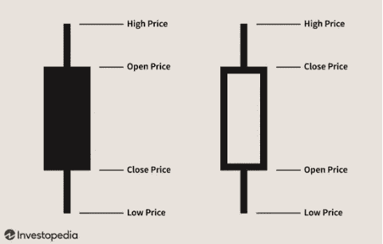
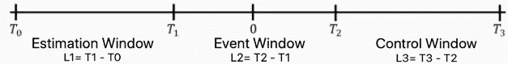
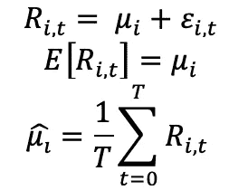
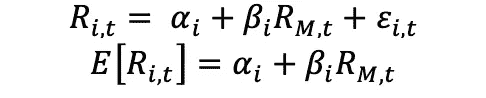
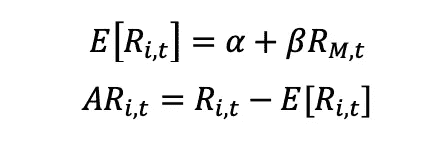
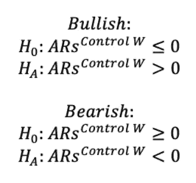
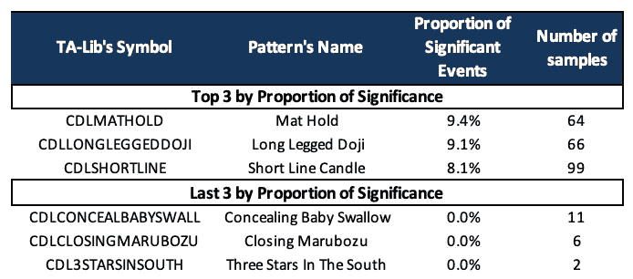
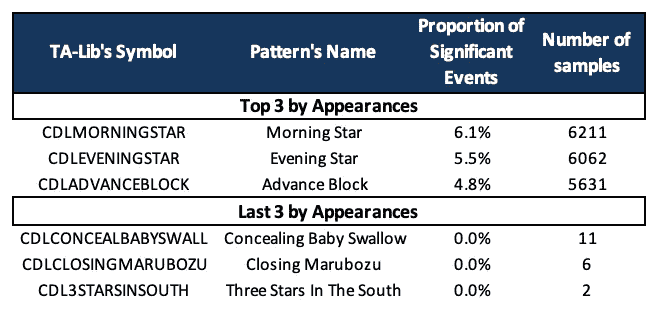
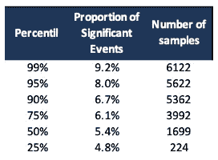

# 烛台图案，真的有用吗？进行大规模的事件研究

> 原文：<https://medium.com/nerd-for-tech/candlestick-patterns-they-really-work-conducting-a-massive-event-study-13f538e4c891?source=collection_archive---------0----------------------->

烛台模式是 18 世纪在日本发展起来的一种古老的技术分析形式。这项发明归功于日本大米交易商 Munehisa Homma，但直到 90 年代初，这项技术才由 Steve Nilson 在他的书《日本烛台制图技术》中推广开来。本文旨在对所有标准普尔& P500 成份股进行事件研究，以确定烛台作为预测工具的实际有效性。

在第一部分，我们解释了烛台的基本知识。然后，在第二部分，我们详细介绍了进行事件研究的程序。在第三部分中，我们回顾了用于进行研究的 Python 代码。在第四部分，我们展示了实验的结果，最后，在第五部分，我们得出结论。

# 烛台基础

这篇文章的目的不是要详细探究所有烛台模式是如何工作的，而是要简要解释一根蜡烛是如何被阅读的。



蜡烛图和条形图没有太大的不同，两者显示了相同的信息。主要的区别在于术语和词汇。蜡烛线的中心被称为“真实体”，它代表开盘价和收盘价之间的价格范围。如果真正的身体是黑色的，这意味着关闭低于开放，而白色的身体表明相反。那么，实体的上下就是所谓的“影子”，上下，显示的是那个交易日的价格高低。关于烛台的事情是，他们有时形成几种模式，作为预测。模式分为看涨和看跌，无论它们预测的是资产价格的上涨还是下跌。

使用烛台最困难的部分是识别图案。幸运的是，Python 提供了一个名为 TA-Lib 的库来简化这项任务。该软件包还有几个用于进行技术分析的特性，我们邀请您查看参考资料部分。

# 事件研究

在本节中，我们将解释为进行分析而实施的方法。首先，一个必要的定义:什么是事件研究？

事件研究是一种统计技术，用来衡量特定事件对公司或资产价值的影响。该方法依赖于法玛的市场效率假说(EMH)和资本资产定价模型(CAPM)。下面，我们详细介绍事件研究的过程:

**1)定义事件:**第一步是选择将进行研究的事件(以及公司或资产)。通常，对股票分割、并购公告、收益公告、宏观经济公告等进行事件研究。在这条线上，事件被定义为在明确定义的时间点上的非预期冲击。

**2)将数据拆分成窗口:**仔细选择事件后，我们要确定一个估计窗口、一个事件窗口和一个控制窗口。我们可以观察下图中每个窗口的长度。在估计窗口中，我们将使用事件窗口之前可用的数据拟合模型，以计算一系列参数。在这一行中，窗口必须足够长(这与事件的行为有关)以使估计的参数稳健。然后，在控制窗口(事后窗口)中，我们将应用估计的参数来计算异常收益。事件窗口可以分为两个阶段:事件前的时刻(T1 到 0)、事件当天(t=0)和 3-事件后的时刻(0 到 T2)。在我们的例子中，T2=0。



**3)选择模型:**下一步是选择一个模型来计算估计窗口的参数，我们将重点关注两个:均值收益模型和市场模型。

均值-回报:是一个单因素模型，假设回报行为可以用其期望值(mu)加上白噪声(epsilon)来解释。



Ri，t 表示公司(或资产)I 在交易日 *t* 的收益。

市场模型或 CAPM:假设两个风险因素解释了回报的行为。CAPM 认为，一项资产的回报可以部分地用市场回报(Rm)来解释，另一方面，也可以用公司的特质风险(epsilon)来解释。就本文的范围而言，我们将特别关注这个模型。



阿尔法和贝塔从 OLS 回归中获得。

**4)计算异常收益:**选择模型后，我们就可以计算控制窗口内的异常收益(ARs)了。ARs 被定义为资产的当前价格与模型(在这种情况下是市场模型)估计的预测或“公平”价格之间的差异。



程序很简单:1-我们用估计窗口中的可用数据估计阿尔法和贝塔，2-我们计算控制窗口中的回报期望值，3-我们计算 ARs。

执行 T 检验:最后一步是计算统计量，并执行 T-student 检验。对于这一步，我们需要计算控制窗口内的累积异常收益(CAR)。


在这一行中，统计分布为具有 L1 的 T-student-2 自由度。对于我们的例子，我们根据蜡烛图的趋势(看涨或看跌)进行单尾 t 检验。在这条线上，对看涨和看跌模式的测试表明:



# 代码

在这一节中，我们将检查为进行实验而实现的代码。我们定义了一个名为 Events 的类，它包含了整个代码:

```
# Necessary Imports
import talib as tb
import yfinance as yf
import pandas as pd
from dateutil.relativedelta import relativedelta
import numpy as np
from sklearn.linear_model import LinearRegressionclass Events:
    def __init__(self,df,l1,l2,l3,model,patterns):
        """
        df: DataFrame with price data: Open, Close, High & Low. 
        l1: length of estimation window. 
        l2: length of event window
        l3: length of control window
        model: market or mean return model. 
        patterns: candlestick patterns to conduct the event study. 
        """
        self.df=df
        self.l1=l1
        self.l2=l2
        self.l3=l3
        self.model=model
        self.patterns=patterns***Getting Events***
```

正如我们之前提到的，TA-Lib 库提供了一个非常容易识别烛台模式的属性。目前 TA-Lib 的识别算法支持 61 种模式。该函数的语法非常简单:PATTERN_NAME (Open，High，Low，Close)。在这一行中，我们可以使用 Python 的内置 *getattr* ，传递库名(或缩写)、模式名和四个输入。模式识别函数在发现看涨模式时输出 100，看跌模式输出-100，没有识别出任何模式时输出 0。有关 TA-Lib 属性的更多信息，可以在参考资料部分找到该库的文档。

```
def candle_events(self,stock,pattern):   

        #Define the events
        ind=self.df['Adj Close'][stock].dropna().index.tolist()
        df=pd.DataFrame(index=ind)
        hi=self.df['High'][stock].dropna().values
        lo=self.df['Low'][stock].dropna().values
        op=self.df['Open'][stock].dropna().values
        cl=self.df['Close'][stock].dropna().values
        df[pattern] = getattr(tb, pattern)(op, hi, lo, cl)
        events=df[df[pattern]!=0][pattern]
```

***建筑窗户***

代码中的以下步骤是为事件数据框中的每个事件定义估计和控制窗口。这部分代码的关键是事件不能重叠。如果我们选择一个事件与另一个事件的估计窗口重叠，我们将获得有偏差的结果。

```
#Dates list
        dates=events.index.tolist()
        dates.insert(0,df.index[1])
        dates.append(df.index[-1])#Compute Windows
        estimation_window=[]
        control_window=[]
        event_day=[]
        bullish_bearish=[]
        for i in range(1,len(dates)-1):
            if ind.index(dates[i])-ind.index(dates[i-1])>=self.l1+self.l2 and ind.index(dates[i+1])-ind.index(dates[i])>=self.l3+1:
                estimation_window.append((ind[ind.index(dates[i])-(self.l1+self.l2)],ind[ind.index(dates[i])-self.l2]))
                control_window.append((ind[ind.index(dates[i])+1],ind[ind.index(dates[i])+self.l3]))
                event_day.append(str(dates[i])[:-9])
                bullish_bearish.append(events.loc[dates[i]])return estimation_window,control_window,event_day,bullish_bearish
```

***选择型号***

正如我们在上一节中所描述的，第三步是定义一个模型来估计预期回报。我们的代码是为前面提到的两个模型准备的:均值收益和市场模型。对于 OLS 回归，我们使用 Scikit Learn 的回归工具。

```
def get_CAR(self,stock,pattern):

        reference_index=self.df['Adj Close'].columns[-1]
        estimation_window, control_window, event_day, bullish_bearish=self.candle_events(stock,pattern)
        log_returns=np.log(abs(self.df['Adj Close'][[stock,reference_index]])/abs(self.df['Adj Close'][[stock,reference_index]].shift(1))).dropna()CAR, V_CAR, SCAR={},{},{}

        if event_day==[]:
            return {}, {}, {}, {}

        else:
            for t in range(len(estimation_window)):
                #Linear Regression
                Rm_estimation=log_returns[reference_index].loc[estimation_window[t][0]:estimation_window[t][1]].values.reshape(-1,1)
                Ri_estimation=log_returns[stock].loc[estimation_window[t][0]:estimation_window[t][1]].values.reshape(-1,1)
                Rm_event=log_returns[reference_index].loc[control_window[t][0]:control_window[t][1]].values.reshape(-1,1)
                Ri_event=log_returns[stock].loc[control_window[t][0]:control_window[t][1]].values

                #Calculate expected returns (Market or Mean Return model)
                if self.model=='market':
                    lm=LinearRegression()
                    lm.fit(Rm_estimation,Ri_estimation)
                    event_preds=lm.predict(Rm_event).reshape(Rm_event.shape[0])
                    est_fitted=lm.predict(Rm_estimation).reshape(Rm_estimation.shape[0])elif self.model=='mean return':
                    event_preds=est_fitted=Ri_estimation.reshape(Ri_estimation.shape[0]).mean()
```

***计算 ARs 并构建 T-stat***

下一步是计算异常收益并构建 T 统计量。

```
#AR estimation window
                AR_est=Ri_estimation.reshape(Ri_estimation.shape[0])-est_fitted#AR for the control window
                AR_event=Ri_event.reshape(Ri_event.shape[0])-event_preds#Variance of AR
                Vi=sum(AR_est**2)/(self.l1-2)#CAR & CAR variance
                if Vi!=0:
                    CAR[str(event_day[t])]=sum(AR_event)
                    V_CAR[str(event_day[t])]=self.l3*Vi
                    SCAR[str(event_day[t])]=CAR[str(event_day[t])]/V_CAR[str(event_day[t])]**0.5
                else:
                    pass

            return CAR, V_CAR, SCAR, bullish_bearish
```

***计算重大事件在模式中的比例***

为了进行大规模的研究，我们必须构建一个函数，对一组股票重复执行研究过程。在这一行中，下面的函数对 *self.df* 数据框中的每只股票运行 get_CAR()，并根据与所选模式(看涨或看跌)相关的趋势计算 t 检验的 p 值。然后，它将具有统计显著性的事件数量(在 5%的水平上)添加到一个字典中，并将分析的样本总数(事件)添加到另一个字典中。

```
def pattern_significance(self,pattern):

        #Number of stocks in the sample
        stocks=self.df['Adj Close'].columns[:-1]

        one_tail_sign,N={},{}

        for s in tq(stocks):
            SCAR,bullish_bearish=self.get_CAR(s,pattern)[2:4]

            if SCAR!={}:
                #Two tail t-test
                #tt_pvalue=[2*(1-t.cdf(abs(x),self.l1-2)) for x in SCAR.values()]
                #two_tail_sign[s]=sum([1 for x in tt_pvalue if x<0.01])/len(tt_pvalue)

                #One tail t-test depending on the pattern trend (Bullish or Bearish)
                for i in bullish_bearish:
                    if i==100:
                        ot_pvalue=[t.pdf(x,self.l1-2) for x in SCAR.values()]
                        one_tail_sign[s]=sum([1 for x in ot_pvalue if x<0.05])
                    elif i==-100:
                        ot_pvalue=[t.cdf(x,self.l1-2) for x in SCAR.values()]
                        one_tail_sign[s]=sum([1 for x in ot_pvalue if x<0.05])
                    else:
                        one_tail_sign[s]=np.nan

            elif SCAR=={}:
                #two_tail_sign[s]=np.nan
                one_tail_sign[s]=np.nan

            #Number of observations for each stock
            N[s]=len(SCAR)

        return one_tail_sign,sum(N.values())
```

**对所有可用模式进行研究**

在代码的最后一部分，我们简单地将 pattern_significance 函数扩展到 TA-Lib 中可用的 61 个模式。该函数输出一个数据框，其中股票代码作为行，模式名称作为列，包含统计意义上的事件数量和一个字典，其中包含为每个模式分析的样本数量。

```
def S_overall(self):
        one_tail_soverall={}
        N_events={}
        for p in tq(self.patterns):
            ot_sign, N = self.pattern_significance(p)
            N_events[p]=N
            one_tail_soverall[p]=ot_signreturn pd.DataFrame(one_tail_soverall,index=self.df['Adj Close'].columns[:-1]),N_events
```

要可视化整个代码，可以参考参考资料一节中的 Github repo。

# 实验结果

实验使用市场模型，以指数作为市场基准，对 S&P500 的 502 只成份股进行。我们选择 L1=200，L2=2，L3=4 个交易日。该算法总共处理了 136，555 个事件。在下表中，我们可以看到前三个和后三个模式，按统计显著事件的比例排列。另一方面，我们分离到另一个表中，该模式具有更多的外观，反之亦然。



另一方面，我们可以分析模式的分布:



我们可以观察到显著性很低。从实验中分析的 136，555 个事件中，只有 7247 个被证明是具有统计意义的。换句话说，烛台模式有 5.3%的时间准确预测了价格趋势。

# 结论

那么，烛台图案真的有效吗？从统计学上说，我们可以得出结论，只有 5.3%的时间，烛台模式准确预测未来价格的运动。在这方面，尽管围绕这些数字的所有神秘主义，他们被证明是非常低效的预测。此外，它们甚至比随机猜测模型表现更差。总之，技术分析的另一个神话被打破了。

我们希望这篇文章的结果鼓励读者继续从不同的角度研究烛台和其他技术分析工具。在未来看到类似的技术指标和模式的实验会很有趣。

# 参考

TA-Lib 的资料来源:

 [## TA-Lib

### 这是一个基于 Cython 而不是 SWIG 的 TA-LIB 的 Python 包装器。来自主页:TA-Lib 被…广泛使用

mrjbq7.github.io](https://mrjbq7.github.io/ta-lib/) 

关于烛台图案的更多信息:

[](https://www.investopedia.com/trading/candlestick-charting-what-is-it/) [## 理解蜡烛图

### 烛台图表起源于日本，比西方发展条形图和点图图表早 100 多年。在…

www.investopedia.com](https://www.investopedia.com/trading/candlestick-charting-what-is-it/) [](https://www.investopedia.com/articles/active-trading/092315/5-most-powerful-candlestick-patterns.asp) [## 5 种最强大的烛台模式

### 蜡烛图是一种技术工具，它将多个时间框架的数据打包到单个价格条中。这使得

www.investopedia.com](https://www.investopedia.com/articles/active-trading/092315/5-most-powerful-candlestick-patterns.asp) 

关于事件研究的更多信息:

[](https://www.jstor.org/stable/2729691?seq=1) [## JSTOR 上的经济和金融事件研究

### 经济和金融中的事件研究经济文献杂志经济文献杂志(JEL)，第一…

www.jstor.org](https://www.jstor.org/stable/2729691?seq=1)  [## 事件研究

### 事件研究是一种统计方法，用于评估事件对公司价值的影响。例如……

en.wikipedia.org](https://en.wikipedia.org/wiki/Event_study) 

本文的 Github 资源库:

[](https://github.com/fedeglan/candlesticks-event-study) [## 费德兰/烛台-活动-研究

### 在 GitHub 上创建一个帐户，为 fede glan/candlesticks-event-study 的发展做出贡献。

github.com](https://github.com/fedeglan/candlesticks-event-study)