# CAP Java 教程:Hello World App

> 原文：<https://medium.com/nerd-for-tech/cap-java-tutorial-1-hello-world-app-66b4435a6e29?source=collection_archive---------1----------------------->

如何用 SAP 的 CAP Java 框架制作 hello world app


照片由[马克西米利安·魏斯贝克尔](https://unsplash.com/@maxweisbecker?utm_source=medium&utm_medium=referral)在 [Unsplash](https://unsplash.com?utm_source=medium&utm_medium=referral) 上拍摄

SAP 的新 CAP 框架有相当多的教程，但大多数都是针对框架的 NodeJS 风格；Java 版本似乎落后了。为此，我决定创建自己的 CAP Java 系列教程。本系列假设您对 SAP 一无所知，因此即使是 SAP 初学者也应该能够理解。在这第一部分中，我们将向您展示如何制作一个简单的 Hello World 应用程序。

注意:本教程中使用的代码可以在[这里](https://github.com/toadslop/cap-helloworld)找到。

# 步骤 1:设置开发环境

首先，我们需要安装 CAP Java 开发和部署所需的依赖项。仔细阅读下面的列表，确保你都有。

*   **Node.js:** [安装说明](https://nodejs.org/en/)
*   **@sap/cds-dk** : `npm i -g @sap/cds-dk`
*   **Java VM:** 至少需要 Java 8。SAP 推荐自己的“ [SAP 机](https://github.com/SAP/SapMachine/releases/latest)”。
*   **Apache Maven:** 至少需要 3.5.0 版本；遵循这些[说明](https://maven.apache.org/download.cgi)

此外，在本教程中，我们将使用 VS 代码以及以下支持包。

*   **VS 代码:** [安装说明](https://code.visualstudio.com/download)
*   **VS 代码 Java 支持:** [安装说明](https://code.visualstudio.com/docs/java/java-tutorial)
*   **VS 代码光盘支持:** [安装说明](https://marketplace.visualstudio.com/items?itemName=SAPSE.vscode-cds)

# 步骤 2:生成应用程序

接下来，我们需要生成新的应用程序。既然是 hello world app，那就叫“hello world”吧。

```
cds init helloworld --add java
```

您应该会看到以下输出:

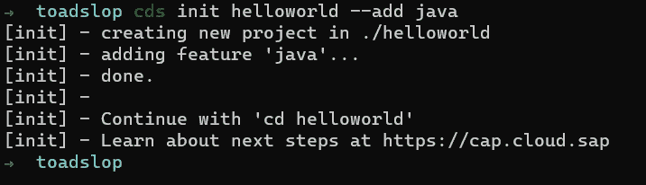

接下来让我们进入应用程序文件夹:

```
cd helloworld
```

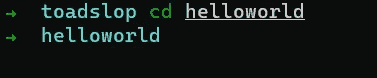

安装 Java 依赖项:

```
mvn clean install
```

您将看到相当多的输出，但是如果一切顺利，应该会如下所示:

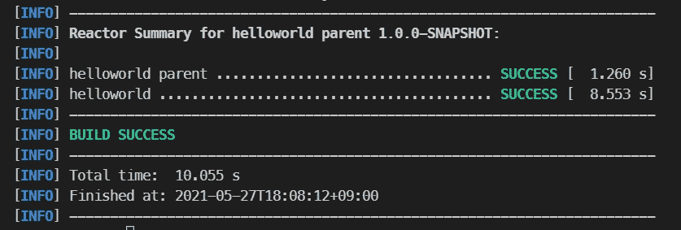

打开 VS 代码，检查生成的文件和文件夹:

```
code .
```

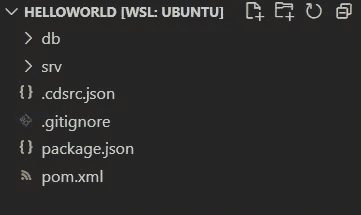

我们现在不需要担心任何事情，除了 ***srv*** 文件夹，这是我们项目的后端所在的位置。下一步，我们将建立一个 oData 服务(即遵循 [oData 协议](https://www.odata.org/documentation/)的 REST API)。

# 步骤 3 用 CDS 定义服务

CAP 的一大优点是建立一个全功能的 REST API 是多么简单。我们来看看怎么做。

首先创建一个新文件，命名为 ***say.cds*** 。

```
touch ./srv/say.cds
```

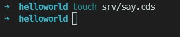

在该文件中，添加以下代码:

```
service say {
  function hello (to:String) returns String;
}
```

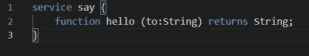

如果你是 CD 新手，这可能看起来有点奇怪，所以让我们来分解一下。

*   关键字 *service* 创建一个 oData 服务。
*   *表示*定义了服务的名称。
*   服务定义包含在{}中。
*   *函数*正如你可能已经猜到的那样，启动一个函数定义。
*   *你好*是函数的名字。
*   ()包含输入参数。
*   *到*是参数的名称。
*   *字符串*是输入的类型。
*   *返回*表示下面将要定义的返回类型。
*   *字符串*是这个函数的返回类型。

请注意，这里没有函数的逻辑。CDS 仅根据 API 端点、函数预期接收的数据类型以及调用者预期返回的数据类型来定义函数。对输入的实际处理将发生在我们的 Java 文件中，接下来我们将创建这个文件。

# 步骤 4:在 Java 中创建事件处理程序

在一些生成的文件夹中，我们的事件处理程序的位置有点深，所以让我们看看我们的文件夹结构，看看我们的处理程序到底去了哪里。

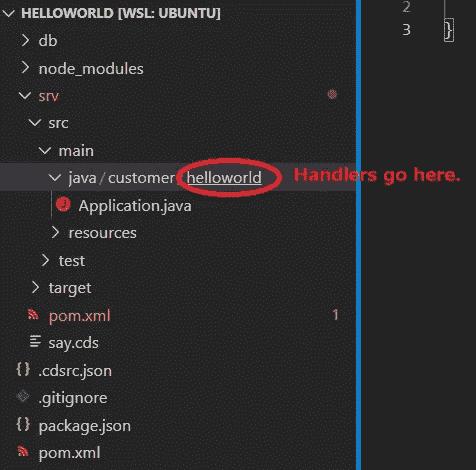

按照惯例，我们将创建一个名为 ***handlers*** 的文件夹来存储我们的处理程序，并创建一个名为*SayHandler.java*的文件。请注意，文件名和文件夹名只是约定，您可以随意命名。

```
mkdir srv/src/main/java/customer/helloworld/handlers
touch srv/src/main/java/customer/helloworld/handlers/SayHandler.java
```

让我们来看看结果:

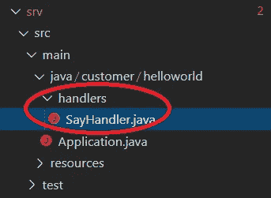

如果您的开发环境设置正确，那么您应该会看到已经生成了下面的框架。如果没有，复制粘贴进去。

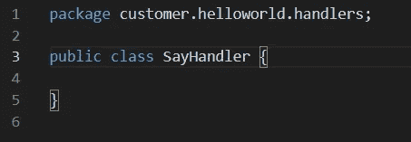

```
package customer.helloworld.handlers;public class SayHandler {}
```

接下来，我们必须通过实现 EventHandler 类将这个基本类转换成事件处理程序，EventHandler 类是 Java CDS SDK 的一部分。

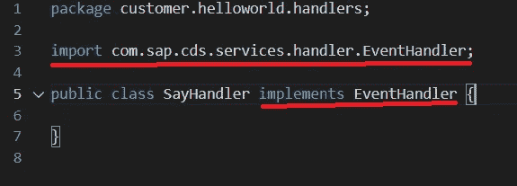

```
import com.sap.cds.services.handler.EventHandler;public class SayHandler implements EventHandler {}
```

接下来，我们必须添加一些装饰来链接这个通用事件处理程序和我们在上一步中定义的 oData 服务。不过，在此之前，我们必须生成一些支持文件来帮助我们。再次运行 *mvn 全新安装*。您应该看到生成了以下文件夹和文件:

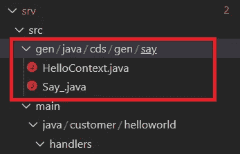

让我们看看里面的‘Say _’。java。

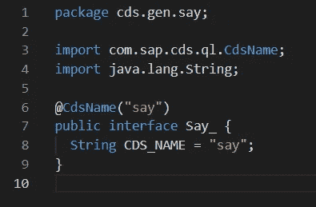

这里没有什么可看的，只有一个包含字符串 CDS_NAME 的简单接口，该字符串解析为值“say”，即我们服务的名称。这是为了让我们更容易地编写程序，而不会在字符串文字中出现拼写错误。

让我们回到 SayHandler.java，将我们的类装饰如下:

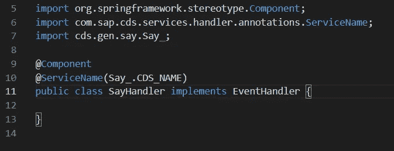

```
// ...
import org.springframework.stereotype.Component;
import com.sap.cds.services.handler.annotations.ServiceName;
import cds.gen.say.Say_;@Component
@ServiceName(Say_.CDS_NAME)
public class SayHandler implements EventHandler {}
```

首先，我们从 SpringBoot 添加@Component 注释。这里没有时间深入讨论它的作用，但是如果你很好奇，可以看看这篇文章。

接下来，我们添加来自 CDS SDK 的@ServiceName 注释，并将来自 Say_ class 的 CDS_NAME 值作为它的参数传递，我们在前面已经看到了(解析为“Say”)。这就是 CAP 如何用“say”服务来标识这个特定的处理程序。

现在我们得到了我们真正想要的:处理我们在上一步中在 CDS 中定义的函数的逻辑。添加以下代码:

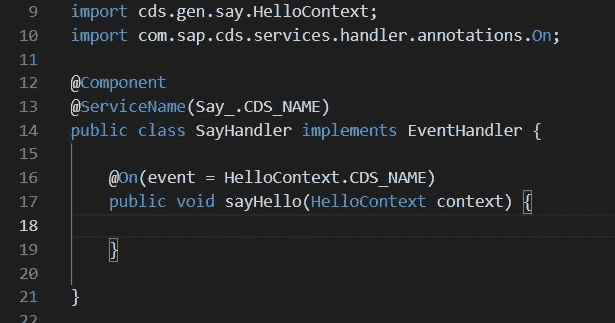

```
// ...
import cds.gen.say.HelloContext;
import com.sap.cds.services.handler.annotations.On;@Component
@ServiceName(Say_.CDS_NAME)
public class SayHandler implements EventHandler {@On(event = HelloContext.CDS_NAME)
  public void sayHello(HelloContext context) {
  }}
```

在顶部，我们导入了 HelloContext，它是前面与 Say_.java 一起自动生成的。我们还导入了上的服务处理程序注释，它允许我们修饰一个函数来指示它将处理某个事件。

然后我们添加带有参数 **event = HelloContext 的 **@On()** 注释。CDS_NAME** 。如果我们检查 HelloContext.java 文件，我们可以看到它包含值“hello ”,这是我们在上一步中定义的函数的名称。

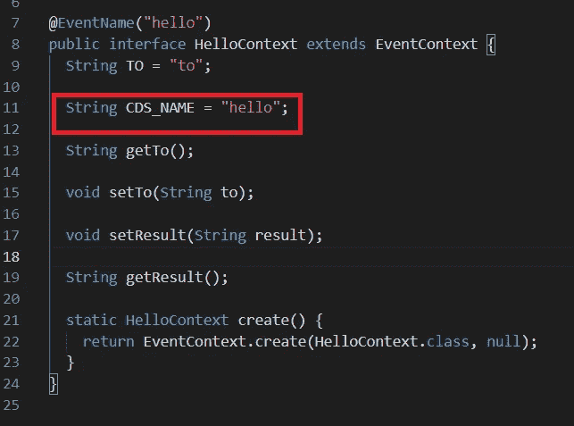

有了这个注释，我们告诉 CAP 框架在每次触发“hello”事件时运行这段代码，或者换句话说，每当我们之前在 CDS 文件中创建的 API 端点被命中时，运行这段代码。

接下来，我们声明了一个名为“sayHello”的没有返回值的公共方法。注意，函数的名称根本不重要——框架知道如何通过@On 注释将它连接到 CDS 函数定义。另外，请注意，我们没有指明返回类型。这是因为结果会通过其他方式传递出去，我们稍后会看到。

我们做的下一件事是传入 HelloContext 的一个实例作为输入。您会注意到 HelloContext.java 文件中有一个“create()”方法。在幕后，CAP 调用这个方法来创建一个上下文，然后将它传递给这个函数。这个上下文变量将包含输入参数，我们将在函数体中处理它。

最后，这是我们的逻辑:

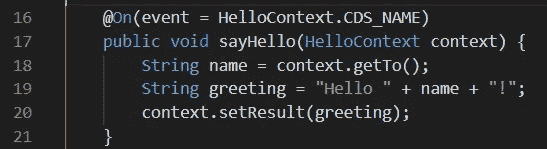

```
// ...@On(event = HelloContext.CDS_NAME)
public void sayHello(HelloContext context) {
  String name = context.getTo();
  String greeting = "Hello " + name + "!";
  context.setResult(greeting);
}
```

在第 18 行，我们调用“context”上的函数“getTo()”来获取 API 调用中传递的输入(查看**HelloContext.java**以了解详细信息)。我们将这个变量命名为“name ”,因为假设“to”的值是一个人的名字。

在第 19 行，我们创建了一个名为“greeting”的新字符串，它将包含我们的最终结果。假设“to”的值是“Bob”，那么我们会得到“Hello Bob！”。

最后，我们使用 setResult()方法设置上下文的结果，将“greeting”作为参数传入。注意，这个函数不需要返回值。通过设置上下文的结果，结果将被传递回框架，框架将把它解析成 JSON 并返回给调用者。让我们实际运行这段代码并检查结果！

# 第五部分:检查结果

要启动我们的应用程序，请运行以下命令:

```
mvn spring-boot:run
```

此时，您会看到一条相当神秘的错误消息:

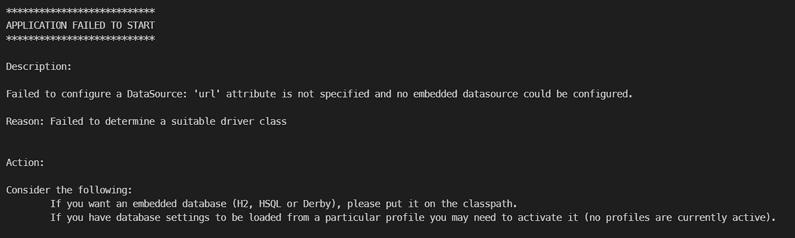

失败的原因是 CAP Java 确实想建立一个数据库，但是因为我们还没有建立数据模型，框架没有任何东西可以用来创建数据库，所以失败了。让我们做一个简单的数据模型，只是为了让框架高兴。我们将在后面的教程中讨论更多关于定义数据模型的内容。

找到名为 *db* 的文件夹，在那里创建一个名为 *User.cds* 的文件。

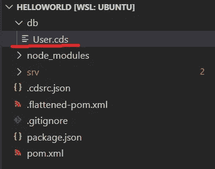

在文件内，复制以下代码:

```
define entity User {
  name : String;
}
```

这将创建一个简单的用户数据库表，其中包含一个名为“name”的字段。有了这个，CAP 就开心了。尝试再次运行启动命令(mvn spring-boot-run)。

如果你以此结束，那么一切都很好:

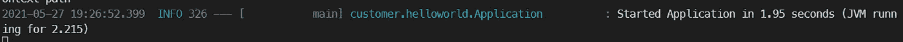

默认情况下，应用程序在 localhost:8080 上启动。单击下面的链接进行尝试:

[http://localhost:8080/odata/v4/say/hello(to = ' Tommy ')](http://localhost:8080/odata/v4/say/hello(to='Tommy'))

您应该会得到以下结果:

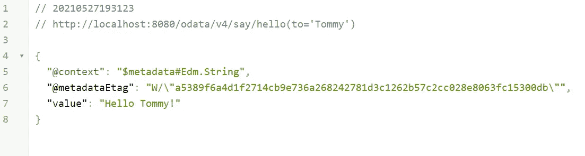

尝试将 Tommy 替换为您喜欢的任何名称，以查看不同名称的问候语。

# 结论

在本课中，我们学习了如何使用 SAP 的 CAP Java 框架制作一个简单的 hello world 应用程序。

如果您正在寻找更高级的东西，请查看我的关于使用 CAP Java 连接到 S/4 HANA 系统的 6 篇教程[。](https://bnheise.medium.com/sap-tutorial-serving-data-from-an-on-premise-system-in-a-cap-java-application-part-1-2426175ad4fa)