# CAP 定理

> 原文：<https://medium.com/nerd-for-tech/cap-theorem-f2fdb9d41e36?source=collection_archive---------5----------------------->

CAP 定理指出，分布式数据存储不可能同时提供以下三种保证中的两种以上:

*   稠度(℃)
*   可用性(A)
*   分区公差(P)

但是什么是一致性、可用性和分区容忍度呢？它如何帮助我们设计更好的系统？让我们找出这些问题的答案。

# 稠度(℃)

当系统能够在创建/修改后立即返回最新数据时，它就是一致的。

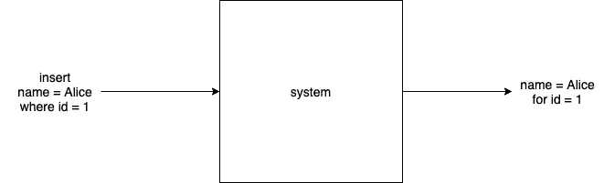

一致系统

在下面的体系结构中，我们有 3 个数据库—一个主数据库和两个副本数据库。所有写操作都将进入主数据库，并同步**复制到所有副本。复制副本只能处理读取请求，而主副本能够接受写入请求。当客户端向主服务器写入一些数据时，它会将这些数据同步复制到所有副本服务器，并向客户端返回成功响应。这种类型的系统称为强一致或可线性化系统。**

****

**同步复制**

**该系统强大的一致性源于这样一个事实，即所有副本中的数据总是最新的，并且客户端可以从任何数据库(副本或主数据库)中读取数据以获得最新数据。在下图中，客户端 1 将`id = 1`的数据写入主数据库。主服务器将该数据复制到所有副本服务器，并在复制成功完成后向客户端发送 ok。当客户端 2 尝试从副本 1 或副本 2 读取带有`id = 1`的用户时，它能够接收到正确的数据，因为复制以全有或全无的方式同步发生。**

**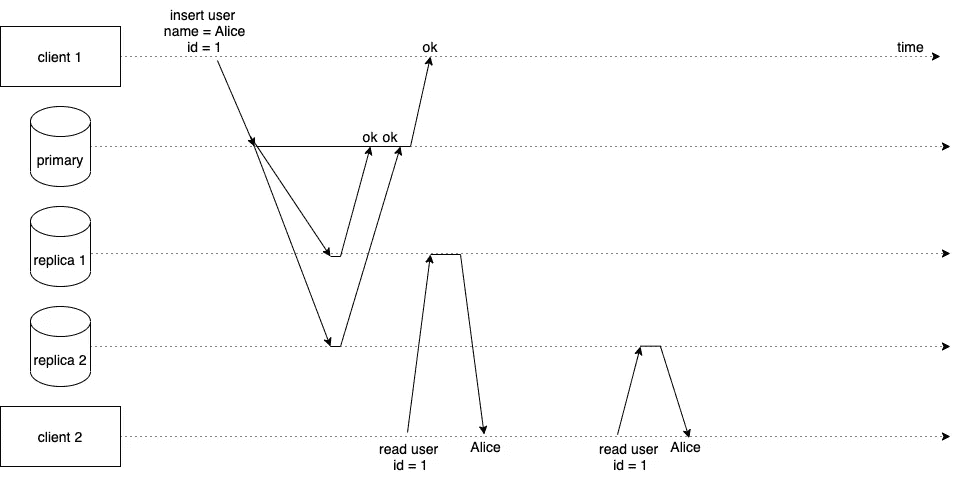**

**同步复制—成功案例**

**如果主服务器无法将数据复制到任何副本服务器，则不会存储数据，并且会向客户端发回错误响应。正如您可以看到的，当两个客户端试图用`id = 1`读取用户时，它们都从副本中获得了`nil`。**

**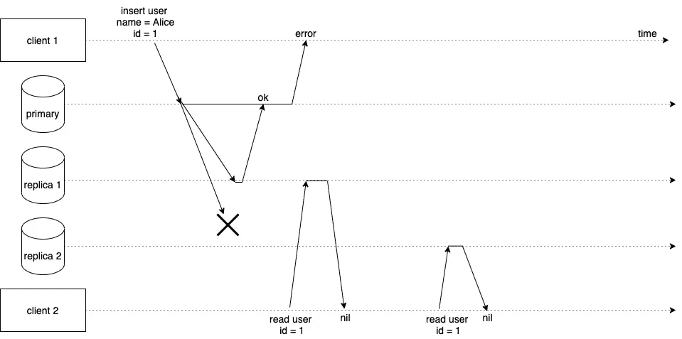**

**同步复制—失败案例**

**我们的系统可能是一致的，要么数据存在于所有数据库中，要么没有。但是这种架构会有什么问题呢？想想吧，文末再来讨论。**

# **可用性(A)**

**当一个系统被声明为可用时，它大部分时间都能够满足请求。**

**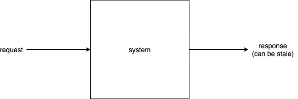**

**可用系统**

**我们用一个例子来理解。采用以下体系结构(见下文)，其中我们有一个数据库称为主数据库，两个数据库分别称为副本数据库。所有写操作都进入主数据库，并且**异步**复制到所有副本。复制副本只能处理读取请求，而主副本可以处理读取和写入请求。当客户端向主服务器写入一些数据时，由于复制过程的异步特性，这些数据可能不会立即在副本服务器中可供读取，但这些数据最终可能是可用的。这种类型的系统被称为最终一致性系统。**

**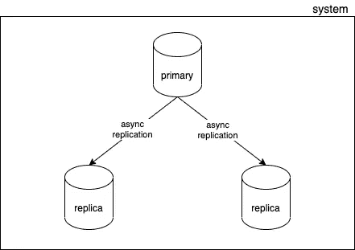**

**异步复制**

**在下图中，客户端 1 将 Alice 写入主数据库，并在写入数据后获得成功响应。然后，主服务器将数据异步复制到副本服务器。当客户端 2 尝试从副本 1 读取该数据时，它会返回用户，因为主数据库此时已将数据复制到副本 1。但是，当客户端 2 在某个时候连接到副本 2 以读取数据时，我们会得到`nil`,因为主服务器尚未将其数据复制到副本 2。**

**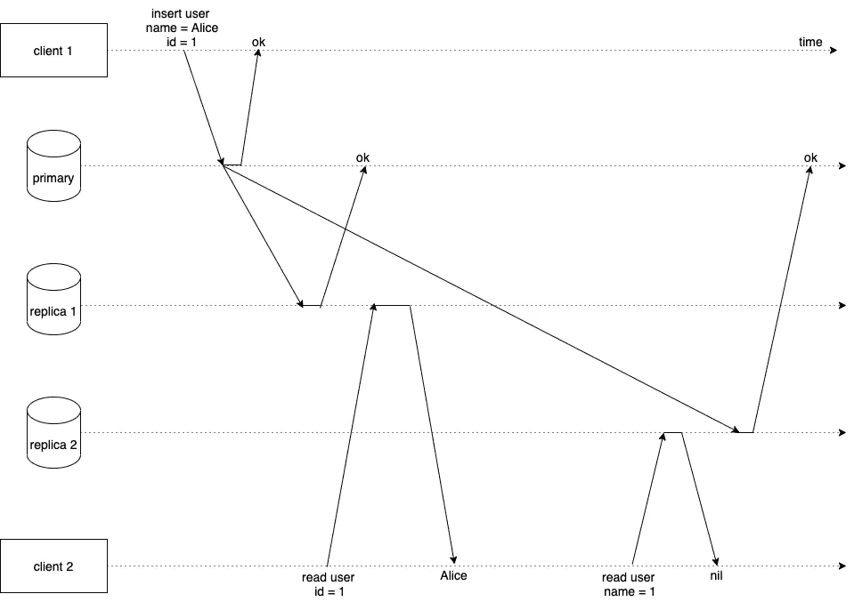**

**异步复制—成功案例**

**在现实世界中，我们可能会遇到一些数据库面临任意停机的情况，在这种情况下，我们的系统将继续响应旧数据，即`id = 1`的`nil`，以响应从副本 2 读取的所有客户端。一旦主服务器能够成功地将其数据复制到副本服务器 2，这种读取差异将最终得到解决。**

**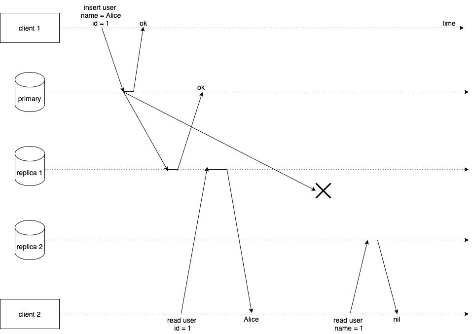**

**异步复制—失败案例**

**我们的系统在读取时可用，因为它能够处理来自多个数据库的请求，没有单点故障。但是系统并不一致。**

**您可能会有以下问题，为什么我们不能让这个系统同步复制它的写操作，并解决读操作不一致的问题呢？**

**好问题。是的，你是正确的，我们可以潜在地解决同步复制的不一致读取问题，但是有一个警告。如果您的主数据库总是等到数据复制到其所有副本，那么系统将如何扩展以实现高吞吐量和频繁写入？想一想，让我们在文章快结束时再次讨论这个话题。**

# **分区公差(P)**

**分区容忍系统应该能够服务于请求，而不管其内部通信信道的条件如何。**

**例如，如下图所示，我们有两个数据中心通过网络相互通信。通过网络通道，两个数据中心可以相互交换数据，以便它们保持最新的数据。**

**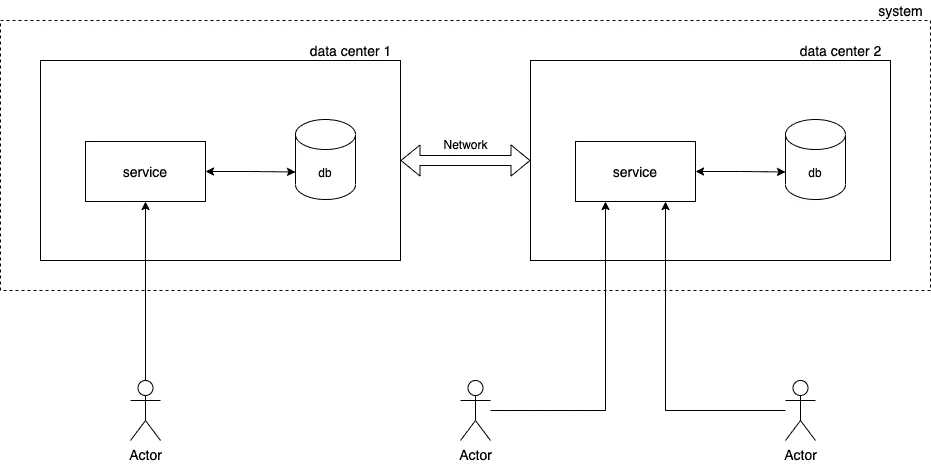**

**分区容忍系统**

**但是，当通信通道出现问题，数据中心无法相互通信时，会发生什么情况呢？**

**这就是分区容差发挥作用的地方。如果我们的系统是分区容忍的，那么各个数据中心将能够毫无问题地向它们的客户提供请求。尽管它们可能无法交换数据和更新数据，这将导致数据过时。但重要的一点是，数据中心将正常运行并为请求提供服务，即分区容忍。**

**如果我们的系统不支持分区，我们的数据中心在建立通信之前可能无法提供服务。虽然这将有助于我们的系统保持一致——没有陈旧的数据——但它可能无法继续为来自客户端的请求提供服务。**

# **系统设计和 CAP**

**现在我们大概理解了一致性(C)、可用性(A)和分区容差(P)的含义，让我们看看什么是上限定理。**

**正如在开始时已经提到的，CAP 定理表明分布式数据存储不可能同时提供以下保证 C、A 和 p 中的两个以上。也就是说，我们只能设计具有以下保证的数据存储:**

*   **可用性和分区容差**
*   **一致性和分区容差**
*   **CA(一致性和可用性)**

**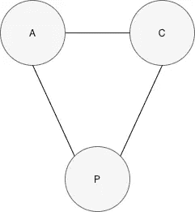**

**CAP 定理**

**为什么会这样呢？我们自己设计一些系统来探索一下吧。**

# **示例 1**

**假设我们计划创建一个类似 WhatsApp/Discord 的消息服务，并满足以下要求，**

*   **应用程序应该高度可用**
*   **应用程序应该能够以极低的延迟处理海量的写入**
*   **应用程序可以容忍向用户显示旧数据，直到最新数据可用。**

**你会如何设计这样一个系统？一定要停下来想一想。**

**一种方法是建立一个主数据库，该数据库接受写入并异步复制到其副本。异步复制可以提高写入速度，减少延迟，因为我们的主服务器不必等到数据复制到所有副本。正如我们所知，对于异步复制，数据最终只能保持一致。但是对于我们的应用程序，我们可以容忍这一点。**

**我们的数据存储也是高度可用的，因为当主数据库停机时，任何最新的副本都可以被选为主数据库，这一过程称为故障转移。稍后当主节点恢复时，它会自动成为新选出的主节点的副本。**

**太好了！我们设计了一个高度可用且快速写入的系统。但是，我们的系统能否仅用一个主数据库来处理海量的写操作？也许不是。我们需要一个更好的方案来解决这个问题。**

**分片或分区是一种机制，可以将写入拆分到多个数据库中，以便单个数据库只获取写入的一个子集。我们可以使用分片来解决上述写吞吐量问题，其中主节点不再是承担所有写操作的单个节点。我们可以有 2 个主节点，每个节点根据一些分区逻辑来处理一部分写入。每个主节点都有副本以实现高可用性。**

**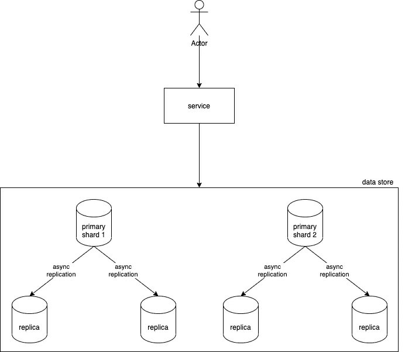**

**AP 系统**

**我们的系统具有很高的读写可用性，但并不一致。因此，它可以被称为 AP(可用和分区容忍)系统。通常，写密集型系统被设计为 AP。AP 的示例数据存储有 **Apache Cassandra** 。**

**如果你想了解更多关于数据库分片以及它在大规模系统中是如何实现的，[这篇文章](https://swamim.medium.com/consistent-hashing-6524e48ac648)可能会让你感兴趣。**

# **示例 2**

**假设我们想要设计一个数字支付服务，为用户执行基于货币的交易。该系统的规格如下:**

*   **系统不应该不惜任何代价向用户显示陈旧的数据。交易要么被处理，要么不被处理**
*   **系统应该高度可用于读取**
*   **系统中每天发生的事务数量大约为 10K 事务。**

**你会如何设计这样一个系统？一定要停下来想一想。**

**我们可以有一个接收写入数据的主数据库和多个为读取数据服务的复制副本。我们的主数据库同步地将其数据复制到副本数据库，这样所有数据库中的数据都是最新的。**

**异步复制在这里可能不工作，因为当我们的应用程序由于复制滞后而显示不正确的事务状态时，这可能会给用户带来不好的体验。同步复制可能不会出现此问题。**

**因为主数据库有多个副本，所以我们的 is 系统具有很高的读取可用性。但是从技术上讲，当某个复制副本失败时，由于同步复制的性质，主副本可能无法处理写入。不处理写操作，并向用户发回一个错误。这使得我们的系统不可用于写入。尽管系统可以提供读取服务，直到出现故障的副本被修复。**

**我们应该可以使用单个主数据库进行写入，因为根据应用程序要求，每天的总写入量比读取量要少。**

**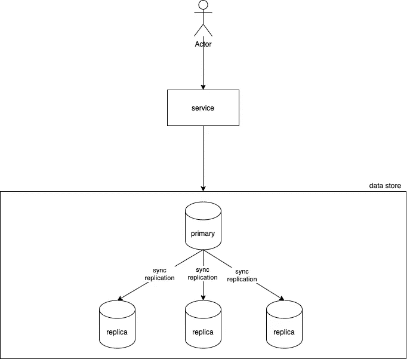**

**CP 系统**

**我们的系统是一致的，但由于同步复制机制，写入时可能会执行缓慢，或者有时变得不可用。因此，该系统可以被称为 CP(一致和分区容忍)。通常，不能容忍陈旧/丢失数据的系统被设计为 CP。示例数据存储是 CP — **MYSQL、PostgreSQL、MongoDB** 等。**

# **结束语**

**正如我们所讨论的，基于性能因素，应用程序可以是 AP 或 CP。如果我们需要高性能并能容忍最终的一致性，那么我们的系统可以设计成 AP。但是如果我们需要很强的一致性，并且可以接受较低的性能，我们的系统可以设计成 CP。下表很好地总结了这一点。**

**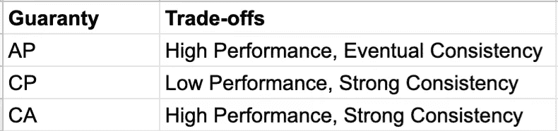**

**但是等等，什么是 CA(一致&可用)？一个系统可以是 CA 吗？**

**是的，可以，但是这个保证很难实现。这很困难，因为为了使系统可用且一致，所有数据库(主数据库和副本数据库)应该尽快就相同的数据达成一致。这可以通过一个叫做共识的概念来实现。有各种共识算法，如 [RAFT 共识算法](https://raft.github.io/)，有助于实现可用性和一致性。示例数据存储是 CA — **etcd，Zookeeper** 。**

**本帖到此为止，感谢阅读。我们下次再见，在那之前保重，继续学习:)**