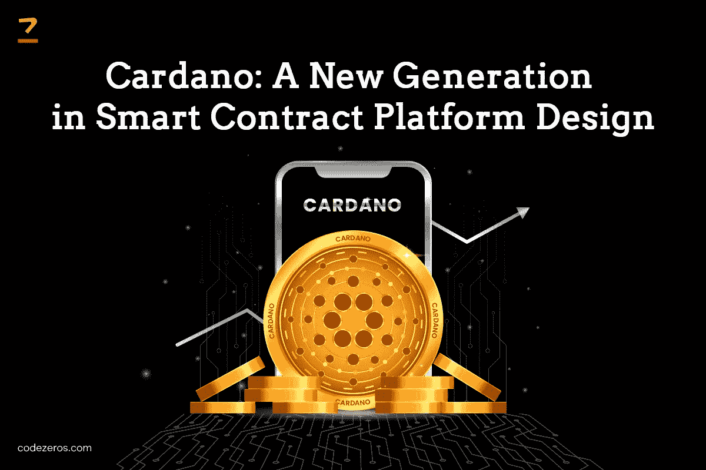

# Cardano:智能合约平台设计的新一代

> 原文：<https://medium.com/nerd-for-tech/cardano-a-new-generation-in-smart-contract-platform-design-6dc30c9f0f3a?source=collection_archive---------0----------------------->

Cardano 是一个经得起考验的区块链平台。它是市值最大的加密货币之一。它旨在成为一个灵活、可持续和可扩展的区块链平台，用于运行智能合同。它允许开发各种分散的金融应用程序、新的加密令牌、游戏等等。

Cardano 于 2015 年推出，但上市两年后才开始流行。最初，它成功地走出了加密冬天的愤怒，并成为市场上顶级的加密资产之一。一个 [**智能合约开发公司**](https://www.codezeros.com/services/smart-contract-creation) 可以帮助你在 Cardano 平台上进行自动化交易。

**了解卡达诺**

卡尔达诺是一个拥有未经许可的网络的区块链。开源区块链的目标是一个可持续的、由社区管理的去中心化的生态系统。它以其科学的方法和创新的技术驱动战略为加密货币提供了一个平衡的环境。

区块链还使用密集的审查流程来提高安全性，并解决扩展和基础设施问题。Cardano 是第三代加密货币，专注于克服与可持续性和互操作性相关的问题。 [**智能合约开发服务**](https://www.codezeros.com/services/) 涉及使用卡尔达诺区块链运行定制编程逻辑和构建分散程序。

**ADA-Cardano 加密货币**

ADA 是 Cardano 的加密货币，在平台上的交易中充当交换媒介。Ada 确保其加密持有者进行安全透明的交易，无需第三方认证过程。

Ada 持有者可以将他们的货币委托给股份池来创建区块。股份池投票选出将创建区块的股份负责人。押 ADAs 赌注的人可以获得他们可以使用 Cardano 赌注计算器计算的奖励。

你可以从北海巨妖、Bittrex 和比特币基地等加密货币交易所购买 ADA。您可以在钱包上存储 ADA，例如代达罗斯、Yoroi、莱杰 Nano X、Trezor Model T、莱杰 Nano S、Atomic Wallet、Infinito Wallet、Tangem 和 Ellipal 等等。

**大毒蛇**

Cardano 使用一种叫做 Ouroboros 的算法来克服缩放问题。Ouroboros 的股权证明方法有助于经济高效地加快交易流程。用户可以在卡尔达诺区块链上验证节点。

《区块链议定书》有一个通过侧链使用跨链转移的中本风格共识。ADA 在每个阶段影响块创建的节点选择。适当的智能合同开发帮助它实现了这一壮举，并成为市场上值得信赖的区块链。

**卡达诺区块链发展的五个阶段**

卡尔达诺的发展分为五个阶段，每个阶段都有一个重要的里程碑，以创建一个自我维持和社区管理的网络。虽然它们是五个不同的阶段，但大多数阶段是相互并行的。

严谨的学术研究帮助塑造了每个阶段。原型是阶段开发中的一个重要因素。这是它发展的五个阶段。

**拜伦**

这是 Cardano 的第一阶段，标志着它在 2017 年推出。在这一阶段，内部监督组和合作伙伴将这些节点作为一个联合区块链网络来运营。该阶段为其网络架构奠定了基础，并测试了区块链的功能。

**谢利**

随着 Shelly 的到来，Cardano 进入了去中心化阶段，慢慢过渡到了一个没有权限的网络。它引入了社区节点，通过运行节点鼓励公众参与协议。

**高根**

stage 向区块链引入了多资产支持，如智能合约、用户定义的令牌和 NFTs。它为 dApps 和 Defi 铺平了道路。

**芭蕉**

Basho 带来了互操作性，以增强它与其他区块链和外部资源(如 API)的交互。可扩展性功能有助于 it 部门支持不断增长的用户群和设备。

**伏尔泰**

该阶段将介绍卡尔达诺区块链的自我可持续性，通过治理持续很长时间。它将通过财政支出的社区治理和协议升级来确保这一点。

**卡达诺的主要特点**

卡尔达诺为其利益相关者提供了一个充满机遇的世界。它提供的特征使其比其他加密货币更具优势。

**广泛分权**

Cardano 在很大程度上是分散的，允许其货币持有者审查区块链上的新节点。它的工作效率更高，因为它使用了利益证明(PoS) [**区块链智能合同**](https://www.codezeros.com/) 平台。

**高速交易**

与其他加密货币相比，Cardano 提供了一个快节奏的交易流程。它通过其高度可扩展的区块链技术实现了成为最快加密货币的壮举。

**生态友好型采矿方法**

Cardano 有助于节省能源，因为它是一种低能耗的加密货币。它的采矿协议使用了一种可持续的方式，这使得它的能源效率更高。其轻量级的能耗使其成为市场上最受欢迎的加密货币之一。

**最低交易费用**

有一个公式计算 ADA 交易费，确保成本最低。你用 ADA 支付交易费，这也将取决于你使用的交易所。这种独特的收费结构适用于大宗生产商和所有股份池。

**腰果的用途**

你可以用 Cardano 做各种交易，就像你做流动货币一样。Cardano 专注于帮助智能合同创建和多资产分类帐的分散应用程序开发平台。

开发人员可以使用卡尔达诺区块链构建智能合约和创建分散式协议。由于交易费用最低，您可以使用加密货币即时收发资金。

**卡达诺价格**

Cardano 的价格在上市初期飙升。几年来，这一比例逐渐降低，目前保持稳定。ADA 采用了固定的货币政策，只允许铸造 450 亿 ADA。

由于限量规定了它的稀有性，而且 ADA 的数量是有限的，所以它将在未来创造大量的需求。这将使加密货币更有价值，并有助于使其更有利可图。

**结论**

Cardano 通过其强化战略提供了一个充满希望的未来，以变得更加可持续和可互操作。它的节能特性使其成为加密货币中的热门选择。凭借其严格的研究和社区驱动的方法，卡达诺已经想出了创新的方法，成为环保和有利可图的。

接触 [**智能合同服务提供商**](https://www.codezeros.com/services/smart-contract-creation) 将有助于您了解卡达诺区块链的工作方式，以及如何从长远角度利用其优势。利用合适的交易所收购 ADA，并把它们存放在可靠的钱包里，这对于收获其收益至关重要。