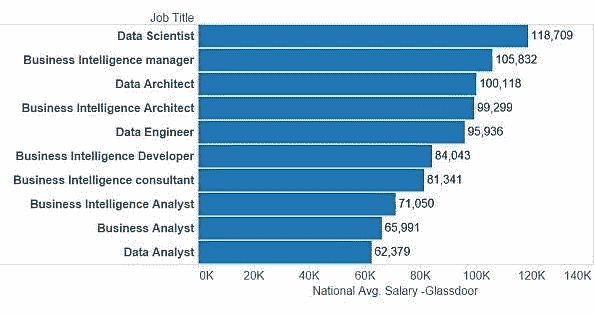
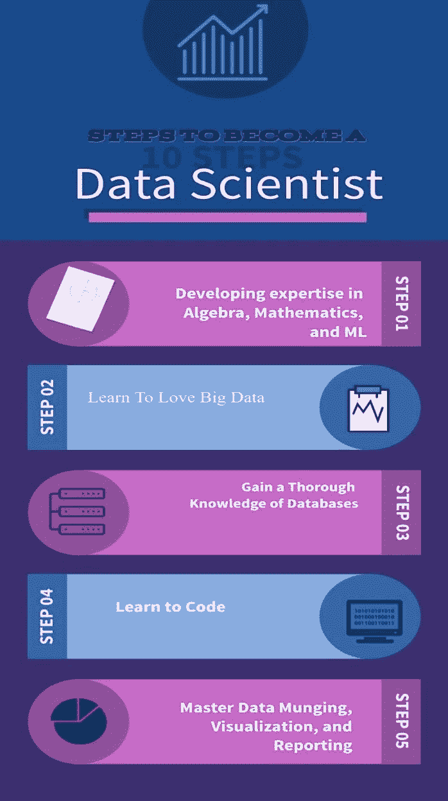
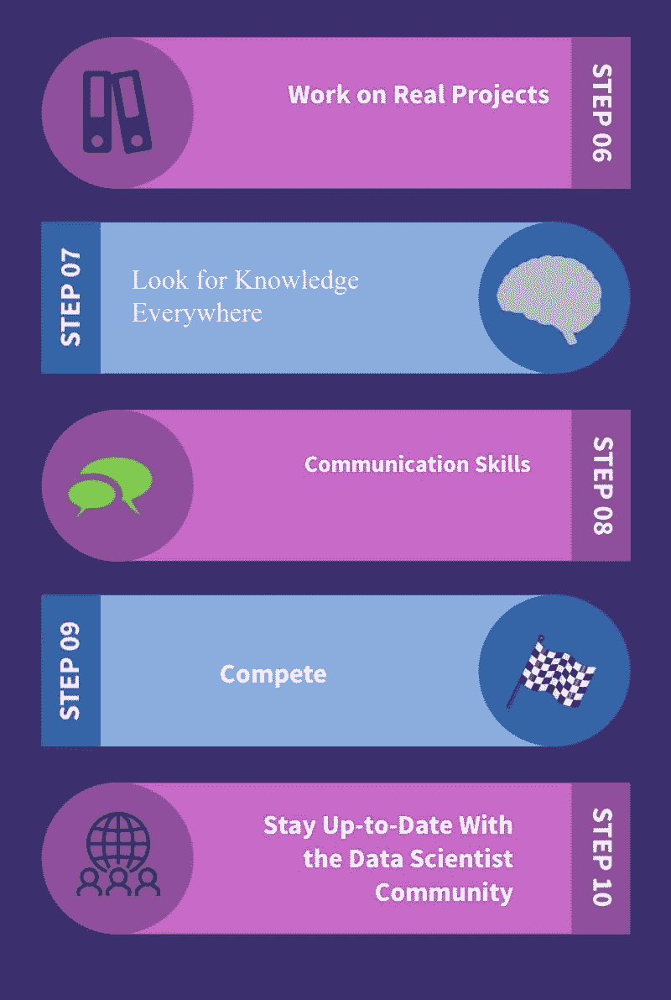
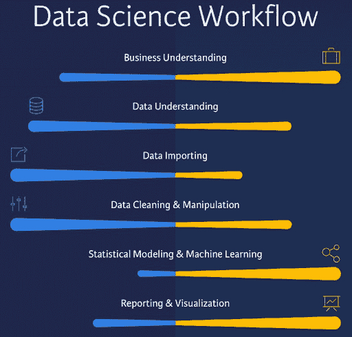
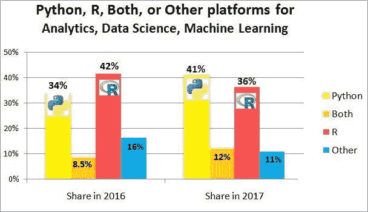

# 数据科学的职业道路

> 原文：<https://medium.com/nerd-for-tech/career-path-in-data-science-2c23cd7869fe?source=collection_archive---------7----------------------->

> 对于那些想知道如何开始、从哪里开始、选择哪个流以及其他事情的人，这里有一篇快速文章可以帮助你！

1.  **基本区别和工作描述**

一个不熟悉数据的人可能想知道这种“基于数据的工作”是关于什么的。我首先想到的是术语“数据”的含义。一般来说，数据是收集和翻译的任何字符集，通常是为了某种目的而分析的。它可以是任何字符，包括文本和数字、照片等。如果数据不放在上下文中，人或计算机什么都得不到。

**数据分析师:**在数据科学中，数据分析师扮演着重要的角色。他们执行几项与选择、组织和从中获取统计信息相关的任务。他们还负责以地图、图形和表格的形式显示数据，并使用这些数据构建组织关系数据库。当需要将数据科学项目的发现传达给某些部分时，数据分析师必须精通数据交流的艺术。而且，因为数据解释不需要完全编码，所以数据分析师可能是一个不太懂编码的人！

**数据科学家:**数据科学家是一名专家，他们大多来自应用算术或潜在洞察力基础，并与软件工程相结合。数据研究人员也将有基础来选择合适的人工智能计算，训练它们，并设计测试其准确性的策略。他/她从业务角度理解信息。他负责做出预测，以帮助组织做出准确的选择。让他们与众不同的是，他们在商业上的辉煌与非凡的关系能力相结合，管理商业和 IT 先锋。当信息科学风险的结果应该传递给业务堆栈持有人时，数据科学家必须了解信息叙述的专业知识。这种努力需要口头上和表面上传达复杂的结果和感知的能力，以便伴侣能够理解和跟进。数据研究人员同样应该具备 R 或 Python 语言的编码能力。一个信息研究者的编程能力从根本上来说不应该有那么高的水平。

**数据工程师:**数据工程师是有编程背景的人。它们的历史通常是用 Python、Java 或 Scala 这样的语言编写的。我们的重点是分布式和大数据结构。与数据科学家相比，他们的编程技能更先进，主要用于构建高可用性生产系统，而数据工程师通常会为生产环境实施数据科学家首选的机器学习算法。数据工程师的编程技能被用来建立大规模的数据管道。这涉及到多种大数据技术的整合。数据工程师必须对应用技术和环境有透彻的理解

**机器学习(ML)工程师:** ML 工程师在处理大量结构化或非结构化数据以及开发和实现机器学习算法方面发挥着主要作用。一个 ML 工程师应该能够设计和创建高质量的、制造就绪的代码，这些代码可以被企业内的云平台用户使用。他/她应该对 Python、R 等统计语言有丰富的经验。以及 ML 原理的知识，应该能够管理大量数据集和分布式计算，还应该具备定义与数据挖掘技术等。

1.  **薪水**

在数据科学中，还有其他工作职能。根据技能不同，每个工作岗位的报酬也不同。

数据分析师:20 万卢比至 90 万卢比

软件开发者或程序员:250 万印度卢比至 100 万印度卢比

数据分析师:20 万卢比至 90 万卢比

高级数据分析师:310 万卢比至 100 万卢比

软件工程师:25 万印度卢比至 100 万印度卢比

高级商业分析师:420 万卢比至 200 万卢比

**地理位置**

数据科学的工资也因工作地点的不同而不同，古尔冈、钦奈和班加罗尔的工资最高，而德里、浦那和海德拉巴的工资最低。

多年的经验

在不到一年的工作经验中，大一新生可以期望年薪 50 万卢比。

在最初职业中有 1-4 年经验的专业人员年薪为 60 万卢比。

专业人员 5-9 年经验，分别拥有 100 万卢比和 170 万卢比，10-19 年经验。

**2。成为数据科学家的步骤**

**a .发展代数、数学和 ML 方面的专业知识:**

数据科学家在数学方面比任何软件工程师都强，在软件工程方面比任何统计学家都强。目标是要有正确的平衡，而不是强调两者中的一个太多或不够。

**b .学会爱(大)数据:**

数据科学家处理大量隔离和未隔离的数据，在这些数据上，一台计算机有时无法进行计算。他们中的许多人正在使用 Hadoop、MapReduce 或 Spark 等大数据工具来实现分布式计算。许多在线课程将帮助您按照自己的节奏学习大数据。

**c .获得数据库的全面知识**

鉴于几乎每分钟都会产生大量数据，大多数行业都使用 MySQL 或 Cassandra 等数据库管理软件来存储和分析数据。清楚地了解 DBMS 的工作方式肯定会对你实现数据科学家的梦想大有帮助。

**d .学习编码**

除非你知道数据交互的语言，否则你不可能成为一名优秀的数据科学家。一个分类良好的数据可能会大声喊出它的分析；文笔可能在墙上，但只有知道剧本才算看懂。一个好的程序员可能不是一个伟大的数据科学家，但一个伟大的数据科学家肯定是一个好的程序员。

**e .主数据管理、可视化和报告**

数据管理是将原始数据源转换成易于研究、解释和可视化的数据源的方法。数据可视化和表示是一组同样有价值的技能，数据科学家非常依赖这些技能，因为通过数据分析可以做出战略和管理决策。

真正的项目工作

当你成为一名优秀的数据科学家后，一切都是关于理论的实践。在互联网上寻找数据科学项目，花时间发展你的能力，同时专注于仍然需要提高的领域。

到处寻找知识

数据科学家是团队成员，当你与一群志同道合的人合作时，敏锐的观察者也会有所帮助。学习如何通过密切观察同事的工作习惯来培养数据分析和决策所需的洞察力，并确定什么最适合你。

**h .沟通技巧**

沟通能力将大数据科学家与平庸的数据科学家区分开来。大多数情况下，你会发现自己在闭门向关心你的数据审查结果的人解释，并且在应对意外情况时，用词的能力也会很有用。

**一、竞争**

像 Kaggle 这样的网站是初露头角的数据科学家的完美试验场，因为他们寻求寻找合作伙伴，并相互竞争，以展示他们富有洞察力的战略和微调他们的能力。随着这些网站提供的认证在行业中的声望越来越高，这些比赛正迅速成为向公司展示思维如何创新的舞台。

**j .与数据科学家社区保持同步**

关注 KDNuggets、Data Science 101 和 DataTau 等博客，与数据科学世界的事件保持联系，并深入了解该行业目前提供的职位空缺类型。

**3。数据科学家学位&浓度**

**数据科学核心要求**

数据科学理论核心

*   数据科学算法
*   高级算法

数据系统核心

*   数据科学系统
*   数据库设计和实现
*   分布式和操作系统

数据科学人工智能核心

*   自然语言处理
*   机器学习
*   数据可视化和探索
*   机器学习:模式
*   视觉分析

虽然由于数据科学的多学科性质，它需要许多技能，但可以被视为数据科学先决条件的三种基本技能是数学技能、编程技能和解决问题技能。

分析学科的学位会给你数据科学所需的基本技能。任何在分析学科有扎实背景的人都可能通过自学学习数据科学。

如果你有分析学科的背景，并且正在考虑数据科学，这里有一些你可以用来自己研究的工具:

**(一)** [数据科学专业证书](https://www.edx.org/professional-certificate/harvardx-data-science) (HarvardX，通过 edX)

**(ii)** [分析:基本工具和方法](https://www.edx.org/micromasters/gtx-analytics-essential-tools-and-methods) (Georgia TechX，通过 edX)

**(iii)**[Python 专门化的应用数据科学](https://www.coursera.org/specializations/data-science-python)(密歇根大学，通过 Coursera)

**(iV)** “使用 Python 系统”，Sebastian Raschka 著。这本书提供了塞巴斯蒂安·拉什卡(Sebastian Raschka)对数据科学和机器学习的完美介绍，并附有代码:“Python 机器学习。”通过机器学习，作者以非常容易理解的方式描述基本原理。代码也包括在内，以便您可以使用给出的代码来练习和创建您的模型。

现在让我们来讨论 5 个可以轻松通向数据科学的最佳学位项目。

进入数据科学的最佳学位

**1。物理学**

我只想把物理放在我清单的首位。我在这里可能有偏见，因为通过训练我自己就是一个物理学家。然而，我认为这在这个列表中是合理的。物理学学位是最灵活的等级项目之一。物理学学位为解决问题、分析技能、数学和编程技能提供了坚实的基础。这些都是很容易转移的技能。这解释了为什么你可以找到在教育、技术、银行和金融、研发、软件工程、法律、军事、数据分析等不同领域工作的物理学毕业生。

**2。数学**

我会把数学列为第二项。数学也是一个非常灵活的职业，就像物理一样，数学背景可以导致多个学科，如银行和金融，工程，卫生部门，研究和开发等。数据科学中最重要的能力是强大的数学和统计背景。

如果你正在攻读数学学位，并且正在考虑数据科学，请确保你参加了一些编程课程。无论是简单的还是高级的统计和概率，上一些课也是很重要的。

**3。计算机科学**

计算机科学学位在我的排名中位列第三。计算机科学教育项目，包括物理和数学，提供了解决问题、几何和编程技能的良好基础。在数据科学中，编程技能是关键。

如果你正在攻读计算机科学学位，并且正在考虑数据科学，请确保你正在学习一些数学课程，如微积分、线性代数、统计和概率以及最优化方法。

**4。工程**

任何学位课程，如机械工程、电气工程或工业工程，都将为你提供数据科学所必需的分析技能。

如果你目前正在攻读工程学位，并且正在考虑数据科学，请确保你正在学习一些编程课程以及一些基础和高级的统计和概率课程。

**5。经济学、会计学或商业学位**

在这些领域中，学位也可以作为通向数据科学的大门。与物理和数学等项目相比，这些项目提供的分析技能缺乏定量的严谨性，但经济学或会计学学位将为人们提供现实世界数据科学应用所必需的商业技能。

如果你目前正在攻读经济学、会计学或商业学位课程，并且正在考虑数据科学，请确保你正在学习一些数学课程，如微积分、线性代数、统计学和概率，以及编程课程。

**4。成功的数据科学家职业的组成部分:技能、工具和技术**

**Python 编程:**

一些基本的 python 编程是你应该做的第一件事。首先，学习语法、变量和数据的类型、列表和 for 循环、条件语句、字典和频率表、函数以及面向对象的 python。

数据分析和可视化:

现在我们想知道如何分析和可视化数据。首先，您将希望从学习 pandas 和 NumPy 开始，以清理和探索您的数据。然后，您会希望将 matplotlib 与您的数据一起用于探索性数据可视化和讲述故事。

**命令行工具:**

接下来，您想知道如何浏览数据目录，如何建立和删除文件夹，如何修改和管理数据及其权限，如何与命令行程序交互，以及如何构建虚拟世界。对于版本控制，您也需要了解 git 和 GitHub。

**数据库:**

您需要了解访问数据的 SQL 和高级数据库管理的 PostgreSQL。此外，您应该能够使用 API 和 web 抓取来构建您的数据集。也寻求知道火花和上升的地图

**统计数据**

接下来，您需要了解简单的统计数据，包括抽样、频率分布、平均值、加权平均值、中值、风格、可变性测量、Z 得分、可能性、机会分布、显著性检验和卡方检验。

**机器学习**

你会想知道至少十种简单的机器学习算法:线性回归、逻辑回归、SVM、随机森林、梯度推进、PCA、k-means、协同过滤、k-NN 和 ARIMA。

您还需要学习如何测试模型效率、超参数优化、交叉验证、线性和非线性函数、基本计算和线性代数、选择和准备功能、梯度下降、二进制分类、过拟合和欠拟合、决策树、神经网络，然后用这些技能创建一些东西，甚至尝试一些 kaggle co。您还可以继续学习更高级的科目，如 NLP 和 AI。

**5。数据科学家的职业趋势**

如果数据科学的在线工作列表是可靠的话，在过去的几年里，对这个职位的需求一直保持着稳步上升的趋势。这支持了互联网预言家的预测，即他们正在考虑未来几年数据科学的大幅增长。事实上，一项研究报告称，该行业的规模已经上升到 30.3 亿美元，预计到 2025 年将翻一番。

领导这场争论的是 Quora 的数据科学主管 Eric Mayefsky，他还认为某些发展将加速这种发展，这将对数据科学职业基础产生特殊的影响。

这样的转变，围绕着许多模式，会让你更清楚地了解未来会发生什么，以及你应该做些什么来利用前面的机会

标题多样化

这可能是未来几年数据科学领域最大的转变。尽管越来越多的企业依赖数据驱动的团队，并因此寻找更多的数据科学角色来填补，但现实是，他们中的大多数人对这项任务可能存在的差异知之甚少。暴露在这里，这导致低效的招聘实践，失望的雇主或幻灭的工人，往往两者兼而有之。

然而，技术职位的情况并非如此。大多数组织可以很容易地区分机械工程师和软件工程师，甚至在整个招聘周期的最初阶段，这也是有效的。

虽然“数据科学家”的广泛接受有助于突出这一领域，但需要更好地理解如何使这一大领域多样化。仅仅强调招募人们从数据角度思考你的产品或服务的重要性已经不够了。

然而，随着这一地位在各行业中不断扩大和深入，很可能会扩展到定义明确的武器领域。这也意味着扩大数据科学的范围，从而出现一些专业化。

**更多“非科技”公司**

最近出现的一个现象是，过去将自己描述为“非科技”的企业开始将自己定位为科技公司，这种情况可能会继续下去。

银行就是一个例子。例如，只要他们试图将企业的数据资产货币化，这个领域中使用的“分析师”一词现在可能被称为“数据科学家”

如今可用的大量数据是这一趋势的关键原因之一，而且这一趋势一直呈指数级增长。此外，在物联网和社交媒体(物联网)的推动下，这一发展预计不会很快放缓。

据报道，到 2022 年，仅印度的物联网市场就将跨越 20 亿个连接。它强调了这样一个事实，即生成的数据形式将更加多样化，不仅随着更多的设备上线，而且随着更大的硬件升级。

社交媒体也是如此。Hootsuite 表示，2019 年全球社交媒体用户数量增加到 34，840 亿，同比增长 9%。除了传统的社交媒体网络，博客激增，电子支付交易，监控数据等。正在为这个庞大的数据收集做出贡献。

通过数字化，这些数据源将继续扩大，鼓励公司收集更多的消费者信息来推动其商业战略。

此外，这种数据增长趋势的影响将支撑到其他领域，推动“非科技”公司对数据科学的需求。

**继续创造价值**

在你的职业生涯中，数据科学领域将继续带来大量价值——即使你刚刚起步。这种情况将继续存在，因为这种功能将由不断增长的数据需求产生。从数据分析师到系统工程师，各个职位都是如此。

在数据科学工作中，没有明确的等级，即使是一份工作，工资也相差很大，这取决于它的总体性。这确保了你有一个相对开放的职业生涯，你可以根据自己的喜好和技能四处旅行并接受工作。

**6。数据科学家的工作前景**

据美国劳工统计局报道，到 2026 年，所有计算机和信息技术科学家的就业率预计将增长 19%，这被认为远高于所有职业的增长率。在未来十年中，预计将有大约 5，400 个新的工作岗位。随着数据科学领域对新技术和先进技术需求的增长，对熟练数据科学家的需求也将不断增长。数据收集的快速增长将导致对数据挖掘服务的需求增加。

**7。如何为这份工作准备简历**

**建筑简历**

*   应该很容易在 6 秒或更短的时间内找到相关信息
*   只强调最好/最重要的经历
*   视觉上在千篇一律的应用程序海洋中脱颖而出
*   使用正确的公式从商业影响的角度来描述你的项目和经历(即使它们是个人/学术项目)
*   格式:你做了什么->如何做->产生了什么影响
*   不好:在 python 中建立了推荐系统
*   好:使用协作过滤和矩阵分解在 python 中构建推荐系统，导致购物篮大小增加 3%,年收入增加 300 万美元
*   确保你的简历易于阅读——使用 [www.readable.io](http://www.readable.io/) 并以五年级的阅读水平为目标
*   使用[www.jobscan.co](http://www.jobscan.co/)时，确保你有合适的关键词

**您的 LinkedIn:**

*   将你的经历从简历中转化到你的 LinkedIn 上
*   写一份总结，展示你独特的技能和个性
*   拍摄一张友好的专业个人资料照片，让你更值得信赖
*   在技能部分填写正确的技能，这样招聘人员就能找到你(去掉那些让你的简历变得杂乱的多余技能)
*   开始通过 LinkedIn 申请工作
*   发送跟进信息—(找到 3-5 名关键决策者(这些人很可能是你申请的公司的人力资源部的人)并发送跟进信息)
*   快速简单地展示你对他们公司的热情
*   简要介绍你的独特技能，以及它们将如何帮助公司(只是简单介绍一下你能做些什么)
*   保持后续信息不超过 5 句。(越短越好，更容易被阅读)

**您的投资组合:**

*   你的项目应该讲述一个容易理解的故事
*   应该可视化你的结果
*   应该用高质量的、有组织的代码很好地记录
*   包括清楚地写下你做了什么以及为什么
*   证明您可以胜任数据科学家的工作

**8。公司招聘**

***正在招聘的印度公司有:***

德里 SocialCops:你可以联系 [Prukalpa Sankar](https://www.quora.com/profile/Prukalpa-Sankar) 了解更多。他们主要致力于分类和预测分析问题

FreeCharge:行为预测和推荐引擎

Snapdeal:推荐引擎，配送路线优化

Myntra:推荐引擎、仓库工作量分布、需求分布预测

Flipkart:推荐引擎、欺诈检测、预测分析

VMWare:销售预测

Thoughtworks:首选硕士和博士候选人

Bloomreach:推荐引擎，广告网络

穆·适马:似乎总是在招人。

[帮助聊天](http://helpchat.in/):聊天助手

Haptik:聊天机器人

[隶属](http://belong.co/)，班加罗尔:搜索、预测建模和推荐引擎

三星研究院-班加罗尔:机器学习-分类和评分问题，信号处理，大量的 NLP 和预测分析

微软研究院，班加罗尔:非常注重研究，专注于伟大的出版物，致力于前沿 ML 和其他问题

ParallelDots 人工智能 API 堆栈

[大篮子](http://bigbasket.com/)

[奥拉](http://olacabs.com/)

钦奈 mad Street Den——图像处理和推荐系统的优秀产品

***位于国外的公司有:***

埃森哲:埃森哲是一家提供区域战略和技术服务的咨询公司。它提供各种政策、数字服务、基础设施和活动，目前与超过四分之三的《财富》全球 500 强企业合作。

该公司在都柏林的站点雇佣了数据科学家、数据分析师、数据开发人员和人工智能软件工程师

富达投资公司:该公司目前正在为其都柏林办事处寻找一名投资数据分析分析师。

美银美林:美银美林是世界领先的金融公司之一，在并购、股权和债务资本市场、贷款、交易、风险管理、分析以及流动性和支付管理方面提供专业知识。

在美国的夏洛特(北卡罗来纳州)和亚特兰大(佐治亚州)，投资银行部门雇佣了数据科学家。

怡安:他们在都柏林的办公室正在招聘一名数据工程师。

Bristol Myers-Squibb: BMS 希望从其位于马萨诸塞州 Devens 的大型生物制品工厂聘请一名数据分析科学家。

誓言:它正在寻找一名数据中心工程师在新加坡的基地工作，以及一名数据科学家在伊利诺伊州尚佩恩的中心工作。

MSD: MSD 目前正在[招聘](http://www.msd-ireland.com/careers/25/careers)科克的工厂维护数据主管。

英特尔:这家科技巨头目前在加州、俄勒冈州、亚利桑那州、得克萨斯州和马萨诸塞州的各个办公室都有数据科学家[的职位](http://jobs.intel.com/)。

普拉克里卡:该公司有一系列数据科学职位可供竞争。